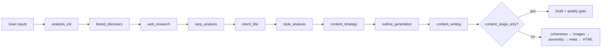
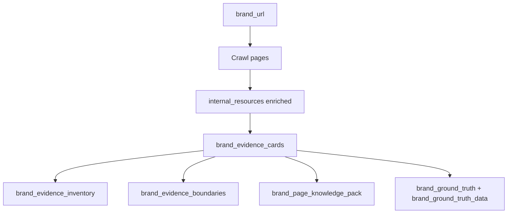
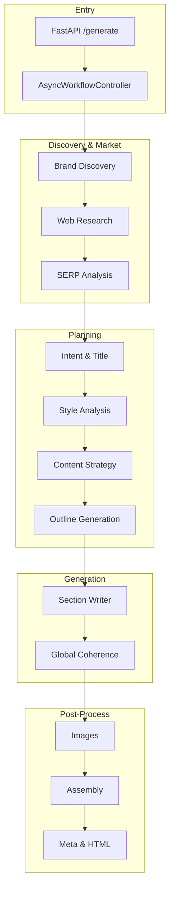

# SEO Writing AI — System Audit Report

**Document type:** System architecture audit (onboarding)  
**Audience:** Experienced AI / software engineers joining the project  
**Scope:** Entire pipeline — not a single article, keyword, or run  
**Report date:** 2026-06-09  
**Repository:** `F:\SEO-Writing-AI`  
**Status:** Active development — Brand Ground Truth consolidation in progress (Steps 3A–3B done; 3C pending)

---

## SECTION 1 — PROJECT OVERVIEW

### What the SEO Writing AI system is

SEO Writing AI is a **multi-stage, LLM-orchestrated content generation engine** that produces long-form SEO articles (primarily **Arabic commercial/brand** content) from minimal user inputs. It combines:

- **Brand site crawling and evidence extraction**
- **SERP / web research**
- **Structured content strategy and outline generation**
- **Per-section LLM writing with brand guardrails**
- **Deterministic validation, fulfillment checks, and quality gates**
- **Optional image generation, HTML rendering, and schema/meta output**

The system is exposed as a **FastAPI HTTP service** (`src/app/main.py` → `src/app/api.py`) with a static web UI (`src/app/static/index.html`). There is no standalone CLI; integration tests invoke `AsyncWorkflowController` directly.

### Problem it solves

Marketing and SEO teams need **localized, brand-accurate, SERP-competitive articles** without manually researching competitors, structuring outlines, and enforcing brand claim boundaries. The system automates:

1. Discovering what a brand actually offers (from its website, not SERP guesses)
2. Aligning article structure with search intent and competitor patterns
3. Writing section-by-section content with SEO constraints (keyword density, tables, CTAs, internal links)
4. Blocking or flagging **unsupported brand claims** (pricing, local offices, testimonials, invented projects)

The **core architectural challenge** (confirmed, in active remediation) is **truth fragmentation**: brand facts exist in 5+ parallel structures (`brand_evidence_cards`, `brand_evidence_inventory`, `brand_evidence_boundaries`, `brand_page_knowledge_pack`, `brand_ground_truth`), and different pipeline layers consume different subsets. This causes writer blindness, validator false positives, and strategy/outline plans that ignore observed brand capabilities.

### Expected inputs

| Input | Source | Required |
|-------|--------|----------|
| Title / topic | API `ArticleRequest.title` | Yes |
| Keywords (primary first) | API `keywords` | Yes |
| Brand URL | API `brand_url` | For `brand_commercial` |
| Target area | API `area` (e.g. السعودية, Riyadh) | Optional |
| Article language | API `article_language` (default `ar`) | Optional |
| Internal / external link pools | API `urls`, `external_urls` | Optional |
| Mode flags | `heading_only_mode`, `content_stage_only_mode`, `content_only_mode`, `disable_outline_repair` | Optional |
| Approved outline JSON | `approved_outline` (content-only mode) | When `content_only_mode=true` |
| Advanced controls | tone, POV, structure toggles, image settings, keyword density | Optional |

Schema: `src/schemas/api_models.py` (`ArticleRequest`, `ArticleResponse`).

### Expected outputs

Per run, under `{work_dir}/{slug}_{timestamp}/` (default `output/`):

| Artifact | Description |
|----------|-------------|
| `brand_ground_truth.md` | Page-first consolidated brand report (single source of truth target) |
| `brand_page_knowledge_pack.md` | Page narrative briefs for writer context |
| `article_content_draft.md` / `article_final.md` | Assembled markdown article |
| `quality_warnings.txt` | Content-stage quality gate (`pass` / `needs_revision`) |
| `workflow.log` | Step-level I/O trace via `WorkflowLogger` |
| `metrics.csv`, `diagnostic_report.md`, `consumption_report.md` | Performance and token accounting |
| `page.html` | Rendered HTML (full pipeline only) |
| API JSON | `outline_structure`, metadata, images, status fields |

### High-level workflow



**Review modes** (early exit):

- `heading_only_mode` — stops after outline; returns `outline_structure` for human approval
- `content_stage_only_mode` — stops after section writing + quality gate (no images/HTML)
- `content_only_mode` — skips outline regeneration; loads `approved_outline`

### Current development status

| Area | Status | Notes |
|------|--------|-------|
| Core pipeline (18 steps) | **Operational** | `AsyncWorkflowController.run_workflow` in `workflow_controller.py` |
| Brand discovery + Ground Truth | **~90% complete** | GT report + structured data in state; catalog cleanup in code |
| Ground Truth consumption | **Partial** | Writer + validator wired (3B); strategy/outline logging only (3A) |
| Quality gate | **Operational** | Deterministic warnings → `needs_revision` |
| Heading-only / content-only modes | **Operational** | Contract-tested |
| Full article validation step | **Disabled** | `_step_8_article_validation` commented out in pipeline |
| Semantic layer step | **Disabled** | Commented out in pipeline |
| Test suite | **Large, unittest-based** | ~100 tests in `test_brand_evidence_contract.py` alone; `pytest` not in `requirements.txt` |
| Uncommitted work | **Active** | GT integration, validator fixes, prompt templates modified on branch |

**Confirmed fact:** The project is mid-migration from legacy brand evidence structures to a **Brand Ground Truth Pack** as the intended single source of truth. Legacy structures are intentionally retained until all layers stabilize.

---

## SECTION 2 — SYSTEM ARCHITECTURE

Each layer below lists **purpose**, **inputs**, **outputs**, **main files**, **dependencies**, and **current status**.

### Layer 0 — API & Orchestration

| | |
|---|---|
| **Purpose** | HTTP entry, request validation, workflow invocation, response assembly |
| **Inputs** | Multipart form / JSON → `ArticleRequest` |
| **Outputs** | `ArticleResponse`, files in `output_dir` |
| **Main files** | `src/app/api.py`, `src/app/main.py`, `src/schemas/api_models.py`, `src/schemas/input_validator.py` |
| **Dependencies** | FastAPI, Pydantic, `AsyncWorkflowController` |
| **Status** | ✅ Stable |

### Layer 1 — Analysis Init

| | |
|---|---|
| **Purpose** | Normalize inputs, create `output_dir`, init link pools, counters, `workflow_logger` |
| **Inputs** | `state["input_data"]` |
| **Outputs** | `area`, `primary_keyword`, `brand_url`, `internal_resources`, `external_resources`, `output_dir`, link tracking sets |
| **Main files** | `workflow_controller.py` → `_step_0_init` (~L373) |
| **Dependencies** | `WorkflowLogger`, `LinkManager` |
| **Status** | ✅ Stable |

### Layer 2 — Brand Discovery

| | |
|---|---|
| **Purpose** | Crawl brand URL, extract per-page evidence, build all brand truth artifacts |
| **Inputs** | `brand_url`, `internal_resources`, crawl config |
| **Outputs** | `brand_evidence_cards`, `brand_evidence_inventory`, `brand_evidence_boundaries`, `brand_page_knowledge_pack_*`, `brand_ground_truth`, `brand_ground_truth_data`, `brand_writing_brief`, crawl diagnostics |
| **Main files** | `workflow_controller.py` → `_step_brand_discovery_router` (~L543); `brand_evidence_service.py` (~9,760 lines); `research_service.py` (brand discovery entry) |
| **Dependencies** | `scraper_utils`, HTTP crawl, `build_brand_evidence_cards`, GT builders |
| **Status** | 🔄 **Active remediation** — extraction de-biased, GT introduced, catalog filters added; confirmation run pending |



### Layer 3 — Web Research

| | |
|---|---|
| **Purpose** | Hybrid web research for market context, competitor signals |
| **Inputs** | `primary_keyword`, `area`, `brand_url` |
| **Outputs** | `serp_data`, partial `seo_intelligence`, `web_research_attempts` |
| **Main files** | `research_service.py`; template `seo_web_research.txt`, `seo_hybrid_research.txt` |
| **Dependencies** | OpenRouter online model (`openai/o4-mini:online`) |
| **Status** | ✅ Operational |

### Layer 4 — SERP Analysis

| | |
|---|---|
| **Purpose** | Structured SERP intelligence: titles, FAQ patterns, competitor structure |
| **Inputs** | SERP raw data, keyword, area |
| **Outputs** | `seo_intelligence`, `serp_outline_brief` |
| **Main files** | `research_service.py`; template `seo_serp_analysis_observed_v2.txt` |
| **Dependencies** | LLM, `serp_topic_miner.py` (enrichment) |
| **Status** | ✅ Operational; **not merged with brand GT** for planning |

### Layer 5 — Intent & Title

| | |
|---|---|
| **Purpose** | Classify search intent, set `content_type`, optimize title |
| **Inputs** | keyword, title, SERP context |
| **Outputs** | `intent`, `detected_intent_ai`, `content_type`, updated `input_data.title` |
| **Main files** | `strategy_service.py` → `run_intent_title`; `title_generator.py`; `00_intent_classifier.txt`, `00_seo_intent_title.txt` |
| **Dependencies** | LLM |
| **Status** | ✅ Stable |

### Layer 6 — Style Analysis

| | |
|---|---|
| **Purpose** | Extract / infer writing style blueprint from reference or defaults |
| **Inputs** | `style_reference`, brand context |
| **Outputs** | `style_blueprint`, `brand_visual_style` |
| **Main files** | `strategy_service.py` → `run_style_analysis`; `style_extractor.py` |
| **Dependencies** | LLM, optional style reference URL |
| **Status** | ✅ Stable |

### Layer 7 — Content Strategy

| | |
|---|---|
| **Purpose** | Generate JSON content strategy: section roles, differentiators, SERP gaps |
| **Inputs** | `seo_intelligence`, `brand_evidence_boundaries`, brand context |
| **Outputs** | `content_strategy` dict; may update `brand_evidence_boundaries` |
| **Main files** | `strategy_service.py` → `run_content_strategy`; `00_content_strategy_*_v2.txt` |
| **Dependencies** | LLM, boundaries from brand discovery |
| **Status** | ⚠️ **Does not read `brand_ground_truth`** — only `brand_evidence_boundaries` + SERP; 3A-1 logging only |

### Layer 8 — Outline Generation

| | |
|---|---|
| **Purpose** | Generate section outline (headings, taxonomy axes, contracts) |
| **Inputs** | `content_strategy`, `seo_intelligence`, `brand_evidence_inventory` context, SERP brief |
| **Outputs** | `outline` (list of section dicts), heading audit fields, link strategy |
| **Main files** | `workflow_controller.py` → `_step_1_outline`; `content_generator.py` → `OutlineGenerator`; `validation_service.py`; `outline_repair_service.py` |
| **Dependencies** | LLM, optional `OutlineRepairService` (bypassed when `disable_outline_repair=true`) |
| **Status** | ⚠️ **Does not read GT**; repair path has known template-leak risk |

Sub-steps inside outline:

- AI outline generation
- `ValidationService` structure enforcement
- Optional `OutlineRepairService` deterministic repairs
- Optional `_run_controlled_heading_fix` (critique + fix templates)
- `_run_post_outline_brand_targeted_crawl` (additional brand pages)
- `_normalize_outline_with_brand_evidence_inventory` (heading downgrade)

### Layer 9 — Content Writing

| | |
|---|---|
| **Purpose** | Write each section sequentially with brand firewall, GT injection, fulfillment loop |
| **Inputs** | `outline`, `content_strategy`, `brand_page_knowledge_pack_context`, **`brand_ground_truth` (writer 3B)**, section-specific raw blocks |
| **Outputs** | `sections` dict, `section_truth_trace`, per-section `generated_content` |
| **Main files** | `workflow_controller.py` → `_step_2_write_sections`, `_write_single_section`; `content_generator.py` → `SectionWriter` |
| **Dependencies** | LLM; prompt stack: `02_section_writer_*`, `core_constitution.txt`, `runtime_state.txt`, `section_contract.txt` |
| **Status** | ✅ **Writer GT injection proven**; repair-stage leakage still possible post-write |

**Brand knowledge firewall:** Neutral sections (comparison, etc.) receive empty `writer_brand_page_knowledge_pack_context` — GT block appended only when pack is visible.

### Layer 10 — Validation & Fulfillment (inline, not a pipeline step)

| | |
|---|---|
| **Purpose** | Deterministic checks: unsupported claims, project names, evidence density, heading drift |
| **Inputs** | Section content, `section_brand_understanding`, `section_raw_brand_blocks`, `state` (GT `claim_boundaries` via `resolve_brand_claim_boundaries`) |
| **Outputs** | `fulfillment_status`, quality issue markers on sections |
| **Main files** | `brand_evidence_service.py` → `evaluate_brand_section_fulfillment`, `find_unsupported_brand_project_names`; `workflow_controller.py` → `_brand_claim_support_flags`, content-stage quality gate (~L10720) |
| **Dependencies** | Regex heuristics, GT structured data (3B) |
| **Status** | 🔄 **Code updated** (geo market-context exemption, GT boundaries); confirmation run pending |

**Note:** `validation_service.py` handles outline/heading validation; `section_validator.py` / `article_validator.py` exist but their pipeline steps are **disabled**.

### Layer 11 — Global Coherence

| | |
|---|---|
| **Purpose** | Cross-section consistency pass |
| **Inputs** | `sections`, `outline` |
| **Outputs** | Updated `sections` |
| **Main files** | `workflow_controller.py` → `_step_3_global_coherence_pass`; `09_humanizer_editor.txt` |
| **Status** | ✅ Operational (skipped in `content_stage_only_mode`) |

### Layer 12 — Image Pipeline

| | |
|---|---|
| **Purpose** | Plan prompts, generate images, insert into markdown |
| **Inputs** | `outline`, `sections`, brand visual style |
| **Outputs** | `image_prompts`, `assets/images`, `image_frame_path` |
| **Main files** | `image_generator.py`, `image_inserter.py`, `image_service.py`; `06_image_planner.txt` |
| **Dependencies** | OpenRouter image model / Stability.ai / mock |
| **Status** | ✅ Operational; default `IMAGES.provider = "mock"` in config |

### Layer 13 — Assembly & Humanization

| | |
|---|---|
| **Purpose** | Merge sections, final humanizer pass |
| **Inputs** | `sections`, `outline` |
| **Outputs** | `final_output.final_markdown` |
| **Main files** | `content_generator.py` → `Assembler`, `FinalHumanizer`; `04_article_assembler.txt`, `05_final_humanizer.txt` |
| **Status** | ✅ Operational |

### Layer 14 — Meta & Schema

| | |
|---|---|
| **Purpose** | Meta title/description, JSON-LD |
| **Inputs** | Final markdown, keyword, brand |
| **Outputs** | `seo_meta` |
| **Main files** | `meta_schema_generator.py`; `05_meta_schema_generator.txt` |
| **Status** | ✅ Operational |

### Layer 15 — HTML Render

| | |
|---|---|
| **Purpose** | Publish-ready HTML |
| **Inputs** | `final_markdown`, `seo_meta` |
| **Outputs** | `html_path`, `article_final.md` on disk |
| **Main files** | `html_renderer.py`, `workflow_controller.py` → `_step_render_html` |
| **Status** | ✅ Operational |

### Architecture diagram (full pipeline)



---

## SECTION 3 — DATA FLOW

### End-to-end flow

```
Brand URL
  → Crawl (ResearchService + BrandEvidenceService)
  → internal_resources[] enriched
  → build_brand_evidence_cards()
  → brand_evidence_cards[]
  → build_brand_evidence_inventory()     → brand_evidence_inventory{}
  → build_brand_evidence_boundaries()    → brand_evidence_boundaries{}
  → build_brand_service_catalog()        → service_catalog (embedded in GT)
  → build_brand_ground_truth_report()    → brand_ground_truth (markdown)
  → build_brand_ground_truth_data()      → brand_ground_truth_data{}
  → _persist_brand_page_knowledge_pack() → brand_page_knowledge_pack_context

Primary Keyword + Area
  → web_research + serp_analysis
  → seo_intelligence{}

seo_intelligence + brand_evidence_boundaries
  → StrategyService.run_content_strategy()
  → content_strategy{}

content_strategy + brand_evidence_inventory + seo_intelligence
  → OutlineGenerator
  → outline[]

outline + knowledge_pack + brand_ground_truth (writer only)
  → SectionWriter (per section)
  → sections{}

sections + claim_boundaries (via resolve_brand_claim_boundaries)
  → evaluate_brand_section_fulfillment()
  → quality_warnings[]
  → article_final.md
```

### State object reference

#### `internal_resources`

| Attribute | Detail |
|-----------|--------|
| **Purpose** | List of `{link, text}` brand/internal URLs — crawl seeds and link pool |
| **Created** | `_step_0_init` (manual URLs); enriched in `ResearchService.run_brand_discovery`, `enrich_brand_internal_resources` |
| **Consumers** | `build_brand_evidence_cards`, outline link pool, fingerprinting |
| **Problems** | Crawl depth/URL scoring may miss deep pages (e.g. `/hosting`) — **hypothesis** |
| **Future** | GT should derive crawl priority from page-type signals, not keyword bias |

#### `brand_evidence_cards`

| Attribute | Detail |
|-----------|--------|
| **Purpose** | Per-page structured evidence: services, technologies, projects, geography, pricing, trust, snippets |
| **Created** | `_step_brand_discovery_router` → `build_brand_evidence_cards` (`brand_evidence_service.py` ~L4489) |
| **Consumers** | Inventory, boundaries, GT report/data, knowledge pack catalog lines |
| **Problems** | Legacy primary structure; large; some fields historically web-keyword-biased (mitigated in 3E) |
| **Future** | Remain as **raw evidence layer** under GT; not removed until GT dominance complete |

#### `brand_evidence_inventory`

| Attribute | Detail |
|-----------|--------|
| **Purpose** | Availability router — which evidence categories exist (`pricing_available`, `projects_available`, etc.) |
| **Created** | `build_brand_evidence_inventory` (~L1481) |
| **Consumers** | Strategy (fallback boundaries), outline normalization, heading downgrade |
| **Problems** | Coarse flags; strategy treats as authority without catalog detail |
| **Future** | Replace prompt injection with `brand_ground_truth_data.claim_boundaries` + catalogs |

#### `brand_evidence_boundaries`

| Attribute | Detail |
|-----------|--------|
| **Purpose** | Claim permissions: `local_presence`, `testimonials`, `brand_pricing`, `explicit_geography` |
| **Created** | `build_brand_evidence_boundaries` (~L1734) |
| **Consumers** | Strategy prompts, `_unsupported_brand_claim_guard`, legacy validator path |
| **Problems** | Can drift from GT `claim_boundaries` if rebuilt at different times |
| **Future** | `resolve_brand_claim_boundaries()` already prefers GT — extend to all consumers |

#### `brand_ground_truth` (markdown)

| Attribute | Detail |
|-----------|--------|
| **Purpose** | Human- and LLM-readable consolidated report: page-by-page evidence + derived catalogs + claim boundaries |
| **Created** | `build_brand_ground_truth_report` (~L1106); persisted in `_persist_brand_ground_truth_report` |
| **Consumers** | Writer (injected block, max 8000 chars), logging; **not** strategy/outline prompts yet |
| **Problems** | Truncation at 8000 chars for writer; derived catalog section can still have ~10% noise pre-cleanup run |
| **Future** | Primary prompt source for all brand-aware layers; page sections are authoritative over derived catalogs |

#### `brand_ground_truth_data` (structured)

| Attribute | Detail |
|-----------|--------|
| **Purpose** | Machine-readable twin: `catalogs.*` with `{value, sources}`, `claim_boundaries`, `pages[]` |
| **Created** | `build_brand_ground_truth_data` (~L1312) — same inputs as markdown report |
| **Consumers** | `record_ground_truth_consumption`, `resolve_brand_claim_boundaries`, tests; **planned** for strategy/outline |
| **Problems** | Built but under-consumed; sync guaranteed only if both built in same call |
| **Future** | **Primary API for code paths**; markdown for writer prompts |

#### `brand_page_knowledge_pack` / `brand_page_knowledge_pack_context`

| Attribute | Detail |
|-----------|--------|
| **Purpose** | Page narrative briefs formatted for section writer prompts |
| **Created** | `_persist_brand_page_knowledge_pack` (~L962) |
| **Consumers** | `SectionWriter`, unsupported-claim guards, testimonial detection |
| **Problems** | Overlaps with GT; writer receives **both** pack + GT block (intentional during 3B parallel phase) |
| **Future** | Merge or subordinate to GT; pack may become "page narratives only" slice of GT |

#### `service_catalog` / `build_brand_service_catalog`

| Attribute | Detail |
|-----------|--------|
| **Purpose** | Aggregated services, technologies, offers, claim flags from cards |
| **Created** | `build_brand_service_catalog` (~L948) |
| **Consumers** | GT report, GT data, `_brand_ground_truth_catalog_lines` in pack and writer |
| **Problems** | Historically included portfolio entities as services (fixed by `_filter_derived_service_catalog`) |
| **Future** | Embedded in GT only; no separate state key |

#### `content_strategy`

| Attribute | Detail |
|-----------|--------|
| **Purpose** | JSON plan: intents, section guidance, differentiators, SERP gaps |
| **Created** | `StrategyService.run_content_strategy` (~L770) |
| **Consumers** | Outline generator, section writer (`section.content_strategy`), validation |
| **Problems** | `supported_differentiators` often SERP-generic, not from observed brand stack |
| **Future** | Inject `brand_ground_truth_data.catalogs.services` (Step 3C) |

#### `outline`

| Attribute | Detail |
|-----------|--------|
| **Purpose** | Ordered list of section dicts: `section_id`, `heading_text`, `taxonomy_axis`, `section_contract`, `commercial_section_role` |
| **Created** | `_step_1_outline` or `_step_load_approved_outline` |
| **Consumers** | Writer, coherence, images, assembly, quality gate |
| **Problems** | FAQ count, process structure sensitive to repair leaks |
| **Future** | Outline headings validated against GT service/project catalogs |

#### `sections`

| Attribute | Detail |
|-----------|--------|
| **Purpose** | Map `section_id` → `{generated_content, section_quality_issues, writer_truth_trace, ...}` |
| **Created** | `_step_2_write_sections` |
| **Consumers** | Quality gate, assembly, diagnostics |
| **Problems** | Post-write repair can inject template placeholders |
| **Future** | Stricter repair guards; separate process/FAQ repair audit |

#### `ground_truth_consumption`

| Attribute | Detail |
|-----------|--------|
| **Purpose** | Per-layer audit: `{strategy, outline, writer, validator}` → `{used, markdown_chars, catalog_counts}` |
| **Created** | `record_ground_truth_consumption` (~L1423) |
| **Consumers** | Logs, unit tests |
| **Problems** | `used=true` does not mean prompt consumption (strategy/outline log only) |
| **Future** | Add `prompt_injected: bool` when 3C completes |

---

## SECTION 4 — IMPORTANT FILES

| File | Responsibility | Importance | Notes |
|------|----------------|------------|-------|
| `src/services/workflow_controller.py` (~11,300 lines) | Pipeline orchestration, brand refresh, writer GT injection, quality gate | **Critical** | `AsyncWorkflowController`; largest integration point |
| `src/services/brand_evidence_service.py` (~9,760 lines) | Crawl evidence, cards, inventory, boundaries, GT, fulfillment | **Critical** | Core brand truth logic |
| `src/services/strategy_service.py` (~1,380 lines) | Intent, style, content strategy | **High** | Needs GT wiring (3C) |
| `src/services/content_generator.py` | OutlineGenerator, SectionWriter, Assembler, Humanizer | **Critical** | All LLM content generation |
| `src/services/research_service.py` | Brand discovery entry, web research, SERP | **High** | Crawl quality affects everything downstream |
| `src/services/validation_service.py` (~3,800 lines) | Outline/heading validation, structure rules | **High** | GT consumption logging at L1129 |
| `src/services/outline_repair_service.py` | Deterministic outline repairs | **Medium** | Bypassed when `disable_outline_repair=true` |
| `src/app/api.py` | FastAPI routes, mode flags, response build | **High** | Entry point |
| `src/config/ai_config.py` | Models, API keys, structure rules | **High** | `AI_PROVIDER` env selects client |
| `src/services/ai_client_factory.py` | Provider factory | **Medium** | openrouter default |
| `src/utils/workflow_logger.py` | Step I/O logging, metrics | **High** | Debugging runs |
| `src/utils/scraper_utils.py` | HTML fetch/parse helpers | **Medium** | Crawl dependency |
| `assets/prompts/templates/00_content_strategy_brand_commercial_observed_v2.txt` | Commercial strategy prompt | **High** | Recently modified |
| `assets/prompts/templates/01_outline_generator_heading_only_*.txt` | Heading-only outlines | **High** | Recently modified |
| `assets/prompts/templates/02_section_writer_brand_commercial_v2.txt` | Commercial writer | **Critical** | Constitution stack included |
| `tests/test_brand_evidence_contract.py` (~10,000 lines, ~100 tests) | Brand evidence + GT contracts | **Critical** | Primary regression suite |
| `tests/test_strategy_contract.py` | Strategy JSON shape, boundaries | **High** | |
| `tests/test_workflow_contracts.py` | Service signature preflight | **Medium** | |
| `tests/test_outline_repair.py` | Outline repair behavior | **Medium** | |
| `src/schemas/api_models.py` | Request/response contracts | **High** | |
| `requirements.txt` | Dependencies | **Medium** | No pytest; unittest in practice |

---

## SECTION 5 — CHRONOLOGY OF RECENT WORK

Phases referenced in code comments, tests, and commit history. Dates approximate from git log (May–June 2026).

### Phase: Heading approval era (May 2026)

| | |
|---|---|
| **Problem** | Outline headings not reviewable; structural drift |
| **Changes** | `heading_only_mode`, heading fix layer, critique templates (`01c`, `01d`), validation tightening |
| **Results** | Human-in-the-loop heading approval workflow |
| **Status** | ✅ Operational |

### Phase: Brand Discovery foundation (May 25–June 7)

| | |
|---|---|
| **Problem** | Brand evidence weak, web-keyword-biased, not page-grounded |
| **Changes** | `brand_evidence_cards`, inventory, boundaries, knowledge pack, crawl report |
| **Results** | Per-page evidence pipeline established |
| **Status** | ✅ Foundation complete |

### Phase: 3C (Assembly / pack sync)

| | |
|---|---|
| **Problem** | Saved knowledge pack out of sync with cards/catalog |
| **Changes** | `_brand_ground_truth_catalog_lines` embedded in saved pack and prompt formatter |
| **Results** | Pack file matches prompt catalog section |
| **Status** | ✅ Done |

### Phase: 3E (Extraction de-biasing)

| | |
|---|---|
| **Problem** | Services extracted from web keyword lists; portfolio misclassified; offers → technologies |
| **Changes** | Signal-based service extraction; URL-first portfolio page type; `_OFFER_SIGNAL_RE`; template label filters |
| **Results** | Homepage stack (WordPress, PHP, React, SEO, mobile) surfaces correctly — **confirmed in test fixtures and reference runs** |
| **Status** | ✅ Done |

### Phase: 3E-2 / 3E-3 (Structural catalog cleanup)

| | |
|---|---|
| **Problem** | Derived catalogs polluted: portfolio names in services, template metadata chains, sentence fragments |
| **Changes** | `_filter_derived_service_catalog`, `_filter_derived_project_catalog`, `_is_template_metadata_chain`, `_is_sentence_fragment`, `_portfolio_primary_entity_names` |
| **Results** | Unit tests pass; **not yet verified in full pipeline run** |
| **Status** | ✅ In code — pending confirmation run |

### Phase: Ground Truth introduction (GT-1, GT-2)

| | |
|---|---|
| **Problem** | No single readable artifact; truth scattered |
| **Changes** | `build_brand_ground_truth_report`, page-first layout, derived catalogs marked secondary, sources per item |
| **Results** | `brand_ground_truth.md` + in-state keys |
| **Status** | ✅ Done |

### Phase: 3A (Parallel exposure + logging)

| | |
|---|---|
| **Problem** | Layers couldn't be audited for GT availability |
| **Changes** | `state["brand_ground_truth"]`, `brand_ground_truth_data`, `record_ground_truth_consumption` wired to strategy, outline, writer, validator |
| **Results** | `ground_truth_consumption` map in state; tests `test_step_3a0_*`, `test_step_3a1_*` |
| **Status** | ✅ Done — **logging only, no prompt change** (except writer in 3B) |

### Phase: 3B (Writer + Validator dominance — partial)

| | |
|---|---|
| **Problem** | Writer blind to full GT; validator used stale boundaries |
| **Changes** | `_format_ground_truth_for_writer` appended to writer pack; `resolve_brand_claim_boundaries` prefers GT; `_content_claims_brand_local_presence` market-context exemption |
| **Results** | Writer injection proven (`ground_truth_injected_into_writer=true` in traces); validator code updated |
| **Status** | 🔄 **Partial** — needs confirmation run for warning reduction |

### Phase: 3C-next (planned)

| | |
|---|---|
| **Problem** | Strategy/outline plan without observed brand catalog |
| **Changes** | Not started — wire `brand_ground_truth_data.catalogs` into strategy/outline prompts |
| **Status** | ⏳ Pending |

### Phase: 21 (commercial content stage)

| | |
|---|---|
| **Problem** | Process/FAQ/CTA enforcement, project proof tables, buyer stage snapshots |
| **Changes** | Taxonomy planner, table usefulness checks, intro enforcement |
| **Results** | Extensive tests; **one pre-existing failure**: `test_phase_21_content_stage_reports_missing_process_faq_cta_without_auto_expansion` |
| **Status** | 🔄 Mostly done; one test red |

---

## SECTION 6 — CONFIRMED IMPROVEMENTS

Each item includes **why it matters** and **evidence**.

### 1. Brand Ground Truth introduced

- **What:** `brand_ground_truth` markdown + `brand_ground_truth_data` structured dict in workflow state and output dir.
- **Why:** Enables a single auditable artifact; downstream layers can converge on one truth.
- **Evidence:** `build_brand_ground_truth_report` / `build_brand_ground_truth_data` in `brand_evidence_service.py`; `test_step_3a0_ground_truth_exposed_in_state_and_synced_with_file`; `_persist_brand_ground_truth_report` in `workflow_controller.py` ~L1054.

### 2. Writer now sees Ground Truth (Step 3B-W)

- **What:** `_format_ground_truth_for_writer` appends bounded GT block to writer context for brand-eligible sections.
- **Why:** Writer was limited to narrative briefs; missed consolidated catalogs and page-indexed evidence.
- **Evidence:** `workflow_controller.py` ~L9010–9025; `writer_truth_trace.ground_truth_injected_into_writer`; gate test `test_gate_baddel_reaches_writer_context`.

### 3. Validator reads GT claim boundaries (Step 3B-V)

- **What:** `resolve_brand_claim_boundaries` prefers `brand_ground_truth_data.claim_boundaries`.
- **Why:** Validator was failing sections when legacy boundaries disagreed with GT or were overly strict.
- **Evidence:** `brand_evidence_service.py` ~L1450; `test_resolve_brand_claim_boundaries_prefers_ground_truth`; `evaluate_brand_section_fulfillment` calls it at ~L9616.

### 4. Geography: project location ≠ brand office

- **What:** `explicit_geography` in GT labeled "NOT proof of brand offices"; `_content_claims_brand_local_presence` exempts buyer market context.
- **Why:** Arabic commercial copy mentions target market (السعودية) without claiming local offices — was causing false `unsupported` fulfillment.
- **Evidence:** GT report template text ~L1266; `_content_claims_brand_local_presence` ~L9440; test `test_fulfillment_market_context_not_local_presence`.

### 5. Service extraction de-biased (3E-1)

- **What:** Removed web-keyword-list bias; URL scoring and page-type signals for portfolio vs service pages.
- **Why:** SERP keyword "تصميم مواقع" was polluting extracted services.
- **Evidence:** `build_brand_evidence_cards` refactored paths; gate tests for Hosting→strategy data path.

### 6. Offer vs technology separation

- **What:** `_OFFER_SIGNAL_RE` routes promotional lines to pricing/offers bucket.
- **Why:** "50% Off Hosting" was misclassified as a technology.
- **Evidence:** `_OFFER_SIGNAL_RE` ~L242; GT `pricing_offers` catalog section.

### 7. Structural catalog cleanup (3E-3)

- **What:** Filters for template labels, metadata chains, fragments, portfolio entities in service catalog.
- **Why:** Derived catalogs were ~10–15% noise, undermining trust in GT.
- **Evidence:** `_filter_derived_service_catalog`, `_filter_derived_project_catalog`; dedicated unit tests in `test_brand_evidence_contract.py`.

### 8. Knowledge pack ↔ catalog sync (3C)

- **What:** Saved `brand_page_knowledge_pack.md` includes same catalog lines as prompts.
- **Why:** Engineers debugging pack file saw different data than writer.
- **Evidence:** `_persist_brand_page_knowledge_pack` ~L985–988.

### 9. Ground truth consumption audit trail (3A-1)

- **What:** `ground_truth_consumption` per layer.
- **Why:** Proves wiring before behavior change; supports onboarding debugging.
- **Evidence:** `record_ground_truth_consumption` ~L1423; tests for strategy/writer/validator layers.

### 10. Commercial section firewall

- **What:** `brand_usage_policy` hides knowledge pack (and GT) from neutral sections.
- **Why:** Comparison sections must stay brand-neutral.
- **Evidence:** `workflow_controller.py` ~L8996–9006; `writer_truth_trace` logs `knowledge_pack_visible=false` for neutral sections.

---

## SECTION 7 — CURRENT PROBLEMS

Problems are **system-wide**, grouped by severity. Status reflects **current codebase** (June 9, 2026).

### HIGH

#### H-01: Truth fragmentation across layers

| Field | Detail |
|-------|--------|
| **Description** | Five+ parallel brand structures; strategy/outline still use inventory/boundaries only |
| **Root cause** | Incremental architecture; GT added without removing legacy paths |
| **Files** | `brand_evidence_service.py`, `strategy_service.py`, `workflow_controller.py`, `content_generator.py` |
| **Impact** | Strategy plans generic differentiators; outline headings may not reflect observed stack; validator/writer see different facts |
| **Workaround** | Writer GT injection (partial); manual review of `brand_ground_truth.md` |
| **Recommended fix** | Step 3C: wire `brand_ground_truth_data` to strategy + outline; then gradual legacy deprecation |

#### H-02: Validator false positives (partially fixed, unverified)

| Field | Detail |
|-------|--------|
| **Description** | Trust/pricing/geography regex flags legitimate commercial prose |
| **Root cause** | `trust_claim_re`, `pricing_claim_re` match generic marketing language; raw evidence check too strict |
| **Files** | `brand_evidence_service.py` → `evaluate_brand_section_fulfillment` ~L9634–9680 |
| **Impact** | `needs_revision` status, unnecessary warnings, engineer distrust of gate |
| **Workaround** | Review `quality_warnings.txt`; ignore known FP patterns |
| **Recommended fix** | Confirmation run post-3B-V; tighten regex to require brand-attributed claims; use GT raw snippets as evidence source |

#### H-03: Process / FAQ repair template leak

| Field | Detail |
|-------|--------|
| **Description** | Placeholder text (e.g. Arabic template instructions) appears in final process sections |
| **Root cause** | Post-write repair path injects or fails to strip template scaffolding — **hypothesis** from observed `article_final.md` patterns; exact function path needs dedicated audit |
| **Files** | `workflow_controller.py` (repair helpers ~L6300–6600), `content_generator.py` SectionWriter repair loop |
| **Impact** | Broken sec_process content; `process_section_insufficient_steps` warnings |
| **Workaround** | `disable_outline_repair=true` reduces but does not eliminate |
| **Recommended fix** | Add placeholder detection to quality gate; block publish when template tokens detected; fix repair prompt |

#### H-04: Arabic false positive project name detection

| Field | Detail |
|-------|--------|
| **Description** | `find_unsupported_brand_project_names` matches Arabic clause fragments as project names |
| **Root cause** | Heuristic extraction of capitalized / quoted tokens not suited to Arabic morphology |
| **Files** | `brand_evidence_service.py` ~L3836, ~L9690 |
| **Impact** | `unsupported fulfillment` on project sections with valid content |
| **Workaround** | None automated |
| **Recommended fix** | Require multi-token proper nouns; cross-check against `brand_ground_truth_data.catalogs.projects` only |

#### H-05: Strategy and outline blind to Ground Truth

| Field | Detail |
|-------|--------|
| **Description** | `record_ground_truth_consumption` returns `used=true` but prompts don't include GT |
| **Root cause** | 3A-1 intentionally logging-only; 3C not implemented |
| **Files** | `strategy_service.py` ~L622; `workflow_controller.py` outline ~L1571 |
| **Impact** | Weak FAQ/process planning; `supported_differentiators` SERP-generic |
| **Workaround** | None |
| **Recommended fix** | Inject structured catalog slice into strategy/outline prompts (token-budgeted) |

### MEDIUM

#### M-01: Derived catalog noise (~10%)

| Field | Detail |
|-------|--------|
| **Description** | Portfolio entity names, generic labels in derived service catalog |
| **Root cause** | Auto-aggregation from noisy card fields |
| **Files** | `build_brand_service_catalog`, filter functions ~L358 |
| **Impact** | Engineer confusion; potential writer hallucination seed |
| **Workaround** | Trust page-by-page sections over derived catalogs (documented in GT header) |
| **Recommended fix** | Confirmation run after 3E-3 filters; add catalog quality metric to diagnostics |

#### M-02: Intro soft CTA enforcement failures

| Field | Detail |
|-------|--------|
| **Description** | `intro_final_enforcement_failed:intro_missing_soft_cta` |
| **Root cause** | Mismatch between writer prompt and post-write intro enforcer rules |
| **Files** | `workflow_controller.py` ~L7181–7250 |
| **Impact** | `needs_revision` on otherwise acceptable intros |
| **Workaround** | Manual intro edit |
| **Recommended fix** | Align `02_section_writer` intro contract with enforcer regex |

#### M-03: `disable_outline_repair` policy unclear

| Field | Detail |
|-------|--------|
| **Description** | Eval runs use `disable_outline_repair=true`; production default unclear |
| **Root cause** | Repair fixes some issues, causes others |
| **Files** | `workflow_controller.py` ~L1411; `outline_repair_service.py` |
| **Impact** | Non-reproducible behavior between environments |
| **Workaround** | Document flag per run |
| **Recommended fix** | Fix B-01 first; re-enable repair with regression tests |

#### M-04: Dead code path in fulfillment wrapper

| Field | Detail |
|-------|--------|
| **Description** | `workflow_controller._evaluate_brand_owned_section_fulfillment` may return early after delegating to `evaluate_brand_section_fulfillment` — duplicate logic risk |
| **Root cause** | Refactor incomplete |
| **Files** | `workflow_controller.py` ~L5616 |
| **Impact** | Maintenance confusion |
| **Workaround** | Use `brand_evidence_service.evaluate_brand_section_fulfillment` as canonical |
| **Recommended fix** | Remove dead branches in wrapper |

#### M-05: Article / section validation steps disabled

| Field | Detail |
|-------|--------|
| **Description** | `_step_8_article_validation`, `section_validation` commented out in pipeline |
| **Root cause** | Intentional disable during refactor |
| **Files** | `workflow_controller.py` ~L315–325 |
| **Impact** | No LLM-level article validation in production path |
| **Workaround** | Content-stage quality gate only |
| **Recommended fix** | Re-enable after GT-stable validator |

#### M-06: Offers vs pricing boundary ambiguity

| Field | Detail |
|-------|--------|
| **Description** | Promotional offers exist but `pricing_available=false` |
| **Root cause** | Boundaries distinguish list pricing from promotional copy |
| **Files** | `build_brand_evidence_inventory`, fulfillment pricing check |
| **Impact** | Writer may avoid mentioning offers; validator may flag offer language |
| **Workaround** | Manual interpretation of `pricing_offers` catalog |
| **Recommended fix** | Add `promotional_offers_available` boundary flag |

### LOW

#### L-01: Duplicate AR/EN portfolio pages in crawl

| Field | Detail |
|-------|--------|
| **Description** | Bilingual sites produce duplicate evidence cards |
| **Root cause** | No locale deduplication in crawl |
| **Impact** | Token waste, redundant catalog entries |
| **Recommended fix** | Canonical URL merging by path pattern |

#### L-02: Truncated metadata in case study rows

| Field | Detail |
|-------|--------|
| **Description** | Clipped CMS template strings in cards |
| **Root cause** | Crawl text extraction limits |
| **Impact** | Minor catalog noise |
| **Recommended fix** | `_TRUNCATED_TEMPLATE_TAIL_RE` already partial; extend |

#### L-03: Pre-existing test failure (phase 21)

| Field | Detail |
|-------|--------|
| **Description** | `test_phase_21_content_stage_reports_missing_process_faq_cta_without_auto_expansion` fails |
| **Root cause** | Validation/prompt expectation drift — **hypothesis** |
| **Impact** | CI noise if suite run |
| **Recommended fix** | Align validation_service with intended process/FAQ policy |

#### L-04: `pytest` not in dependencies

| Field | Detail |
|-------|--------|
| **Description** | Tests use `unittest`; `python -m pytest` fails on clean install |
| **Impact** | Onboarding friction |
| **Recommended fix** | Add pytest to `requirements-dev.txt` or document unittest invocation |

#### L-05: Orphan prompt templates

| Field | Detail |
|-------|--------|
| **Description** | `step1_outline_gen.txt`, `seo_semantic_layer.txt`, etc. have no `src/` references |
| **Impact** | Confusion about active prompts |
| **Recommended fix** | Move to `assets/prompts/archive/` |

---

## SECTION 8 — OPEN ARCHITECTURAL QUESTIONS

### Q1: Should Ground Truth become the only source of truth?

| Option | Tradeoff |
|--------|----------|
| **Yes (full dominance)** | Simpler mental model; requires all layers migrated and legacy removed |
| **No (parallel indefinitely)** | Safer rollback; continued drift risk |
| **Current consensus** | Parallel read during 3B–3C; dominance only after confirmation runs |

### Q2: Should legacy evidence structures be removed?

| Option | Tradeoff |
|--------|----------|
| **Remove cards/inventory/boundaries** | Less code; cards are still the **raw evidence layer** for GT |
| **Keep cards, remove inventory/boundaries from prompts** | Moderate cleanup; recommended medium-term |
| **Keep all** | Status quo; fragmentation continues |

**Recommendation:** Keep `brand_evidence_cards` as raw crawl output; deprecate direct prompt use of inventory/boundaries.

### Q3: Should validator consume Ground Truth directly (not just claim_boundaries)?

| Option | Tradeoff |
|--------|----------|
| **Boundaries only (current 3B-V)** | Fast; misses catalog-level checks |
| **Full GT catalogs** | Better project/service validation; more CPU/string matching |
| **Page snippets as evidence** | Highest fidelity; highest token/compute cost |

### Q4: How should token budget be managed for GT in prompts?

| Approach | Tradeoff |
|----------|----------|
| Full markdown (8000 cap writer) | Simple; truncates pages |
| Structured slice per section | Precise; requires section→page routing |
| Retrieval by taxonomy_axis | Best relevance; needs implementation |

**Open question:** Strategy/outline likely need **structured slices only**, not full markdown.

### Q5: Should promotional offers unlock pricing fulfillment?

Offers appear in GT `pricing_offers` but `pricing_available=false`. Need product decision: are "% off" promotions "pricing" for compliance purposes?

### Q6: Re-enable outline repair in production?

Requires fixing template leak (H-03) and defining when `disable_outline_repair` is allowed.

### Q7: Re-enable article-level LLM validation step?

Adds cost/latency; may duplicate deterministic gate; useful for holistic coherence checks.

### Q8: Parallel vs sequential section writing?

`PARALLEL_SECTIONS = False` hardcoded. Commercial brand articles sequential for claim consistency — confirm before enabling parallel.

---

## SECTION 9 — TECHNICAL DEBT

### Duplicate structures

- `brand_evidence_boundaries` vs `brand_ground_truth_data.claim_boundaries` — same semantic, two sources
- `build_brand_service_catalog` output embedded in pack, GT markdown, and GT data
- `outline` (runtime) vs `outline_structure` (API export) — naming inconsistency
- Writer receives **knowledge pack + GT block** — intentional duplicate during migration

### Legacy code

- `src/utils/injector.py` references `step1_outline_gen.txt`, `step2_section_writer.txt` — superseded by `content_generator`
- `ArticleRefiner`, `SectionValidator` — not in active pipeline
- `semantic_layer` pipeline step commented out
- `FORCE_HEADING_ONLY_MODE` in `api.py` — explicitly ignored

### Temporary fixes

- `record_ground_truth_consumption` logs `used=true` when GT exists, even if layer doesn't read it (strategy/outline)
- Writer GT truncated at 8000 chars
- `disable_outline_repair=true` used in evaluation to avoid repair corruption

### Architectural inconsistencies

- Strategy uses boundaries; writer uses pack+GT; validator uses GT boundaries + legacy raw blocks
- Fulfillment uses `section_brand_understanding` from pre-write planner, not GT catalogs
- Quality gate uses string marker matching on warnings — fragile coupling

### Refactoring targets

1. `brand_evidence_service.py` (~9,760 lines) — split: crawl, catalog, GT, fulfillment
2. `workflow_controller.py` (~11,300 lines) — split: brand router, outline step, write step, quality gate
3. Unify claim boundary resolution behind `resolve_brand_claim_boundaries` everywhere
4. Single `BrandTruthProvider` interface for strategy/outline/writer/validator

---

## SECTION 10 — SYSTEM RISKS

| Risk | Likelihood | Impact | Mitigation |
|------|------------|--------|------------|
| **Truth fragmentation** | High | High | GT migration 3C; `resolve_brand_claim_boundaries`; consumption audit |
| **Validator drift** | Medium | High | GT-backed boundaries; regression tests per warning type |
| **Prompt dependence** | High | Medium | Deterministic gates alongside LLM; contract tests on prompt payloads |
| **Crawl quality dependence** | Medium | High | Failure mode flag; bounded claims when crawl empty; URL scoring improvements |
| **Repair-stage leakage** | Medium | High | Placeholder detection in quality gate; disable repair until fixed |
| **Token budget overrun** | Medium | Medium | GT truncation; structured slices; metrics in `consumption_report` |
| **LLM provider outage** | Low | High | `ai_client_factory` multi-provider; mock client for tests |
| **Arabic NLP heuristics** | High | Medium | GT catalog cross-check vs regex extraction |
| **Uncommitted branch state** | High (current) | Medium | Commit GT work; confirmation run before stakeholder demo |
| **False `needs_revision`** | Medium | Medium | Tune critical_semantic_markers; separate `warn` vs `block` |

---

## SECTION 11 — RECOMMENDED ROADMAP

### Immediate (days)

1. **Confirmation pipeline run** with current code (3E-3 cleanup + 3B-V validator + writer GT)
2. **Inspect** `brand_ground_truth.md` derived catalogs for residual noise
3. **Compare** `quality_warnings.txt` count vs baseline (target: meaningful drop from validator FPs)
4. **Commit** uncommitted GT integration work with clear message
5. **Document** unittest invocation (`python -m unittest discover tests`)

### Short-term (1–2 weeks)

6. **Step 3C:** Wire `brand_ground_truth_data.catalogs` into `StrategyService.run_content_strategy` (parallel read)
7. **Step 3C:** Wire structured GT slice into outline generator context
8. **Fix H-03:** Process/FAQ repair template leak — add gate markers for placeholder tokens
9. **Fix H-04:** Tighten `find_unsupported_brand_project_names` for Arabic
10. **Fix L-03:** Phase 21 failing test

### Medium-term (2–6 weeks)

11. **Close brand discovery layer** — checklist: clean GT, all pages typed, sources on every catalog line
12. **Validator reads GT catalogs** for project/service name validation (not only boundaries)
13. **Intro soft CTA alignment** between writer and enforcer
14. **Split** `brand_evidence_service.py` into modules
15. **Policy** for `disable_outline_repair` and re-enable repair with tests
16. **Add** `promotional_offers_available` boundary if product agrees

### Long-term (6+ weeks)

17. **GT dominance** — remove inventory/boundaries from prompts; keep cards as raw layer only
18. **Section-aware GT retrieval** — per `taxonomy_axis`, inject relevant pages/catalogs only
19. **Re-enable** article validation step with GT-aware prompts
20. **CI harness** with pytest + smoke pipeline test on mock AI client
21. **Locale deduplication** in crawl
22. **Archive** orphan prompt templates

---

## SECTION 12 — APPENDIX

### A. Reference runs (evidence only — not audit scope)

These runs informed problem identification; the system audit does not depend on any single run.

| Run folder | Date | Notes |
|------------|------|-------|
| `output/افضل-شركة-تصميم-مواقع-في-السعودية_20260609_091249` | 2026-06-09 | Pre-3E-3/3B-V confirmation; 9 warnings; writer GT injection verified |
| `output/افضل-شركة-تصميم-مواقع-في-السعودية_20260609_003943` | 2026-06-09 | GT files present; quality_warnings.txt |
| `output/افضل-شركة-تصميم-مواقع-في-السعودية_20260608_235818` | 2026-06-08 | Early GT introduction |
| `output/شقق-للايجار-في-الرياض_20260607_163853` | 2026-06-07 | Non-brand-commercial reference (Golden Host) |

### B. Pipeline step timing (representative brand-commercial run)

| Step | Approx. duration |
|------|------------------|
| brand_discovery | 31s |
| web_research | 40s |
| serp_analysis | 6s |
| intent_title | 3s |
| content_strategy | 6s |
| outline_generation | 31s |
| content_writing | 86s |

*Source: `metrics_summary.txt` from reference runs.*

### C. Key metrics (system-level)

| Metric | Value |
|--------|-------|
| Pipeline steps (full) | 18 |
| `brand_evidence_service.py` lines | ~9,760 |
| `workflow_controller.py` lines | ~11,300 |
| Prompt templates (active) | ~35 |
| Test files in `tests/` | 37+ `test_*.py` |
| Tests in `test_brand_evidence_contract.py` | ~100 |
| Default writing model | `openai/gpt-4.1` (OpenRouter) |
| Default research model | `openai/o4-mini:online` |

### D. Environment variables

| Variable | Purpose |
|----------|---------|
| `AI_PROVIDER` | `openrouter` (default), groq, gemini, etc. |
| `OPENROUTER_API_KEY` | Primary API key |
| `AGENTROUTER_API_KEY` | Alternate provider |
| `GROQ_API_KEY` | Optional |
| `GEMINI_API_KEY` | Optional |
| `HF_TOKEN` | HuggingFace inference |

### E. Ground Truth consumption matrix (current code)

| Layer | GT in prompt? | GT in code decisions? | Logging |
|-------|---------------|----------------------|---------|
| Brand discovery | N/A (builds) | Builds GT | ✅ |
| Strategy | ❌ | ❌ | ✅ 3A-1 |
| Outline | ❌ | ❌ | ✅ 3A-1 |
| Writer | ✅ (3B append) | ❌ | ✅ |
| Validator/fulfillment | ❌ | ✅ `claim_boundaries` (3B-V) | ✅ |

### F. Brand discovery close checklist

```text
[✓] Page-first ground truth report
[✓] Structured brand_ground_truth_data in state
[✓] claim_boundaries with geography ≠ local_presence
[✓] Offers separated from technologies
[✓] Writer GT injection (3B-W)
[✓] Validator GT boundaries (3B-V) — code only
[~] Derived catalog clean — pending confirmation run
[ ] Strategy reads GT (3C)
[ ] Outline reads GT (3C)
[ ] Validator stable on GT — pending confirmation run
[ ] Process/FAQ repair leak fixed
```

### G. Critical code entry points (quick navigation)

| Concern | File | Function / line |
|---------|------|-----------------|
| Pipeline start | `workflow_controller.py` | `run_workflow` ~L237 |
| Brand discovery | `workflow_controller.py` | `_step_brand_discovery_router` ~L543 |
| GT build | `brand_evidence_service.py` | `build_brand_ground_truth_report` ~L1106 |
| GT state persist | `workflow_controller.py` | `_persist_brand_ground_truth_report` ~L1054 |
| Writer GT inject | `workflow_controller.py` | `_write_single_section` ~L9010 |
| Fulfillment | `brand_evidence_service.py` | `evaluate_brand_section_fulfillment` ~L9491 |
| Quality gate | `workflow_controller.py` | ~L10720 |
| API entry | `api.py` | `POST /generate` ~L77 |

### H. Supporting test classes (brand evidence)

- `test_step_3a0_ground_truth_exposed_in_state_and_synced_with_file`
- `test_step_3a1_validator_sees_ground_truth_in_parallel`
- `test_resolve_brand_claim_boundaries_prefers_ground_truth`
- `test_fulfillment_market_context_not_local_presence`
- Gate tests: Hosting→strategy, SEO→outline, no-pricing→boundaries, Baddel→writer

---

## Document control

| Field | Value |
|-------|-------|
| Version | 2.0 (System Audit) |
| Supersedes | `SEO_Writing_AI_Technical_Audit_Report.md` (run-focused v1.0) |
| Author | System audit (engineering) |
| Next review | After Step 3C + confirmation run |

---

*End of SEO Writing AI System Audit Report*
