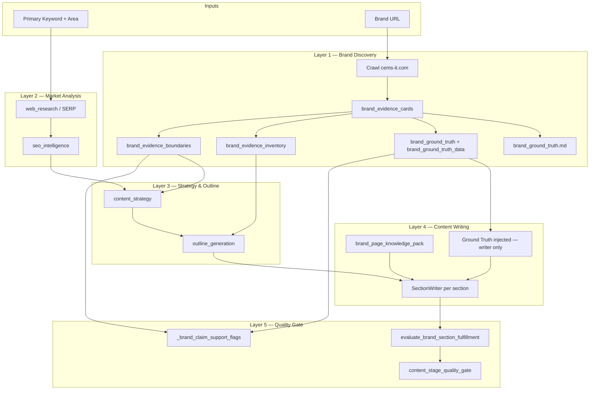

# SEO Writing AI — Technical Audit Report

**Project:** SEO Writing AI (Arabic commercial article pipeline)  
**Reference run:** `output/افضل-شركة-تصميم-مواقع-في-السعودية_20260609_091249`  
**Brand:** Creative Minds — https://cems-it.com/  
**Keyword:** افضل شركة تصميم مواقع في السعودية  
**Target area:** السعودية  
**Report date:** 2026-06-09  
**Audience:** Engineers / AI engineers onboarding to the project  

---

## 1. Executive Summary

The pipeline produces Arabic **brand_commercial** articles through a multi-stage workflow: brand discovery → SERP research → content strategy → outline → section writing → quality gate.

**Core architectural problem (identified and partially fixed):** Brand truth was fragmented across `brand_evidence_cards`, `brand_page_knowledge_pack`, `brand_evidence_inventory`, and `brand_evidence_boundaries`. Different layers read different snapshots, causing writer blindness, validator false positives, and inconsistent outlines.

**Major progress in the last iteration cycle:**

| Area | Before | After (latest run + code on branch) |
|------|--------|-------------------------------------|
| Brand crawling | Weak / web-biased extraction | 16 pages, page-by-page evidence, offers separated |
| Single source of truth | File only or absent | `state["brand_ground_truth"]` + `brand_ground_truth_data` |
| Writer | UI/Graphic-only services | WordPress, PHP, React, Hosting, SEO, Mobile, real projects |
| Validator | Geography/pricing false positives | 3B wired to `claim_boundaries` in code (post-run) |
| Derived catalogs | ~15% noise | Structural cleanup in code (post-run) |

**Latest run status:** `needs_revision` — **9 quality warnings**. Article content improved substantially; most remaining warnings are **validator false positives** and **repair/template leaks** (sec_07 process section), not missing brand evidence.

**Recommended immediate action:** One confirmation run with current code (cleanup + validator 3B), then wire strategy/outline to ground truth (Step 3C).

---

## 2. Architecture — System Layers



### Layer consumption matrix (as of latest run `091249`)

| Layer | Reads ground truth? | Reads legacy sources? | Affects article output? |
|-------|--------------------|-----------------------|-------------------------|
| Brand discovery | Builds it | cards, inventory, boundaries | Indirect (evidence quality) |
| Strategy | **No** (boundaries only in prompt) | `brand_evidence_boundaries` | Yes — section roles, differentiators |
| Outline | **No** | inventory context, brand_context | Yes — headings, FAQ count |
| Writer | **Yes** (parallel injection) | knowledge_pack | **Yes — major improvement observed** |
| Validator / fulfillment | **Partial** (pre-3B: boundaries; post-code: `claim_boundaries`) | cards, raw blocks, pack | Yes — warnings, not always content |

---

## 3. Timeline of Fixes (3C → 3E → Ground Truth → 3A → 3B)

| Phase | Focus | What changed | Status |
|-------|--------|--------------|--------|
| **3C** | Assembly / reporting | Fixed knowledge_pack vs cards sync; catalog in saved pack | ✅ Done |
| **3E-1** | De-bias extraction | Removed web-only keyword lists; signal-based services, URL scoring, page-type for portfolio | ✅ Done |
| **3E-2** | Geography validator | Distinguish project location vs brand office; `target_area` ≠ `local_presence` | ✅ Done |
| **GT-1** | Ground truth report | Page-first `brand_ground_truth.md`; dynamic catalogs; raw snippets; sources per item | ✅ Done |
| **GT-2** | Noise filters | Template labels, metadata chains, sentence fragments, offers vs technologies | ✅ Done |
| **3A-0** | State exposure | `state["brand_ground_truth"]` + `brand_ground_truth_data` | ✅ Done |
| **3A-1** | Parallel logging | `ground_truth_consumption` stamps per layer | ✅ Done |
| **3B-W** | Writer integration | `_format_ground_truth_for_writer` appended to writer pack | ✅ Done — **proven in run** |
| **3B-C** | Catalog cleanup | Page-type routing; portfolio names ≠ services; label/fragment filters | ✅ In code — **not in run 091249** |
| **3B-V** | Validator integration | `resolve_brand_claim_boundaries`; fulfillment geo/trust fixes | ✅ In code — **not in run 091249** |
| **3C-next** | Strategy + outline read GT | Not started | ⏳ Pending |
| **Repair** | sec_07 process template leak | Not fixed | ❌ Open |

---

## 4. Confirmed Findings

### 4.1 What works

1. **Brand discovery crawls Creative Minds successfully** — 16 pages in ground truth report; homepage services include WordPress, PHP, React, SEO, Android/iOS, marketing stack.
2. **Page-as-unit-of-truth structure** — Per-page URL, summary, observed evidence, raw snippets preserved.
3. **Claim boundaries are correct** for this brand: `pricing_available=no`, `local_presence=no`, `projects_available=yes`, Riyadh/Saudi listed as **mentioned geographies (not offices)**.
4. **Writer ground-truth injection works** — Log: `ground_truth_injected_into_writer=true` × 52; `false` × 14 (neutral sections, firewall OK).
5. **Article service coverage improved** — sec_02–04 include development, hosting, e-commerce, SEO, mobile; sec_05 lists Baddel, Billion, Aqar Ya Masr, etc.
6. **Comparison table (sec_06)** — First decision-useful markdown table in recent runs.

### 4.2 What does not work yet

1. **Strategy and outline do not consume `brand_ground_truth`** — Still driven by SERP + `brand_evidence_boundaries` + inventory strings.
2. **Validator false positives** (in run 091249) — "السوق السعودي" and similar buyer-context copy flagged as geography/trust violations.
3. **Derived service catalog noise** (in run 091249 file) — Rage3, Bolaq Bookstore, `expert design`, `including UI` in Services; `Design Services` / `Mobile App` in Projects.
4. **Process section corruption (sec_07)** — Placeholder bullets ("اكتب النتيجة المطلوبة") mixed with real process steps; duplicate numbering `1. 1. 1.`.
5. **FAQ thin (sec_08)** — Single Q&A; repair removed preamble/leak but coverage weak.
6. **Intro soft CTA** — `intro_final_enforcement_failed:intro_missing_soft_cta`.

---

## 5. Confirmed Bugs

| ID | Severity | Component | Description | Evidence |
|----|----------|-----------|-------------|----------|
| **B-01** | High | Process / FAQ repair | Template placeholder text leaked into sec_07 final content | `article_final.md` L122–124 |
| **B-02** | High | Fulfillment | Arabic prose falsely detected as unsupported project name | `quality_warnings.txt` sec_05; log `fulfillment_reason` |
| **B-03** | Medium | Fulfillment / validator | Buyer market context ("السوق السعودي") flagged as brand geography | sec_03, sec_04, sec_07, sec_09 warnings |
| **B-04** | Medium | Fulfillment / validator | Trust regex matches generic commercial praise without raw testimonial evidence | sec_01, sec_04, sec_09 |
| **B-05** | Medium | Intro enforcement | Commercial intro missing required soft CTA | `intro_final_enforcement_failed` in log |
| **B-06** | Low | Outline assembly | Raw project bullet list prepended before narrative in sec_05 | `article_final.md` L63–67 |
| **B-07** | Low | Derived catalogs | Cross-bucket pollution (portfolio entities in services catalog) | `brand_ground_truth.md` L247–262 |
| **B-08** | Low | FAQ repair | `faq_preamble_removed` / `faq_repair_leak_removed` | sec_08 warnings |

**Fixed in code after run 091249 (verify on next run):** B-03 (partial), B-07, validator path for B-04 via `claim_boundaries`.

---

## 6. Open Questions

1. **Should promotional offers (`50% Off Hosting`) unlock `pricing_available` for fulfillment?** Currently `pricing_available=false` but offer exists in catalogs.
2. **When to wire strategy/outline to full ground truth markdown vs structured `brand_ground_truth_data` only?** Risk: token budget vs coverage.
3. **Is `disable_outline_repair=true` still required for evaluation runs?** May hide fixes but also avoids some corruption — need policy.
4. **Should sec_06 comparison remain brand-neutral (no pack)?** Firewall hides GT for neutral sections — correct by design?
5. **Hosting page on cems-it.com** — Not always in top crawl set; is URL scoring reaching `/hosting` paths consistently?
6. **Post-3B-V:** How many warnings remain on confirmation run? Target: ≤4.

---

## 7. Current State of Each Layer

### 7.1 Brand discovery ✅ (≈90%)

- **Outputs:** `brand_ground_truth.md`, `brand_page_knowledge_pack.md`, cards, inventory, boundaries, in-state GT.
- **Strengths:** Rich homepage + portfolio evidence; offers separated; sources on catalog lines.
- **Gaps:** Derived catalog noise (~10%); duplicate AR/EN portfolio pages; truncated metadata rows on some case studies.
- **Gate to close:** One clean run with 3B-C cleanup applied.

### 7.2 SERP / market analysis ✅

- **Duration:** ~45s in reference run.
- **Strengths:** Competitor structure, FAQ/pricing ratios, Arabic SERP titles.
- **Gaps:** Not merged with brand ground truth for planning.

### 7.3 Content strategy ⚠️

- **Duration:** ~5.7s.
- **Reads:** `brand_evidence_boundaries` in prompt — **not** ground truth catalogs.
- **Impact:** `supported_differentiators` generic (SERP/topics), not WordPress/Hosting/SEO from site.
- **Logging:** `strategy_ground_truth_used` stamped (3A-1) but no prompt consumption.

### 7.4 Outline generation ⚠️

- **Duration:** ~30.7s; `disable_outline_repair=true`.
- **Reads:** inventory JSON gate, brand_context — **not** ground truth.
- **Impact:** FAQ count low; process section structure vulnerable to repair leaks.

### 7.5 Writer ✅ (with GT injection)

- **Duration:** ~86s content_writing.
- **Reads:** knowledge_pack + **injected ground truth block** (brand-eligible sections).
- **Proven:** Service and project coverage in `article_final.md`.

### 7.6 Validator / fulfillment ❌ → 🔄 (code updated)

- **Pre-run:** Legacy boundaries + aggressive regex → 6/9 warnings validator-related.
- **Post-code:** `resolve_brand_claim_boundaries`, market-context geo exemption, structural catalog cleanup.
- **Needs:** Confirmation run.

---

## 8. Run Analysis — `20260609_091249`

| Metric | Value |
|--------|--------|
| Total time | ~1.9 min (content_stage_only) |
| AI tokens (reported) | 69,014 |
| Sections written | 9 |
| Quality warnings | 9 |
| Status | `needs_revision` |
| Ground truth pages | 16 analyzed |
| Writer GT injection | 52 true / 14 false |

### Section scorecard

| Section | Content quality | Warning(s) |
|---------|-----------------|------------|
| sec_01 Intro | OK bridge to brand | soft CTA, trust FP |
| sec_02 Offer | **Strong** — stack listed | — |
| sec_03 Features | **Strong** — SEO/marketing | — |
| sec_04 Differentiation | Good tech breadth | pricing/geo/trust FP |
| sec_05 Projects | Good names + narrative | false project name, proof_missed |
| sec_06 Comparison | **Good table** | — |
| sec_07 Process | **Broken** placeholders | pricing/geo/trust FP |
| sec_08 FAQ | Weak (1 question) | repair artifacts |
| sec_09 Conclusion | OK CTA | geo/trust FP |

---

## 9. Evidence from Logs

### 9.1 Pipeline steps (from `workflow.log` / `metrics_summary.txt`)

```
brand_discovery     31.25s
web_research        39.94s
serp_analysis        5.54s
intent_title         2.56s
content_strategy     5.74s
outline_generation  30.66s
content_writing     86.08s
```

### 9.2 Ground truth in state (brand_discovery output)

```text
state["brand_ground_truth"]       → markdown report present
state["brand_ground_truth_data"]  → structured catalogs + claim_boundaries
state["brand_ground_truth_path"]  → saved to output dir
```

### 9.3 Writer injection (parsed from log)

```text
ground_truth_injected_into_writer: true  → 52 occurrences
ground_truth_injected_into_writer: false → 14 (neutral / firewall)
```

### 9.4 Per-section fulfillment (first audit pass)

| Section | status | reason (truncated) |
|---------|--------|-------------------|
| sec_01 | unsupported | trust/certification lacks raw evidence |
| sec_02 | satisfied | — |
| sec_03 | satisfied | — |
| sec_04 | unsupported | pricing + geography + trust |
| sec_05 | unsupported | false project name (Arabic phrase) |
| sec_06 | satisfied | not brand-owned |
| sec_07 | unsupported | pricing + geography + trust |
| sec_08 | weak | faq repair leak cleaned |
| sec_09 | unsupported | geography + trust |

### 9.5 Strategy boundaries (correct)

```json
"brand_pricing": false,
"local_presence": false,
"projects": true,
"testimonials": false
```

### 9.6 Quality warnings file (authoritative)

```text
STATUS: needs_revision
WARNING_COUNT: 9
```

---

## 10. Recommended Next Steps

### Immediate (before sharing with stakeholders)

1. **Run confirmation pipeline** with current codebase (3B-C + 3B-V + writer GT).
2. **Compare** `quality_warnings.txt` — expect drop from 9 → ~3–4.
3. **Inspect** `brand_ground_truth.md` derived catalogs — no Rage3/Bolaq in Services.

### Short term (Step 3 completion)

4. **Wire strategy** to `brand_ground_truth_data.catalogs.services` (parallel read + log).
5. **Wire outline** to same structured slice (not full 20k markdown).
6. **Fix B-01** — audit process/FAQ repair path when `disable_outline_repair=true` still leaks templates.

### Medium term

7. **Fix B-02** — tighten `find_unsupported_brand_project_names` for Arabic clause fragments.
8. **Intro soft CTA** — align writer prompt or post-processor with `intro_final_enforcement` rules.
9. **Close brand discovery layer** after one clean GT file + checklist ✓.

### Explicitly defer

- Full dominance (removing legacy cards/inventory) until strategy + outline + validator stable on GT.
- Prompt rewrites beyond minimal CTA/process fixes.

---

## Appendix A — Key files for reviewers

| File | Purpose |
|------|---------|
| `output/..._20260609_091249/workflow.log` | Full step I/O (~5MB) |
| `output/.../brand_ground_truth.md` | Single source of truth report |
| `output/.../article_final.md` | Published draft |
| `output/.../quality_warnings.txt` | Gate output |
| `src/services/brand_evidence_service.py` | Discovery, GT build, fulfillment |
| `src/services/workflow_controller.py` | Orchestration, writer GT injection |
| `tests/test_brand_evidence_contract.py` | Gate + integration tests |

## Appendix B — Checklist to close Brand Discovery

```text
[✓] Important pages crawled (16)
[✓] Services catalog has real stack (homepage)
[✓] Projects catalog has Baddel/Billion/etc.
[✓] Offers separate from technologies
[✓] Geography ≠ local_presence
[✓] claim_boundaries correct
[✓] Every catalog item has source
[~] Derived catalog clean (pending confirmation run)
[ ] Strategy reads GT
[ ] Outline reads GT
[ ] Validator stable on GT
```

---

*End of report — SEO Writing AI Technical Audit v1.0*
