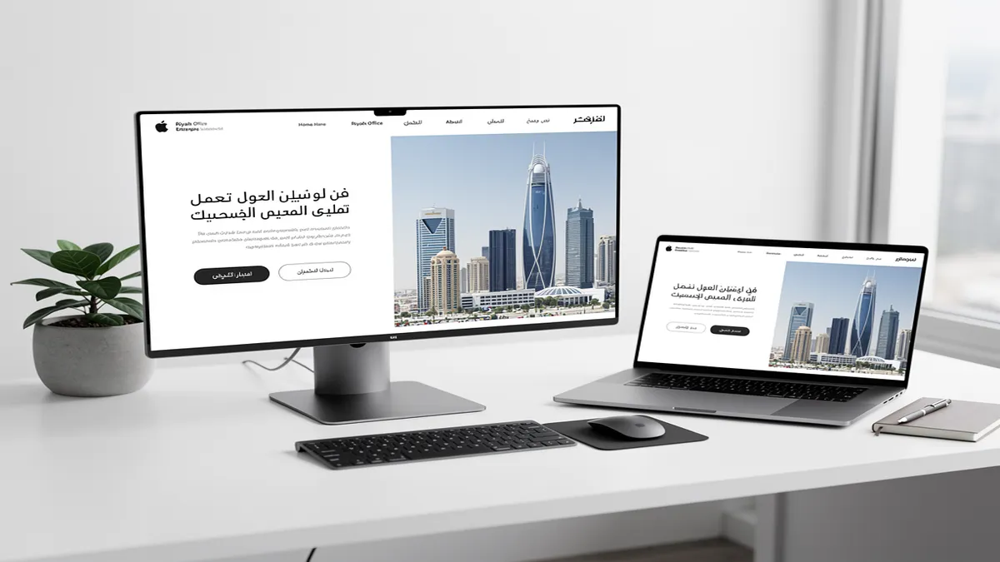
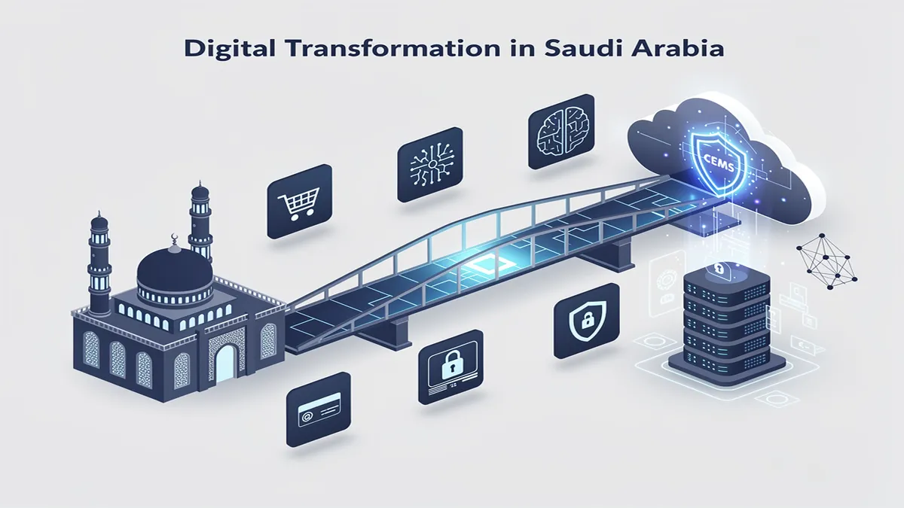
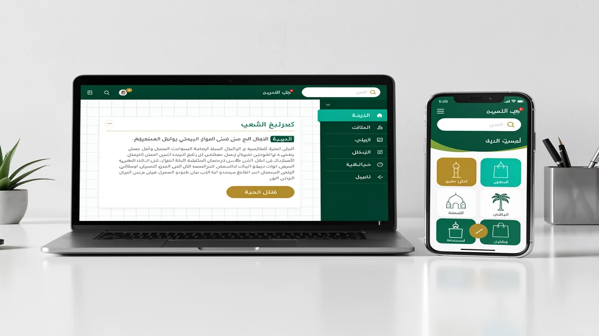
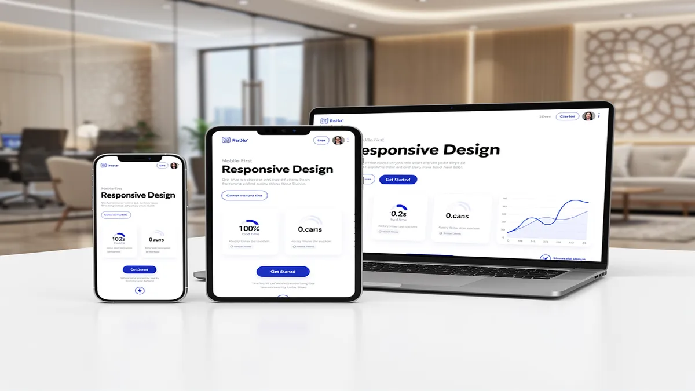
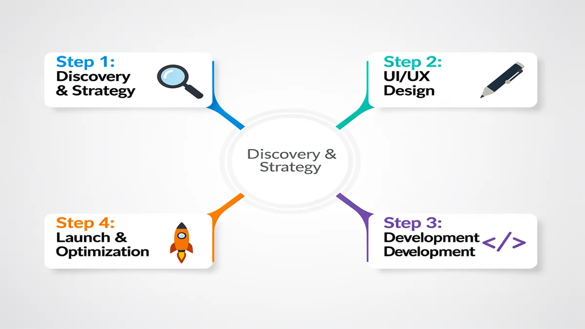
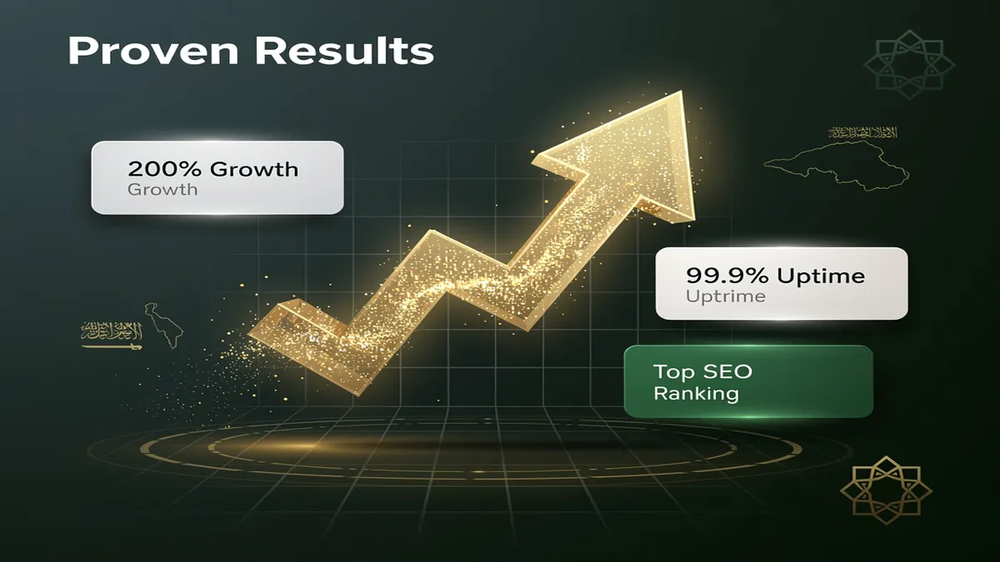

# Top Web Design Agency in Riyadh | Professional Website Solutions

## Leading Web Design Agency in Riyadh: Transforming Digital Visions into Reality

<!-- section_id: sec_01 -->

In the rapidly evolving market of Riyadh, your digital presence is no longer just a virtual storefront; it is the primary engine of your business growth and a critical pillar of your digital transformation. Partnering with a premier Web Design Agency like CEMS IT Official Website ensures your brand doesn’t just exist online but dominates the competitive Saudi landscape through high-performance, user-centric design. [Contact CEMS IT Official Website today to scale your digital ROI.](https://cems-it.com)

The Saudi market demands more than generic templates; it requires a deep understanding of local consumer behavior and the technical rigor to meet Saudi Vision 2030 digital goals. We specialize in crafting bespoke platforms that blend sophisticated visual identity with robust engineering, ensuring your website serves as a high-converting asset. By prioritizing responsive design and Arabic language localization, we bridge the gap between your global ambitions and local cultural nuances.

### Strategic Digital Transformation for the Saudi Market
Digital transformation in Riyadh is moving at a breakneck pace, requiring businesses to adopt agile, future-proof technologies. Our approach moves beyond aesthetics to integrate AI solutions and machine learning into your user journeys, predicting customer needs before they arise. This proactive strategy ensures your platform remains relevant as market dynamics shift, providing a sustainable competitive advantage in the Kingdom’s capital.

To achieve true market leadership, your website must adhere to international WCAG accessibility standards, ensuring every citizen and resident can interact with your brand effortlessly. We implement headless CMS architectures and Next.js frameworks to provide lightning-fast speeds that outpace traditional WordPress sites. This technical depth allows your business to scale rapidly while maintaining the highest levels of performance optimization and security.

Scale your business with an expert Web Design Agency in Riyadh. Book your free consultation now.

### User-Centric Design Meets Cultural Precision
Winning the trust of Saudi users requires a specialized focus on RTL (Right-to-Left) design nuances that many global agencies overlook. We meticulously engineer every interface element to align with natural Arabic reading patterns, ensuring a seamless flow that reduces bounce rates. Our user-centric design philosophy places your customer at the heart of the experience, maximizing engagement through intuitive navigation and culturally resonant imagery.

Your visual identity is the silent ambassador of your brand, and in Riyadh’s prestige-driven market, first impressions are definitive. We develop cohesive design systems that reflect your corporate values while utilizing modern UI trends that appeal to the tech-savvy Saudi youth. This strategic alignment between brand soul and digital body ensures that your audience perceives you as a leader from the very first click.

### High-Performance Engineering and Local Integration
Speed is a critical ranking factor in modern SEO services, and our development team prioritizes performance optimization at every layer of the stack. By utilizing [Cloudflare](https://www.cloudflare.com) for global content delivery and localized edge computing, we ensure your site loads instantly for users across the GCC. This technical excellence directly impacts your bottom line by preventing the 40% user drop-off associated with slow-loading mobile pages.

The final mile of conversion often happens at the checkout, which is why we specialize in seamless HyperPay integration and Moyasar payment gateway setups. These local financial integrations provide your customers with the security and familiarity they expect, significantly increasing transaction success rates. We don’t just build websites; we build complete transactional ecosystems designed to capture and process revenue efficiently within the Saudi regulatory framework.

### Advanced AI and Data-Driven Optimization
We leverage AI solutions to conduct deep user research, utilizing heatmaps and behavioral analytics to refine your site’s layout based on real-world data. This iterative design process eliminates guesswork, allowing us to implement features that directly correlate with increased user retention and higher average order values. Your website becomes a living organism that evolves based on how your Riyadh-based audience actually interacts with it.

Post-launch, our commitment continues with comprehensive maintenance packages that include 24/7 security monitoring and proactive core updates. We treat security as a non-negotiable foundation, implementing enterprise-grade encryption to protect your data and your customers' privacy against evolving cyber threats. This holistic approach ensures your digital asset remains a secure, high-performing representative of your brand long after the initial launch.

Secure your market share with Riyadh’s leading Web Design Agency. Start your project with CEMS IT Official Website.

## Why Professional Web Solutions are the Backbone of Saudi Arabia’s Vision 2030

<!-- section_id: sec_02 -->

In the heart of Riyadh, your digital presence is no longer a secondary asset; it is the primary engine of your commercial growth. As a premier **Web Design Agency**, we recognize that the Kingdom’s rapid digital transformation demands more than just aesthetic appeal. To align with Saudi Vision 2030 digital goals, your platform must serve as a high-performance gateway that converts local traffic into measurable revenue through precision-engineered user journeys.

The Saudi market is unique, characterized by a mobile-first population that expects instantaneous loading and culturally resonant interfaces. By choosing a professional **Digital Marketing Agency Saudi Arabia**, you ensure your brand does not just exist online but dominates its niche. We move beyond basic templates to build high-converting systems that integrate deep local insights with global technical standards, ensuring your business leads the regional shift toward a knowledge-based economy.

### Strategic Advantages of Vision-Aligned Web Solutions

*   **Performance Optimization for Speed and Retention**: You gain a competitive edge by reducing bounce rates through advanced **performance optimization** techniques like server-side rendering and global CDN deployment.
*   **Localized Visual Identity**: Your brand commands authority with a **visual identity** that respects Saudi cultural nuances, utilizing professional **RTL design** (Right-to-Left) and high-quality Arabic typography.
*   **User-Centric Design for Higher Conversions**: We implement **user-centric design** and **responsive design** frameworks that adapt perfectly to the diverse devices used across Riyadh and Dammam.
*   **Enterprise-Grade Security**: Protect your customer data and brand reputation with rigorous **security** protocols, including encrypted data layers and compliance with local Saudi cybersecurity regulations.
*   **AI Solutions and Automation**: You can scale operations efficiently by integrating **AI solutions** and **machine learning** to personalize user experiences and automate customer support workflows.
*   **Seamless Local Payment Integration**: Boost your e-commerce ROI by integrating local gateways like **HyperPay integration** and **Moyasar payment gateway**, providing the frictionless checkout experience Saudi consumers demand.

### Engineering Excellence with Modern Tech Stacks

Generic website builders often fail to meet the rigorous demands of the modern Saudi enterprise. To ensure your platform remains future-proof, we utilize high-performance frameworks like **Next.js** and **headless CMS** architectures. This approach decouples your content from the presentation layer, allowing for lightning-fast speeds and the flexibility to push updates across multiple platforms without downtime or technical friction.

Performance is a ranking factor that directly impacts your visibility. By prioritizing **performance optimization** at the code level, we ensure your site passes Core Web Vitals with ease. This technical foundation is essential for effective **SEO services**, as search engines prioritize platforms that offer a stable, fast, and accessible experience. Our development process adheres to **WCAG accessibility standards**, ensuring your brand remains inclusive and compliant with government-level digital requirements.

### Dominating the Local Search Landscape

In Riyadh’s crowded marketplace, visibility is the difference between a thriving business and a forgotten one. A professional website acts as the anchor for all your **SEO services**, providing the technical structure needed to rank for high-intent keywords. We focus on **Arabic language localization** that goes beyond simple translation, optimizing for local dialects and search behaviors to ensure you capture the "near me" search intent prevalent in the KSA market.

Your digital transformation is an ongoing journey, not a one-time project. By integrating **AI solutions** early in the design phase, you can leverage predictive analytics to understand how users interact with your site. This data-driven approach allows for continuous refinement of your **visual identity** and UX, ensuring your platform evolves alongside the shifting preferences of the Saudi consumer base.

### Future-Proofing Through Technical Innovation

The transition to a digital-first economy requires a robust technical backbone. Utilizing **Next.js** allows us to deliver static-site generation benefits with the dynamic capabilities of a modern web app. This ensures that even during high-traffic periods, such as national holidays or major sales events, your site remains stable and responsive. This level of reliability is what separates market leaders from their competitors in the Riyadh tech ecosystem.

Furthermore, our commitment to **security** ensures your business is protected against evolving cyber threats. By implementing modern headers, secure API integrations, and regular audits, we provide a safe environment for your transactions. When combined with **HyperPay integration**, your customers feel a sense of trust and professionalism that is vital for long-term brand loyalty in the Kingdom.

### Cultural Nuance and RTL UX Mastery

Designing for the Saudi market requires a deep understanding of **RTL design** principles. It is not merely about flipping the layout; it is about re-engineering the visual hierarchy to match the natural eye-scanning patterns of Arabic readers. We ensure that every button, form field, and navigation element is placed strategically to minimize cognitive load and maximize the probability of a successful conversion.

Your **visual identity** must reflect the ambition and heritage of Saudi Arabia. We blend modern minimalism with traditional motifs where appropriate, creating a professional look that resonates with both local investors and international partners. This balance is critical for businesses looking to expand their reach under the umbrella of **digital transformation**, providing a platform that is as prestigious as it is functional.

### Accessibility and Inclusion as a Standard

Adhering to **WCAG accessibility standards** is no longer optional for forward-thinking Saudi brands. An accessible website ensures that all citizens, regardless of their physical abilities, can interact with your services. This commitment to inclusivity not only broadens your market reach but also enhances your brand’s reputation as a socially responsible entity aligned with the humanitarian goals of the Kingdom’s vision.

By choosing a **headless CMS**, you gain the ability to manage complex, multi-lingual content with ease. This is particularly beneficial for organizations that need to provide real-time updates in both Arabic and English. The flexibility of this tech stack means your marketing team can launch campaigns faster, responding to market trends in Riyadh with unprecedented agility and precision.

### Measuring Success with Data and Analytics

We don't just build websites; we build growth engines. Every element of our **user-centric design** is informed by data. By integrating advanced tracking and **machine learning** tools, we provide you with a clear view of your ROI. You can see exactly where your traffic is coming from, how they are interacting with your **visual identity**, and which specific features are driving the most conversions.

This analytical depth allows us to perform ongoing **performance optimization** based on real-world usage. Whether it is tweaking a call-to-action or optimizing a landing page for a specific **Digital Marketing Agency Saudi Arabia** campaign, our goal is to ensure your digital presence remains a high-yielding asset. In the competitive landscape of Riyadh, this data-driven strategy is what ensures your long-term dominance and profitability.

To learn more about modern web standards and performance metrics, you can explore the official [web.dev](https://web.dev) documentation provided by Google. This resource offers deep insights into how technical health directly influences user satisfaction and search engine rankings in today’s digital economy.

## Comprehensive UI/UX Design Tailored for the Saudi Audience

<!-- section_id: sec_03 -->

In the competitive Riyadh market, a high-performing digital presence begins with a **Web Design Agency** that understands the intersection of cultural nuance and technical excellence. At CEMS IT Official Website, we transform your digital interface into a conversion engine by prioritizing **user-centric design** that resonates with local behavioral patterns. By aligning your platform with **Saudi Vision 2030 digital goals**, we ensure your brand not only meets global standards but leads the Kingdom’s **digital transformation**.

[**Transform Your User Experience – Contact CEMS IT Today**]

Superior **UI/UX Design** in Saudi Arabia requires more than just aesthetic appeal; it demands a deep mastery of **RTL design** (Right-to-Left) and **Arabic language localization**. We meticulously craft interfaces where navigation feels natural to native speakers, ensuring that every call-to-action is positioned for maximum psychological impact. This localized approach reduces bounce rates and fosters immediate trust with your Saudi audience.

We leverage **Next.js** and **headless CMS** architectures to deliver lightning-fast performance that satisfies both users and search engines. By integrating **SEO services** directly into the design phase, your site gains a structural advantage in local search rankings from day one. Our focus on **performance optimization** ensures that your high-resolution visual assets never compromise mobile loading speeds, even on 4G networks.

To future-proof your investment, we incorporate advanced **AI solutions** and **machine learning** to personalize the user journey in real-time. These technologies allow your platform to adapt to individual user preferences, suggesting content or products that increase average session duration. This data-driven layer turns a static website into an intelligent business tool that evolves alongside your customer base.

[**Get a Custom UI/UX Audit for Your Riyadh Business**]

Security and financial trust are paramount for Saudi consumers, which is why our design workflow includes seamless **HyperPay integration** and **Moyasar payment gateway** compatibility. We design checkout flows that minimize friction and emphasize **security**, utilizing familiar local payment methods like Mada and STC Pay. This strategic integration ensures that your **responsive design** maintains a professional, trustworthy appearance across all devices.

Accessibility is no longer optional for enterprise and government-linked entities in Riyadh. We strictly adhere to **WCAG accessibility standards**, ensuring your digital products are inclusive and usable for all citizens, including those with disabilities. This commitment to high-standard **visual identity** and usability protects your brand reputation and ensures compliance with evolving National Data Management Authority (NDMA) guidelines.

Our team utilizes **machine learning** algorithms to conduct predictive heat-mapping, identifying exactly where Saudi users are likely to click before a single line of code is written. This proactive **user-centric design** methodology eliminates guesswork, allowing us to build layouts that guide visitors toward conversion with surgical precision. You gain a platform optimized for the specific scrolling and clicking habits of the Riyadh tech-savvy youth.

[**Build a High-Converting Digital Platform Now**]

Beyond the launch, we provide comprehensive **digital transformation** support, including specialized maintenance packages that keep your **AI solutions** and security protocols updated. Our commitment to **SEO services** means we constantly monitor how UI changes affect your rankings, adjusting elements to maintain your competitive edge. Partnering with CEMS IT Official Website ensures your brand remains a dominant force in the Saudi digital landscape.

### Mobile-First and Responsive Solutions for Riyadh’s Tech-Savvy Market

<!-- section_id: sec_04 -->

In Riyadh’s hyper-competitive digital landscape, a standard website is no longer enough to capture a market that leads the world in smartphone penetration. Partnering with a premier **Web Design Agency** ensures your platform is built to dominate this mobile-first economy, where over 80% of local consumers browse and purchase via handheld devices. Contact our experts today to build a high-performance site that scales with your business.

Your brand’s digital transformation must align with Saudi Vision 2030 digital goals, moving beyond basic layouts to high-performance architectures. We utilize **Next.js** to deliver lightning-fast, server-side rendered pages that eliminate lag and provide an instantaneous user experience. This technical edge directly improves your search visibility and keeps tech-savvy Riyadh users engaged from the first click.

True **responsive design** in the Kingdom requires more than just resizing images; it demands a deep understanding of **RTL design** (Right-to-Left) nuances. We ensure your visual identity remains consistent across all screen sizes while optimizing the flow for Arabic language localization. This precision prevents layout breaks and ensures your message resonates culturally and linguistically with your target audience.

Performance optimization is the backbone of our development process, focusing on Core Web Vitals to guarantee elite loading speeds. By implementing a **headless CMS** and modern frameworks like **Next.js**, we decouple the frontend from the backend, allowing for rapid content updates without compromising site stability. This architecture provides the agility needed to stay ahead of market trends in Saudi Arabia.

Security and trust are paramount for Saudi enterprises and government entities alike. Our solutions adhere to strict **WCAG accessibility standards**, ensuring your platform is inclusive and compliant with national digital regulations. We integrate robust **security** protocols and AI-driven threat detection to protect your data and maintain the integrity of your customer interactions.

To drive actual revenue, we prioritize seamless transactional flows through local **HyperPay integration** and **Moyasar payment gateway** setups. By embedding these trusted Saudi payment solutions directly into the design phase, you reduce cart abandonment and build immediate credibility. This localized approach transforms a simple website into a powerful, high-converting commercial engine.

Scale your Riyadh business with a custom, mobile-first web solution designed for maximum ROI.

Our **user-centric design** philosophy leverages **AI solutions** and **machine learning** to personalize the visitor journey in real-time. By analyzing user behavior, your site can dynamically adjust content to match individual preferences, significantly boosting engagement rates. This data-driven strategy ensures your digital presence evolves alongside the sophisticated demands of the Riyadh market.

Beyond the launch, we provide comprehensive **SEO services** and maintenance packages to ensure your platform remains a leader in search rankings. We bridge the gap between aesthetics and functionality, utilizing **performance optimization** techniques that satisfy both Google’s algorithms and human users. Your website becomes a resilient asset that grows in value as your brand expands.

Choosing a specialized agency means gaining access to a "Made in Saudi" expertise that understands the regional competitive landscape. We don't just build pages; we engineer digital experiences that foster brand loyalty through intuitive navigation and rapid response times. This commitment to quality ensures your business remains at the forefront of the Kingdom’s digital evolution.

Ready to dominate the Saudi market? Let’s design a website that outperforms your competition.

## The CEMS IT Advantage: Why Riyadh Businesses Trust Us

<!-- section_id: sec_05 -->

In the high-stakes Riyadh market, your digital presence is either a growth engine or a silent liability. As a premier **Web Design Agency**, CEMS IT transforms static websites into high-performance assets that align with Saudi Vision 2030 digital goals. We don't just build pages; we engineer conversion-focused ecosystems that command authority in the Kingdom’s competitive landscape.

Your business deserves more than a template; it requires a bespoke **visual identity** that resonates with local cultural nuances while maintaining global standards. By integrating **user-centric design** with advanced **Arabic language localization**, we ensure your brand speaks naturally to your audience. This precision reduces bounce rates and fosters immediate trust with Saudi consumers who prioritize authenticity and ease of use.

Speed is the silent killer of conversions, which is why we prioritize extreme **performance optimization** using modern frameworks like **Next.js**. Unlike bloated legacy systems, our **headless CMS** architectures decouple the frontend from the backend, resulting in lightning-fast load times. This technical edge directly improves your search rankings and keeps mobile users engaged on 5G networks across Riyadh.

Security is non-negotiable for enterprise and government-linked entities in Saudi Arabia. CEMS IT implements rigorous **security** protocols and data encryption to protect your intellectual property and customer information. Our development process adheres to **WCAG accessibility standards**, ensuring your platform is inclusive and compliant with the latest Ministry of Communications and Information Technology (MCIT) regulations.

We bridge the gap between browsing and buying by perfecting **RTL design** (Right-to-Left) layouts that feel intuitive to Arabic speakers. Our team specializes in seamless **HyperPay integration** and **Moyasar payment gateway** setups, removing friction from the checkout process. This local expertise ensures your transactional flow is optimized for the specific banking habits of the Saudi market.

Beyond aesthetics, CEMS IT functions as a comprehensive **Digital Marketing Agency Saudi Arabia**, embedding **SEO services** into the core architecture of your site. We utilize **AI solutions** and **machine learning** to analyze user behavior, allowing for data-driven adjustments that increase ROI. This proactive approach to **digital transformation** means your website evolves alongside your business objectives.

Mobile responsiveness is often claimed but rarely mastered for the unique device landscape in Riyadh. We utilize **responsive design** techniques that guarantee a pixel-perfect experience on everything from high-end smartphones to enterprise tablets. Your users will enjoy a fluid, app-like experience that maintains brand consistency across every touchpoint, regardless of screen size or connection speed.

Choosing CEMS IT means partnering with a team that understands the "Made in Saudi" ethos and the technical demands of the future. We provide dedicated post-launch support and scalable maintenance packages to ensure your platform remains secure and updated. By focusing on measurable outcomes rather than just "going live," we empower your brand to lead the digital shift in the region.

To explore how our technical stack can accelerate your growth, visit the CEMS IT Official Website for a deep dive into our specialized Riyadh-based solutions. Whether you are a startup or an established enterprise, our architecture is built to scale with your ambitions. Stop settling for a digital placeholder and start building a digital legacy with the experts who understand the Riyadh market best.

## Our 4-Step High-Performance Design Process

<!-- section_id: sec_06 -->

In the fast-paced Riyadh market, a website is no longer just a digital brochure; it is the engine of your **digital transformation**. As a specialized **Web Design Agency**, we have engineered a high-performance 4-step process that aligns your online presence with the ambitious **Saudi Vision 2030 digital goals**. By focusing on measurable outcomes rather than just aesthetics, we ensure your platform serves as a high-converting asset that dominates local search results.

### 1. Discovery, Visual Identity, and Cultural Alignment
We begin by defining a unique **visual identity** that resonates with the specific cultural nuances of Middle Eastern users. Our team deep-dives into your brand’s DNA to ensure that every design element reflects local values while maintaining international quality standards. This stage focuses on **Arabic language localization** and sophisticated **RTL design** (Right-to-Left) layouts, ensuring that your Saudi audience experiences a natural and intuitive interface from the very first click.

Beyond simple translation, we analyze local market behavior to create a **user-centric design** that prioritizes the needs of Riyadh’s tech-savvy demographic. We map out user journeys that account for local browsing habits, ensuring that your brand’s message is never lost in translation. This foundational step sets the stage for a website that doesn't just look professional but feels native to the Kingdom’s rapidly evolving digital landscape.

### 2. Intelligent Architecture and AI-Driven UX
Moving into the technical design phase, we implement cutting-edge **AI solutions** to predict user intent and streamline navigation. By utilizing **machine learning** algorithms during the wireframing stage, we can identify potential friction points before a single line of code is written. This data-driven approach allows us to build a **responsive design** that maintains pixel-perfect precision across all devices, from mobile smartphones to high-resolution desktop monitors.

To ensure your platform is future-proof, we utilize a **headless CMS** architecture combined with **Next.js** for lightning-fast front-end performance. This modern tech stack allows for seamless content updates and unparalleled scalability as your business grows. We also adhere strictly to **WCAG accessibility standards**, ensuring that your digital services are inclusive and usable for all citizens, meeting the high expectations of Saudi government and enterprise-level projects.

### 3. High-Performance Development and Local Integration
Performance is a non-negotiable factor for conversion, which is why our development phase centers on aggressive **performance optimization**. We build lean, high-speed architectures that reduce bounce rates and keep users engaged. During this stage, we integrate essential local fintech tools, including **HyperPay integration** and the **Moyasar payment gateway**, to provide your customers with the secure, familiar checkout experiences they trust in the Saudi market.

Security is woven into the fabric of our code, not added as an afterthought. We implement robust **security** protocols and advanced encryption to protect your data and your customers' privacy against modern cyber threats. By combining these local payment solutions with world-class **SEO services**, we ensure your site is not only technically superior but also highly visible to your target audience in Riyadh and throughout the GCC region.

### 4. Optimization, Launch, and Post-Launch Evolution
The final step involves a rigorous testing phase where we verify every integration, from API calls to mobile responsiveness. We don't just launch and leave; we provide comprehensive post-launch support and maintenance packages designed to keep your site at peak performance. This includes continuous monitoring of core web vitals and regular updates to ensure your platform remains compatible with the latest browser technologies and security patches.

Our commitment to your growth includes ongoing **digital transformation** consulting, helping you leverage new features as they emerge. We provide detailed analytics and heatmaps to show exactly how users are interacting with your site, allowing for iterative improvements based on real-world data. This holistic 4-step approach ensures that your investment continues to deliver high ROI, keeping you ahead of the competition in Saudi Arabia’s competitive digital economy.

## Proven Results: Elevating Brands Across the Kingdom

<!-- section_id: sec_07 -->

Transforming your presence in the Riyadh market requires more than a standard template; it demands a strategic overhaul of your **visual identity** to align with the sophisticated expectations of Saudi consumers. By partnering with a premier **Web Design Agency**, you move beyond basic aesthetics to build a high-performance digital asset that actively drives revenue. CEMS IT Official Website specializes in this transition, ensuring your brand doesn't just exist online but dominates its niche through technical excellence and cultural resonance.

The Saudi market is currently undergoing a massive shift fueled by Saudi Vision 2030 digital goals, creating a landscape where only the most agile brands survive. You gain a competitive edge by deploying **performance optimization** strategies that reduce bounce rates and keep users engaged longer. This isn't just about speed; it is about creating a frictionless pathway from the first click to the final conversion, ensuring every interaction reinforces your market authority in the Kingdom.

Your digital transformation begins with a deep dive into **user-centric design**, where every interface element is positioned based on behavioral data rather than guesswork. In Riyadh’s fast-paced business environment, your customers expect a **responsive design** that feels native to both high-end mobile devices and enterprise desktops. We focus on the "Mobile-First" reality of Saudi Arabia, ensuring your site delivers a premium experience regardless of how your audience accesses it.

True brand elevation involves the integration of **AI solutions** and **machine learning** to personalize the user journey in real-time. Imagine a website that adapts its content based on user intent, shortening the sales cycle and increasing your ROI. By leveraging these advanced technologies, you provide a level of service that mirrors the hospitality and efficiency expected in the Saudi corporate sector, setting a new benchmark for your competitors.

Security is the cornerstone of trust for any enterprise operating within the Kingdom. We implement rigorous **security** protocols and **WCAG accessibility standards** to ensure your platform is safe, inclusive, and compliant with local regulations. This commitment to technical integrity protects your reputation and ensures that your **digital transformation** is built on a foundation that can scale as your business grows across the Middle East.

Maximizing your visibility requires integrated **SEO services** that target high-intent local keywords while maintaining global standards. By utilizing a modern tech stack involving **Next.js** and a **headless CMS**, your site achieves lightning-fast load times that search engines reward with top rankings. This architecture allows you to manage content with unprecedented flexibility, ensuring your marketing team can react to market trends in Riyadh within minutes, not days.

A critical component of success in the Saudi market is flawless **Arabic language localization** and **RTL design** (Right-to-Left) execution. We don't just translate text; we re-engineer the entire UX flow to feel natural for Arabic speakers, ensuring that visual hierarchies and navigation menus align with local reading patterns. This cultural precision is what differentiates a global brand from one that truly resonates with the hearts and minds of the Saudi people.

To facilitate seamless transactions, your platform must integrate with local financial ecosystems like **HyperPay integration** or the **Moyasar payment gateway**. These tools provide your customers with the familiar, secure payment methods they trust, such as Mada and STC Pay. By removing payment friction at the design phase, you directly impact your bottom line and improve the overall lifetime value of every customer who visits your site.

We move beyond the limitations of generic platforms by offering bespoke development that prioritizes long-term scalability. Whether you are a government entity or a private enterprise, our approach ensures your website is ready for the future of the web. Explore the official Next.js documentation to understand how this framework provides the performance foundation necessary for modern, enterprise-grade Saudi websites.

Choosing the right **Web Design Agency** means selecting a partner that understands the specific nuances of Riyadh’s economy. You deserve a platform that reflects the prestige of your brand while delivering measurable results through data-driven design. With CEMS IT Official Website, you are not just launching a website; you are deploying a strategic tool designed to capture market share and reflect the ambitious spirit of the New Saudi Arabia.

## Frequently Asked Questions About Web Design in Riyadh

<!-- section_id: sec_08 -->

### Why is a Professional Web Design Agency Critical for Riyadh Businesses?

In Riyadh’s hyper-competitive market, your digital presence is the primary engine for growth and credibility. A professional **Web Design Agency** does more than create aesthetic layouts; it engineers high-performance platforms that align with the Saudi Vision 2030 digital goals. By prioritizing user-centric design, you ensure that local customers find your services intuitive, leading to higher retention and measurable ROI.

A sophisticated digital presence in the capital requires a deep understanding of local market behavior, where mobile-first browsing dominates and users expect instant gratification. When you invest in professional **Web Design Riyadh**, you are not just buying a website; you are securing a scalable asset that integrates advanced **SEO services** and robust **security** protocols. This strategic foundation allows your business to outperform competitors who rely on outdated, static templates.

### How Does RTL Design Impact User Experience in the Saudi Market?

Arabic language localization is not merely about translating text; it requires a comprehensive RTL design (Right-to-Left) strategy. In Riyadh, users navigate digital interfaces differently than Western audiences, meaning your visual identity must be recalibrated for natural eye-scanning patterns. Proper RTL implementation ensures that navigation menus, call-to-action buttons, and form fields feel native and frictionless to the local user base.

Beyond basic alignment, true localization involves cultural nuance in iconography and typography. Utilizing modern frameworks like **Next.js** allows for seamless switching between English and Arabic without compromising performance or layout integrity. By adhering to these standards, you demonstrate respect for the local culture, which significantly boosts brand trust and conversion rates among Saudi nationals and residents.

### What Role Does Page Speed Play in Modern Web Performance?

Performance optimization is a ranking factor that directly influences your bottom line, as even a one-second delay can slash conversions by 20%. For businesses in Riyadh, where high-speed 5G is the standard, users have zero tolerance for slow-loading pages. Implementing a **headless CMS** architecture or using static site generation ensures your content reaches the user almost instantaneously, regardless of their device.

Your website must pass Google’s Core Web Vitals to maintain visibility in a crowded marketplace. This involves optimizing server response times, compressing high-resolution assets, and utilizing global CDNs. When your site loads rapidly, it signals to search engines that you provide a superior user experience, which is a core pillar of effective **SEO services**. High speed isn't a luxury; it's a prerequisite for digital dominance.

### How Can AI Solutions and Machine Learning Enhance My Website?

Integrating **AI solutions** into your web architecture allows you to offer hyper-personalized experiences that were previously impossible. In the Riyadh tech ecosystem, businesses are increasingly using **machine learning** to analyze user behavior in real-time. This data enables your site to dynamically adjust content, product recommendations, and search results to match the specific intent of each visitor.

AI-driven chatbots and predictive search functions reduce the friction in the customer journey, leading to higher engagement. These technologies also assist in backend automation, such as automated content tagging and sentiment analysis of user feedback. By leveraging these advanced tools, you position your brand as an innovator, staying ahead of the **digital transformation** curve currently sweeping through the Kingdom’s private sector.

### Which Payment Gateways are Essential for Saudi E-commerce?

For any transactional site in Riyadh, seamless **HyperPay integration** or the use of **Moyasar payment gateway** is non-negotiable. Saudi consumers demand secure, familiar, and localized payment methods like Mada, Apple Pay, and STC Pay. If your checkout process feels alien or lacks these local options, you will face high cart abandonment rates and a loss of consumer confidence.

During the design phase, the UI must prioritize the security and simplicity of the transaction flow. Ensuring PCI-DSS compliance and clearly displaying trust signals are vital steps in building a reliable e-commerce environment. By integrating these local gateways early in the development cycle, you provide a frictionless path to purchase that aligns with the spending habits of the Saudi market.

### Why is Responsive Design No Longer Optional?

With over 80% of internet traffic in Saudi Arabia originating from smartphones, **responsive design** is the backbone of your digital strategy. Your website must adapt fluidly to everything from the latest iPhone to large desktop monitors used in Riyadh’s corporate offices. A "mobile-first" approach ensures that touch targets are accessible and content remains legible without zooming or horizontal scrolling.

Google’s mobile-first indexing means your search rankings are directly tied to how well your site performs on mobile devices. A poorly optimized mobile site will hide your business from potential clients, regardless of how good your desktop version looks. By focusing on fluid grids and flexible images, you provide a consistent brand experience that captures leads across all touchpoints in the customer lifecycle.

### How Does SEO Integration Drive Long-Term Business Growth?

Effective **SEO services** are not an afterthought; they must be baked into the code of your website from day one. Structural SEO involves optimizing your site’s architecture, URL strings, and internal linking to help search engines crawl and index your content efficiently. In Riyadh’s competitive sectors like real estate or finance, being on the first page of Google is the difference between scaling and stagnating.

Beyond technical factors, SEO requires high-quality, localized content that answers the specific queries of your target audience. By targeting high-intent keywords and maintaining a healthy keyword density, you attract "warm" leads who are already looking for your solutions. This organic traffic provides a much higher ROI than paid advertising over time, establishing your brand as a permanent authority in your niche.

### What are the Standards for Accessibility Compliance in KSA?

Adhering to **WCAG accessibility standards** is becoming a mandatory requirement for government-linked entities and large enterprises in Saudi Arabia. This ensures that your website is usable by everyone, including people with visual, auditory, or motor impairments. Features like screen reader compatibility, high-contrast modes, and keyboard navigation are essential components of an inclusive **user-centric design**.

Beyond legal and ethical considerations, accessibility improves the overall usability for all visitors. For example, clear heading hierarchies and descriptive alt-text for images help search engines understand your content better, which indirectly boosts your SEO. By prioritizing accessibility, you expand your market reach and demonstrate a commitment to social responsibility that resonates with modern Saudi values.

### How Can I Ensure Maximum Website Security?

In an era of increasing cyber threats, **security** must be the foundation of your web development project. This includes implementing SSL certificates, firewalls, and regular security audits to protect both your business data and your users' personal information. In Riyadh, where digital trust is paramount, a single data breach can permanently tarnish a brand's reputation and lead to significant financial loss.

Using a **headless CMS** can further enhance security by decoupling the frontend from the backend, making it significantly harder for attackers to find vulnerabilities. Regular software updates and the use of multi-factor authentication for administrative access are also critical. By building a "security-first" culture, you provide your clients with the peace of mind they need to engage with your brand online.

### What Kind of Post-Launch Support Should I Expect?

The launch of your website is just the beginning of your digital journey; consistent maintenance is required to keep it running at peak performance. Professional agencies offer support packages that include uptime monitoring, periodic **security** patches, and performance tuning. This proactive approach prevents technical debt from accumulating and ensures your site remains compatible with evolving browser standards.

Post-launch support also involves analyzing user data to make iterative improvements to the UX. By monitoring heatmaps and conversion funnels, you can identify bottlenecks and optimize the path to purchase. This continuous improvement cycle ensures that your website remains a high-performing asset that grows alongside your business in the dynamic Riyadh market.

### Why Choose a Headless CMS Over Traditional WordPress?

While traditional WordPress is popular, a **headless CMS** like Strapi or Contentful offers superior flexibility and performance for modern Saudi enterprises. By separating the content management from the presentation layer, you can deliver content to multiple platforms—websites, mobile apps, and IoT devices—from a single source. This architecture is inherently faster because it eliminates the bloat associated with traditional themes and plugins.

Headless systems also offer better **security** because the database is not directly exposed to the internet. For businesses in Riyadh aiming for a "future-proof" tech stack, this approach allows developers to use modern frameworks like **Next.js** to create highly interactive, app-like experiences. If your goal is a bespoke, high-performance platform that can scale indefinitely, a headless solution is the gold standard.

### How Does Visual Identity Influence Brand Trust?

Your **visual identity** is the first thing a visitor notices, and it takes less than a second for them to form an opinion about your professionalism. In Riyadh, a premium aesthetic that blends modern minimalism with local cultural elements signals that your business is high-end and reliable. Consistent use of typography, color palettes, and high-quality imagery creates a cohesive brand story that sticks in the user’s mind.

A well-crafted visual strategy goes beyond "looking pretty"; it guides the user’s eye toward your most important information and calls to action. By aligning your digital look with your physical presence, you create a seamless omnichannel experience. This consistency is vital for building the long-term brand equity required to dominate your industry in the Saudi market. For more technical insights on maintaining web standards, you can visit wordpress.org.

## Conclusion: Start Your Digital Journey with Riyadh’s Premier Agency

<!-- section_id: sec_09 -->

Your digital presence in Riyadh is no longer just a virtual storefront; it is the engine of your business growth in a city rapidly transforming under Saudi Vision 2030 digital goals. Partnering with a specialized Web Design Agency ensures your brand does not just exist online but dominates its niche through high-performance architecture and localized user experiences. By prioritizing user-centric design, you convert casual browsers into loyal customers, leveraging a platform built to handle the unique demands of the Saudi market.

The shift toward a digital-first economy in KSA requires more than aesthetic appeal; it demands a comprehensive digital transformation. When you invest in Web Design Riyadh, you are securing a scalable foundation that integrates Next.js for lightning-fast speeds and headless CMS for flexible content management. This technical edge allows your business to stay agile, updating offerings in real-time while maintaining the rigorous security standards necessary for modern enterprise operations.

Modern Saudi consumers expect seamless interactions, which is why Arabic language localization and flawless RTL design are non-negotiable. A premier agency ensures your typography, navigation, and visual hierarchy feel natural to native speakers, respecting cultural nuances while maintaining a global standard of sophistication. This attention to detail builds immediate trust, signaling to your audience that your brand understands their specific needs and values.

Beyond the interface, your website serves as a transactional powerhouse through integrated local payment solutions. By embedding HyperPay integration or the Moyasar payment gateway directly into the design phase, you remove friction from the customer journey. These localized fintech connections ensure that your checkout process is familiar and secure, significantly reducing cart abandonment rates and boosting your bottom line in the competitive Riyadh retail landscape.

Performance optimization is the silent driver of your search engine rankings and user retention. Utilizing modern frameworks like Next.js ensures your site achieves elite Core Web Vitals scores, which is a critical factor for SEO services. In a market where mobile usage is nearly universal, a responsive design that loads in under two seconds is the difference between capturing a lead and losing them to a faster competitor.

To future-proof your investment, elite agencies now incorporate AI solutions and machine learning to personalize the user journey. Imagine a website that adapts its content based on user behavior or utilizes predictive search to help customers find products faster. These advanced features, once reserved for global tech giants, are now essential components for any Riyadh-based business looking to lead its industry through innovation.

Accessibility is another pillar of a world-class digital strategy, particularly for government-linked entities or large enterprises. Adhering to WCAG accessibility standards ensures your platform is inclusive, reaching users of all abilities while complying with evolving Saudi regulations. This commitment to universal design not only expands your market reach but also reinforces your brand’s reputation as an ethical and forward-thinking leader.

Your visual identity must be consistent across every digital touchpoint to create a lasting impression. Professional designers craft a cohesive language where colors, icons, and layouts reflect your core values while standing out in a crowded marketplace. This strategic branding, combined with high-quality imagery and interactive UX walkthroughs, ensures that your first impression is both memorable and authoritative.

The journey doesn't end at launch; sustained growth requires robust post-launch support and maintenance packages. Rapidly evolving web standards and security threats mean your site needs constant monitoring and updates to remain at peak performance. A dedicated partner provides the peace of mind that your digital asset is protected by the latest encryption protocols and performance patches, allowing you to focus on your core business operations.

Choosing the right partner is the most critical decision in your digital roadmap. You need a team that blends technical mastery with deep local insights to navigate the complexities of the Saudi market. For those ready to elevate their online presence with a bespoke, high-conversion platform, visiting the CEMS IT Official Website offers a gateway to professional solutions tailored for Riyadh’s ambitious business landscape.

Ultimately, a world-class website is an investment in your brand’s future scalability and credibility. By aligning your digital strategy with the latest technology and local user expectations, you create a powerful tool that drives measurable ROI. Start your transformation today and position your business at the forefront of Riyadh’s vibrant digital economy with a website designed to lead, perform, and convert.