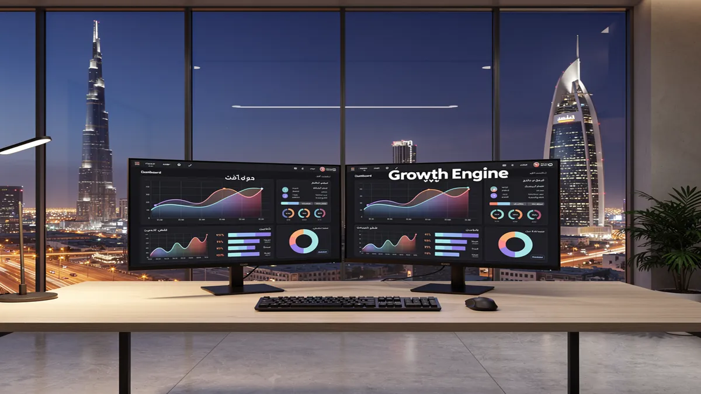
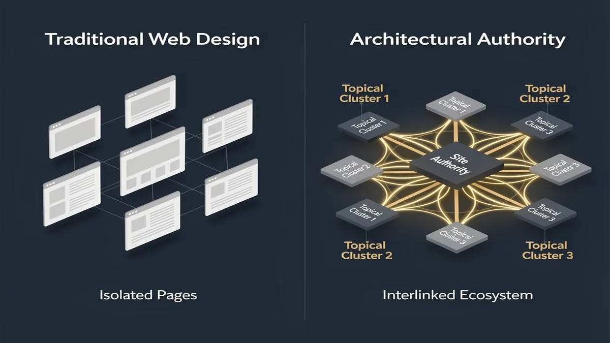
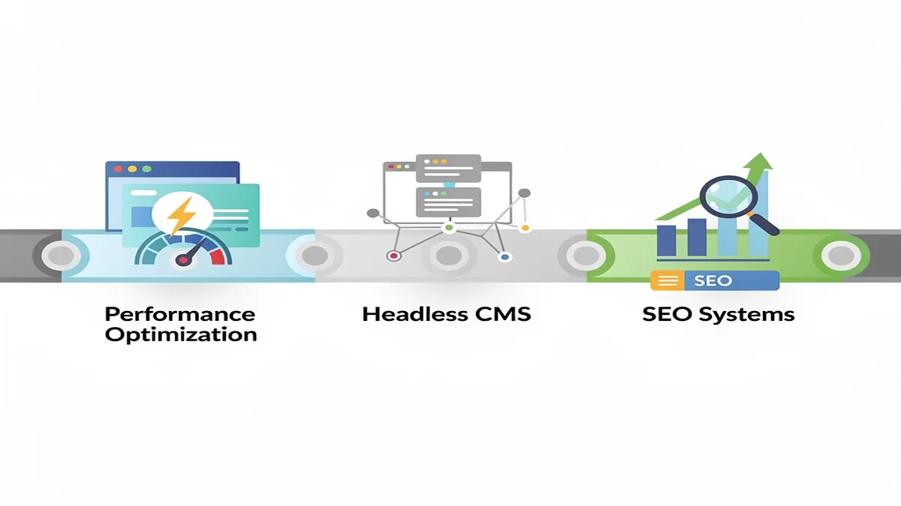
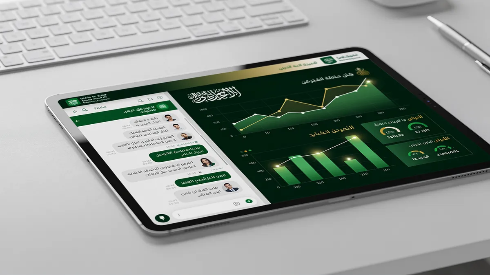

# Top Web Design Agency in Riyadh | Professional Website Development

## Top Web Design Agency in Riyadh | Professional Website Development

<!-- section_id: sec_01 -->

The rapid acceleration of the digital economy in Riyadh has shifted the requirements for a professional online presence from simple visibility to architectural authority. In a market where internet penetration has surpassed 98%, according to the [citc.gov.sa](https://www.citc.gov.sa), a **Web Design Agency** must look beyond superficial aesthetics to ensure every digital asset functions as a high-performance engine for growth. Business leaders in the Kingdom are increasingly moving away from short-term "hacks" in favor of robust systems that align with the rigorous standards of Saudi Vision 2030 digital compliance.

The challenge for most enterprises in Riyadh is the "Translation Trap"—the tendency to apply Western design frameworks to a Middle Eastern context without accounting for **RTL design nuances**. True digital transformation requires an Arabic-first UX architecture where the visual hierarchy, typography, and navigation flow are natively engineered for the local user’s cognitive patterns. This cultural alignment is the foundation of building trust and authority in a competitive regional landscape.

Modern **web development** now demands a "GPT-ready" architecture. This involves a **Topical Authority blueprint** that utilizes semantic HTML and structured data to ensure that both traditional search engines and emerging AI crawlers can accurately parse and rank your content. Without this machine-learning integration, even the most visually stunning website remains invisible to the very systems driving modern discovery.

For organizations seeking to dominate their vertical, basic hosting is no longer sufficient. High-level **technology consulting** is required to navigate **NCA compliance Saudi Arabia** (National Cybersecurity Authority) and NDMO data sovereignty requirements. Implementing a **headless architecture** allows for superior **performance optimization** and security, ensuring that **e-commerce solutions** remain resilient against threats while delivering sub-second load times across all devices through **responsive design**.

By integrating **SEO services** directly into the development lifecycle, businesses can ensure that their **digital transformation** is measurable. At [CEMS IT Official Website](https://cems-it.com/), the focus remains on engineering platforms that prioritize technical excellence and local regulatory adherence, transforming a standard corporate site into a strategic asset capable of sustaining long-term market leadership.

## Why Riyadh’s Leading Brands are Shifting to Architectural Authority

<!-- section_id: sec_02 -->

The rapid evolution of the Riyadh market, fueled by Saudi Vision 2030, has rendered traditional, isolated keyword strategies obsolete. For a modern **Web Design Agency**, the focus has shifted from merely ranking for a handful of terms to building an interconnected content ecosystem that signals deep topical authority. Leading brands in the Kingdom are moving away from "thin" landing pages toward architectural authority—a strategy where every technical and creative asset serves a broader digital transformation goal.

In a city where 98.6% of the population is digitally active, the competition for attention is no longer about being found; it is about being trusted. Riyadh’s enterprise sector now demands that a **Digital Marketing Agency Saudi Arabia** provides more than just aesthetic layouts. They require a "Topical Authority Blueprint" that integrates SEO services with high-level technology consulting to ensure long-term search dominance.

### The Problem: The Failure of Isolated Visibility
Many businesses in Riyadh still treat their website as a static brochure. This approach leads to several critical failures in the 2026 search landscape:
*   **Algorithmic Decay:** Search engines now prioritize "entities" over keywords. If your site lacks a logical flow between its service pages and educational resources, its perceived expertise drops.
*   **Friction in User Journeys:** Generic templates often ignore **RTL design nuances**, leading to high bounce rates among Arabic-speaking users who find the interface counter-intuitive.
*   **Compliance Gaps:** Failure to align with **NCA compliance Saudi Arabia** or NDMO data sovereignty rules can lead to legal hurdles and a loss of consumer trust.

### The Solution: Building an Architectural Powerhouse
To achieve "Architectural Authority," brands must adopt a multi-layered approach to website development that prioritizes **performance optimization** and future-ready tech stacks.

1.  **Deploy Headless Architecture:** By decoupling the frontend from the backend, brands can deliver lightning-fast experiences across all devices. This is essential for **responsive design** in a mobile-first market like Riyadh.
2.  **Implement AI Solutions:** Integrating **machine learning integration** allows for hyper-personalized user experiences. This includes dynamic content delivery that adapts based on the visitor's previous interactions.
3.  **Prioritize Saudi Vision 2030 Digital Compliance:** Every digital asset must reflect the Kingdom’s standards for innovation, accessibility, and data security.
4.  **Develop GPT-Ready Architecture:** Content must be structured semantically so that AI discovery engines can easily parse and recommend your services.

### Strategic Comparison: Traditional vs. Architectural Web Design

| Feature | Traditional Web Design | Architectural Authority (CEMS IT) |
| :--- | :--- | :--- |
| **Search Strategy** | Isolated Keyword Targeting | Topical Authority Ecosystem |
| **Tech Stack** | Monolithic CMS | **Headless Architecture** & **AI Solutions** |
| **UX Focus** | Translated Layouts | **RTL Design Nuances** & Cultural UX |
| **Compliance** | General GDPR/Global | **NCA Compliance Saudi Arabia** & Vision 2030 |
| **Performance** | Standard Hosting | **Performance Optimization** & Edge Computing |

### Real-World Application and Results
When Riyadh-based enterprises transition to this model, the results extend beyond simple traffic metrics. For instance, a retail giant implementing **e-commerce solutions** with integrated **machine learning integration** can see a significant lift in average order value through predictive product placement. 

Furthermore, by aligning with **digital transformation** roadmaps provided by **CEMS IT Official Website**, brands ensure their infrastructure is scalable. This prevents the need for costly "re-platforming" every two years. Instead of chasing the latest Google update, these brands become the "source of truth" in their respective niches, forcing competitors to react to their content depth rather than the other way around. Following official [Google Search Central](https://developers.google.com/search) documentation on structured data is the final step in ensuring this architectural authority is recognized by global crawlers.

## Our Core Services: Beyond Aesthetics to Performance Optimization

<!-- section_id: sec_03 -->

The shift in the Riyadh digital landscape toward Saudi Vision 2030 compliance has transformed the role of a **Web Design Agency** from a creative boutique into a strategic technology partner. We move beyond isolated keyword optimization to build interconnected content ecosystems—a "Topical Authority" blueprint—that signals genuine expertise to 2026 search algorithms. By aligning every technical decision with your digital transformation goals, we ensure your platform serves as a high-performance engine for growth.

### The Solution: Architecture Built for the Saudi Market
Our approach integrates **UI/UX Design** with a deep understanding of **RTL design nuances**. For a website to resonate in Saudi Arabia, it must be "Arabic-first," not just translated. This involves mirroring layouts, adjusting typography for readability, and ensuring that visual hierarchies align with regional cognitive patterns. 

To support these experiences, we deploy **headless architecture** using frameworks like Next.js and Laravel. This decoupled approach allows for lightning-fast **performance optimization**, ensuring your site meets Core Web Vitals and **NCA compliance Saudi Arabia** standards for data sovereignty and security. By utilizing a **GPT-ready architecture**, we structure your data semantically, making it easily "readable" by both traditional search engines and emerging AI discovery tools.

### Strategic Implementation Steps
1.  **Technology Consulting & Audit**: We begin by mapping your current infrastructure against **Saudi Vision 2030 digital compliance** standards. This identifies gaps in security, accessibility, and data residency.
2.  **UX Research & RTL Prototyping**: Our team develops user flows specifically for the local market, integrating **AI solutions** such as **machine learning integration** for personalized user journeys.
3.  **Full-Stack Web Development**: Utilizing **headless architecture**, we build scalable environments that support complex **e-commerce solutions** and enterprise portals.
4.  **Performance & SEO Services**: We implement a "Topical Authority" strategy, linking your core services to educational clusters that satisfy E-E-A-T requirements.

### Practical Examples of Performance-Driven Design
Consider a large-scale enterprise in Riyadh requiring a **digital transformation**. Instead of a standard WordPress build, we implement a **headless architecture** where the frontend is hosted on a global CDN like cloudflare.com for sub-second loading times, while the backend remains secured within KSA borders to meet local regulations.

For **e-commerce solutions**, we integrate **AI solutions** that predict customer behavior, offering a **responsive design** that adapts not just to screen size, but to user intent. By combining **SEO services** with technical excellence, we ensure your brand doesn't just rank for a single term, but dominates its entire niche through a structured, authoritative content ecosystem. This holistic method secures long-term visibility and higher conversion rates in an increasingly competitive Middle Eastern market.

### Cultural UX: Designing for the Saudi User Experience

<!-- section_id: sec_04 -->

In the rapidly evolving digital landscape of Riyadh, high-performance web design is no longer just about aesthetics; it is about cultural resonance and technical precision. For a **Web Design Agency** operating within the Kingdom, the primary challenge lies in bridging the gap between global functional standards and the specific behavioral expectations of Saudi users. Unlike Western-centric models, a successful digital presence in Saudi Arabia requires a deep understanding of Right-to-Left (RTL) logic, where the visual journey begins at the top-right corner. This shift dictates everything from the placement of "Call to Action" buttons to the flow of navigation menus, ensuring that the interface feels intuitive rather than mirrored.

The problem many businesses face is treating Arabic localization as a secondary translation layer. This often results in "broken" layouts where icons point the wrong direction or typography becomes unreadable due to improper scaling. In Riyadh’s competitive market, a site that feels like an afterthought loses trust instantly. To solve this, professional **Web Design Riyadh** must adopt an "Arabic-first" philosophy. This involves using specific typefaces like Noto Sans Arabic or Tajawal, which are designed to handle the complexities of ligatures and diacritics without sacrificing legibility on mobile devices.

Beyond visual mirroring, modern **UI/UX design** in the Kingdom must align with **Saudi Vision 2030 digital compliance**. This means prioritizing accessibility and data sovereignty while ensuring the platform is ready for the next wave of innovation. By utilizing **headless architecture**, developers can decouple the Arabic frontend from the backend, allowing for faster load times and the flexibility to push content across various IoT devices and apps seamlessly. This technical foundation is essential for **digital transformation**, as it provides a **GPT-ready architecture** that search engines and AI crawlers can index with high semantic accuracy.

Real-world examples of this approach can be seen in the latest **e-commerce solutions** deployed for major Saudi retailers. These platforms prioritize **responsive design** that accounts for the fact that over 80% of local traffic is mobile-driven. By integrating **AI solutions** and **machine learning integration**, these sites offer personalized shopping experiences that respect local privacy norms and **NCA compliance Saudi Arabia** standards. This level of **technology consulting** ensures that a website is not just a digital brochure but a robust tool for growth.

Furthermore, **performance optimization** is critical in a region where high-speed connectivity is expected but low-latency delivery is a competitive advantage. Implementing **SEO services** alongside a **Topical Authority blueprint** ensures that the site ranks for high-intent keywords while maintaining **Core Web Vitals** excellence. Companies like **CEMS IT Official Website** emphasize that a holistic approach—combining **web development** with cultural UX—is the only way to achieve long-term ROI. By focusing on these **RTL design nuances**, brands can move beyond simple translation to create truly immersive, high-converting digital experiences that resonate with the Saudi identity.

## The Role of AI and Machine Learning in Modern Web Development

<!-- section_id: sec_05 -->

In the rapidly evolving digital landscape of Riyadh, a leading web design agency must move beyond aesthetics to integrate intelligence. As Saudi Arabia accelerates toward its goals for the year 2030, businesses are shifting from static brochures to dynamic, AI-ready platforms. This transformation is driven by the need for websites that not only represent a brand but also think, adapt, and convert through advanced technology consulting.

### The Solution: AI-Driven Architecture
Modern web development now prioritizes a GPT-ready architecture. This involves using semantic HTML and structured data to ensure that AI crawlers and LLMs (Large Language Models) can accurately retrieve and cite your content. By implementing headless architecture, businesses in Riyadh can decouple their content from the presentation layer, allowing AI solutions to distribute data across multiple touchpoints—from smart mirrors to voice assistants—while maintaining NCA compliance in Saudi Arabia for data sovereignty.

### Implementation Steps for Intelligence
1.  **Semantic Mapping:** We structure your site’s "Topical Authority blueprint" so that search engines and AI agents recognize your expertise in the local market.
2.  **Machine Learning Integration:** By embedding recommendation engines, e-commerce solutions can provide personalized product suggestions based on real-time user behavior, significantly increasing ROI.
3.  **Conversational Interfaces:** Moving beyond basic scripts, we deploy NLP-powered chatbots that handle complex inquiries in both English and Arabic, respecting RTL design nuances and local dialects.
4.  **Performance Optimization:** AI-powered analytics monitor Core Web Vitals and server loads, automatically adjusting resources to ensure a responsive design remains lightning-fast during peak traffic.

### Practical Examples of Impact
A Riyadh-based retail enterprise, for instance, can utilize machine learning integration to predict inventory demands through website traffic patterns. Similarly, government entities requiring Saudi Vision 2030 digital compliance use AI to automate accessibility features, ensuring the portal is usable for all citizens regardless of impairment. 

These digital transformation efforts are supported by robust SEO services that focus on "entity clarity." By defining your business as a specific entity within the google.com knowledge graph, AI-driven search overviews are more likely to feature your brand as a primary source. This comprehensive approach ensures that your web presence is not just modern, but future-proofed against the next wave of algorithmic shifts.

## Security, Compliance, and Data Sovereignty in KSA

<!-- section_id: sec_06 -->

Navigating the digital landscape in Riyadh requires more than aesthetic appeal; it demands a rigorous adherence to the Kingdom’s evolving regulatory framework. For any enterprise engaging a **Web Design Agency**, the primary challenge lies in aligning modern web development with the strict data sovereignty laws mandated by the National Cybersecurity Authority (NCA) and the Saudi Central Bank (SAMA). 

In Saudi Arabia, data protection is not merely a technical preference but a legal necessity. The National Data Management Office (NDMO) and NCA compliance in Saudi Arabia dictate that sensitive subscriber information and government-related data must be hosted within national borders. This localized hosting ensures that "Saudi data stays in Saudi," a core pillar of Saudi Vision 2030 digital compliance. Failing to implement these residency requirements can lead to significant regulatory penalties and a loss of consumer trust in the local market.

To solve these compliance hurdles, CEMS IT Official Website advocates for a security-first architecture. This begins with technology consulting to classify data types before the first line of code is written. By utilizing local cloud service providers (CSPs) that are certified by the Communications, Space & Technology Commission (CST), businesses can ensure their e-commerce solutions and corporate portals remain fully compliant while benefiting from lower latency for Riyadh-based users.

The implementation process involves three critical steps:

First, the discovery phase focuses on digital transformation and data mapping. We identify where personal data is collected—whether through responsive design contact forms or complex AI solutions—and ensure it is encrypted both at rest and in transit using industry-standard protocols.

Second, the development phase integrates a headless architecture or a GPT-ready architecture. This approach separates the frontend user experience from the backend data layer, allowing for high performance optimization and seamless machine learning integration without compromising the integrity of the core data silo. Special attention is given to RTL design nuances, ensuring that security prompts and privacy disclosures are natively intuitive for Arabic-speaking users.

Finally, the post-launch phase involves continuous SEO services and security monitoring. By maintaining a Topical Authority blueprint, we ensure that the site remains visible to search engines while adhering to the latest cybersecurity patches. This holistic method, supported by expert technology consulting, transforms a standard website into a secure, scalable asset that meets the highest global and local standards. nca.gov.sa provides the foundational frameworks that guide these essential security controls for all digital entities operating within the Kingdom.

## Frequently Asked Questions About Web Design in Riyadh

<!-- section_id: sec_07 -->

Selecting a premier **Web Design Agency** in Riyadh requires an understanding of how digital architecture intersects with the Kingdom’s unique market dynamics. In a city driving the Saudi Vision 2030 digital compliance standards, your website must serve as a high-performance asset capable of navigating local regulatory frameworks while delivering global-standard user experiences.

### How long does a professional web development project take in Riyadh?
The timeline for a comprehensive web development project typically spans 8 to 16 weeks, depending on the complexity of the integration. A standard corporate site focusing on responsive design may lean toward the shorter end, while complex e-commerce solutions involving machine learning integration or headless architecture require extensive testing phases.

This duration accounts for the "Arabic-first" UX architecture phase. Unlike simple translation, professional Riyadh-based agencies design with Right-to-Left (RTL) design nuances from the wireframing stage. This ensures that visual hierarchy and navigation flow naturally for Saudi users, preventing the "mirrored" look that often plagues low-quality templates.

### What pricing models should businesses expect for premium web design?
The local market is shifting from fixed-fee "commodity" pricing to value-based technology consulting models. This approach aligns the investment with the anticipated digital transformation outcomes, such as increased conversion rates or reduced operational overhead through automation.

A value-based model covers more than just aesthetics; it includes a Topical Authority blueprint and GPT-ready architecture. By structuring data semantically, your platform becomes more accessible to AI crawlers and LLMs, ensuring your brand remains discoverable in the evolving search landscape. This investment also covers NCA compliance Saudi Arabia, ensuring your data residency and hosting protocols meet national cybersecurity standards.

### Why is post-launch maintenance critical for Saudi enterprises?
Launching a website is merely the first step in a long-term growth strategy. Continuous performance optimization is necessary to maintain high Core Web Vitals scores, which directly impact search rankings. Without dedicated SEO services and technical upkeep, even the most visually stunning site will lose visibility as competitors update their content and infrastructure.

Maintenance SLAs (Service Level Agreements) in Riyadh typically include security patching, cloud scaling, and regular audits for Saudi Vision 2030 digital compliance. As the digital landscape in the KSA matures, staying updated with the latest Google Search Central guidelines and local data sovereignty requirements is the only way to ensure long-term ROI and protect your digital reputation from emerging cybersecurity threats.

## Ready to Dominate the Saudi Digital Landscape?

<!-- section_id: sec_08 -->

Transitioning from a high-volume digital presence to a high-authority market position in Riyadh requires more than just an aesthetic upgrade. In the competitive Saudi landscape, a professional **Web Design Agency** must serve as a strategic partner that aligns technical architecture with the socio-economic goals of Saudi Vision 2030. Modern success is no longer measured by traffic alone but by how effectively a platform integrates into the local ecosystem through **digital transformation** and **technology consulting**.

Building for the Kingdom necessitates a deep understanding of **RTL design nuances**, where Right-to-Left layouts are not merely mirrored but architected to respect Arabic typography and cultural visual hierarchy. At **CEMS IT Official Website**, we emphasize that true authority stems from **performance optimization** and a **GPT-ready architecture**. This ensures that your brand is not only discoverable by human users but is also semantically structured for AI crawlers and LLMs that now dictate search visibility.

To achieve sustainable growth, businesses must move beyond legacy systems toward **headless architecture** and **AI solutions**. This transition allows for faster deployment of **e-commerce solutions** and **responsive design** that maintains 100% **NCA compliance Saudi Arabia**. By prioritizing data sovereignty and local hosting requirements, organizations protect their reputation while leveraging **machine learning integration** to personalize user journeys. 

Our **Topical Authority blueprint** serves as a comprehensive **Digital Transformation Roadmap**, auditing your current assets to identify gaps in **SEO services** and technical security. We focus on delivering a **web development** framework that balances rapid loading speeds with robust **web development** standards, ensuring your platform remains a high-performing asset in an increasingly automated economy.

### The Digital Transformation Roadmap Audit

Our specialized audit provides a clear path from a standard website to a dominant digital entity. We evaluate your current standing against four critical pillars of the Saudi digital market:

*   **Vision 2030 Compliance:** Assessment of digital accessibility and integration with national digital initiatives.
*   **Technical Sovereignty:** Review of hosting environments and adherence to NDMO/NCA data protection regulations.
*   **AI Readiness:** Evaluation of schema markup and semantic data structures for **machine learning integration** and AI-driven search.
*   **Performance Benchmarking:** Real-world testing of **responsive design** across local 5G networks to ensure sub-second core web vitals.

By partnering with a specialized **Digital Marketing Agency Saudi Arabia**, you secure a future-proof foundation. This roadmap does not just offer a website; it provides a strategic asset capable of scaling alongside the Kingdom's rapid technological evolution. For more information on maintaining high-performance standards, you can refer to the official web.dev documentation by Google.