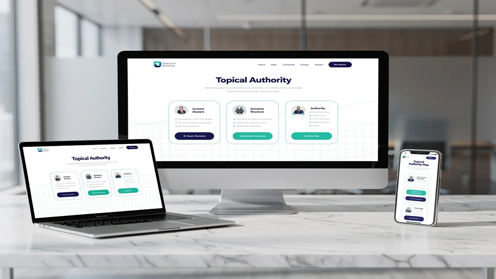
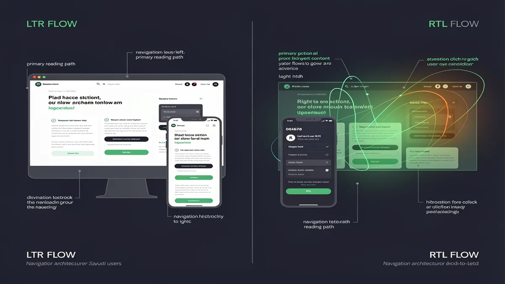
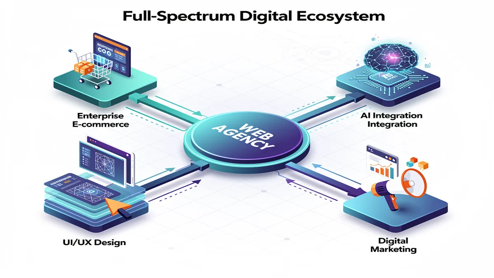
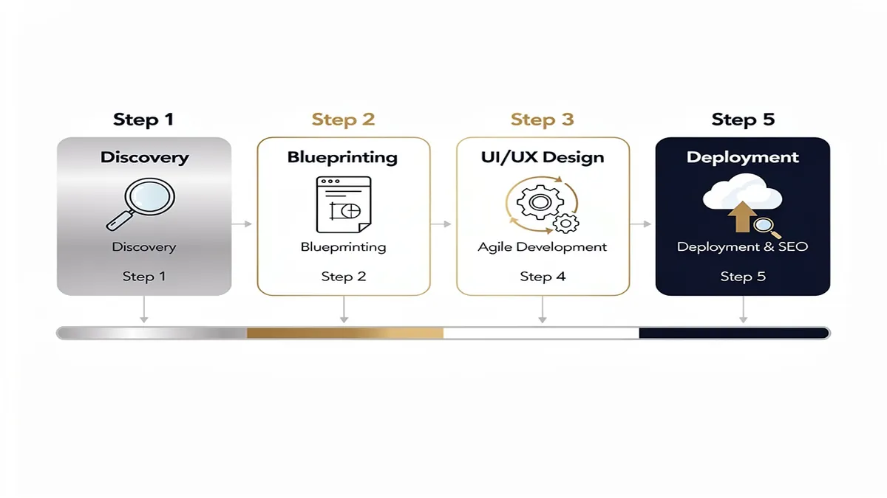

# Top Web Design Agency in Riyadh | Professional Website Development

## Why Your Business Needs a Top Web Design Agency in Riyadh for 2026

<!-- section_id: sec_01 -->

In the rapidly evolving digital landscape of Riyadh, a professional website is no longer a luxury but the primary engine for business scalability. As Saudi Arabia accelerates toward the goals of Vision 2030, consumer behavior in the capital has shifted toward a "digital-first" mentality, where 80% of users research a brand online before engaging. Partnering with a specialized **Web Design Agency** ensures your business transitions from a static online presence to a high-performance growth tool that aligns with local market expectations and regulatory standards.

Modern **Web Design Riyadh** requires a deep understanding of the "dual-audience" dynamic. Businesses must cater to a tech-savvy local population while adhering to the technical frameworks set by the **Saudi Data & AI Authority** (SDAIA). A top-tier agency doesn't just build a site; they architect a digital ecosystem that balances global performance standards with regional nuances, such as **RTL design** (Right-to-Left) for seamless Arabic navigation.

### The Strategic Impact of User Experience (UX) and Performance
A high-converting website is built on the foundation of superior **user experience** (UX). In Riyadh’s competitive market, a delay of even one second in page load speed can result in a 7% drop in conversions. Professional agencies prioritize **performance optimization** by utilizing advanced **technology stacks** and Content Delivery Networks (CDNs) to ensure your site remains lightning-fast, even during high-traffic periods.

Beyond speed, **responsive design** is critical. With the majority of internet users in Saudi Arabia browsing via mobile devices, your platform must provide a flawless experience across all screen sizes. This **mobile responsiveness** is not just about resizing images; it involves touch-friendly navigation, optimized font scales, and accelerated mobile pages (AMP) that keep users engaged regardless of their device.

### E-commerce Excellence and Local Integrations
For businesses launching **e-commerce platforms**, the complexity increases with the need for secure, local payment processing. A professional agency facilitates seamless **Moyasar integration** and **STC Pay integration**, ensuring that your customers can checkout using their preferred local methods. This localized financial infrastructure is essential for building trust and reducing cart abandonment rates in the KSA market.

Furthermore, compliance with **ZATCA (Zakat, Tax and Customs Authority)** regulations is mandatory for e-commerce entities in Saudi Arabia. Expert developers ensure your platform’s invoicing and data handling meet these legal requirements, protecting your business from penalties while streamlining your accounting processes through automated, compliant systems.

### Technical Sophistication: AI and Headless Architecture
The "GPT-era" has introduced new requirements for digital visibility. A forward-thinking **Web Design Agency** implements **AI solutions** that optimize your content for AI-driven search engines and crawlers. This ensures your business remains discoverable as search behavior evolves from simple keyword queries to complex, conversational AI interactions.

For enterprises seeking maximum scalability, adopting a **Headless CMS Saudi Arabia** strategy offers unparalleled flexibility. By decoupling the backend content management from the frontend presentation layer, businesses can push content to websites, mobile apps, and IoT devices simultaneously. This architecture provides the "future-proof" foundation necessary for large-scale Saudi enterprises to pivot quickly in a fluctuating market.

### Arabic SEO Architecture and Bilingual Success
Success in Riyadh requires more than just a translated website; it demands a robust **Arabic SEO architecture**. This involves structural optimization that accounts for how Arabic keywords are searched locally. Professional agencies implement bilingual Hreflang tags and localized metadata, ensuring that your site ranks effectively for both English and Arabic queries, capturing the full spectrum of the Riyadh market.

### Security and Trust in the Digital Hub
In an era of increasing cyber threats, **security** is a non-negotiable pillar of web development. Top agencies implement enterprise-grade SSL certificates, web application firewalls (WAF), and regular security audits. For businesses in Riyadh, where data privacy is governed by strict national regulations, ensuring your **programming** and data storage protocols are airtight is essential for maintaining consumer trust and operational continuity.

By choosing a partner like [CEMS IT Official Website](https://cems-it.com/), businesses gain access to the technical expertise required to navigate these complexities. From initial **UI/UX** wireframing to post-launch maintenance, a professional agency acts as a strategic partner, ensuring your digital presence is a measurable asset that contributes directly to your bottom line.

### Key Benefits of Professional Web Development in Riyadh:
*   **Cultural Alignment:** Expert **RTL design** that feels natural to native Arabic speakers.
*   **Regulatory Peace of Mind:** Full compliance with ZATCA and Saudi Data & AI Authority standards.
*   **Market-Leading Speed:** Optimization for **Core Web Vitals** to dominate Google KSA rankings.
*   **Conversion Focus:** Strategic placement of call-to-actions (CTAs) based on local user behavior data.
*   **Scalable Infrastructure:** Use of modern frameworks like React, Vue.js, or Headless CMS for long-term growth.

Investing in a top-tier agency means your business isn't just "getting a website"—it is building a 24/7 sales representative capable of representing your brand with the sophistication and reliability that the Riyadh market demands in 2026. For more information on web standards, you can visit the official [WordPress.org](https://wordpress.org) documentation to understand the importance of secure, scalable CMS platforms.

## The Anatomy of High-Performance Web Design: Moving Beyond Aesthetic Templates

<!-- section_id: sec_02 -->

In the rapidly evolving digital landscape of Riyadh, a website is no longer a static digital brochure but a sophisticated business engine that must navigate complex local regulations and high user expectations. Building a high-performance platform requires moving beyond basic aesthetic templates to create an interconnected ecosystem where technical precision meets cultural relevance. As a specialized web design agency, we prioritize a "Topical Authority" blueprint, ensuring your site is structured to signal deep expertise to modern AI-driven search algorithms while delivering a seamless experience for the Saudi market.

Performance optimization begins at the architectural level, focusing on the core technology stack to ensure lightning-fast load times. In a region where mobile penetration is among the highest globally, mobile responsiveness is a baseline requirement, not a luxury. By utilizing modern frameworks and clean programming practices, we reduce code bloat that typically plagues off-the-shelf templates. This technical discipline directly impacts your Core Web Vitals, which Google now uses as a primary ranking signal to measure real-world user satisfaction.

A truly effective UI/UX Design must account for the unique linguistic and behavioral nuances of Saudi users. This involves implementing sophisticated RTL design (Right-to-Left) that feels natural to Arabic speakers while maintaining a cohesive bilingual experience for English users. Our approach integrates Arabic SEO architecture from the ground up, ensuring that search engines can easily crawl and index your content in both languages, which is essential for dominating local search results in Riyadh and across the Kingdom.

Security and compliance are pillars of trust in the Saudi digital economy. High-performance web design must adhere to the rigorous standards set by the Saudi Data & AI Authority (SDAIA) to ensure data privacy and protection. Furthermore, for businesses engaged in digital commerce, ensuring ZATCA compliance for e-invoicing is a legal necessity. We build these requirements into the development lifecycle, protecting your business from regulatory risks while signaling reliability to your customers.

For enterprises seeking ultimate scalability and speed, adopting a Headless CMS Saudi Arabia strategy allows for decoupled front-end and back-end systems. This technology stack enables faster content delivery through a global CDN while providing the flexibility to push content to multiple platforms simultaneously. This approach is particularly beneficial for high-traffic e-commerce platforms that require robust performance during peak shopping periods or major national events.

The integration of local financial ecosystems is another critical component of a functional website. We specialize in seamless Moyasar integration and STC Pay integration, providing your customers with the payment methods they trust most. By reducing friction at the checkout stage through localized AI solutions, we help businesses transform passive visitors into active conversions, significantly improving the ROI of your digital investment.

To maintain a competitive edge, your website requires more than just a successful launch. We provide comprehensive post-launch support and maintenance packages that include regular security patches, performance audits, and content updates. This ensures that your platform remains optimized for both human users and AI crawlers, preventing the technical debt that often leads to declining search rankings over time.

At CEMS IT Official Website, we believe that web design is an ongoing process of refinement. By focusing on a "Business Growth Engine" positioning, we ensure every line of code and every design element serves a specific commercial objective. Whether it is improving the Time to First Byte (TTFB) or enhancing the visual stability of a page, our technical interventions are designed to move the needle on your business metrics.

For those interested in the technical benchmarks of modern performance, [web.dev](https://web.dev) provides the industry-standard documentation on how metrics like Largest Contentful Paint (LCP) and Interaction to Next Paint (INP) define the modern user experience. By aligning your site with these global standards while respecting local Saudi context, you create a digital presence that is both authoritative and highly effective.

Ultimately, the anatomy of a high-performance site is defined by how well it balances speed, security, and user intent. By moving away from generic templates and embracing a custom-coded, SEO-first approach, businesses in Riyadh can build a sustainable digital advantage. This strategic depth ensures that your website doesn't just look modern—it functions as a high-velocity asset that drives growth and reinforces your brand’s authority in the Saudi market.

### Right-to-Left (RTL) UX Mastery for the Saudi Market

<!-- section_id: sec_03 -->

Mastering Right-to-Left (RTL) design is a fundamental requirement for any web design agency operating in Riyadh, as the local market's digital intuition is built upon the flow of the Arabic script. Unlike standard Western layouts, a successful Saudi interface requires a complete inversion of the visual hierarchy to align with how users naturally process information. This transition involves more than just flipping text; it necessitates a deep understanding of the cognitive load placed on Arabic-speaking users when they interact with mirrored environments.

In the Kingdom, the digital landscape is evolving rapidly, driven by the Saudi Data & AI Authority (SDAIA) and Vision 2030 initiatives. Users in Riyadh expect interfaces that feel culturally and linguistically native. When a website fails to implement proper RTL design, it creates immediate friction, leading to higher bounce rates and diminished trust. Achieving RTL mastery means ensuring that the user experience remains fluid, where the eye travels naturally from the top-right corner across the page, following the traditional path of Arabic literacy.

A sophisticated technology stack is essential to manage the complexities of bilingual SEO architecture. Modern developers in Riyadh are increasingly turning to a Headless CMS Saudi Arabia-based approach to decouple the backend from the frontend. This allows for greater flexibility in how content is served across different locales. By utilizing logical CSS properties—such as `margin-inline-start` instead of `margin-left`—programming teams can create a more maintainable codebase that adapts automatically to the user's language preference without breaking the responsive design.

Mobile responsiveness is a critical factor in the MENA region, where smartphone penetration is among the highest globally. A mobile-first strategy must account for how RTL layouts behave on smaller screens. For instance, navigation drawers should emerge from the right, and "back" buttons must point to the right, signifying a return to previous content. This attention to detail in UI/UX ensures that the user experience remains consistent across all devices, preventing the "awkwardly bolted-on" feel common in poorly localized sites.

Integrating AI solutions into the design process allows for automated layout testing and predictive user flow analysis. By analyzing Riyadh-specific case studies, agencies can identify common pitfalls in Saudi e-commerce platforms, such as misaligned form fields or confusing checkout sequences. AI-driven tools can help optimize the placement of call-to-action buttons, ensuring they sit in the "primary optical area" for an Arabic reader—typically the right-hand side of the header or the top-right quadrant of a hero section.

Performance optimization is inextricably linked to user retention. In a market where high-speed 5G is the norm, a delay of even a few milliseconds can lead to lost conversions. This is particularly true for transactional sites requiring STC Pay integration or Moyasar integration. These local payment gateways must be embedded within a secure, high-performance environment that complies with ZATCA regulations. Ensuring that the technology stack is optimized for local peering and low latency is a non-negotiable aspect of professional web development in Riyadh.

Security and compliance form the backbone of trust in the Saudi digital economy. Beyond the visual elements of UI/UX, developers must ensure that data handling practices meet the rigorous standards set by national authorities. This includes implementing robust encryption and ensuring that all e-invoicing components are fully compatible with ZATCA's Phase 2 requirements. A website that looks beautiful but fails at technical compliance will ultimately fail the business it was built to serve.

Typography plays a transformative role in RTL design. Using generic Latin fonts for Arabic text often results in poor legibility and a "translated" appearance. Mastery of the Saudi market involves selecting typefaces that respect the anatomy of Arabic letterforms, ensuring that line heights and kerning are adjusted for maximum readability. When combined with a clean, modern aesthetic, high-quality typography elevates the brand's perceived authority and makes the content more engaging for the local audience.

The integration of advanced features, such as real-time ROI calculators or interactive prototypes, provides tangible value to the user during the decision-making process. For enterprise-level projects, a Headless CMS offers the scalability needed to manage vast amounts of data while maintaining lightning-fast load speeds. This architectural choice supports long-term growth, allowing businesses to add new features or languages without a complete site overhaul.

Ultimately, the goal of RTL mastery is to create a digital environment where the technology becomes invisible, leaving only a seamless interaction between the brand and the user. By focusing on the nuances of the Arabic language and the specific behavioral patterns of the Riyadh market, agencies can deliver platforms that are not only functional but also culturally resonant. This holistic approach to web design ensures that every element—from the technology stack to the final UI/UX—is engineered for success in the Saudi Arabian landscape.

## Full-Spectrum Digital Services: From UI/UX Design to Enterprise E-commerce

<!-- section_id: sec_04 -->

In the rapidly evolving digital landscape of Riyadh, a professional Web Design Agency does more than create aesthetic layouts; it builds a high-performance business engine tailored to the Saudi market's unique demands. Success in the Kingdom requires a sophisticated blend of global technical standards and local cultural nuances, ensuring that every digital touchpoint resonates with users from Diriyah to the Financial District.

Modern enterprises in Saudi Arabia now require a holistic approach to their online presence. This involves integrating advanced UI/UX principles with robust backend engineering to handle the high mobile penetration rates seen across the region. By focusing on a "user-first" philosophy, businesses can transform passive visitors into active brand advocates through seamless, intuitive interfaces.

### Precision UI/UX for the Saudi User
User experience is the cornerstone of digital retention. In Riyadh’s competitive market, UI/UX design must account for Right-to-Left (RTL) typography and layout flow to ensure natural readability for Arabic speakers. This goes beyond simple translation; it involves re-engineering the visual hierarchy so that navigation, call-to-action buttons, and imagery align with regional cognitive patterns.

*   **RTL Design Mastery:** Proper alignment of menus and forms ensures that Saudi users interact with your site naturally, reducing bounce rates and increasing session duration.
*   **Intuitive Navigation:** Streamlined user flows minimize the number of clicks required to reach a goal, which is essential for capturing the attention of Riyadh’s fast-paced corporate sector.
*   **Visual Storytelling:** Utilizing high-quality imagery that reflects local culture and values builds immediate trust and brand authority with a Saudi audience.

### Scalable E-commerce Platforms and Local Integrations
The shift toward digital commerce in the Kingdom has made robust e-commerce platforms a necessity. For a business to thrive, its online store must be more than a catalog; it must be a fully integrated ecosystem capable of handling secure transactions and complex logistics.

Middle Eastern consumers expect localized payment flexibility. Integrating gateways like **Moyasar** and **STC Pay** is no longer optional—it is a critical factor for conversion. Furthermore, compliance with **ZATCA** (Zakat, Tax and Customs Authority) for e-invoicing ensures that your business operates within the legal framework of the Saudi government’s Vision 2030 initiatives.

*   **Local Payment Gateway Integration:** Offering STC Pay and Apple Pay at checkout directly correlates with higher transaction completion rates in the KSA market.
*   **ZATCA Compliance:** Automated e-invoicing systems save administrative time and ensure your enterprise remains fully compliant with Saudi tax regulations.
*   **Logistics Syncing:** Seamlessly connecting your storefront with local couriers ensures real-time tracking and reliable delivery, which are vital for customer satisfaction.

### Mobile Responsiveness and Performance Optimization
With one of the highest smartphone penetration rates globally, **mobile responsiveness** is the absolute baseline for any Digital Marketing Agency Saudi Arabia. A website that fails to load under three seconds on a 4G or 5G connection in Riyadh will lose over half of its potential traffic. 

Performance optimization involves more than just shrinking images. It requires a modern **technology stack** and often utilizes **Headless CMS Saudi Arabia** architectures to decouple the frontend from the backend. This allows for lightning-fast load speeds and the ability to push content to multiple platforms—smartphones, tablets, and IoT devices—simultaneously without losing performance.

*   **Accelerated Load Times:** Optimizing the critical rendering path ensures users stay engaged, which is a primary ranking factor for modern search engines.
*   **Adaptive Layouts:** Content that adjusts perfectly to every screen size provides a consistent brand experience, whether the user is on a desktop in an office or a mobile device on the go.
*   **Advanced Caching:** Utilizing local CDNs (Content Delivery Networks) reduces latency for users within the Kingdom, providing a snappy, "app-like" feel to standard web pages.

### Security and Data Sovereignty
In an era of increasing cyber threats, **security** is a non-negotiable asset. For Saudi enterprises, this also means adhering to the regulations set by the **Saudi Data & AI Authority (SDAIA)**. Protecting user data is not just about a lock icon in the browser; it involves rigorous encryption, secure **programming** practices, and ensuring that sensitive data is handled according to National Data Governance requirements.

*   **SDAIA Alignment:** Implementing data privacy frameworks ensures your brand avoids heavy penalties and builds long-term consumer trust.
*   **SSL & Encryption:** Standardizing high-level encryption protocols protects both your business intelligence and your customers’ personal information.
*   **Regular Audits:** Continuous monitoring and vulnerability testing prevent downtime and protect your digital reputation from malicious actors.

### AI Solutions and Future-Ready Architecture
The integration of **AI solutions** is redefining how businesses in Riyadh interact with their customers. From intelligent chatbots that understand the Saudi dialect to predictive analytics that personalize the shopping experience, AI turns a static website into a dynamic sales tool. 

By leveraging a forward-thinking **technology stack**, companies can implement "GPT-era" readiness. This means structuring data so it is easily understood by both human users and AI crawlers, ensuring your brand remains visible as search behavior shifts toward conversational AI.

*   **Conversational AI:** 24/7 automated support in both English and Arabic handles routine inquiries, allowing your team to focus on high-value tasks.
*   **Personalization Engines:** AI-driven recommendations increase average order value by showing users products or services tailored to their specific behavior.
*   **Arabic SEO Architecture:** Building a site with a deep understanding of Arabic search intent ensures you capture high-intent traffic that competitors often overlook.

### The Role of CEMS IT Official Website in Digital Evolution
Navigating these complexities requires a partner who understands the local ecosystem. The **CEMS IT Official Website** serves as a benchmark for how integrated digital services—ranging from custom **programming** to enterprise-level **e-commerce platforms**—should be executed in the Saudi market. By focusing on **performance optimization** and high-conversion **UI/UX**, they demonstrate the tangible ROI that comes from a well-executed digital strategy.

### Post-Launch Excellence: Maintenance and Growth
A website is never truly "finished." The most successful brands in Riyadh invest in continuous maintenance and performance monitoring. This ensures that as browser technologies and **security** protocols evolve, the website remains at peak efficiency.

*   **Continuous Monitoring:** Real-time tracking of site health prevents minor bugs from turning into costly outages.
*   **Content Scalability:** Using a flexible CMS allows your internal marketing team to update promotions and news without needing deep technical knowledge.
*   **Bilingual SEO Updates:** Regular audits of both English and Arabic keywords ensure your site maintains its competitive edge in search rankings as market trends shift.

By choosing a comprehensive service model, businesses in Riyadh ensure they aren't just "online," but are actively dominating their niche. From the initial **UI/UX** wireframes to the final **Moyasar integration**, every step is a calculated move toward market leadership in the Kingdom’s vibrant digital economy. For more information on technical standards, you can visit the official WordPress.org documentation to understand the foundations of scalable CMS architecture.

### Mobile-First Architecture and AI Solution Integration

<!-- section_id: sec_05 -->

In the competitive Riyadh market, a high-performing digital presence requires more than just aesthetic appeal; it necessitates a robust technical foundation built on **mobile-first architecture** and intelligent automation. As a leading **Web Design Agency**, we prioritize mobile responsiveness from the initial wireframe, ensuring that your brand delivers a flawless experience on smartphones before scaling to larger screens. This approach aligns with the browsing habits of Saudi users, who increasingly rely on mobile devices for everything from e-commerce to government services.

Modern **mobile responsiveness** is no longer a luxury but a core requirement for visibility. By employing a sophisticated **technology stack** that includes **Headless CMS Saudi Arabia** configurations, businesses gain the agility to push content across multiple platforms while maintaining lightning-fast **performance optimization**. This decoupled architecture ensures that your front-end remains lightweight, reducing bounce rates and keeping users engaged during high-traffic periods.

The integration of **AI solutions** is transforming how businesses in Saudi Arabia interact with their customers. By embedding machine learning algorithms directly into your website’s **programming**, we enable predictive search, personalized product recommendations, and automated customer support. These tools do more than just modernize your site; they provide actionable data that helps you understand user behavior and refine your marketing strategies in real-time.

For businesses focused on growth, **responsive design** must be paired with local technical excellence. This includes seamless **RTL design** (Right-to-Left) to ensure that Arabic typography and layouts feel natural and professional. Our **Arabic SEO architecture** ensures that your site is indexed correctly by search engines, helping you capture high-intent traffic within the Kingdom and across the broader GCC region.

Trust and **security** are the pillars of any successful online venture. We ensure full compliance with the **Saudi Data & AI Authority (SDAIA)** regulations, protecting user data with enterprise-grade encryption. Furthermore, our development process incorporates **ZATCA compliance** for e-invoice generation, making your platform ready for the latest regulatory requirements in the Saudi market without needing third-party patches.

Transaction fluidity is critical for **e-commerce platforms** looking to maximize conversion rates. We specialize in deep integration with local payment gateways such as **STC Pay integration** and **Moyasar integration**. These localized financial tools reduce friction at checkout, allowing customers to pay using their preferred methods, which directly correlates to higher completed sales and improved **user experience (UX)**.

A superior **UI/UX** strategy also accounts for the unique cultural nuances of the Riyadh business landscape. By combining high-end visual storytelling with technical precision, we create digital environments where users feel secure and valued. This involves optimizing every touchpoint—from the initial page load to the final "Thank You" screen—to ensure that your brand’s digital journey is as premium as its physical presence.

To maintain a competitive edge, your website must be viewed as an evolving asset rather than a static brochure. Our approach includes dedicated post-launch support and maintenance, ensuring that your **AI solutions** continue to learn and your **mobile responsiveness** remains compatible with new device releases. This long-term commitment to quality ensures that your investment continues to deliver measurable ROI year after year.

By leveraging a modern **technology stack** and focusing on the specific needs of the Saudi market, we help brands transition from simple websites to comprehensive digital business engines. Whether you are scaling a local startup or managing an established enterprise, the combination of mobile-first design and AI-driven functionality provides the scalability needed to thrive in Vision 2030’s digital economy.

For more information on the standards governing digital transformation in the Kingdom, you can visit the official sdaia.gov.sa portal to understand the latest data privacy and AI implementation guidelines. Adhering to these national standards ensures your business remains reputable and avoids the legal pitfalls associated with non-compliant data handling.

## Local Compliance and Security: Navigating SDAIA and ZATCA Requirements

<!-- section_id: sec_06 -->

Operating a digital presence in Riyadh requires more than just aesthetic appeal; it demands a rigorous commitment to local regulatory standards that govern how data is handled and how transactions are processed. For any business partnering with a **Web Design Agency**, understanding the intersection of technical performance and legal **compliance** is essential for long-term viability in the Saudi market. The regulatory landscape, led by the **Saudi Data & AI Authority** (SDAIA) and the Zakat, Tax and Customs Authority (ZATCA), has established a framework that ensures **security** and transparency are embedded into every digital touchpoint.

The Saudi Data & AI Authority (SDAIA) oversees the Personal Data Protection Law (PDPL), which mandates strict protocols for the collection, processing, and storage of user information within the Kingdom. For local enterprises, this means that **AI solutions** and data architectures must be designed with "privacy by design" principles. Implementing a **Headless CMS Saudi Arabia**-based strategy can often assist in this area, as it allows for decoupled data management where sensitive information can be stored in localized, secure environments while the front-end remains agile and responsive.

ZATCA **compliance** is another pillar of the Saudi digital ecosystem, particularly regarding Phase 2 of the Fatoora (e-invoicing) initiative. Websites must be capable of generating cryptographic stamps and UUIDs for every transaction, ensuring that **e-commerce platforms** are fully integrated with the national tax infrastructure. This level of **programming** complexity requires a sophisticated **technology stack** that can handle real-time API integrations without compromising the **user experience** or page load speeds.

For businesses targeting the local market, **RTL design** (Right-to-Left) is a fundamental requirement of **UI/UX** that goes beyond simple text alignment. A true **responsive design** must account for the mirroring of layouts, navigation bars, and call-to-action buttons to match the natural reading patterns of Arabic-speaking users. When this is coupled with a robust **Arabic SEO architecture**, businesses can ensure their platforms are not only compliant with local laws but also optimized for visibility on search engines used by the Riyadh population.

**Security** remains a top priority, especially as the National Cybersecurity Authority (NCA) sets high benchmarks for data residency and encryption. Integrating local payment gateways like **Moyasar integration** or **STC Pay integration** provides a double benefit: it offers users familiar, trusted payment methods while ensuring that financial data flows through secure, regulated channels. These integrations must be stress-tested for **mobile responsiveness** and **performance optimization** to prevent abandonment during the checkout process.

Beyond the initial launch, maintaining **compliance** requires a proactive approach to **security** updates and regulatory shifts. CEMS IT Official Website emphasizes that digital assets must undergo regular audits to remain aligned with evolving SDAIA guidelines. This includes ensuring that **mobile responsiveness** does not create vulnerabilities in data capture forms and that **AI solutions** used for customer service, such as chatbots, do not inadvertently leak personal identifiers.

The technical **programming** involved in meeting these standards often involves complex backend configurations. For instance, ensuring that a website adheres to the latest ZATCA requirements involves more than just a plugin; it requires a deep understanding of XML structures and digital signatures. By focusing on these technical nuances, a **Web Design Agency** helps businesses avoid the heavy penalties associated with non-compliance while building a foundation of trust with their local customer base.

Ultimately, the goal of navigating these requirements is to create a seamless, secure environment where users feel safe sharing their information. Whether it is through the implementation of advanced encryption or the strategic use of a **Headless CMS Saudi Arabia** configuration, the focus remains on protecting the user. According to catalyicsecurity.com, SDAIA's updated guidelines emphasize risk assessments for data transfers, reinforcing the need for localized hosting and robust data governance.

In the competitive Riyadh market, **performance optimization** is not just about speed—it is about the reliability of the entire system under the weight of regulatory protocols. A website that is fast but fails a ZATCA audit is a liability, just as a compliant site that provides a poor **user experience** will fail to convert. Balancing these elements requires an expert-level understanding of both global technical standards and the specific legal mandates of the Kingdom of Saudi Arabia.

By prioritizing **security** and **compliance** from the earliest stages of the **UI/UX** design phase, businesses can future-proof their digital assets. This involves choosing the right **technology stack** that supports localized data residency and ensuring that all third-party integrations, from analytics to payment processing, respect the boundaries set by the **Saudi Data & AI Authority**. This holistic approach ensures that your digital presence is not just a marketing tool, but a secure, compliant, and high-performing business engine.

## Our Proven Development Process: 5 Steps to Digital Dominance

<!-- section_id: sec_07 -->

Building a digital presence in Riyadh requires more than just aesthetic appeal; it demands a strategic alignment with the Kingdom’s rapid digital transformation and the specific expectations of the Saudi market. As a specialized web design agency, we recognize that a website must serve as a high-performance growth engine that adheres to local regulations while delivering a world-class user experience. Our development process is engineered to move beyond basic templates, focusing on scalable architecture and measurable business outcomes.

The first phase of our process centers on strategic architectural planning and UI/UX design tailored for the Middle Eastern audience. In Riyadh, user behavior is heavily influenced by mobile-first habits and the necessity for seamless RTL design (Right-to-Left) integration. We don’t just flip a layout; we rebuild the navigation flow to ensure that Arabic-speaking users experience a natural and intuitive interface. This stage involves defining the technology stack—whether utilizing a traditional robust framework or a Headless CMS for Saudi Arabia enterprise scalability—to ensure the foundation can handle future growth and high traffic volumes.

During the design phase, we prioritize mobile responsiveness and performance optimization to meet the high standards of Saudi consumers. A website that takes more than three seconds to load loses nearly half of its potential leads. By implementing advanced caching, image compression, and clean programming practices, we ensure your platform remains lightning-fast. This phase also integrates essential local elements, such as Arabic SEO architecture, ensuring that your content is structured correctly for both Google and local search behaviors from the very first line of code.

The development stage is where functional complexity meets local utility. For businesses entering the digital economy, we build robust e-commerce platforms integrated with regional payment powerhouses. Our process includes seamless Moyasar integration and STC Pay integration, providing your customers with the trusted, local payment methods they prefer. Beyond transactions, we ensure full compliance with the Saudi Data & AI Authority (SDAIA) regulations and ZATCA billing requirements, protecting your business from legal friction and building long-term trust with your user base.

Security and rigorous testing form the penultimate step of our "Digital Dominance" roadmap. Every line of code undergoes a security audit to protect sensitive user data against emerging threats. We simulate various user journeys to verify that the user experience remains consistent across all devices and browsers. This stage also includes the deployment of AI solutions, such as intelligent chatbots or automated data sorting, which are becoming standard expectations for modern enterprises in the Riyadh market. We ensure these tools are optimized to understand local dialects and business logic.

The final phase transitions from launch to long-term evolution through specialized Maintenance and Support Packages. A website is a living asset that requires constant updates to remain secure and efficient. Our support goes beyond bug fixes; we implement ongoing SEO Strategies for Riyadh Market to ensure your brand maintains its visibility as search algorithms and competitor landscapes shift. By monitoring real-time analytics, we provide data-driven recommendations that allow you to refine your conversion funnels and maintain a competitive edge in the Kingdom’s thriving digital ecosystem.

## Frequently Asked Questions About Web Design in Riyadh

<!-- section_id: sec_08 -->

Selecting a **Web Design Agency** in Riyadh requires a deep understanding of the local digital ecosystem, where rapid transformation meets high consumer expectations. In the Saudi market, a website is no longer just a digital brochure; it is a sophisticated growth engine that must align with Vision 2030’s digital standards and local regulatory frameworks.

### What is the average cost of professional web development in Riyadh?

**Cost and Pricing Transparency** is fundamental for Saudi businesses planning their digital investment. In Riyadh, pricing typically scales based on technical complexity and integration requirements. A basic informational corporate site generally ranges from SAR 5,000 to SAR 15,000. These projects focus on brand identity and essential lead generation features.

For high-growth retail ventures, **e-commerce platforms** require a larger investment, often ranging from SAR 20,000 to SAR 80,000. This increase accounts for secure **Moyasar integration** or **STC Pay integration**, inventory synchronization, and advanced **security** protocols. Enterprise-level solutions involving a **Headless CMS Saudi Arabia** or custom **programming** for large-scale data handling can exceed SAR 150,000, reflecting the need for bespoke **technology stack** development and long-term scalability.

### How does the Arabic Website Design Process differ for the Saudi market?

The **Arabic Website Design Process** is not merely a translation of English content; it is a complete structural reversal known as **RTL design** (Right-to-Left). This impacts the entire **user experience**, as the human eye scans the page from the top-right corner. Navigation menus, logos, and call-to-action buttons must be strategically repositioned to feel natural to local users.

Beyond visual layout, a professional agency implements a dedicated **Arabic SEO architecture**. This ensures that search engines like Google accurately index your site for local keywords, respecting linguistic nuances and regional dialects. By focusing on **UI/UX** that resonates with Saudi cultural aesthetics, businesses can significantly reduce bounce rates and improve engagement across the Kingdom.

### Is mobile responsiveness mandatory for Saudi businesses?

With one of the highest smartphone penetration rates globally, **mobile responsiveness** is a non-negotiable requirement in Riyadh. A **responsive design** ensures that your platform functions flawlessly across all devices, from high-end smartphones to tablets. Google’s mobile-first indexing means that without a mobile-optimized site, your visibility in search results will suffer.

Furthermore, **performance optimization** is critical for mobile users who often browse on the go. Slow loading times lead to immediate abandonment. Elite agencies prioritize "Lightweight" coding and **AI solutions** to predict user behavior, ensuring that images and scripts load instantly, thereby maintaining a competitive edge in a fast-paced market.

### What are the legal and compliance requirements for websites in Saudi Arabia?

Operating a digital business in Riyadh involves strict adherence to local regulations. Compliance with the **Saudi Data & AI Authority** (SDAIA) is essential for any platform handling personal user data. This includes clear privacy policies and secure data storage practices that protect citizen information from unauthorized access.

For commercial entities, **ZATCA compliance** (Zakat, Tax and Customs Authority) is mandatory for electronic invoicing and financial transparency. Integrating these regulatory requirements into the backend of your website ensures that your business avoids legal friction and builds a foundation of trust with both the government and your customers.

### Which technology stack is best for enterprise scalability in Riyadh?

The choice of **technology stack** depends on your long-term business goals. While WordPress remains a popular choice for content-heavy sites, many Riyadh-based enterprises are moving toward a **Headless CMS Saudi Arabia** approach. This decouples the frontend from the backend, allowing for extreme **performance optimization** and the ability to push content to multiple platforms simultaneously.

For custom web applications, frameworks like React or Next.js combined with robust backend languages offer superior **security** and flexibility. This setup allows for seamless integration with local APIs and third-party services, ensuring that as your business grows, your digital infrastructure can scale without requiring a complete rebuild.

### How do you ensure a website ranks well in both Arabic and English?

Achieving dominance in search results requires a bilingual SEO strategy. This involves creating unique metadata, headers, and content for both languages rather than relying on automated plugins. An **Arabic SEO architecture** focuses on how local users search—often using different terminology than a direct English translation would suggest.

By optimizing for both human users and AI-driven crawlers, your site becomes a "Compound Authority." This means providing deep, high-quality content that answers specific user queries. Successful agencies in Riyadh utilize data-driven insights to map out keyword clusters that capture high-intent traffic in both the local and expatriate demographics.

### What kind of post-launch support should a business expect?

The launch of a website is only the beginning of its lifecycle. Professional agencies provide comprehensive maintenance packages that include regular **security** audits, software updates, and database backups. In a landscape where cyber threats are evolving, proactive monitoring is essential to protect your brand’s reputation.

Ongoing **performance optimization** is also a key component of post-launch support. As you add more products or content, the site's speed can be affected. Regular "Health Checks" ensure that the **user experience** remains optimal. Many businesses in Riyadh partner with CEMS IT Official Website to manage these technical complexities, allowing them to focus on their core operations while their digital presence continues to evolve.

### How do local payment gateways like STC Pay and Moyasar improve conversion?

Integrating familiar payment methods is one of the most effective ways to boost conversion rates in Saudi Arabia. **STC Pay integration** and **Moyasar integration** provide users with a sense of security and convenience, as these are the most trusted financial tools in the region.

When a checkout process is streamlined and includes local options, friction is reduced, and "Cart Abandonment" rates drop significantly. A professional **Web Design Agency** ensures these integrations are not only functional but also optimized for a smooth **UI/UX**, guiding the customer from product selection to final payment in as few clicks as possible.

### What role does AI play in modern web design for Riyadh companies?

**AI solutions** are transforming how businesses interact with their customers. From intelligent chatbots that provide 24/7 customer support in both Arabic and English to personalized product recommendations, AI enhances the **user experience** by making it more relevant and efficient.

In the "GPT-era," websites must also be optimized for AI crawlers. This involves using structured data (Schema markup) that helps AI models understand the context of your services and products. By staying ahead of these technological shifts, Riyadh businesses can ensure they remain visible not just on traditional search engines, but also within the emerging world of AI-driven search and discovery.

### Why is UI/UX design specifically tailored for the Saudi audience?

The Saudi market has unique cultural and behavioral patterns that must be reflected in the **UI/UX**. This includes the use of high-quality imagery that respects local sensibilities and a color palette that aligns with brand expectations in the Kingdom. Navigation must be intuitive, with a clear hierarchy that reflects the importance of various services.

Expert designers focus on "Micro-interactions"—small animations or feedback loops that occur when a user performs an action. These details make the website feel responsive and "alive," which builds a stronger emotional connection between the brand and the user. In a competitive city like Riyadh, these subtle design choices often make the difference between a bounce and a conversion.

### How does a website contribute to long-term ROI for Saudi SMEs?

A well-designed website acts as a 24/7 salesperson. By automating lead generation, providing instant information, and facilitating direct sales through **e-commerce platforms**, the site reduces the operational costs associated with traditional business models. Over time, the data gathered from user interactions provides invaluable insights into customer behavior.

This data allows businesses to refine their marketing strategies and improve their service offerings. When built on a solid **technology stack** with a focus on **security** and SEO, a website becomes an appreciating asset. For companies looking to dominate the Riyadh market, investing in a professional digital presence is the most effective way to ensure sustainable growth and a high return on investment.

For more information on technical standards and web protocols, you can visit the official wordpress.org documentation, which outlines the global benchmarks for modern web development and security.

## Future-Proof Your Brand with Riyadh’s Leading Web Design Experts

<!-- section_id: sec_09 -->

In the rapidly evolving digital landscape of Riyadh, a website is no longer just a digital brochure; it is the primary engine for business growth and market authority. Partnering with a specialized Web Design Agency allows businesses to navigate the complexities of the Saudi market, where user expectations for speed, cultural relevance, and technical reliability are among the highest in the world. As the Kingdom moves toward a fully digitized economy under Vision 2030, the shift from basic web presence to high-performance digital ecosystems has become a prerequisite for survival and scale.

The local market behavior in Riyadh is characterized by a "mobile-first" and "trust-driven" consumer base. Saudi users demand seamless mobile responsiveness and high-speed performance, often transacting through localized payment methods like STC Pay and Moyasar. For a brand to remain competitive, its technology stack must be robust enough to handle high traffic while maintaining strict compliance with the Saudi Data & AI Authority (SDAIA) regulations. This ensures that data privacy and security are not just features, but foundational elements of the brand's digital reputation.

### Strategic UI/UX and RTL Design Nuances
Effective web development in Saudi Arabia requires a deep understanding of Right-to-Left (RTL) design. This goes beyond simple text alignment; it involves mirroring the entire user experience (UX) to match the natural visual flow of Arabic speakers. A professional Web Design Agency like CEMS IT focuses on creating an intuitive Arabic SEO architecture that ensures search engines can crawl and index bilingual content efficiently, giving brands a dual-market advantage.

User experience (UX) in the Saudi context also means optimizing for "micro-moments." Whether a user is looking for a service in the heart of Riyadh or a specialized product in the Eastern Province, the interface must guide them toward a conversion with minimal friction. This involves strategic placement of call-to-action buttons, simplified navigation menus, and high-quality visual assets that reflect local cultural values while maintaining a modern, global appeal.

### Performance Optimization and Technical Scalability
Speed is a critical ranking factor and a major driver of user retention. Performance optimization involves more than just compressing images; it requires a sophisticated approach to code minification, server-side caching, and the use of Content Delivery Networks (CDNs). For Saudi enterprises looking for ultimate scalability, adopting a Headless CMS Saudi Arabia strategy allows for the decoupling of the front-end and back-end, resulting in lightning-fast load times and the flexibility to push content across various platforms without technical debt.

The choice of programming languages and frameworks—the technology stack—determines how well a site can grow. Modern web design relies on lightweight frameworks that ensure mobile responsiveness across all devices. By prioritizing clean code and modular architecture, businesses can future-proof their digital assets, making it easier to integrate new AI solutions or advanced analytics tools as the business evolves.

### E-commerce Platforms and Regional Integration
For businesses in Riyadh, e-commerce success is tied directly to local integration. A website must do more than showcase products; it must function as a localized marketplace. This includes seamless integration with regional payment gateways like Moyasar and STC Pay, which are preferred by the local population for their security and ease of use. Furthermore, e-commerce platforms must be ZATCA compliant to ensure that electronic invoicing and tax reporting meet the latest Saudi government standards.

Security remains a top priority for both businesses and consumers. Implementing SSL certificates, advanced firewalls, and regular security audits protects sensitive customer data and builds long-term trust. In an era where cyber threats are increasingly sophisticated, a "security-first" mindset in web development is essential for maintaining brand integrity and avoiding the catastrophic costs of data breaches.

### The Role of AI Solutions and GPT-Era Readiness
As search engines evolve into AI-driven discovery engines, websites must be optimized for more than just traditional keywords. GPT-era readiness involves structuring data so that AI crawlers can easily understand and recommend your services. This includes implementing schema markup and maintaining a high-quality, informative content strategy that establishes the brand as a thought leader in its niche.

Integrating AI solutions, such as intelligent chatbots and personalized recommendation engines, can significantly enhance the user experience. These tools provide 24/7 customer support, answering FAQs and guiding users through the sales funnel even outside of standard business hours. This level of automation not only improves efficiency but also aligns with the Kingdom's push toward becoming a global hub for artificial intelligence and technological innovation.

### Post-Launch Support and Maintenance
The launch of a website is only the beginning of its lifecycle. To maintain peak performance, a consistent regimen of updates and maintenance is required. Professional maintenance packages ensure that the technology stack remains current, security patches are applied immediately, and the site continues to comply with evolving regulations like those from the Saudi Data & AI Authority.

Regular audits help identify areas for improvement in user experience and SEO. By analyzing user behavior data, businesses can make informed decisions about feature updates or content shifts. This iterative process ensures that the website remains a dynamic asset that adapts to market trends and changing consumer needs in Riyadh and beyond.

### Strategic Digital Growth
Ultimately, a website is a business growth engine. By focusing on a "conversion-first" philosophy, every element of the design is engineered to drive a specific outcome—whether that is a lead generation form, a direct sale, or a service inquiry. When a Web Design Agency combines local expertise with global technical standards, the result is a digital platform that not only represents the brand but actively works to expand its market share.

Investing in high-quality web development is a strategic move that pays dividends in brand equity and operational efficiency. In the competitive Riyadh market, those who prioritize a superior digital experience will lead their industries, while those who settle for generic solutions will find it increasingly difficult to capture the attention of the modern Saudi consumer.

For more information on the technical standards of modern web architecture, you can explore the WordPress.org documentation on performance and security best practices. By adhering to these global standards and layering them with local Saudi expertise, businesses can build a digital presence that is truly world-class.