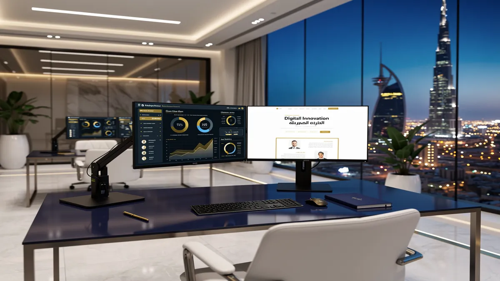
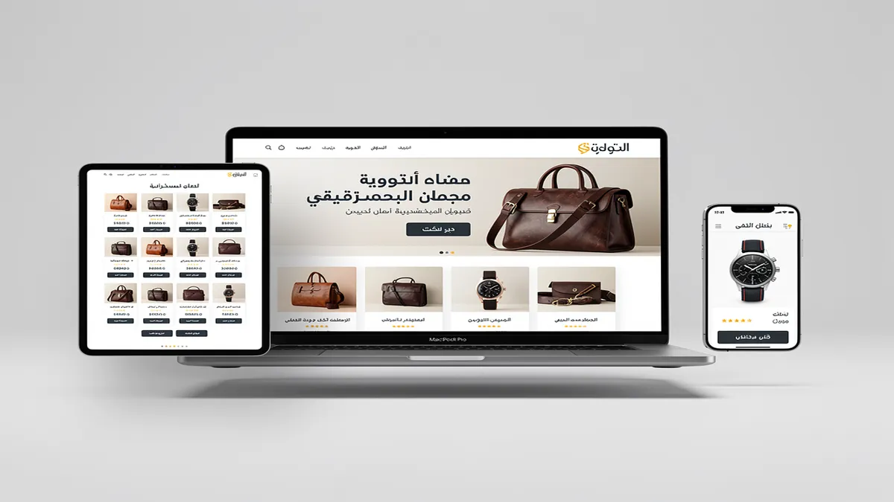
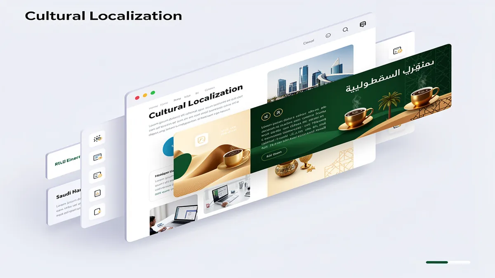
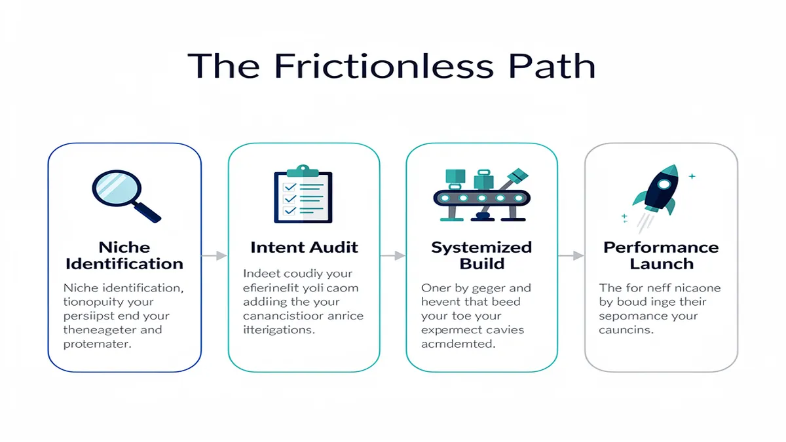
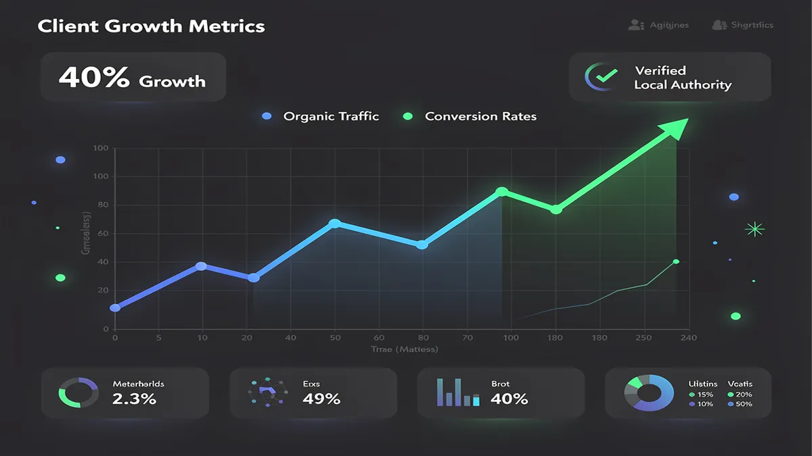
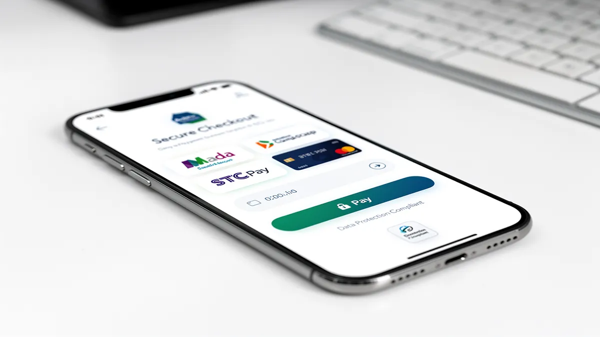
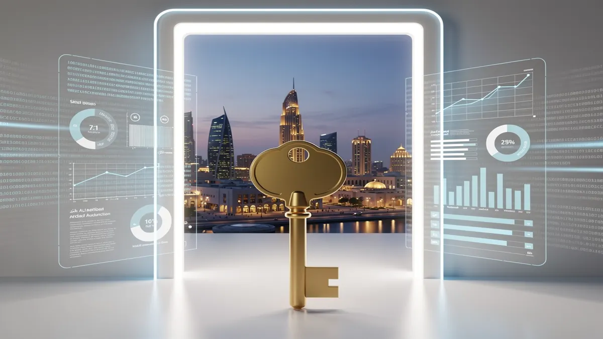

# Top Web Design Agency in Riyadh | Custom Websites & Digital Growth

## The Leading Web Design Agency in Riyadh: Driving Digital Growth Through Operational Excellence

<!-- section_id: sec_01 -->

Success in the Riyadh market no longer depends on merely having an online presence; it requires a high-performance digital engine that converts local traffic into measurable revenue. As a premier Web Design Agency, we specialize in building high-speed, secure, and culturally resonant platforms that align with the ambitious goals of Saudi Vision 2030. By integrating advanced UI/UX principles with deep local market insights, we ensure your brand stands out in the competitive landscape of the capital.

Our approach to Web Design Riyadh focuses on operational excellence, moving beyond aesthetics to prioritize functional growth and technical precision. We understand that Saudi users demand seamless interactions, which is why our development process centers on user-centric design to reduce friction and increase retention. Every element, from the navigation flow to the call-to-action placement, is engineered to guide visitors toward a specific business outcome.

Mobile responsiveness is a non-negotiable standard in a region where mobile penetration rates are among the highest globally. Our team implements rigorous responsive design protocols to ensure your website performs flawlessly across all devices, from high-end smartphones to tablets. This commitment to mobile responsiveness directly impacts your search visibility and user satisfaction, providing a consistent brand experience regardless of how your audience accesses your site in Riyadh.

To future-proof your digital assets, we integrate cutting-edge AI solutions and machine learning algorithms that personalize the user journey in real-time. This digital transformation allows your business to automate customer interactions and gain deeper insights into consumer behavior through data-driven analytics. By leveraging these technologies, we help Saudi enterprises move from reactive maintenance to proactive growth strategies that scale effortlessly.

A truly effective website in the Kingdom must respect local nuances, which is why we prioritize expert RTL (Right-to-Left) design for Arabic interfaces. We ensure that typography, alignment, and visual hierarchy are optimized for the Arabic language, preventing the common "mirrored" look that plagues amateur builds. This level of detail in content & graphics ensures your brand communicates authority and respect for the local culture.

Security and compliance are the pillars of our development philosophy, especially regarding SDAIA compliance and National Data Management Office (NDMO) regulations. We implement robust data protection measures to ensure your customer information remains secure and your business stays aligned with Saudi law. Our technical architecture often utilizes Headless CMS Saudi Arabia configurations, offering superior security and faster load times compared to traditional monolithic systems.

Financial transactions must be frictionless to drive conversions, which is why we provide seamless Mada payment integration alongside STC Pay and Urpay. By offering the payment methods your customers trust most, we significantly reduce cart abandonment and build long-term consumer confidence. These localized fintech integrations are essential for any business looking to dominate the e-commerce sector within the Riyadh region.

Visibility is driven by our integrated SEO services and comprehensive digital marketing strategies that target high-intent keywords in both Arabic and English. We focus on local SEO Riyadh tactics to ensure your business appears at the top of search results when local customers are looking for your specific services. This holistic approach ensures that your high-performance website receives the qualified traffic it needs to thrive.

Beyond the initial launch, we provide rigorous website maintenance SLA packages to ensure your platform remains updated, secure, and fast. Our 24/7 local support team in Riyadh is always available for on-site consultations, providing a level of accountability that offshore agencies cannot match. With CEMS IT Official Website, you gain a partner dedicated to your long-term digital evolution and conversion rate optimization.

Our strategy is built on the belief that a website should be a profit center, not an expense. By combining world-class engineering with local market expertise, we deliver digital experiences that resonate with the Saudi audience while meeting global performance standards. Whether you are a startup or a government entity, our focus remains on driving your digital growth through technical and operational brilliance.

## Why Riyadh Businesses Choose Our System-Driven Web Design Agency

<!-- section_id: sec_02 -->

In the rapidly evolving landscape of Riyadh, your business requires more than just a digital presence; it demands a strategic engine built for the high-velocity Saudi market. As a specialized Web Design Agency, we deliver system-driven platforms that align perfectly with the ambitious goals of Saudi Vision 2030, ensuring your brand leads the digital transformation in the region. Riyadh-based users exhibit unique browsing behaviors, favoring mobile-first interactions and culturally resonant interfaces, which is why our approach moves beyond aesthetics to focus on measurable business outcomes.

*   **Accelerated Digital Transformation:** We integrate advanced AI solutions and machine learning protocols to automate customer interactions, allowing your business to scale operations without increasing overhead in the competitive Riyadh market.
*   **User-Centric Design Architecture:** By prioritizing user-centric design, we reduce friction in the customer journey, ensuring that local visitors find exactly what they need within seconds of landing on your site.
*   **Mada & STC Pay Integration:** Our systems feature seamless Mada payment integration and support for Urpay and STC Pay, catering directly to the preferred transaction methods of Saudi consumers to maximize checkout conversions.
*   **SDAIA & NDMO Compliance:** We build every platform with strict adherence to Saudi Data Protection Laws, ensuring your enterprise remains fully compliant with SDAIA and NDMO regulations regarding data residency and user privacy.
*   **RTL Design Excellence:** Our team masters Right-to-Left (RTL) design nuances, ensuring that Arabic typography and navigation flows are intuitive, professional, and culturally aligned with the Saudi audience's expectations.
*   **Headless CMS Performance:** For Saudi enterprises requiring agility, we deploy Headless CMS Saudi Arabia solutions that decouple the frontend from the backend, providing lightning-fast load times and unmatched security.
*   **Mobile Responsiveness & Speed:** With Riyadh’s high mobile penetration, our responsive design ensures your site performs flawlessly on every device, significantly lowering bounce rates and improving your Local SEO Riyadh performance.
*   **Comprehensive SEO Services:** Every element of your site is optimized for search engines from day one, leveraging digital marketing strategies that place your brand at the forefront of Google.sa search results.
*   **Content & Graphics Localization:** We produce high-impact content & graphics that speak the local dialect of your industry, ensuring your brand voice resonates with both corporate stakeholders and retail consumers in the Kingdom.

Riyadh’s business ecosystem is no longer satisfied with static websites that act as digital brochures; companies now seek high-performance assets that drive lead generation. By partnering with a Digital Marketing Agency Saudi Arabia that understands the local nuances, you gain access to sophisticated conversion rate optimization (CRO) techniques specifically tuned for the Middle Eastern consumer. This results in a website that doesn't just look impressive but functions as a 24/7 sales representative, capturing high-intent leads and nurturing them through localized automation.

To maintain a competitive edge, we implement a robust website maintenance SLA that guarantees 99.9% uptime and proactive security patching, protecting your investment from evolving cyber threats. Our maintenance packages are designed for Riyadh businesses that cannot afford downtime, offering on-site consultation and immediate support to ensure your digital infrastructure remains resilient. We treat digital transformation not as a one-time project, but as a continuous evolution supported by data-driven insights and real-time performance monitoring.

Our expertise extends into the integration of AI solutions and machine learning to personalize user experiences at scale, providing your visitors with tailored recommendations that drive loyalty. This level of technical sophistication is what differentiates a standard site from a market-leading platform capable of supporting the massive scale of Saudi Vision 2030 initiatives. We focus on building the technical foundation that allows your business to pivot quickly as market demands shift within the Kingdom’s diverse economic sectors.

Choosing a system-driven agency means you benefit from a structured methodology that covers everything from initial UX audits to post-launch digital marketing. We bridge the gap between complex backend engineering and elegant frontend presentation, ensuring that your digital assets are as powerful as they are beautiful. By focusing on the intersection of user-centric design and technical performance, we help Riyadh businesses achieve a superior return on investment while establishing a dominant online authority.

In a market where trust is the primary currency, our commitment to transparency and local expertise provides the peace of mind you need to grow your digital footprint. We provide detailed reporting and analytics, allowing you to see exactly how your website contributes to your bottom line through improved engagement and higher conversion rates. Our goal is to empower your brand with the tools necessary to outpace competitors and secure a long-term leadership position in the Saudi Arabian digital economy.

The shift toward modern web architectures, such as [wordpress.org](https://wordpress.org), allows us to provide flexible, scalable, and secure environments for businesses of all sizes. Whether you are a startup in the King Abdullah Financial District or an established enterprise in the heart of Riyadh, our system-driven approach ensures your website is a future-proof asset. We eliminate the technical debt associated with legacy systems, replacing them with agile platforms that are ready to integrate with the next generation of Saudi digital infrastructure.

## Core Services: From UI/UX Design to Full-Scale Digital Transformation

<!-- section_id: sec_03 -->

In the rapidly evolving digital landscape of Riyadh, a website is no longer just a digital business card; it is a high-performance engine for growth. As a premier Web Design Agency, CEMS IT Official Website delivers high-efficiency digital solutions that align with the ambitious goals of Saudi Vision 2030. We transform your online presence into a conversion-focused asset by integrating local market reliability with global technical standards. **[Book Your Free Digital Strategy Consultation in Riyadh Today!](https://cems-it.com)**

Our approach begins with world-class UI/UX Design that prioritizes the specific behavioral patterns of Saudi users. We specialize in RTL Design (Right-to-Left) to ensure that Arabic-speaking audiences experience a natural, intuitive flow that builds immediate brand trust. By focusing on user-centric design, we reduce bounce rates and guide your visitors toward clear, measurable actions that impact your bottom line.

True digital transformation requires more than just aesthetics; it demands flawless technical execution across all devices. Our team implements Responsive design and Mobile responsiveness as a core standard, ensuring your site performs perfectly on everything from high-end desktops to the latest smartphones. This mobile-first strategy is critical in Saudi Arabia, where mobile internet penetration is among the highest globally, directly influencing your search rankings and user retention.

Beyond the interface, we integrate robust SEO services into the very architecture of your website to ensure you dominate local search results. By focusing on Local SEO Riyadh strategies, we help your business capture high-intent traffic from the capital and across the Kingdom. Our developers ensure that every site is SDAIA compliance ready, adhering to the latest National Data Management Office (NDMO) regulations for data privacy and security.

For enterprises seeking agility and speed, we offer Headless CMS Saudi Arabia solutions that decouple the backend from the frontend. This architecture allows for lightning-fast loading times and the flexibility to push content to multiple platforms simultaneously. Whether you are a startup or a government entity, our high-efficiency delivery ensures your platform is future-proofed against evolving technological shifts.

**Scale Your Business with Riyadh’s Leading Web Design Experts – Get a Quote Now!**

Content & graphics play a pivotal role in storytelling and brand positioning within the local market. We create high-impact visuals and localized copy that resonate with Saudi cultural nuances while maintaining a professional, authoritative tone. This synergy between design and content ensures that your brand message is not only seen but felt by your target audience, driving higher engagement and loyalty.

To maximize your ROI, we implement advanced Conversion rate optimization (CRO) techniques that turn passive visitors into active customers. We analyze user heatmaps and session recordings to identify friction points, then refine the interface to streamline the path to purchase. This data-driven methodology eliminates guesswork, ensuring that every design choice is backed by proven user behavior and performance metrics.

E-commerce excellence in the Kingdom requires seamless Mada payment integration, alongside STC Pay and Urpay options. We build secure, high-speed checkout experiences that cater to the local preference for trusted, domestic payment gateways. By providing a frictionless transaction process, we help you lower cart abandonment rates and increase the average order value for your online store.

Our commitment to your growth extends far beyond the initial launch through our comprehensive Website maintenance SLA. We provide 24/7 local support and proactive security monitoring to ensure your digital assets remain online and optimized at all times. This reliability allows you to focus on your core business operations while we handle the technical complexities of your digital infrastructure.

In today’s competitive market, Digital marketing and SEO services must work in harmony to achieve market leadership. We integrate AI solutions and Machine learning algorithms to analyze market trends and automate personalized user experiences. This forward-thinking approach ensures your business stays ahead of the curve, leveraging the latest innovations to maintain a competitive edge in Riyadh’s thriving economy.

**Don’t Leave Your Digital Growth to Chance – Partner with CEMS IT Official Website for Guaranteed Results!**

### Strategic UI/UX Design for the Saudi Market

<!-- section_id: sec_04 -->

In the competitive Riyadh digital landscape, high-performance web design is no longer a luxury but a fundamental requirement for market penetration. Our approach to UI/UX Design ensures your platform serves as a high-conversion engine by blending global usability standards with deep-rooted Saudi cultural nuances. By prioritizing user-centric design, we transform passive browsing into active engagement, ensuring every click moves the user closer to a transaction.

Success in the Kingdom requires more than just aesthetics; it demands a sophisticated understanding of local user behavior and technological expectations. We implement Right-to-Left (RTL) Design frameworks that feel natural to Arabic speakers while maintaining a flawless bilingual experience for expatriate audiences. This dual-language optimization is critical for brands aiming to align with the digital transformation goals of Saudi Vision 2030, where inclusivity and accessibility are paramount.

Mobile responsiveness is the baseline for any serious enterprise in Riyadh, given the region’s exceptionally high smartphone penetration rates. Our responsive design methodology ensures that your site delivers a premium experience across all devices, from high-end mobile handsets to desktop workstations. By optimizing for mobile-first indexing, we provide a foundation for long-term SEO services success, ensuring your brand remains visible where your customers are most active.

Conversion rate optimization (CRO) is baked into our design DNA, utilizing data-driven heatmaps and user journey mapping to eliminate friction. We integrate essential local features such as Mada payment integration, STC Pay, and Urpay to provide the seamless checkout experiences Saudi consumers trust. When users encounter familiar, secure payment gateways, abandonment rates plumet, directly increasing your bottom line through a frictionless transactional flow.

To stay ahead of the curve, we leverage AI solutions and machine learning to personalize the user experience in real-time. These intelligent systems analyze visitor behavior to serve dynamic content and graphics that resonate with specific audience segments. Whether it is a personalized product recommendation or an automated chatbot, these tools ensure your digital presence evolves alongside your customers' needs.

Compliance with Saudi Arabia’s strict data regulations is a non-negotiable aspect of our strategic design process. We ensure every project adheres to SDAIA and NDMO guidelines, protecting user privacy and building the high level of trust necessary for digital commerce. This commitment to security and transparency is what separates a standard website from a truly authoritative digital asset in the Saudi market.

For enterprises requiring agility and speed, we offer Headless CMS Saudi Arabia implementations that decouple the backend from the frontend. This architecture allows for lightning-fast load times and the flexibility to push content across multiple platforms simultaneously without compromising performance. Combined with a robust website maintenance SLA, your business benefits from a future-proof system that remains secure, updated, and highly available.

Our strategy extends beyond the launch phase to include integrated digital marketing and local SEO Riyadh tactics. By aligning the site’s architecture with search intent, we ensure that your UI/UX Design efforts are supported by a consistent stream of organic traffic. This holistic view of the digital ecosystem ensures that your investment in a web design agency yields measurable growth and a dominant market position.

The synergy between content & graphics and technical performance creates a brand story that captivates and converts. We focus on high-quality visual storytelling that reflects the modern ambition of Riyadh while respecting traditional values. This balanced approach ensures your brand is perceived as both innovative and culturally relevant, fostering deep loyalty among your target demographic.

Ultimately, strategic design is about solving business problems through intuitive interfaces and logical user flows. By focusing on the intersection of technology, culture, and commerce, we help Riyadh-based businesses scale with confidence. Partner with us to redefine your digital engagement and turn your website into your most powerful sales tool. Ready to dominate the Saudi market? Book your free UI/UX consultation today and start your transformation.

## Our 4-Step 'Frictionless Path' Web Design Process

<!-- section_id: sec_05 -->

The digital landscape in Riyadh is evolving at an unprecedented pace, demanding a **Web Design Agency** that moves beyond aesthetics to deliver high-performance business engines. At CEMS IT, we recognize that a website in the Saudi market is no longer just a digital brochure; it is a critical component of **Digital transformation** that must align with the ambitious goals of Saudi Vision 2030. Our "Frictionless Path" process ensures your platform is built to handle the unique cultural and technical requirements of the Kingdom while maximizing ROI through precision engineering.

### 1. Discovery & Strategic Alignment
We begin by immersing ourselves in your business objectives to ensure every design choice serves a specific commercial purpose. This phase focuses on understanding the local user persona in Riyadh, where mobile-first behavior and high expectations for speed are the norm. We analyze your competitive landscape and define the technical roadmap, including necessary **AI solutions** and **Machine learning** integrations that can automate customer interactions or personalize user journeys from day one.

Our strategy is deeply rooted in the requirements of the Saudi market, prioritizing **SDAIA compliance** and National Data Management Office (NDMO) standards for data sovereignty. By establishing these guardrails early, we prevent costly legal or technical pivots during the development cycle. This stage results in a comprehensive blueprint that balances global design standards with local regulatory rigor, ensuring your brand stands out as a trusted leader in the regional digital economy.

### 2. User-Centric Architecture & Cultural Design
The second stage transforms strategy into a visual and structural reality through **User-centric design** that honors local nuances. In Saudi Arabia, **RTL Design** (Right-to-Left) is not merely a flip of the layout; it requires a fundamental understanding of visual hierarchy and eye-tracking patterns specific to Arabic speakers. We craft wireframes that prioritize **Mobile responsiveness** to capture the Kingdom’s massive smartphone-reliant audience, ensuring a seamless experience across all devices.

Beyond layout, we focus on high-impact **Content & graphics** that resonate with the cultural values of the Riyadh business community. This includes selecting imagery and typography that reflect a modern, visionary Saudi identity while maintaining global appeal. By integrating **Responsive design** principles with localized UX, we reduce bounce rates and build immediate trust with your visitors. Every element is tested to ensure it guides the user naturally toward your primary conversion goals.

### 3. Engineering & Localized Integration
During the development phase, **CEMS IT Official Website** standards dictate a focus on speed, security, and scalability. We often recommend a **Headless CMS Saudi Arabia** approach for enterprises seeking maximum flexibility and lightning-fast performance. This allows for a decoupled architecture where the frontend remains agile while the backend stays robust. We integrate essential local financial tools, including **Mada payment integration**, STC Pay, and Urpay, to facilitate frictionless transactions for your customers.

Performance is non-negotiable, as slow load times directly impact your bottom line and search rankings. Our engineers implement advanced caching and **SEO services** at the code level to ensure your site is visible to high-intent users in Riyadh. We also ensure that all technical deployments adhere to the latest [Google Search Essentials](https://developers.google.com/search/docs/essentials) to guarantee long-term indexability. This phase turns complex requirements into a streamlined, high-speed digital reality that is ready for the local market.

### 4. Optimization & Sustainable Growth
The final step of our process is not a conclusion but the beginning of your digital acceleration. We deploy **Digital marketing** and **Conversion rate optimization** (CRO) strategies to turn your traffic into measurable revenue. By analyzing real-time user data, we refine calls-to-action and navigation paths to eliminate friction. This data-driven approach ensures that your website continues to evolve alongside shifting consumer behaviors in the Saudi capital, maintaining its competitive edge.

To protect your investment, we provide a comprehensive **Website maintenance SLA** that covers everything from security patches to performance tuning. Our **Local SEO Riyadh** strategies ensure you dominate local search queries, keeping your brand at the forefront of your industry. This continuous optimization cycle, supported by **AI solutions**, allows your business to scale efficiently while remaining compliant with evolving Saudi digital laws. We treat your website as a living asset that grows in value over time.

## Proven Results: Local Proof and Case Studies in Riyadh

<!-- section_id: sec_06 -->

The digital landscape in Riyadh is undergoing a radical shift driven by Saudi Vision 2030, where a high-performing website is no longer a luxury but a core requirement for survival. To dominate the local market, your business needs a Web Design Agency that understands the intersection of cultural nuances and technical precision. We focus on delivering measurable growth by transforming static pages into high-converting digital assets that resonate with the specific behaviors of Saudi consumers.

Success in the Kingdom requires more than just aesthetic appeal; it demands a deep integration of local functional requirements. Our approach prioritizes Mada payment integration and STC Pay compatibility to ensure frictionless transactions for your customers. By aligning with SDAIA and NDMO data protection standards, we build trust and authority, ensuring your platform is fully compliant with national regulations while providing a seamless user experience.

Mobile responsiveness is non-negotiable in a market where smartphone penetration is among the highest globally. Every project we undertake utilizes user-centric design principles to ensure your site performs flawlessly across all devices, from high-end smartphones to tablets. This commitment to mobile excellence directly impacts your search rankings and reduces bounce rates, positioning your brand as a leader in the competitive Riyadh business ecosystem.

We leverage advanced AI solutions and machine learning to personalize the user journey, predicting customer needs before they even click. This digital transformation allows businesses in Riyadh to automate complex processes, such as intelligent product recommendations or automated Arabic-language chatbots. By integrating these technologies, we help you reduce operational overhead while significantly increasing your conversion rate optimization metrics.

A truly local Digital Marketing Agency Saudi Arabia must master the art of RTL (Right-to-Left) design to cater to the Arabic-speaking majority. We don't just flip the layout; we re-engineer the entire visual hierarchy to ensure that content and graphics lead the eye naturally. This attention to cultural detail ensures that your brand message is received with clarity and respect, fostering deeper connections with your target audience.

Speed is a critical ranking factor, which is why we often recommend a Headless CMS Saudi Arabia for enterprises requiring extreme performance and scalability. Unlike traditional monolithic systems, a headless architecture decouples the frontend from the backend, allowing for lightning-fast load times and greater flexibility. This technical edge ensures your website remains agile, secure, and ready to handle sudden traffic spikes during major national events or sales seasons.

Visibility in local search results is the engine that drives sustainable organic growth for businesses across the capital. Our SEO services are deeply rooted in Local SEO Riyadh strategies, targeting high-intent keywords that your customers are actually searching for. We optimize your Google Business Profile and on-page elements to ensure that when someone looks for your services in Riyadh, your brand appears at the top of the results.

Building a website is only the beginning; maintaining its peak performance requires a dedicated Website Maintenance SLA. We provide proactive monitoring, security patches, and regular performance audits to ensure your digital storefront never goes offline. This consistent support allows you to focus on your core business operations while we handle the technical complexities of keeping your platform secure and up-to-date with the latest web standards.

Our portfolio includes transformative work for major entities, such as the digital platform for the Diriyah Biennale Foundation, where heritage meets modern technology. We also modernized the digital identity for Satorp, proving our ability to handle large-scale corporate branding and technical consultancy. These projects demonstrate our capacity to deliver sophisticated solutions that meet the rigorous demands of the Saudi public and private sectors.

By choosing a partner that understands the Riyadh market, you gain access to a team that combines global design standards with local market insights. We focus on creating digital experiences that are not only visually stunning but also strategically engineered to drive revenue. Whether you are a startup or a global energy powerhouse, our data-driven approach ensures your investment yields a significant return and long-term digital authority.

## The Competitive Edge: Why CEMS IT Stands Out in Saudi Arabia

<!-- section_id: sec_07 -->

Choosing a **Web Design Agency** in Riyadh requires more than just finding a team that can build a functional site; it requires a partner capable of navigating the Kingdom’s unique digital shift. CEMS IT stands out by bridging the gap between aesthetic excellence and the technical rigor demanded by Saudi Vision 2030. Our approach ensures your platform is not just a digital brochure but a high-performance engine designed for the specific browsing habits of the Saudi market.

In a region where mobile penetration is among the highest globally, we prioritize **mobile responsiveness** and **responsive design** to ensure seamless transitions across devices. We understand that Riyadh’s consumers expect instantaneous load times and intuitive navigation. By focusing on **user-centric design**, CEMS IT eliminates friction in the customer journey, directly influencing your bottom line through improved engagement and retention.

Beyond traditional development, CEMS IT integrates advanced **AI solutions** and **machine learning** to future-proof your digital assets. Whether it is implementing predictive search or automated customer service flows, these technologies allow your business to scale efficiently. This commitment to **digital transformation** ensures that your website evolves alongside global trends while remaining deeply rooted in local market requirements.

Cultural resonance is at the heart of our **RTL Design** (Right-to-Left) philosophy, ensuring that Arabic typography and layouts feel natural rather than mirrored. We go beyond translation by optimizing the visual hierarchy for local users, which is critical for building trust. This attention to detail extends to **content & graphics**, where we blend modern minimalism with cultural nuances that reflect your brand’s prestige in the Saudi market.

Financial integration is a core strength, as we provide seamless **Mada payment integration**, STC Pay, and Urpay compatibility for e-commerce ventures. This localized financial infrastructure is essential for converting visitors into customers within the Kingdom. By aligning with local payment preferences, CEMS IT helps businesses reduce cart abandonment and streamline the transactional experience for the Saudi consumer.

Security and legal adherence are non-negotiable in the current regulatory environment. CEMS IT ensures full **SDAIA compliance** and follows NDMO guidelines to protect user data and maintain national standards. Our technical architecture often utilizes **Headless CMS Saudi Arabia** configurations, offering superior security and speed compared to traditional monolithic systems. This setup provides the flexibility needed for enterprise-level growth and complex integrations.

Visibility in a crowded market like Riyadh depends on precision-engineered **SEO services** and **local SEO Riyadh** strategies. We build every site with a clean code structure that search engines favor, ensuring your brand appears when it matters most. Combined with targeted **digital marketing**, our builds are optimized for high **conversion rate optimization**, turning organic traffic into measurable business growth.

Reliability is guaranteed through our comprehensive **website maintenance SLA**, providing 24/7 local support and on-site consultations in Riyadh. We understand that downtime is not an option for businesses contributing to the Kingdom’s economic expansion. CEMS IT offers a partnership that extends far after the launch, ensuring your platform remains secure, updated, and aligned with the latest technological breakthroughs.

By choosing CEMS IT, you are investing in a strategic asset that understands the intersection of global innovation and Saudi tradition. We don't just build websites; we create digital experiences that command authority and drive the next phase of your company's evolution. Our team is ready to transform your vision into a high-converting reality that sets a new benchmark for excellence in the region.

For more information on modern web standards and performance optimization, you can explore the resources provided by web.dev to understand how technical speed impacts your search rankings.

## Frequently Asked Questions About Web Design in Riyadh

<!-- section_id: sec_08 -->

Selecting the right **Web Design Agency** in Riyadh is no longer just about aesthetics; it is a strategic investment in your brand’s future within the rapidly evolving Saudi digital economy. With the Kingdom’s aggressive push toward **Saudi Vision 2030**, businesses must transition from static pages to dynamic, high-performance platforms that prioritize **User-centric design** and measurable growth.

**How does a professional web design strategy impact my business growth in Riyadh?**
A professionally engineered website acts as your 24/7 digital salesperson, specifically optimized to convert the local Riyadh market’s high-intent traffic into loyal customers. By integrating **Conversion rate optimization** (CRO) techniques, agencies ensure that every visitor interaction is mapped toward a specific business outcome, whether that is a lead generation form or a direct purchase.

**Why is mobile responsiveness critical for the Saudi Arabian market?**
With over 80% of internet users in Saudi Arabia accessing the web via smartphones, **Mobile responsiveness** is the baseline for digital survival, not a luxury feature. A **Responsive design** ensures your site maintains its integrity and speed across all devices, preventing potential customers from bouncing to competitors due to poor mobile functionality or slow load times.

**What specific local integrations should I expect for a Saudi e-commerce site?**
To thrive locally, your platform must support **Mada payment integration**, STC Pay, and Urpay to align with the Kingdom's preferred transaction methods. Furthermore, ensuring **SDAIA compliance** regarding data privacy and protection is mandatory for any enterprise operating within Riyadh, providing your users with the security and trust required to complete high-value transactions.

**How does RTL Design affect user experience for Arabic-speaking audiences?**
**RTL Design** (Right-to-Left) is not merely about flipping text; it requires a complete architectural shift in layout, navigation, and visual hierarchy to suit Arabic linguistic flow. Expert agencies in Riyadh specialize in mirroring interfaces so that the **User-centric design** feels natural to local users, significantly improving engagement and reducing cognitive friction during the browsing process.

**Can AI solutions and Machine learning improve my website’s performance?**
Modern **Digital transformation** involves leveraging **AI solutions** to personalize the user journey through predictive search and automated customer support bots. By implementing **Machine learning** algorithms, your website can analyze user behavior in real-time, offering tailored product recommendations that increase average order value and enhance the overall efficiency of your digital sales funnel.

**What is the difference between a Headless CMS and a Monolithic system for Saudi enterprises?**
A **Headless CMS Saudi Arabia** implementation decouples the backend content management from the frontend presentation layer, offering unparalleled flexibility and speed for large-scale enterprises. Unlike traditional monolithic systems, this architecture allows for faster updates and seamless content delivery across multiple platforms, making it the preferred choice for brands seeking long-term scalability and security.

**How do SEO services and Local SEO Riyadh drive organic traffic to my site?**
Effective **SEO services** ensure your brand appears at the top of search results when potential clients search for your specific products or services in the capital. By focusing on **Local SEO Riyadh**, agencies optimize your presence for geo-specific queries, ensuring that your business captures the highest quality traffic from users physically located within the Riyadh province.

**What role do content and graphics play in brand authority?**
High-quality **Content & graphics** are the visual and intellectual pillars of your digital identity, establishing immediate authority and trust with your audience. Professional agencies provide bespoke visual assets and culturally resonant copy that align with Saudi values, ensuring your brand message is both persuasive and respectful of local sensibilities.

**What should be included in a standard Website maintenance SLA?**
A robust **Website maintenance SLA** (Service Level Agreement) should guarantee 24/7 uptime monitoring, regular security patches, and rapid response times for technical issues. For businesses in Riyadh, this ongoing support is vital to ensure that your **Digital marketing** efforts are never undermined by unexpected downtime or technical glitches that could alienate your customer base.

**How does web design contribute to the broader goals of Saudi Vision 2030?**
By adopting advanced digital infrastructures, businesses directly contribute to the Kingdom’s goal of becoming a global hub for technology and innovation. Investing in high-tier web development is an act of alignment with the national **Digital transformation** strategy, positioning your brand as a forward-thinking leader in the competitive Saudi landscape.

**Is it necessary to integrate social media into my web design?**
Seamlessly merging your **Digital marketing** channels with your website creates a unified brand ecosystem that encourages cross-platform engagement. Social proof, live feeds, and easy sharing options turn your website into a social hub, amplifying your reach across Riyadh’s highly active social media demographics and driving organic brand advocacy.

**How can I measure the ROI of my new website design?**
The return on investment is measured through improved key performance indicators such as lower bounce rates, higher session durations, and increased conversion volumes. By utilizing advanced analytics, a **Web Design Agency** can provide transparent data showing exactly how the new design has improved your bottom line and lowered your customer acquisition costs.

**What are the security standards for websites operating in Saudi Arabia?**
Beyond global best practices like SSL certificates and Cloudflare protection, Saudi-based websites must adhere to specific national cybersecurity frameworks. Ensuring your site is hosted on secure servers with localized data residency options helps meet regulatory requirements while providing the fast, low-latency experience that Riyadh-based users expect.

**Why is a custom-built website better than a generic template?**
Custom websites are engineered specifically for your business goals, offering unique features and optimized code that templates simply cannot match. This bespoke approach ensures your site is lightweight, fast, and perfectly aligned with your brand’s unique value proposition, giving you a distinct competitive advantage in the crowded Riyadh marketplace.

**What is the typical timeline for a professional web design project in Riyadh?**
A comprehensive project involving strategy, **User-centric design**, and custom development typically spans 8 to 12 weeks, depending on complexity. This timeline ensures that every phase—from initial wireframing to final **SDAIA compliance** testing—is executed with the precision required to launch a world-class digital asset.

## Conclusion: Partner with Riyadh’s Most Reliable Web Design Agency

<!-- section_id: sec_09 -->

In the rapidly evolving digital landscape of Riyadh, your website is no longer just a digital business card; it is the primary engine for your commercial growth. Choosing a professional **Web Design Agency** ensures your brand captures the immense opportunities presented by Saudi Arabia’s digital transformation. By prioritizing **user-centric design** and seamless functionality, businesses can convert casual visitors into loyal customers while establishing a dominant presence in the local market.

The Saudi market possesses unique cultural and technical requirements that demand more than a generic template. High-performing **Web Design Riyadh** services focus on **RTL Design** (Right-to-Left) precision to ensure Arabic content flows naturally and remains legible across all devices. This localized approach, combined with **responsive design**, guarantees that your platform resonates with the specific aesthetic and functional expectations of Saudi consumers.

To stay competitive under **Saudi Vision 2030**, enterprises are increasingly adopting **AI solutions** and **machine learning** to personalize the user journey. These technologies allow your website to predict user behavior, offering tailored product recommendations or automated support through intelligent chatbots. Integrating such advanced features ensures your business remains at the forefront of innovation while significantly improving overall engagement rates.

Modern web architecture in the Kingdom is shifting toward **Headless CMS Saudi Arabia** models to provide unmatched flexibility and speed. Unlike traditional monolithic systems, a headless approach decouples the backend from the frontend, allowing for lightning-fast load times and easier multi-channel content distribution. This technical edge is crucial for maintaining high performance during peak traffic periods, such as national holidays or major retail events.

Mobile connectivity is the backbone of the Saudi digital economy, making **mobile responsiveness** a non-negotiable standard for success. A site that fails to load perfectly on a smartphone loses more than half of its potential leads instantly. By focusing on a mobile-first strategy, you ensure that your **content & graphics** are optimized for smaller screens without sacrificing the visual impact or the speed of the interface.

Financial trust is established through the seamless integration of local payment ecosystems. Incorporating **Mada payment integration**, alongside STC Pay and Urpay, removes friction at the checkout stage and boosts consumer confidence. This localized transactional capability is essential for any e-commerce venture looking to scale within Riyadh’s competitive retail sector while ensuring full **SDAIA compliance** regarding data privacy.

Visibility in local search results is the lifeblood of sustainable organic growth for any Riyadh-based entity. Implementing robust **Local SEO Riyadh** strategies ensures your business appears exactly when and where your target audience is searching. By pairing high-quality **SEO services** with technical optimization, your website becomes a lead-generation powerhouse that reduces your long-term reliance on expensive paid advertising.

True digital authority is built on a foundation of data-driven results and continuous improvement. Utilizing **conversion rate optimization** (CRO) techniques allows you to refine your site’s layout based on how users actually interact with your pages. This iterative process turns your website into an evolving asset that consistently increases its ROI by removing bottlenecks in the sales funnel.

Protecting user data is not just a best practice; it is a legal mandate under the National Data Management Office (NDMO) guidelines. A reliable agency ensures your platform meets all **SDAIA compliance** standards, protecting your business from legal risks and data breaches. This commitment to security builds a "trust-first" relationship with your clients, which is a critical differentiator in the Riyadh corporate world.

Beyond the initial launch, the longevity of your digital platform depends on consistent technical health. Professional **website maintenance SLA** (Service Level Agreements) provide the peace of mind that your site remains secure, updated, and fast 24/7. This proactive support prevents downtime and ensures that your **digital transformation** efforts continue to yield results as browser technologies and security threats evolve.

The synergy between **digital marketing** and web architecture is what drives high-velocity growth. A well-designed site serves as the ultimate destination for your social media and PPC campaigns, ensuring that every riyal spent on marketing is maximized. By aligning your design with your broader commercial goals, you create a unified brand experience that strengthens your market position.

Ultimately, partnering with an expert team means transforming your digital presence into a scalable corporate asset. Whether you are a startup or an established enterprise, the right technical partner bridge the gap between your vision and the market's reality. Explore how CEMS IT Official Website can elevate your brand through specialized design and development strategies tailored for the Saudi market.

The future of business in Riyadh is undeniably digital, and the window for establishing market leadership is narrowing. Investing in a high-caliber website today ensures your brand is ready to meet the demands of tomorrow’s consumers. With the right blend of creativity, local expertise, and technical rigor, your website will become the most valuable member of your sales and marketing team.