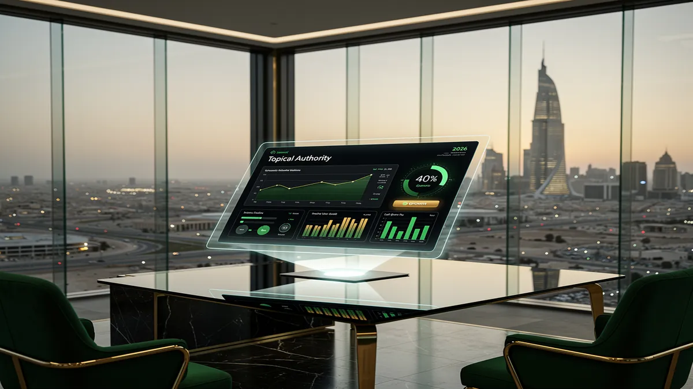
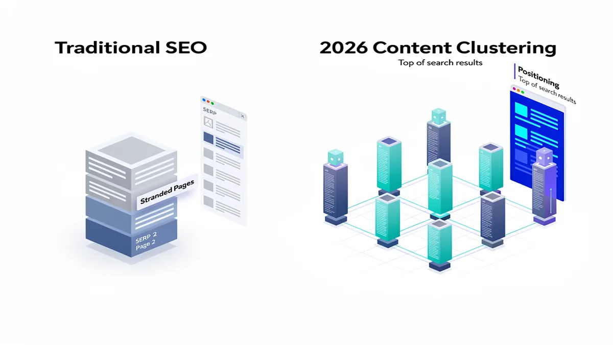
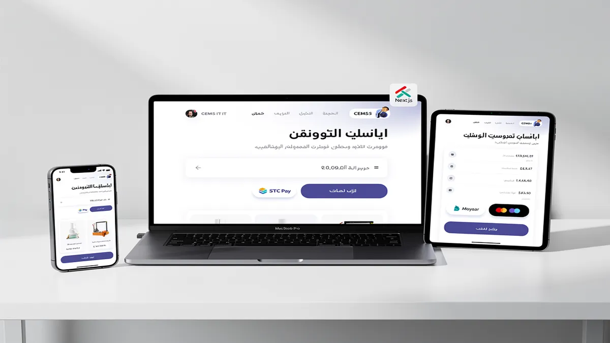
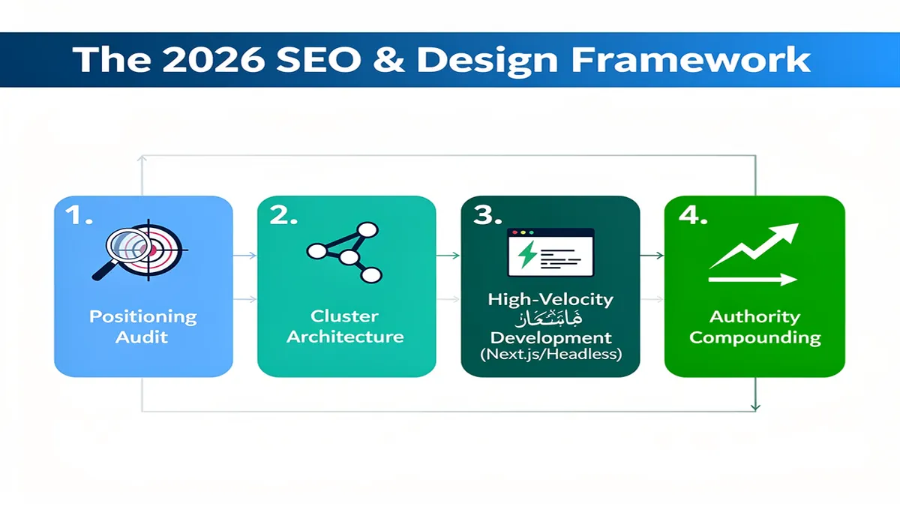
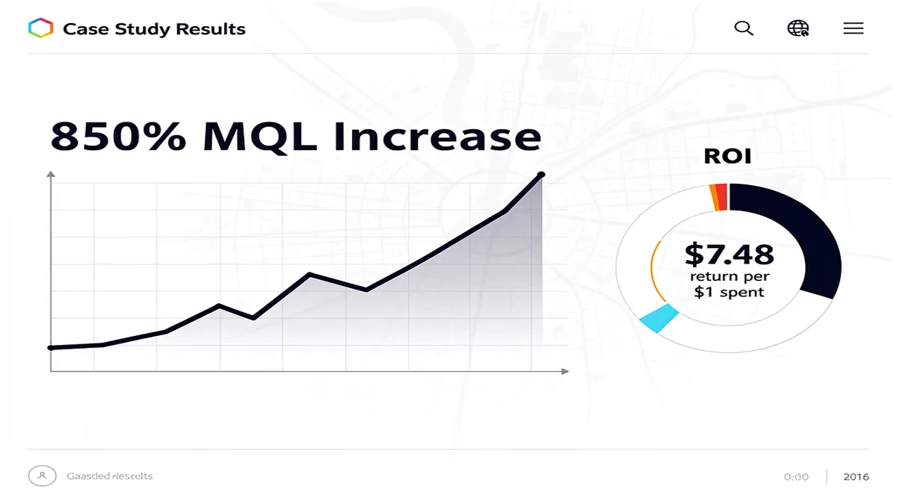
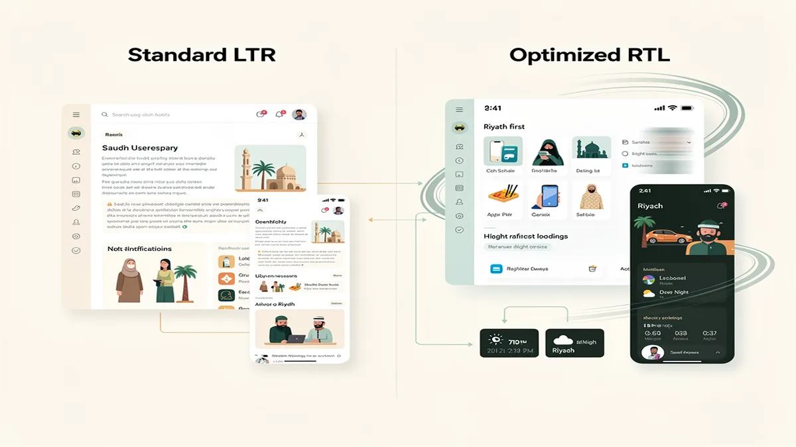
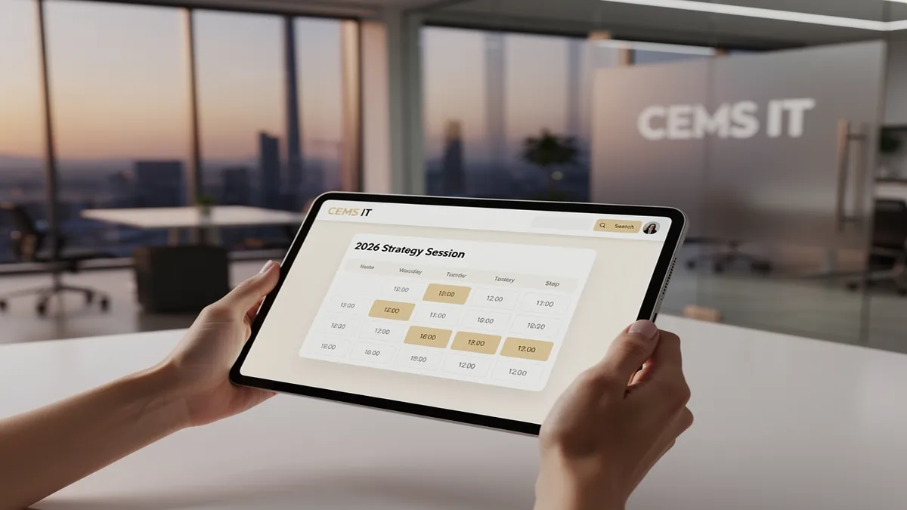

# Top Web Design Agency in Riyadh: Best Digital Solutions 2026

## Top Web Design Agency in Riyadh: Best Digital Solutions 2026

<!-- section_id: sec_01 -->

In today’s hyper-competitive digital landscape, your website serves as the primary engine for revenue generation and brand authority. Partner with [CEMS IT Official Website](https://cems-it.com/) now to dominate the Riyadh market with high-performance digital architecture.

The shift toward Saudi Vision 2030 digital goals has transformed Riyadh into a global tech powerhouse. Businesses no longer need simple brochures; they require sophisticated platforms that integrate seamlessly with the local ecosystem. A premier Web Design Agency must bridge the gap between global technical standards and local cultural expectations.

Your digital presence must prioritize speed, security, and cultural relevance to capture the attention of modern Saudi consumers. We focus on delivering Responsive Web Design that adapts perfectly to the mobile-first behavior prevalent across the Kingdom. Every pixel is optimized to ensure your brand resonates with both local and international audiences.

The evolution of Digital Solutions 2026 demands a move away from legacy systems toward modern, scalable frameworks. We utilize Next.js to build lightning-fast web applications that provide a competitive edge in search engine positioning. This approach ensures your site remains future-proof as the Riyadh tech ecosystem continues its rapid expansion.

E-commerce Development in Riyadh now requires more than just a product listing and a checkout button. To succeed, you must implement localized features like HyperPay integration and STC Pay support. These tools reduce friction at the point of purchase, directly impacting your bottom line and customer loyalty.

Compliance with CITC regulations and local data privacy laws is a non-negotiable standard for any enterprise operating in Saudi Arabia. Our development process incorporates these legal requirements from the initial discovery phase. You gain peace of mind knowing your platform meets all national security and transparency benchmarks.

User experience in the Middle East requires specialized RTL layout optimization to ensure natural readability for Arabic speakers. We treat the Arabic interface as a primary design challenge rather than a secondary translation task. This attention to detail builds immediate trust with your local target demographic.

Topical Authority is established through strategic content clustering and technical excellence that search engines recognize. By optimizing for Lighthouse performance scores, we ensure your website loads in under two seconds. Fast load times are critical for maintaining high Search Engine Positioning in a market where attention spans are short.

Modern businesses are increasingly moving toward Headless CMS architectures to manage content across multiple digital touchpoints effortlessly. This decoupled approach allows for greater design flexibility and faster updates without risking backend stability. You benefit from a platform that scales as quickly as your business grows in Riyadh.

Conversion Rate Optimization (CRO) is the heartbeat of our strategic design philosophy for Saudi enterprises. We analyze user heatmaps and behavioral data to identify bottlenecks that prevent MQL growth metrics from peaking. Every element on your page is strategically placed to guide the user toward a specific action.

The Riyadh market is unique due to its blend of traditional values and a massive, tech-savvy youth population. Your web design must balance professional corporate aesthetics with interactive elements that engage younger users. This duality is what separates a standard website from a market-leading digital asset.

Integrating AI-driven design workflows allows us to personalize the user journey in real-time based on visitor intent. Personalization is no longer a luxury; it is a baseline expectation for high-end digital experiences in 2026. You will see higher engagement rates when users feel the content is tailored specifically to their needs.

Security remains a top priority for government-linked entities and private firms alike across the Saudi capital. We implement robust SSL protocols and advanced firewall configurations to protect your sensitive data from evolving cyber threats. A secure site is the foundation of long-term consumer trust and brand reputation.

Beyond the initial launch, your platform requires dedicated maintenance and post-launch support to remain functional and relevant. The digital landscape shifts daily, and staying ahead requires constant monitoring and iterative updates. We provide the technical backbone that allows your internal team to focus on core business operations.

By aligning your digital strategy with the rapid transformation of Riyadh, you position your brand as a leader. Our commitment is to turn your vision into a high-converting reality that exceeds the highest global standards. Experience the impact of a website built for the future of the Saudi digital economy.

## Why Choosing a Specialized Riyadh Web Design Agency Matters in 2026

<!-- section_id: sec_02 -->

Your digital presence in the Kingdom is no longer about aesthetic appeal alone. To dominate the local market, you need a Web Design Agency that understands the specific behavioral triggers of Saudi consumers. A specialized partner ensures your platform respects local cultural nuances while delivering world-class technical performance.

Global templates often fail to capture the high-trust requirements of the Riyadh business landscape. By prioritizing "Made in Saudi" digital authenticity, you build immediate credibility with local stakeholders. This alignment with Saudi Vision 2030 digital goals transforms your website from a simple URL into a powerful national brand asset.

Modern web architecture requires more than just a visual interface. Utilizing a Headless CMS allows you to decouple your content from the presentation layer for unmatched flexibility. This approach ensures your brand remains agile, allowing for rapid updates across multiple digital touchpoints without compromising system stability.

Performance is a non-negotiable metric for search engine positioning in 2026. Specialized agencies focus on Next.js to deliver lightning-fast, server-side rendered pages that engage users instantly. High Lighthouse performance scores directly correlate with lower bounce rates and improved visibility in competitive Riyadh search results.

Conversion Rate Optimization is the engine that turns local traffic into measurable revenue. Every design element must be strategically placed to guide the Saudi user toward a specific action. By analyzing heatmaps and user flow, a professional agency eliminates friction and maximizes your marketing ROI.

A Digital Marketing Agency Saudi Arabia knows that visibility starts with technical excellence. Implementing a sophisticated Content Clustering strategy helps you build Topical Authority in your specific industry niche. This structured approach signals to search engines that your platform is a comprehensive resource for local users.

Mobile usage in Riyadh is among the highest globally, demanding a mobile-first philosophy. Responsive Web Design must be paired with RTL layout optimization to ensure a natural reading experience for Arabic speakers. Neglecting these structural details can alienate a significant portion of your target demographic.

Security and legal compliance are foundational to operating a digital business in the Kingdom. Your platform must adhere to CITC compliance standards and data privacy regulations to protect user information. Ignoring these local mandates can result in heavy penalties and a total loss of consumer trust.

Seamless financial transactions are critical for successful E-commerce Development in the region. Integrating local payment solutions like HyperPay, STC Pay, and Moyasar ensures a frictionless checkout process. Providing familiar payment gateways reduces cart abandonment and aligns with the purchasing habits of Saudi shoppers.

Data-driven decision-making is what separates market leaders from their competitors. By tracking MQL growth metrics, you can refine your digital strategy based on actual user behavior. This iterative process ensures your platform evolves alongside the rapidly changing Riyadh market dynamics.

Strategic partnerships provide the technical foundation needed for long-term scalability. Engaging with the [CEMS IT Official Website](https://cems-it.com) allows you to leverage enterprise-grade development standards tailored for the Saudi market. This collaboration ensures your digital infrastructure supports your business growth for years to come.

Search engines now prioritize platforms that demonstrate genuine expertise and local relevance. By focusing on deep technical integration and cultural alignment, you secure a dominant market position. A specialized agency doesn't just build a website; they architect a comprehensive digital ecosystem for your success.

## Core Digital Solutions: From Premium UI/UX Design to CEMS IT Integration

<!-- section_id: sec_03 -->

You gain a decisive edge when your digital platform functions as a high-performance sales engine rather than a static brochure. By partnering with a premier Web Design Agency, your business transitions from basic online visibility to dominant market leadership through precision-engineered interfaces.

Our approach prioritizes UI/UX Design that aligns with specific Saudi user behaviors, ensuring every click moves a prospect closer to conversion. We eliminate the friction that causes bounce rates, replacing it with intuitive navigation tailored for the Riyadh enterprise landscape.

Integrating CEMS IT solutions into your core infrastructure ensures that your data flows seamlessly between your website and back-end management systems. This technical synergy reduces manual overhead and provides real-time insights into your customer acquisition funnel.

### High-Conversion Interface Architecture

*   **Mobile-First Precision**: You receive a Responsive Web Design that maintains 100% functionality across all devices used by Saudi consumers.
*   **Next.js Performance**: Your site benefits from lightning-fast load times, directly improving your Lighthouse performance scores and user retention.
*   **Headless CMS Flexibility**: You gain total control over your digital assets, allowing for rapid content updates without risking site stability.
*   **RTL Layout Optimization**: Your Arabic interface feels natural and professional, respecting cultural reading patterns to build immediate brand trust.
*   **Conversion Rate Optimization**: Every design element is A/B tested to ensure your MQL growth metrics consistently trend upward.

To dominate local search results, we implement advanced Content Clustering strategies that establish your brand as a definitive industry leader. This method builds deep Topical Authority, signaling to algorithms that your site is the most relevant source for specific regional queries.

Strategic Search Engine Positioning is not about luck; it is about technical excellence and localized relevance. We ensure your site meets all CITC compliance standards while maintaining peak visibility in a highly competitive digital economy.

### Seamless Transactional Ecosystems

E-commerce success in Riyadh requires more than just a product gallery; it demands a frictionless checkout experience. We specialize in HyperPay integration and support for local providers like STC Pay and Moyasar to ensure your customers feel secure.

By streamlining the payment journey, you significantly reduce cart abandonment rates and increase the average order value. Our E-commerce Development focuses on security and speed, providing a robust foundation for scalable retail growth.

Your digital transformation must align with Saudi Vision 2030 digital goals to stay ahead of regulatory shifts and market expectations. We build platforms that are not only modern today but are architecturally prepared for the innovations of tomorrow.

If you are ready to scale your digital operations with a data-driven strategy, consider a consultation to audit your current performance. You can explore our specialized frameworks at [prolines.sa](https://prolines.sa/web-design-development-company/) to see how custom integration drives measurable ROI.

### Technical Integrity and Compliance

Maintaining high Lighthouse performance scores is essential for both user satisfaction and organic ranking stability. We optimize every script and asset to ensure your site remains lightweight and responsive under heavy traffic loads.

Security remains a top priority for any Riyadh-based enterprise handling sensitive consumer data. Our development process adheres strictly to CITC compliance, ensuring your platform is as secure as it is visually compelling.

Through Content Clustering, we map out every stage of your buyer’s journey, providing the right information at the exact moment of need. This approach turns your website into a 24/7 consultant that educates and converts your target audience.

Finalizing your digital strategy requires a partner who understands the nuances of the Saudi market. From localized payment gateways to cultural design preferences, every detail is engineered to maximize your competitive advantage.

## Our Data-Driven Process: The 2026 SEO & Design Framework

<!-- section_id: sec_04 -->

To dominate the competitive landscape in 2026, your digital presence requires more than aesthetics. Choosing a premier Web Design Agency ensures your platform serves as a high-performance engine for growth. We move beyond traditional templates by integrating a data-driven framework that prioritizes technical precision and user psychology.

Your business transformation begins with a deep technical audit and market analysis. We align every design decision with your specific MQL growth metrics to ensure traffic translates into revenue. By merging global standards with local expertise, we build platforms that resonate with the Saudi market while maintaining elite performance.

Digital Transformation in the Kingdom now demands strict adherence to local governance. Our framework ensures your platform meets all CITC compliance standards and NDMO data privacy regulations from day one. This proactive approach protects your brand reputation and secures your operational longevity in the Saudi digital ecosystem.

We utilize Next.js to deliver lightning-fast, server-side rendered pages that engage users instantly. This architecture significantly improves your Lighthouse performance scores, which is critical for maintaining high Search Engine Positioning. Faster load times directly correlate with lower bounce rates and higher engagement for your Riyadh-based audience.

A Headless CMS approach offers you unparalleled flexibility in managing multi-channel content. You can push updates to your website, mobile app, and IoT devices from a single source of truth. This scalability ensures your brand remains agile as your business requirements evolve within the Saudi market.

Our design philosophy centers on RTL layout optimization to provide a seamless experience for Arabic-speaking users. We meticulously adjust typography, navigation flows, and visual hierarchy to respect regional linguistic patterns. This cultural alignment builds immediate trust and improves the overall usability of your digital interface.

Conversion Rate Optimization is baked into our wireframing process through advanced heat-mapping and user behavior simulations. We strategically place interface elements to guide visitors toward your primary business objectives. This scientific method removes guesswork, ensuring every pixel contributes to your bottom revenue goals.

For brands scaling in the Gulf, we prioritize HyperPay integration to facilitate secure and familiar transaction journeys. Supporting local payment preferences reduces friction at the checkout stage, which is essential for E-commerce Development success. We ensure your financial gateways are robust, compliant, and optimized for high success rates.

Search visibility in 2026 relies heavily on establishing Topical Authority through sophisticated Content Clustering. We architect your site structure to demonstrate deep expertise in your specific industry niche. This method signals to search engines that your platform is a primary resource for users in Riyadh.

Responsive Web Design is no longer optional given the mobile-first behavior of Saudi consumers. We develop fluid interfaces that adapt perfectly to everything from high-resolution desktop monitors to the latest smartphones. Your brand will maintain a consistent and premium feel regardless of the device your customer uses.

We align your digital infrastructure with Saudi Vision 2030 digital goals by fostering innovation and technological self-reliance. By adopting future-proof stacks, you contribute to the Kingdom's thriving digital economy while gaining a competitive edge. Our process ensures you are not just participating in the market, but leading it.

Security remains a foundational pillar of our 2026 framework. We implement advanced encryption and secure API protocols to safeguard sensitive user data against emerging threats. Partnering with CEMS IT Official Website allows you to leverage enterprise-grade security that meets the highest international and local standards.

Your project roadmap includes continuous monitoring of core web vitals to ensure peak performance remains consistent post-launch. We use real-time analytics to identify and resolve bottlenecks before they impact your user experience. This commitment to technical excellence keeps your platform ahead of evolving search engine algorithms.

The integration of AI-driven personalization allows you to deliver tailored experiences to different user segments. By analyzing visitor intent, your website can dynamically adjust content to match individual needs. This level of sophistication drives deeper brand loyalty and increases the lifetime value of your customers.

Our framework is designed to handle the high-traffic demands of the Riyadh market during peak seasons. We utilize global CDNs and edge computing to ensure your site stays online and responsive under heavy loads. Reliability is the cornerstone of consumer trust in the modern digital age.

We focus on creating intuitive navigation that minimizes the cognitive load on your visitors. By simplifying the path to information, you increase the likelihood of successful user interactions. A clean, purposeful design reflects the professional maturity of your organization and its commitment to quality.

Transparency in data usage is a key component of our compliance strategy. We implement clear consent management tools that empower your users while keeping you legally protected. This ethical approach to data builds a transparent relationship between your brand and your Saudi clientele.

Every visual element we choose is vetted for its impact on page weight and rendering speed. We use modern image formats and lazy-loading techniques to maintain visual richness without sacrificing performance. Your site will look stunning while achieving top-tier scores on major speed testing tools.

Our development team prioritizes clean, modular code that is easy to maintain and scale. This reduces your long-term technical debt and allows for faster deployment of new features. Your digital asset remains an adaptable tool that grows alongside your expanding business ambitions.

By focusing on measurable outcomes, we ensure your investment in web design yields a significant ROI. We track key performance indicators to prove the efficacy of our design and SEO strategies. You receive clear reporting that connects digital performance to your actual business growth.

Ultimately, our 2026 framework is about creating a dominant digital presence that captures and keeps market share. We combine technical mastery with a deep understanding of the Riyadh business landscape. Your success is engineered through a meticulous, data-backed process that leaves nothing to chance.

## Proven Authority: Case Studies in the Saudi Market

<!-- section_id: sec_05 -->

To secure a dominant market position, your brand needs more than a static website; it requires a high-performance engine that converts visitors into loyal advocates. As a premier Web Design Agency, we focus on deploying architectures that bridge the gap between creative vision and technical excellence. Our approach ensures your platform is not just visually stunning but also optimized for the rigorous demands of the modern Saudi digital landscape.

Every project we undertake is engineered for maximum impact, leveraging advanced technologies like Next.js and Headless CMS to deliver lightning-fast performance. By decoupling the frontend from the backend, we provide you with a flexible environment where content updates are seamless and security is ironclad. This technical sophistication translates directly into higher Lighthouse performance scores, which are critical for maintaining your search engine positioning in highly competitive niches.

### Strategic Impact During Riyadh Season
The surge in digital activity during Riyadh Season presents a unique opportunity for businesses to capture massive traffic spikes. We design platforms specifically to handle these seasonal market shifts, ensuring your infrastructure remains stable under heavy load. Our ROI-focused design principles prioritize speed and reliability, preventing the revenue loss associated with slow-loading pages during peak consumer interest periods.

To capitalize on these high-traffic windows, we integrate Conversion Rate Optimization (CRO) strategies directly into the UI/UX framework. This involves analyzing user behavior to remove friction points and streamline the path to purchase. By aligning your digital presence with local seasonal events, you create a sense of urgency and relevance that drives measurable MQL growth metrics and increases customer lifetime value.

### Localized Integration and Compliance
Operating within the Kingdom requires a deep understanding of regional technical requirements and consumer trust signals. We ensure every platform features RTL layout optimization, providing a natural and intuitive experience for Arabic-speaking users. This cultural nuance is essential for building authority and ensuring that your brand resonates with the local demographic while maintaining international design standards.

Seamless financial transactions are the backbone of any successful E-commerce Development project. We specialize in HyperPay integration and other local gateways like STC Pay and Moyasar to facilitate secure, one-click payments. Furthermore, our development process strictly adheres to CITC compliance and national data privacy regulations, safeguarding your business against legal risks and building long-term trust with your user base.

### Technical Excellence and Scalability
Your digital platform must be built to scale alongside your business ambitions and the broader Saudi Vision 2030 digital goals. We utilize scalable cloud architectures and Content Delivery Networks (CDNs) to ensure your site performs consistently across the region. This focus on backend integrity ensures that as your traffic grows, your site remains responsive and capable of handling complex data interactions without degradation.

Beyond the initial launch, we emphasize the importance of Topical Authority and Content Clustering to dominate your industry's search landscape. By structuring your site around logical pillars, we help search engines understand the depth of your expertise. This strategic organization, combined with rigorous technical SEO, ensures that your brand remains visible to high-intent users who are actively searching for your services.

### Measurable Growth and Performance Metrics
We believe that data should drive every design decision, which is why we implement comprehensive tracking and analytics from day one. By monitoring user engagement and conversion funnels, we provide you with the insights needed to refine your strategy. This transparent approach to performance allows you to see the direct correlation between Responsive Web Design and your bottom line.

Working with a Digital Marketing Agency Saudi Arabia enables you to synchronize your web presence with broader promotional campaigns. This holistic strategy ensures that every touchpoint, from social media ads to your landing pages, is optimized for a singular goal: conversion. Our commitment to excellence means we don't just deliver a website; we deliver a growth-oriented asset that evolves with the market.

### Future-Proofing with AI and Automation
The integration of AI-driven design workflows allows us to personalize the user experience at scale, providing visitors with content that matches their specific needs. This level of personalization is becoming a standard expectation for Saudi consumers who value efficiency and relevance. By automating repetitive tasks, your team can focus on high-level strategy while the platform handles lead qualification and data synchronization.

Maintaining a competitive edge requires constant vigilance and technical updates. Our post-launch support ensures that your site stays updated with the latest security patches and performance enhancements. This proactive maintenance schedule protects your investment and ensures that your platform continues to meet the high standards of google.com and other major search engines, securing your place at the top of the search results.

## Frequently Asked Questions About Web Design in Riyadh

<!-- section_id: sec_06 -->

When selecting a **Web Design Agency**, your primary focus should be on how digital architecture translates into tangible business growth within the Saudi market. This FAQ addresses the critical technical and financial friction points businesses face when scaling in Riyadh.

### How much does professional web design cost for a Riyadh business?

**Web Design Agency pricing** varies based on the technical complexity and the specific integration requirements of your project. For a standard corporate presence, **Riyadh business web costs** typically range from SAR 10,000 to SAR 25,000, focusing on brand authority and lead generation.

High-performance platforms requiring **Next.js** or a **Headless CMS** for superior speed and scalability often start at SAR 40,000. These investments prioritize **Search Engine Positioning** and long-term **Topical Authority**, ensuring your brand remains dominant in competitive local search results.

### Do you provide integration with local Saudi payment gateways?

Yes, every commercial platform we develop includes seamless **HyperPay integration**, Moyasar, or STC Pay to align with local consumer behavior. Ensuring a frictionless checkout process is vital for achieving high **Conversion Rate Optimization** and reducing cart abandonment in the Kingdom.

Our development team ensures all financial integrations remain in full **CITC compliance**. This protects your business from regulatory risks while providing your customers with the secure, localized payment options they trust for daily transactions.

### How do you handle the Right-to-Left (RTL) layout for Arabic users?

We implement **RTL layout optimization** as a core architectural requirement, not an afterthought. This ensures that typography, navigation menus, and call-to-action buttons mirror the natural reading patterns of Arabic-speaking users in Riyadh.

By prioritizing cultural UX preferences, we help you secure higher engagement and **MQL growth metrics**. A site that feels native to the local audience builds immediate trust, which is essential for converting high-value Saudi enterprise clients.

### Will my website be compliant with Saudi data privacy regulations?

Every project managed by **CEMS IT Official Website** adheres to the latest National Data Management Office (NDMO) guidelines and CITC standards. We implement robust encryption and local hosting configurations to ensure your user data remains protected and compliant.

Data sovereignty is a critical component of **Saudi Vision 2030 digital goals**. By building on secure frameworks, we ensure your digital assets are future-proofed against evolving regional regulations while maintaining peak **Lighthouse performance scores**.

### What is the difference between Responsive Web Design and a mobile-first approach?

While **Responsive Web Design** ensures your site fits various screens, a mobile-first approach prioritizes the 80%+ of Saudi users browsing via smartphones. We build the core experience for mobile users first to maximize speed and interaction quality.

This strategy directly impacts your **Search Engine Positioning**, as Google prioritizes mobile-optimized sites in Riyadh's search rankings. You gain a competitive edge by delivering a lightning-fast experience that keeps users engaged regardless of their device.

### Do you offer ongoing maintenance and post-launch support?

We provide comprehensive maintenance packages that include security patches, API updates, and performance tuning. Digital assets require constant refinement to maintain high **Lighthouse performance scores** and defend against emerging cybersecurity threats in the region.

Our support structure is designed to facilitate **Content Clustering** strategies, allowing you to expand your site’s footprint without technical bottlenecks. This ensures your platform evolves alongside your business, supporting continuous growth and market relevance.

### Why is a Headless CMS better for a growing Saudi enterprise?

A **Headless CMS** decouples the backend content management from the frontend presentation layer. This allows you to push content to websites, mobile apps, and IoT devices simultaneously, providing unmatched flexibility for large-scale **E-commerce Development**.

This architecture is ideal for businesses aiming for **Saudi Vision 2030 digital goals**, as it supports rapid scaling and integration with modern AI tools. You gain a faster, more secure website that provides a superior user experience and higher SEO rankings.

### How long does it take to launch a custom website in Riyadh?

A standard professional website typically takes 6 to 10 weeks from discovery to deployment. Complex **E-commerce Development** projects with custom integrations may require 12 to 16 weeks to ensure rigorous testing and quality assurance.

We follow a structured roadmap that prioritizes transparency and local project management expectations. This timeline ensures every element, from **RTL layout optimization** to backend security, is polished to perfection before your brand goes live.

## What is the typical timeline for a web design project in Saudi Arabia?

<!-- section_id: sec_07 -->

Securing a partnership with a premier Web Design Agency ensures your digital infrastructure aligns with high-performance standards. In the Saudi market, project duration is a strategic variable that directly impacts your market entry and competitive positioning.

A standard professional website typically requires 8 to 12 weeks to complete. This timeframe allows for deep Discovery phases where your business objectives are translated into technical requirements. Rushing this initial stage often leads to scope creep that can derail your launch.

Complex projects involving E-commerce Development or custom integrations generally extend to 16 weeks or more. These timelines account for rigorous testing of HyperPay integration and ensuring full CITC compliance. Precision in the backend ensures your platform handles high traffic volumes without performance degradation.

The Saudi business calendar introduces unique variables that you must account for during planning. Religious observances like Ramadan and the two Eid holidays significantly influence professional availability and communication cycles. Scheduling around these periods prevents unexpected delays in your Search Engine Positioning goals.

During Ramadan, reduced working hours across the Kingdom often slow down feedback loops and approval cycles. If your project overlaps with the final ten days of the month, expect a pause in active development. Planning your milestones around these cultural windows ensures your timeline remains realistic and achievable.

The design phase focuses heavily on RTL layout optimization to serve local user behavior effectively. This involves more than just mirroring a template; it requires adjusting visual hierarchies for Arabic readers. Proper execution here is vital for maintaining high Conversion Rate Optimization metrics from day one.

Modern tech stacks like Next.js and Headless CMS architectures are now industry standards for speed. Implementing these technologies requires specialized expertise but results in superior Lighthouse performance scores. Fast loading times are non-negotiable for capturing mobile-first users in Riyadh and beyond.

Content preparation is the most frequent bottleneck for Saudi enterprises during the development cycle. You should initiate Content Clustering and asset gathering at least four weeks before the design phase begins. Having your high-quality imagery and copy ready prevents the project from stalling at the final hurdle.

Responsive Web Design is no longer a feature but a baseline requirement for Saudi Vision 2030 digital goals. Your site must perform flawlessly across various devices to meet modern consumer expectations. This multi-device testing phase adds approximately two weeks to your total project roadmap.

Technical SEO integration happens concurrently with development to ensure immediate Search Engine Positioning. By building with a "Topical Authority" framework, your site starts indexing for relevant terms shortly after launch. This proactive approach accelerates your MQL growth metrics and shortens your return on investment.

Post-launch support is a critical component that many businesses overlook when calculating their initial timeline. The first 30 days after going live involve monitoring user behavior and fine-tuning performance. This phase ensures your digital solution remains stable and continues to convert at peak efficiency.

Transparency in pricing and contracts protects your investment during these multi-month engagements. A reputable agency provides a detailed 9-phase roadmap from concept to final deployment. This clarity allows you to coordinate marketing launches and internal training with total confidence.

Ultimately, the goal is to build a digital asset that serves as a 24/7 sales engine. Investing the necessary time in the 12-to-20-week window guarantees a robust, scalable, and compliant platform. This strategic patience pays dividends through sustained digital dominance in the competitive Riyadh landscape.

## How do you ensure the website complies with Saudi data regulations?

<!-- section_id: sec_08 -->

Securing your digital presence in the Kingdom requires a rigorous approach to Saudi CITC compliance and local data sovereignty. You gain peace of mind knowing your user data remains within national borders, satisfying the strict requirements of the Communications, Space and Technology Commission.

CEMS IT Official Website integrates these legal frameworks directly into your backend architecture to eliminate regulatory friction. By hosting on local servers like STC Cloud or Oracle’s Riyadh region, you ensure your platform meets all data residency mandates for 2026.

Data privacy in Saudi Arabia is no longer optional for businesses aiming for MQL growth metrics. You must implement robust encryption and clear consent protocols to align with the Personal Data Protection Law (PDPL). This proactive stance builds immediate trust with your local audience.

We utilize Next.js and Headless CMS configurations to separate sensitive data processing from the front-end delivery layer. This architecture allows you to scale rapidly while maintaining high Lighthouse performance scores across all Riyadh-based network nodes.

Your platform must reflect Saudi Vision 2030 digital goals by prioritizing cybersecurity and local infrastructure. We ensure every API call and database query follows the National Cybersecurity Authority (NCA) guidelines to protect your enterprise from evolving digital threats.

For high-volume E-commerce Development, we implement HyperPay integration with localized 3D Secure protocols. This setup ensures transaction data is handled according to Saudi Arabian Monetary Authority (SAMA) standards, reducing cart abandonment and increasing security.

Optimizing for the local market involves more than just RTL layout optimization and language translation. You benefit from a localized Content Clustering strategy that addresses specific regulatory concerns relevant to Riyadh’s unique legal and commercial landscape.

Achieving superior Search Engine Positioning requires a technically sound foundation that respects regional privacy standards. We configure your metadata and schema to highlight your compliance status, which serves as a powerful Trust Signal for both users and algorithms.

Conversion Rate Optimization depends on how safely your users feel when sharing their personal information. By displaying clear CITC compliance badges and transparent privacy policies, you remove the psychological barriers that often hinder online lead generation.

Our team focuses on Topical Authority by ensuring your technical stack supports the latest data protection technologies. We utilize advanced server-side tagging to minimize the exposure of user fingerprints while maintaining accurate analytics for your marketing team.

Maintaining high Lighthouse performance scores is critical when your site handles complex encryption for data privacy in Saudi Arabia. We optimize every script to ensure that security measures never compromise the lightning-fast load times your customers expect.

You deserve a Web Design Agency that treats legal compliance as a core feature rather than a secondary thought. By choosing a partner that understands the nuances of the Saudi CITC compliance framework, you protect your brand from heavy penalties.

Every project we deliver includes a comprehensive audit of data flows to ensure no personal information leaves the Kingdom unnecessarily. This commitment to local data residency is essential for government-linked entities and private firms operating in Riyadh.

Responsive Web Design must be paired with localized hosting to ensure low latency for users across the Central Province. We leverage local Content Delivery Networks (CDNs) to serve your assets quickly while keeping your primary database locked within Saudi borders.

By aligning your digital strategy with the latest government regulations, you position your business as a leader in the Riyadh market. This authoritative approach to compliance ensures your long-term viability in an increasingly regulated digital ecosystem.

## Do you provide post-launch maintenance and SEO support in Riyadh?

<!-- section_id: sec_09 -->

Your digital presence requires more than a launch date; it demands a proactive strategy to maintain peak performance. As a specialized web design agency, we provide dedicated post-launch frameworks that ensure your platform remains a high-converting asset. By securing your infrastructure, you prevent the technical debt that often degrades user trust and search engine positioning over time.

Our approach to website maintenance Saudi Arabia focuses on eliminating downtime through real-time monitoring and rapid response. We prioritize mission-critical updates during Riyadh time zones to ensure your business operations remain uninterrupted. You gain a partner that manages complex server configurations while you focus on scaling your core market operations effectively.

Technical excellence is sustained through rigorous Lighthouse performance scores optimization and routine database cleaning. We implement Next.js and Headless CMS updates to keep your architecture agile and secure against emerging cyber threats. This proactive care directly influences your MQL growth metrics by ensuring every user interaction is seamless and lightning-fast.

Search engine visibility is not a static achievement but a continuous process of refining your topical authority. Our SEO support includes advanced content clustering strategies that align with evolving user intent and local search trends. We monitor your search engine positioning daily to adapt to algorithm shifts that could impact your organic traffic flow.

To dominate the local landscape, we specialize in RTL layout optimization and precise Arabic typography adjustments post-launch. This ensures your brand resonates culturally while maintaining a global standard of responsive web design across all devices. We refine your interface based on actual heatmaps to drive consistent conversion rate optimization for your specific audience.

Compliance is a non-negotiable pillar of our long-term support model for businesses operating within the Kingdom. We ensure your platform strictly adheres to CITC compliance standards and National Data Management Office (NDMO) privacy regulations. This rigorous oversight protects your brand from legal risks and builds deep-seated trust with your Saudi Arabian customer base.

For scaling enterprises, we manage complex HyperPay integration updates and local payment gateway synchronization to ensure zero transaction friction. Our team handles the technical heavy lifting of E-commerce development, allowing you to launch seasonal promotions without worrying about sudden traffic spikes. You receive transparent reporting that links technical health to your actual bottom-line results.

The digital landscape in Riyadh is moving toward the Saudi Vision 2030 digital goals at an unprecedented pace. Our maintenance packages are designed to integrate emerging technologies like AI-driven personalization and automated customer support. We provide the technical backbone that allows your business to pivot and adopt new digital tools without rebuilding from scratch.

Reliability is the foundation of our local support desk, offering immediate troubleshooting for any functional anomalies. We conduct monthly security audits and automated backups to google.com standards, ensuring your data is always recoverable. This level of expert care transforms your website from a static brochure into a resilient, evolving revenue engine.

## How does your UI/UX design cater specifically to Saudi users?

<!-- section_id: sec_10 -->

To dominate the Riyadh market, your digital presence must align with the capital’s high-speed fiber infrastructure and mobile-first consumer habits. A professional **Web Design Agency** ensures your platform is not just a website but a high-performance engine for growth. By prioritizing **UI/UX Design Riyadh** standards, we transform passive visitors into loyal customers through speed and cultural precision.

Your users in Riyadh expect instantaneous interactions. We utilize **Next.js** and **Headless CMS** architectures to deliver sub-second load times that satisfy both human users and Google’s **Lighthouse performance scores**. This technical foundation directly fuels your **MQL growth metrics** by removing the friction typical of outdated, monolithic web platforms.

Effective **RTL Web Design** goes far beyond simple text mirroring. We engineer **RTL layout optimization** that respects the natural eye-tracking patterns of Arabic speakers. This involves reconfiguring navigation flows, iconography, and call-to-action placements to ensure a seamless experience. Proper alignment reduces cognitive load and significantly improves your **Conversion Rate Optimization**.

Mobile usage in Saudi Arabia is among the highest globally. Our approach to **Responsive Web Design** ensures your site functions flawlessly on the latest devices used across Riyadh’s business districts. We optimize every touchpoint to handle high-concurrency traffic during peak shopping seasons or government announcement windows.

Trust is the currency of the Saudi digital economy. We integrate local payment solutions like **HyperPay** and **STC Pay** to provide a checkout experience that feels familiar and secure. This localized focus ensures your **E-commerce Development** strategy remains compliant with **CITC compliance** and data privacy regulations.

Visual storytelling must resonate with local values. We blend modern minimalism with subtle nods to Saudi heritage, ensuring your brand feels "local" yet world-class. This cultural alignment is a critical component of **Topical Authority**, helping your business stand out in a crowded digital landscape.

Your search visibility depends on more than just keywords. We implement **Content Clustering** strategies that signal your expertise to search engines. By organizing information logically, we improve your **Search Engine Positioning**, making it easier for high-intent users in Riyadh to find your services.

Every design choice we make supports **Saudi Vision 2030 digital goals**. By building accessible, high-performance platforms, we help your business contribute to the Kingdom's digital transformation. This alignment ensures your brand remains relevant as the national economy continues its rapid evolution.

Data-driven decisions are at the heart of our workflow. We monitor user behavior to identify bottlenecks and refine the interface continuously. This iterative process ensures your investment in **UI/UX Design Riyadh** yields long-term dividends through sustained user engagement and brand loyalty.

For businesses ready to scale, **CEMS IT Official Website** provides the technical depth and local insight required to lead the market. We don't just build websites; we create digital ecosystems that thrive in Riyadh’s competitive environment. Your success is measured by tangible impact and measurable ROI.

Security and reliability are non-negotiable for Saudi enterprises. We leverage global CDN networks and robust security protocols to protect your data and your users. This commitment to technical excellence ensures your platform remains stable even under the most demanding traffic conditions.

By focusing on the intersection of technology and culture, we deliver results that generic agencies cannot match. Our deep understanding of the Riyadh market allows us to anticipate user needs and deliver solutions that exceed expectations. Experience the difference that expert, localized design can make for your brand.

## Secure Your Digital Future: Partner with Riyadh’s Leading Agency

<!-- section_id: sec_11 -->

Your decision to hire a professional Web Design Agency in Riyadh will determine your brand's trajectory for the next business cycle. A high-performing site transforms your digital presence from a static brochure into a 24/7 lead generation engine. You gain a competitive edge by deploying technologies that load in under two seconds and convert cold traffic into loyal customers.

Partner with a specialized Digital Marketing Agency Saudi Arabia now to dominate your local search rankings.

Modern Saudi consumers demand frictionless experiences. We prioritize Responsive Web Design to ensure your platform performs flawlessly on high-end mobile devices common in the Kingdom. By optimizing for every screen size, you reduce bounce rates and capture users during critical decision-making moments. This mobile-first approach is essential for maintaining high Lighthouse performance scores and securing top search engine positioning.

E-commerce Development in 2026 requires more than just a product grid. You need a robust infrastructure capable of handling massive traffic spikes during seasons like Ramadan or National Day. We implement HyperPay integration and Moyasar to provide the local payment options your customers trust. These secure gateways streamline the checkout process and significantly lower cart abandonment rates.

To future-proof your investment, we utilize a Headless CMS architecture. This allows you to manage content independently from the design layer, ensuring rapid updates across multiple platforms. By adopting Next.js for your front-end, you achieve lightning-fast page transitions. These technical choices directly contribute to higher MQL growth metrics and improved user retention.

Our design philosophy centers on RTL layout optimization to respect the linguistic nuances of the Saudi market. We ensure that Arabic typography is legible, elegant, and culturally resonant. This attention to detail builds immediate trust with local stakeholders and government entities. Proper right-to-left alignment is not just a preference; it is a requirement for CITC compliance and professional credibility.

Conversion Rate Optimization (CRO) is baked into our development DNA. We analyze user heatmaps to place call-to-action buttons where they naturally attract clicks. Every design element serves a specific business goal, whether it is capturing an email or closing a sale. You will see a measurable shift in how visitors interact with your brand's digital touchpoints.

We help you achieve Topical Authority through sophisticated Content Clustering strategies. By organizing your information into logical hubs, we signal to Google that you are an expert in your niche. This structured approach improves your organic visibility without relying solely on paid advertisements. Your website becomes a recognized resource for industry-specific knowledge in the Riyadh region.

Data privacy is a cornerstone of the Vision 2030 digital goals. We implement rigorous security protocols to protect your user data and ensure full alignment with national regulations. Our team handles everything from SSL encryption to secure database management. You can operate with peace of mind, knowing your digital assets are shielded from emerging cyber threats.

Post-launch support is where most agencies fail, but where we excel. We provide continuous monitoring to maintain peak Lighthouse performance scores as your content grows. Regular updates and security patches keep your system running smoothly year-round. You receive a dedicated partner committed to your long-term technical health and scalability.

Visit our Riyadh office today to discuss your 2026 digital roadmap. We offer personalized strategy sessions to align your web architecture with specific regional growth targets. Let us build a platform that reflects the prestige and ambition of your business. Your digital transformation starts with a single, data-driven conversation.

Choosing the right partner means selecting an agency that understands the local enterprise landscape. We bridge the gap between global technical standards and Saudi cultural expectations. This synergy creates a unique user experience that resonates deeply with your target audience. Elevate your brand with a website designed for the future of the Kingdom.