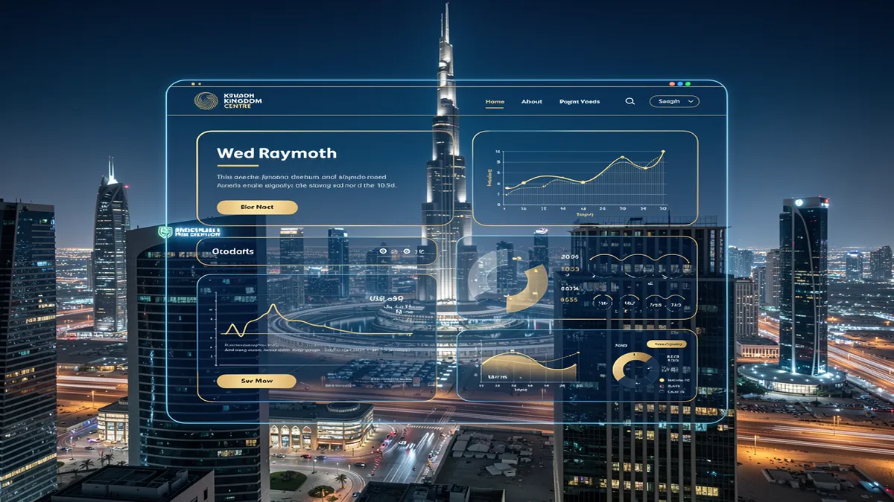
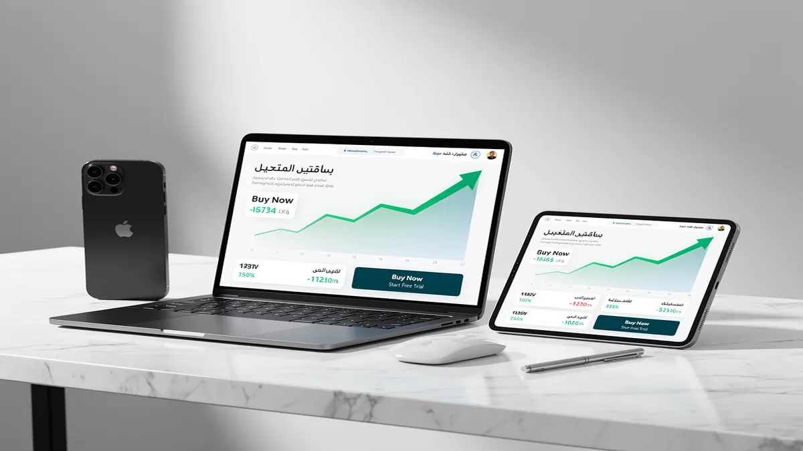
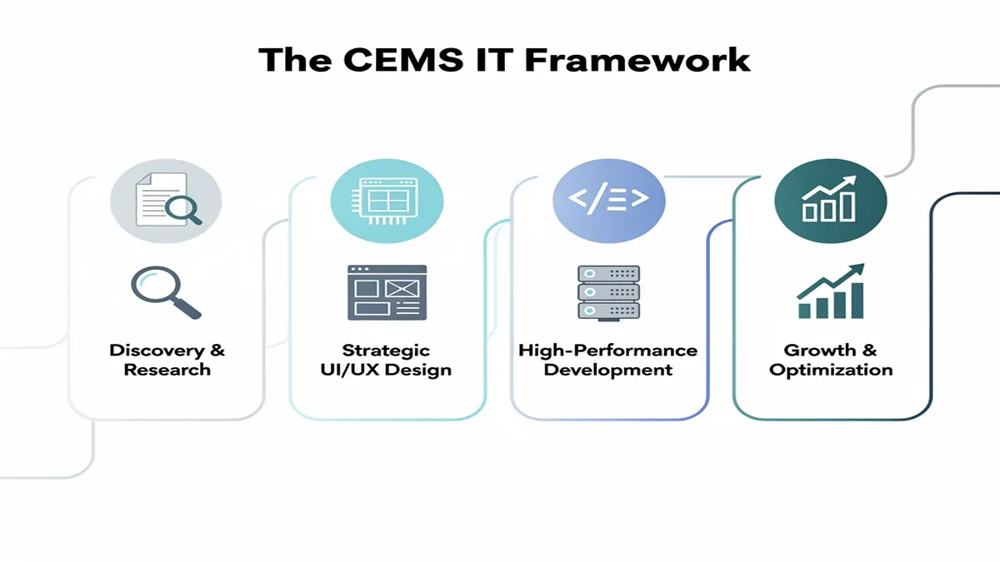
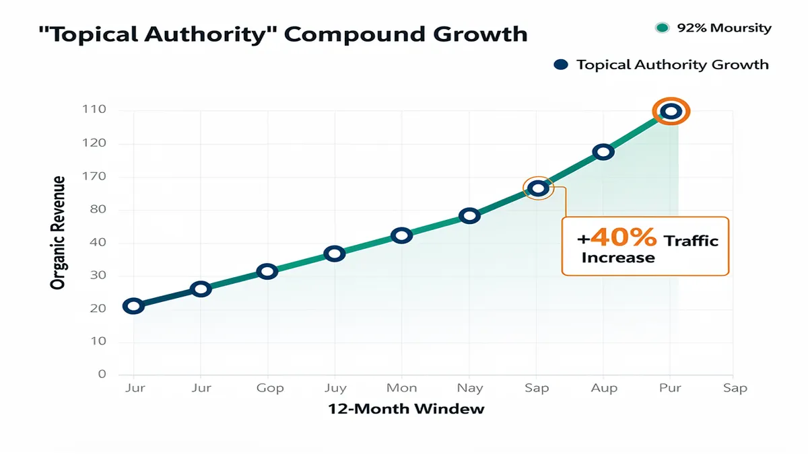
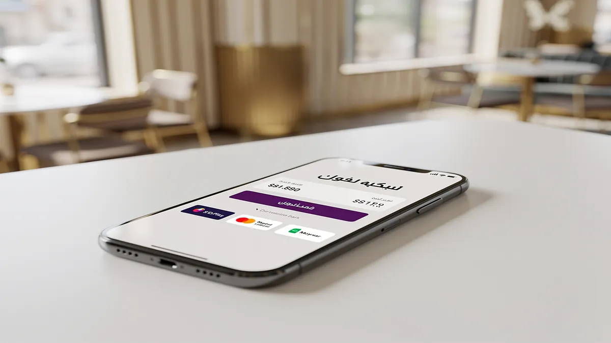
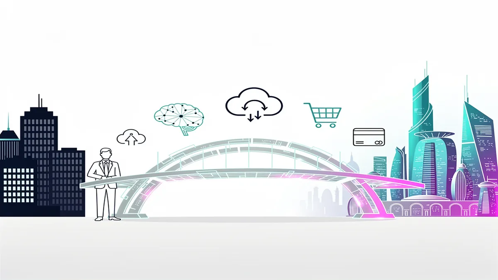

# Top Web Design Agency in Riyadh: Best Digital Solutions 2026

## Top Web Design Agency in Riyadh: Best Digital Solutions 2026

<!-- section_id: sec_01 -->

In the rapidly evolving landscape of Riyadh’s digital economy, your website is no longer just a digital brochure; it is the primary engine for revenue, brand authority, and customer trust. Partnering with a specialized **Web Design Agency** ensures your business transitions from a static online presence to a high-performance asset optimized for the competitive Saudi market. By prioritizing conversion-centric design and localized user experiences, you can capture the growing demand driven by Saudi Vision 2030.

**[Transform your digital presence today—get a custom strategy audit for your Riyadh-based business.](https://syriancoders.com/post/the-best-programming-company-in-riyadh-and-saudi-arabia)**

Modern consumers in Riyadh demand seamless, high-speed digital interactions that reflect their cultural nuances. Our approach to **Web Design Riyadh** focuses on delivering **Digital Solutions 2026** that integrate sophisticated **web development** with aggressive **SEO services** to ensure you outrank competitors. Whether you are launching a complex **e-commerce** platform or a corporate portal, we bridge the gap between technical excellence and local market expectations.

### Strategic Alignment with Saudi Vision 2030
The Kingdom’s digital transformation mandates that businesses adopt world-class standards in security and accessibility. We implement **Saudi PDPL compliance** (Personal Data Protection Law) as a foundational element of every project, ensuring your customer data is handled with the highest level of legal integrity. This proactive compliance shields your brand from regulatory risks while building deep-seated trust with your local audience.

Beyond legalities, our architecture supports the national shift toward a paperless, tech-driven economy. By utilizing **cloud migration** and **AI solutions**, we help Riyadh enterprises automate workflows and scale their operations without technical bottlenecks. Your website becomes a future-proof tool that evolves alongside the Kingdom’s ambitious infrastructure milestones, positioning you as a leader in your specific industry.

### Localized UX: Beyond Translation to Cultural Resonance
True localization requires more than just translating text; it demands a native **RTL layout** (Right-to-Left) strategy that feels natural to Arabic-speaking users. We design interfaces where the visual hierarchy, navigation flow, and call-to-action placements are optimized for the way Saudi users consume information. This attention to detail significantly reduces bounce rates and improves engagement across diverse demographic segments in the Riyadh region.

To further drive local conversions, we provide seamless **HyperPay integration**, STC Pay, and Moyasar gateways. By offering the payment methods your customers already trust, you remove friction at the most critical stage of the buyer journey. This localized transactional flow, combined with **responsive web design**, ensures your **e-commerce** store performs flawlessly on mobile devices, which account for the vast majority of web traffic in Saudi Arabia.

### Technical Superiority and Performance Optimization
In 2026, page speed is a non-negotiable ranking factor and a core component of user retention. We employ **performance optimization** techniques, such as **headless CMS** architectures and Next.js frameworks, to deliver sub-second load times. This technical edge not only satisfies Google’s Core Web Vitals but also ensures that users on varying mobile network speeds in Riyadh enjoy a crisp, uninterrupted experience.

Our **web development** team prioritizes **custom web applications** over generic templates to provide unique functionality tailored to your business logic. By avoiding bloated code and utilizing modern stacks, we ensure your site is secure, scalable, and easy to manage. You gain a high-performance platform that serves as a robust foundation for all your future digital marketing and expansion efforts.

**Maximize your ROI with a high-performance website designed for the Saudi market. Consult with our Riyadh experts now.**

### SEO-First Architecture for Dominant Visibility
Visibility in Riyadh’s crowded digital space requires an **SEO-first** methodology integrated from the very first line of code. We build **topical authority** by structuring your site’s hierarchy to align with how local users search for your services. This involves deep keyword research into Saudi-specific search intent, ensuring your brand appears at the top of SERPs for high-value transactional queries.

Our **SEO services** go beyond meta tags to include technical schema markup and bilingual content strategies. By optimizing for both Arabic and English search patterns, you capture a wider market share and establish your brand as a dual-language authority. This comprehensive approach ensures that your investment in web design translates directly into sustainable organic traffic and reduced customer acquisition costs.

### Conversion Rate Optimization (CRO) and User Impact
A beautiful website is useless if it doesn't convert visitors into leads or sales. Our focus on **conversion rate optimization** (CRO) involves rigorous A/B testing and heat-mapping to understand exactly where your users click and why they leave. We refine your messaging and UI elements to guide users toward your primary goals, whether that is a form submission, a phone call, or a direct purchase.

By analyzing local user behavior, we identify and eliminate friction points that are unique to the Saudi market. This data-driven approach ensures that every design choice is backed by evidence of what works for your specific audience in Riyadh. The result is a measurable increase in your bottom line and a website that pays for itself through improved efficiency and higher sales volumes.

### Post-Launch Security and Maintenance SLAs
The digital threat landscape is constantly evolving, making post-launch support a critical component of your digital strategy. We offer robust Service Level Agreements (SLAs) that include 24/7 security monitoring, regular backups, and proactive software updates. This ensures your site remains protected against vulnerabilities while maintaining peak performance levels long after the initial launch.

Our maintenance packages also include ongoing speed audits and SEO health checks to keep you ahead of algorithm updates. You can focus on running your business in Riyadh while we handle the technical complexities of keeping your digital storefront secure and operational. This long-term partnership approach guarantees that your digital assets continue to grow in value and effectiveness over time.

**Secure your digital future with Riyadh’s leading web experts. Contact us today to start your transformation.**

## Why Riyadh Businesses Need a Conversion-First Web Design Agency

<!-- section_id: sec_02 -->

In the hyper-competitive Riyadh market, a visually pleasing website is no longer a differentiator; it is the bare minimum. To capture market share in Saudi Arabia’s rapidly evolving digital landscape, you need a **Web Design Agency** that prioritizes conversion over aesthetics. Local consumer behavior in Riyadh is shifting toward high-speed, mobile-first interactions, meaning your platform must do more than just exist—it must actively drive revenue and user retention.

By shifting to a conversion-first architecture, you align your digital presence with the ambitious goals of **Saudi Vision 2030**. This approach ensures that every design choice, from button placement to backend logic, serves a specific business objective. Whether you are targeting B2B stakeholders in the King Abdullah Financial District or retail consumers in Olaya, your website must function as a high-performance sales tool.

### Strategic Advantages of Conversion-Centric Design

*   **Elevated User Trust via UI/UX Design**: You gain immediate credibility through intuitive interfaces that respect local navigation habits. By implementing a seamless **UI/UX Design**, you reduce cognitive load, making it easier for Saudi users to find information and complete transactions without friction.
*   **Localized Technical Excellence**: Your platform will feature native **RTL layout** support, ensuring that Arabic content flows naturally. This is not just about translation; it is about mirroring the cultural and linguistic expectations of your Riyadh-based audience to build deeper brand affinity.
*   **Seamless Transactional Flow**: You can eliminate checkout abandonment by integrating local payment powerhouses like **HyperPay integration**, STC Pay, and Moyasar. Providing familiar, secure payment options directly impacts your bottom line and reinforces consumer confidence in your digital ecosystem.
*   **Regulatory Peace of Mind**: You ensure your business remains protected by adhering strictly to **Saudi PDPL compliance**. A conversion-first agency integrates data privacy into the design phase, ensuring that personal data collection meets the latest Kingdom-wide legal standards.
*   **Future-Proof Scalability**: By utilizing a **headless CMS** and **custom web applications**, your site remains agile. You gain the ability to push content to multiple platforms—smartphones, tablets, or IoT devices—without rebuilding your core architecture every time technology shifts.

The foundation of a high-converting site lies in **performance optimization**. In Riyadh’s mobile-heavy market, a one-second delay in page load can result in a significant drop in engagement. Modern agencies utilize global standards, such as those defined by [web.dev](https://web.dev/performance-scoring/), to ensure your site hits peak "Core Web Vitals" scores for speed and stability.

Strategic **conversion rate optimization** (CRO) transforms passive visitors into active leads. This involves rigorous A/B testing, heat mapping, and behavioral analysis to identify where users drop off. When you optimize these touchpoints, you maximize the ROI of your existing traffic, ensuring that your marketing spend in the Saudi market is never wasted on a leaky bucket.

To stay ahead, you must embrace **AI solutions** that personalize the user journey in real-time. From intelligent chatbots that handle inquiries in local dialects to predictive search algorithms, AI ensures your website feels like a bespoke experience for every visitor. This level of sophistication is what separates market leaders from stagnant businesses in the Riyadh digital space.

Beyond the front end, **cloud migration** offers the stability required for high-traffic events like White Friday or national holidays. Migrating to localized cloud servers reduces latency and provides the robust infrastructure needed to support complex **web development** projects. This ensures your site remains online and responsive during your most critical sales periods.

Finally, integrating **SEO services** into the design phase establishes **topical authority** from day one. A conversion-first agency builds your site on a technical SEO foundation, ensuring that your **responsive web design** is easily crawlable by search engines. This holistic strategy guarantees that once a user finds you, the transition from "searching" to "buying" is an inevitable result of a perfectly engineered experience.

## Our Core Services: Integrating UI/UX Design with Local SEO

<!-- section_id: sec_03 -->

In the competitive landscape of Riyadh, a standard website is no longer a luxury; it is a liability if it fails to convert. Our approach as a premier Web Design Agency transforms your digital presence from a fragmented collection of pages into a high-conversion SEO engine using a sophisticated pillar-cluster architecture. By aligning every technical decision with Saudi Vision 2030’s digital transformation goals, we ensure your platform doesn't just look modern but dominates local search rankings.

Ready to dominate the Riyadh market? [Book a Free Strategy Call](https://google.com) to audit your current digital performance.

Your success in the Kingdom depends on **UI/UX Design** that respects local cultural nuances while maintaining global usability standards. We specialize in Right-to-Left (RTL) layout optimization, ensuring that Arabic-first interfaces feel natural and intuitive for Saudi users. This cultural alignment, combined with high-performance **web development**, reduces bounce rates and builds immediate trust with your target audience in the Central Region.

Beyond aesthetics, our **SEO services** are baked into the core of your site’s architecture from day one. We move beyond simple keyword stuffing to build "Topical Authority," structuring your **content and graphics** to answer the specific intent of Saudi consumers. This method ensures that Google recognizes your brand as the definitive leader in your niche, driving sustainable organic traffic without the constant need for ad spend.

### High-Performance Architecture for the Saudi Market

Speed is a critical ranking factor and a cornerstone of **performance optimization** in a mobile-first society like Saudi Arabia. We utilize a **headless CMS** and modern frameworks like Next.js to deliver lightning-fast load times, even on 4G networks in remote areas. Your users will experience instantaneous transitions, which directly correlates to a measurable lift in your **conversion rate optimization** (CRO) metrics.

Every project we undertake features **responsive web design** as a baseline, ensuring your brand looks flawless on the latest mobile devices favored by Riyadh’s tech-savvy population. Whether a user is browsing on an iPhone in a coffee shop in Olaya or a desktop in a government office, the experience remains consistent. This adaptability is essential for maintaining professional credibility and capturing leads across all touchpoints.

For businesses looking to scale, we build **custom web applications** that integrate seamlessly with the local fintech ecosystem. We provide native **HyperPay integration**, Moyasar, and STC Pay setups to ensure your checkout process is frictionless for local buyers. By removing payment hurdles, you can expect a significant increase in successful transactions and a decrease in cart abandonment.

Transform your business with a high-conversion digital engine. Get a Custom Quote Today and see how we integrate local SEO with world-class design.

### Security, Compliance, and Future-Proofing

Navigating the legal landscape is vital for any enterprise operating in the Kingdom. Our development process ensures full **Saudi PDPL compliance** (Personal Data Protection Law), protecting your user data and your brand’s reputation. We implement rigorous security protocols and **cloud migration** strategies that keep your digital assets safe from evolving cyber threats while ensuring 99.9% uptime.

We don't just build and disappear; our commitment includes robust post-launch maintenance and security SLAs. This ensures your **e-commerce** platform or corporate site remains updated against the latest vulnerabilities and continues to perform at peak efficiency. This long-term partnership approach is why leading firms in Riyadh’s Oil & Gas and Tourism sectors trust us with their digital infrastructure.

To stay ahead of the curve, we integrate **AI solutions** that personalize the user journey in real-time. From intelligent chatbots that handle Arabic dialects to predictive search features, we give your platform a competitive edge that generic templates cannot match. These smart features turn passive visitors into loyal customers by providing value at every stage of the funnel.

Our "Topic Authority" blueprint ensures that your **web development** investment yields long-term dividends. By organizing your site into logical clusters, we help search engines crawl your content more effectively, boosting the visibility of your most profitable services. This structured approach is the difference between a website that sits idle and one that actively generates revenue.

Your digital transformation starts with a single click. Start Your Project Now and leverage our expertise in the Saudi digital landscape to outpace your competition.

## The CEMS IT Framework: A 4-Step Process to Digital Dominance

<!-- section_id: sec_04 -->

In the competitive landscape of Riyadh, a standard website is no longer sufficient to capture market share. To achieve true digital dominance, your business requires a high-performance **Web Design Agency** that moves beyond aesthetics to focus on measurable conversion and structural integrity.

The CEMS IT framework is a specialized 4-step methodology designed to align your digital infrastructure with the ambitious goals of Saudi Vision 2030. By integrating advanced **web development** practices with local market intelligence, this process ensures your platform functions as a powerful lead-generation engine rather than a static digital brochure.

### Step 1: Strategic User Research and Market Localization
The foundation of any successful project begins with exhaustive **user research** to identify the specific behaviors of the Saudi consumer. In Riyadh’s fast-paced economy, users demand instant gratification and cultural relevance, making it essential to analyze search intent and local browsing habits before a single line of code is written.

Our research phase deep-dives into the nuances of the KSA market, focusing on **RTL layout** optimization and bilingual information architecture. We evaluate how your target audience interacts with competitors, identifying content gaps and technical weaknesses that you can exploit to gain an immediate competitive advantage.

By establishing a clear roadmap based on data rather than assumptions, we ensure your **web development** strategy is built to scale. This stage also addresses critical regulatory requirements, ensuring your data collection methods are fully compliant with the **Saudi PDPL** (Personal Data Protection Law) from day one.

### Step 2: Architecture, AI Solutions, and Performance Engineering
Once the strategy is set, we transition into building a robust technical core using modern frameworks like Next.js or a **headless CMS**. This architectural choice provides the agility needed to integrate **AI solutions** that personalize the user journey, such as intelligent chatbots or predictive search features that enhance engagement.

Performance is a non-negotiable factor for ranking in KSA. We implement aggressive **performance optimization** techniques, including image compression and server-side rendering, to ensure your site loads in under two seconds. This technical superiority directly impacts your **topical authority** and search engine visibility.

For businesses looking to modernize legacy systems, we manage seamless **cloud migration** to localized servers. This reduces latency for users within the Kingdom while providing the high-level security required for enterprise-grade **custom web applications** that handle sensitive corporate or customer data.

### Step 3: Usability Testing and Conversion Rate Optimization
A website’s success is measured by its ability to turn visitors into loyal customers. Through rigorous **usability testing**, we observe real users navigating your interface to identify friction points. This iterative process allows us to refine the **responsive web design** for flawless performance across all mobile devices.

We prioritize **conversion rate optimization** (CRO) by strategically placing high-value triggers and clear calls-to-action throughout the user flow. By analyzing heatmaps and click-through rates, we ensure that every design element serves a specific business objective, whether that is a lead form submission or a direct sale.

In the Saudi market, trust is built through seamless transactional experiences. We integrate local payment gateways like **HyperPay**, Moyasar, and STC Pay, ensuring that the checkout process is familiar and secure. This attention to localized functional detail significantly reduces cart abandonment and boosts overall ROI.

### Step 4: Growth-Focused SEO Services and E-commerce Scaling
The final stage of the CEMS IT framework focuses on long-term visibility and market expansion. We deploy comprehensive **SEO services** that go beyond basic keywords to build a sustainable organic traffic pipeline. This includes technical SEO audits and the creation of high-authority, bilingual content that resonates with Google’s E-E-A-T principles.

For retail-focused brands, our **e-commerce** strategies are designed to manage high-volume traffic during peak seasons like Ramadan or Black Friday. We provide post-launch security SLAs and maintenance packages to ensure your platform remains shielded against vulnerabilities while maintaining peak operational speed.

By following this 4-step process, your business achieves more than just a new website; you gain a scalable digital asset. This framework ensures your brand is positioned as a leader in Riyadh’s digital economy, fully equipped to meet the technical and cultural demands of a global audience. For more information on maintaining high-performance standards, you can refer to the official web.dev documentation by Google.

## Proven Results: Why We Are the Preferred Digital Marketing Agency in Saudi Arabia

<!-- section_id: sec_05 -->

In the rapidly evolving digital landscape of Riyadh, choosing a premier Web Design Agency is no longer about aesthetics; it is about engineering a high-performance engine for your business growth. We transform your digital presence into a measurable asset by aligning every pixel with the ambitious goals of Saudi Vision 2030, ensuring your brand leads rather than follows.

Your success in the Kingdom depends on a Digital Marketing Agency Saudi Arabia that understands the nuances of local consumer behavior. We bridge the gap between global technical standards and regional cultural expectations, delivering user experiences that resonate deeply with Saudi audiences while maintaining world-class performance optimization and security.

To dominate the local search results, we establish deep topical authority through ROI-driven content that speaks directly to your customers' pain points. By integrating advanced SEO services with high-speed web development, we ensure your platform captures high-intent traffic and converts visitors into loyal brand advocates through seamless, intuitive navigation.

Modern Saudi enterprises require more than just a website; they need custom web applications that solve complex operational challenges. Our team specializes in building scalable architecture using a headless CMS, allowing you to manage content across multiple platforms with ease while benefiting from the lightning-fast load times of a decoupled front-end.

In a mobile-first market like Riyadh, responsive web design is a baseline requirement, not a luxury. We go further by implementing conversion rate optimization (CRO) strategies that analyze heatmaps and user journeys, ensuring your mobile interface minimizes friction and maximizes the likelihood of a completed transaction or lead submission.

Security and data integrity are paramount under the new Saudi PDPL compliance framework. Our development process integrates rigorous data protection protocols from the ground up, ensuring your customer information is handled with the highest level of transparency and legal adherence, shielding your business from reputational and regulatory risks.

For the growing retail sector, we provide robust e-commerce solutions that feel native to the local market. This includes flawless RTL layout (Right-to-Left) precision and native HyperPay integration, Moyasar, or STC Pay, ensuring that your checkout process is familiar, trusted, and optimized for the highest possible success rates.

We leverage cutting-edge AI solutions to automate customer interactions and provide predictive analytics for your marketing spend. This data-backed approach allows you to forecast demand with precision, ensuring your digital strategy evolves in real-time based on actual user data rather than outdated market assumptions or guesswork.

Transitioning to the cloud is a critical step for any scaling Saudi business. Our cloud migration experts ensure your digital infrastructure is hosted on secure, high-availability servers that offer low-latency performance for users within the GCC, significantly improving both your Google PageSpeed scores and your overall user retention.

Technical superiority is the foundation of our work, utilizing modern stacks like Next.js and Laravel to build platforms that are as secure as they are fast. By focusing on clean code and API connectivity, we ensure your website can integrate seamlessly with your existing ERP or CRM systems, creating a unified business ecosystem.

Beyond the launch, we provide comprehensive maintenance and security SLAs that give you peace of mind. Your digital assets remain protected against emerging threats through constant monitoring and proactive updates, ensuring that your "always-on" storefront never experiences downtime during critical sales periods or high-traffic national events.

We understand that the cost of web design in Saudi Arabia must be justified by a clear return on investment. That is why our strategies are built on transparent KPIs, focusing on reducing your cost-per-acquisition while increasing the lifetime value of every customer who engages with your brand through our digital solutions.

By choosing a partner that prioritizes topical authority and technical excellence, you position your business at the forefront of the Riyadh digital economy. We don't just build websites; we create high-converting digital ecosystems that empower you to scale smarter, grow faster, and outperform your competitors in every metric.

For those looking to understand the technical benchmarks of modern web performance, Google Developers provides the industry-standard documentation on Core Web Vitals. We use these precise metrics to audit every project, ensuring your site meets the highest global standards for speed, visual stability, and interactivity from day one.

Your brand deserves a digital home that reflects its prestige and ambition. From initial strategy to post-launch scaling, we provide the localized expertise and technical sophistication required to turn your digital vision into a dominant market reality in Saudi Arabia’s competitive corporate landscape.

## Strategic Advantages: Choosing the Right Partner in Riyadh

<!-- section_id: sec_06 -->

In the high-velocity Riyadh market, partnering with a premier **Web Design Agency** is no longer about aesthetic appeal; it is about engineering a digital asset that aligns with the rapid economic transformation of Saudi Vision 2030. Your business requires a platform that understands local consumer psychology, where right-to-left (RTL) layout precision and cultural nuances dictate conversion rates. By choosing a partner rooted in the capital’s ecosystem, you ensure your interface resonates with a population that demands mobile-first, high-speed, and bilingual excellence.

The transition from legacy systems to modern architectures requires a focus on **cloud migration** to ensure your data remains accessible, scalable, and secure within the Kingdom. Localized hosting solutions reduce latency for your Riyadh-based users, providing the split-second load times necessary to maintain engagement. This technical foundation allows your brand to handle traffic surges during peak seasons like Ramadan or Riyadh Season without compromising performance or user trust.

Integrating advanced **AI solutions** into your web presence transforms a static site into a proactive sales tool. From intelligent chatbots that handle inquiries in the Saudi dialect to personalized recommendation engines, these technologies reduce operational overhead while increasing customer satisfaction. You gain the ability to predict user behavior and automate complex workflows, allowing your team to focus on high-level strategy rather than repetitive manual tasks.

For businesses looking to dominate the digital retail space, robust **e-commerce** development is the cornerstone of sustainable growth. Your platform must go beyond a simple product grid, incorporating seamless **HyperPay integration** and Moyasar gateways to facilitate frictionless transactions. A strategic partner ensures your store is optimized for the local market’s preference for Mada and STC Pay, directly impacting your bottom line through higher checkout completion rates.

Success in the Saudi market also demands strict adherence to **Saudi PDPL compliance**, ensuring your customers' personal data is handled with the highest level of legal integrity. A sophisticated agency integrates these privacy frameworks into the core architecture, protecting your brand from regional regulatory risks. This commitment to security builds long-term authority and trust with a sophisticated audience that values data sovereignty.

To outpace competitors in organic search, your platform requires comprehensive **SEO services** that prioritize **topical authority** and localized search intent. By building a site structure that Google recognizes as an expert source in your specific industry, you capture high-intent traffic before your rivals do. This involves more than just keywords; it requires a technical SEO foundation that supports **headless CMS** deployments for maximum flexibility and speed.

Your digital presence must be built on **responsive web design** that prioritizes the mobile experience, as the majority of Saudi users interact with brands via smartphones. A "mobile-incidental" approach is no longer sufficient; you need a "mobile-perfect" execution where navigation is intuitive and touch-targets are optimized for one-handed use. This focus on usability ensures that whether a client is in a skyscraper in King Abdullah Financial District or commuting through Olaya, your brand remains accessible.

Investing in **custom web applications** allows you to solve unique business challenges that off-the-shelf software cannot address. Whether you need a bespoke booking system for a tourism venture or a complex portal for industrial logistics, custom builds offer the scalability required for long-term expansion. These applications are designed to grow with your enterprise, preventing the "technical debt" that often occurs with rigid, pre-made templates.

True **performance optimization** involves more than just fast loading; it is about **conversion rate optimization** (CRO) that turns visitors into loyal advocates. By analyzing heatmaps and user journey data specific to the Riyadh demographic, a strategic partner refines your calls-to-action and layout. This data-driven approach ensures every riyal spent on marketing yields a measurable return through improved lead generation and sales.

Modern web architecture often benefits from a **headless CMS** approach, decoupling the frontend presentation from the backend logic. This allows you to push content seamlessly across websites, mobile apps, and even IoT devices from a single source of truth. It provides the ultimate future-proofing for your brand, ensuring that as new technologies emerge in the Saudi tech landscape, your digital core remains agile and ready to adapt.

Finally, a strategic partnership in Riyadh provides the security of post-launch maintenance and rigorous SLAs. You gain a dedicated team that monitors for vulnerabilities and ensures your site remains compatible with the latest browser updates and security patches. This ongoing support prevents downtime and ensures your digital gateway remains a 24/7 revenue generator, fully aligned with the ambitious growth targets of the Saudi market.

## How much does a professional web design cost in Riyadh?

<!-- section_id: sec_07 -->

Investing in a professional web design agency in Riyadh is no longer a luxury; it is a strategic requirement for capturing market share in Saudi Arabia’s rapidly evolving digital economy. While a basic landing page might start around SAR 5,000, high-performance corporate platforms and custom web applications typically range from SAR 25,000 to over SAR 150,000. These figures reflect the technical depth required to compete in a landscape driven by Saudi Vision 2030, where user expectations for speed and local relevance are at an all-time high.

Pricing transparency starts with understanding that you are paying for measurable business outcomes rather than just aesthetic layouts. A professional build ensures your site is fully optimized for RTL layout (Right-to-Left) to serve the local Arabic-speaking audience while maintaining a seamless English version for international stakeholders. This bilingual architecture is critical for establishing topical authority and ensuring your brand resonates across the diverse demographic profile of the Riyadh metropolitan area.

For businesses scaling their digital operations, web design cost is heavily influenced by the integration of advanced e-commerce features. Implementing secure local payment gateways like HyperPay, Moyasar, or STC Pay requires specialized development to ensure transaction stability and trust. Furthermore, your platform must adhere to Saudi PDPL compliance (Personal Data Protection Law), which necessitates robust encryption and data handling protocols that cheaper, template-based solutions often overlook.

If you are looking to dominate search rankings, your investment must include comprehensive SEO services integrated directly into the code. Modern performance optimization techniques, such as utilizing a headless CMS or Next.js architecture, significantly reduce latency and improve Core Web Vitals. In Riyadh’s competitive market, a one-second delay in mobile loading times can lead to a 20% drop in conversion rate optimization (CRO), making technical superiority a primary driver of ROI.

Enterprise-level projects often involve complex AI solutions and cloud migration to ensure the infrastructure can handle massive traffic spikes during national events or seasonal sales. Custom web applications designed for the Saudi market often require integration with local ERP systems or CRMs, moving beyond simple "brochureware" into functional business tools. These high-end builds focus on long-term scalability, ensuring your digital asset grows alongside your physical operations without requiring a total rebuild every two years.

Choosing a partner that offers clear post-launch maintenance and security SLAs (Service Level Agreements) protects your initial capital outlay. Professional agencies in Riyadh provide ongoing support to defend against cyber threats and ensure your software remains compatible with evolving browser standards. This proactive approach to web development prevents costly downtime and ensures that your site remains a high-converting lead generation engine for years to come.

Ultimately, the value of your website is defined by its ability to transform visitors into loyal customers. By prioritizing responsive web design that functions flawlessly on the high-end mobile devices prevalent in Saudi Arabia, you secure a competitive edge. Investing in a premium digital solution means you are buying a 24/7 sales representative that reflects the prestige and ambition of a modern Riyadh-based enterprise.

## How long does the web development process take?

<!-- section_id: sec_08 -->

Your business transformation in the Riyadh market depends on a high-performance digital presence that aligns with Saudi Vision 2030. When you partner with a premier web design agency, the development process is treated as a strategic investment rather than a simple coding task. Typically, a professional project timeline ranges from 8 to 16 weeks, ensuring every technical layer—from RTL layout optimization to secure HyperPay integration—is executed to perfection.

The initial discovery phase sets the foundation for your ROI by aligning your digital architecture with local consumer behavior. Over the first two weeks, experts conduct a deep dive into your competitive landscape in Saudi Arabia, defining a sitemap that prioritizes conversion rate optimization. This stage eliminates "scope creep" by documenting every requirement, from Saudi PDPL compliance for data privacy to the specific API needs of your custom web applications.

Design and prototyping take center stage during weeks three to six, where your brand identity is translated into a high-fidelity visual experience. You gain a competitive edge through responsive web design that prioritizes mobile-first users in Riyadh, featuring seamless RTL layout transitions for Arabic-speaking audiences. This phase focuses on UI/UX excellence, ensuring your interface isn't just beautiful but engineered to reduce bounce rates and drive measurable user engagement.

The core web development and coding phase typically spans weeks seven to twelve, turning approved designs into a functional, lightning-fast reality. During this window, developers implement advanced AI solutions for personalized user journeys and headless CMS architectures for maximum content flexibility. If your business requires cloud migration or complex e-commerce functionality, this timeline ensures your back-end remains scalable and secure against modern cyber threats.

Integration and localization are critical milestones that distinguish a premium Saudi build from a generic template. In weeks ten through fourteen, the focus shifts to performance optimization and connecting essential local services like STC Pay or Moyasar. This ensures your transactional flow is frictionless for local customers while maintaining strict adherence to Saudi PDPL regulations, building the trust necessary for high-value digital conversions.

The final stretch involves rigorous quality assurance and SEO services to ensure your launch is a market-dominating event. Experts perform cross-browser testing and speed audits to guarantee your site meets the highest Core Web Vitals standards. By the time you reach the 16-week mark, you possess a robust, SEO-ready platform that is fully optimized for topical authority and ready to capture market share in the Kingdom’s rapidly evolving digital economy.

Strategic planning for post-launch growth is what separates market leaders from the rest. Beyond the initial project timeline, elite agencies provide ongoing security SLAs and maintenance to ensure your site evolves with technical trends like wordpress.org updates or new search algorithms. This long-term approach protects your initial investment, ensuring your custom web applications continue to deliver peak performance and a high return on ad spend (ROAS) year after year.

## Do you offer post-launch maintenance and SEO support in KSA?

<!-- section_id: sec_09 -->

Securing a partnership with a premier web design agency in Riyadh means your digital presence remains high-performing long after the initial launch. In the fast-paced Saudi market, where consumer behavior shifts rapidly, static websites quickly lose their competitive edge. You gain access to a continuous evolution cycle that aligns your platform with the latest search engine requirements and technical standards.

Your business transformation begins with a proactive maintenance and support framework designed to prevent downtime before it impacts your revenue. We move beyond basic troubleshooting to provide comprehensive performance optimization, ensuring your site handles high traffic volumes common during regional shopping peaks. This approach safeguards your investment and maintains the seamless user experience your Riyadh-based customers expect.

A robust SEO strategy is integrated into every support tier to ensure your brand maintains topical authority in an increasingly crowded digital landscape. We focus on continuous SEO services that adapt to Google’s evolving algorithms, specifically targeting local search intent within the Kingdom. By refining your content and technical architecture, we keep your business visible to high-intent users searching for your specific solutions.

Modern web development in KSA requires a deep understanding of Saudi Vision 2030 digital transformation goals and local regulatory frameworks. Our support packages include rigorous Saudi PDPL compliance monitoring to protect user data and ensure your brand adheres to national privacy laws. We manage the complexities of data sovereignty and local hosting requirements so you can focus on core business operations without legal friction.

To dominate the local market, your platform must master the nuances of RTL layout and bilingual functionality. We provide ongoing refinements for Arabic and English interfaces, ensuring that right-to-left transitions remain flawless as you add new features. This cultural precision extends to local payment UX, where we optimize HyperPay integration and other regional gateways to maximize your checkout success rates.

For businesses scaling rapidly, we offer seamless cloud migration and the implementation of headless CMS architectures to enhance flexibility. These AI solutions allow you to distribute content across multiple channels while maintaining a single source of truth, reducing administrative overhead. This technical agility ensures your digital infrastructure grows alongside your expanding market share in the Middle East.

Conversion rate optimization (CRO) is a central pillar of our post-launch support, turning existing traffic into measurable growth. We analyze user heatmaps and session recordings to identify friction points that prevent Saudis from completing transactions or inquiries. By implementing iterative UI/UX improvements, we consistently lower your acquisition costs and increase the lifetime value of every visitor.

E-commerce entities benefit from specialized support that covers inventory synchronization, secure API management, and real-time performance tracking. We ensure your online store remains resilient during flash sales and marketing campaigns, preventing the technical bottlenecks that often lead to cart abandonment. Our team monitors server health around the clock, providing the stability required for high-volume transactional environments.

Effective maintenance also involves staying ahead of global technology shifts, such as the transition to responsive web design 2.0 and advanced mobile-first indexing. We prioritize mobile performance because the majority of Saudi users access services via smartphones, requiring sub-second load times. Our optimization protocols include image compression, script minification, and the deployment of local CDNs for ultra-fast delivery.

Custom web applications require a higher level of technical scrutiny, which is why our SLAs include dedicated security patching and version control. We protect your proprietary code from vulnerabilities while ensuring third-party integrations remain functional after core updates. This proactive security posture is essential for maintaining trust with corporate partners and government entities across Riyadh and beyond.

Our commitment to your growth is reflected in our transparent reporting, which links technical metrics to your actual business outcomes. You receive detailed insights into how our maintenance efforts contribute to faster page speeds, higher search rankings, and increased lead generation. This data-driven approach ensures that every riyal spent on support generates a clear return on investment through improved digital performance.

By choosing a partner that prioritizes long-term stability, you eliminate the risk of technical debt that often plagues unmaintained websites. We ensure your platform remains a modern, high-converting asset that reflects the prestige of your brand in the Saudi market. From routine backups to complex AI-driven enhancements, our support ecosystem is built to keep you at the forefront of Riyadh’s digital economy.

## Can you integrate local Saudi payment gateways like STC Pay and Moyasar?

<!-- section_id: sec_10 -->

Integrating local Saudi payment gateways is not just a technical requirement; it is a strategic move to capture the trust of a mobile-first consumer base in Riyadh. As a premier web design agency, we prioritize seamless financial connectivity to ensure your e-commerce platform aligns with the rapid evolution of the Kingdom’s fintech landscape. By embedding native solutions like STC Pay and Moyasar, you eliminate friction at checkout and cater to the specific spending habits of Saudi users.

Your customers in Riyadh expect a checkout experience that feels local and secure. We specialize in custom web applications that bridge the gap between global standards and regional preferences, ensuring your site supports Mada, Apple Pay, and local digital wallets. This localized approach is essential for conversion rate optimization, as it validates your brand’s presence within the Saudi market and reduces cart abandonment caused by unfamiliar payment interfaces.

Beyond simple transactions, our web development process focuses on Saudi PDPL compliance to protect sensitive financial data. We implement robust encryption and secure API protocols for HyperPay integration, ensuring every riyal processed on your platform is handled with bank-grade security. This commitment to data residency and privacy is a cornerstone of Saudi Vision 2030, positioning your business as a trustworthy leader in the digital economy.

Performance optimization is critical when dealing with real-time payment processing. We utilize headless CMS architectures and cloud migration strategies to ensure that your payment triggers are instantaneous, even during high-traffic events like White Friday. By reducing latency between the user’s click and the gateway’s response, you provide a professional experience that encourages repeat business and strengthens your topical authority in the retail sector.

A truly effective digital storefront requires more than just a "Pay Now" button; it needs a responsive web design that handles RTL layout complexities perfectly. We ensure that payment modals, error messages, and receipts are intuitively placed for Arabic speakers, maintaining a fluid user journey. This attention to detail in UI/UX design ensures that your fintech integrations feel like a natural extension of your brand rather than a third-party afterthought.

Our technical team also provides AI solutions for fraud detection and automated reconciliation, giving you a comprehensive view of your cash flow. Whether you are migrating from a legacy system or building a new enterprise portal, we handle the heavy lifting of API documentation and merchant account setup. We also offer SEO services that highlight your secure payment options, as Google rewards sites that demonstrate high levels of E-E-A-T through secure, compliant transaction environments.

To maintain long-term stability, we offer dedicated post-launch support and security SLAs. The Saudi market moves fast, and payment regulations can shift; our proactive maintenance ensures your gateways remain functional and compliant with SAMA (Saudi Central Bank) standards. By partnering with an agency that understands the intersection of high-end design and local financial infrastructure, you secure a scalable platform ready for the future of Saudi commerce.

## Future-Proof Your Brand: Conclusion & Next Steps

<!-- section_id: sec_11 -->

In the fast-evolving digital landscape of Riyadh, your choice of a **Web Design Agency** determines whether your brand becomes a market leader or remains a background player. As Saudi Arabia accelerates toward the goals of Saudi Vision 2030, businesses in the capital are transitioning from basic websites to high-performance **Digital Solutions** that integrate AI and cloud architecture.

To dominate the local market, your platform must go beyond aesthetics to embrace a "mobile-first, Saudi-first" philosophy. This means implementing a flawless **RTL layout** (Right-to-Left) for Arabic users while maintaining a high-speed English mirrors for international investors. By prioritizing **responsive web design**, you ensure a seamless experience across the Kingdom’s high smartphone penetration areas.

Achieving true **topical authority** requires a technical foundation built on modern frameworks. Whether you opt for a **headless CMS** like Strapi or a robust **web development** cycle using Next.js, the goal is always speed. Performance optimization is no longer a luxury; it is a core requirement for ranking on Google’s first page in the competitive Riyadh search landscape.

Security and legal compliance are the non-negotiable pillars of a future-proof brand. Any modern **Web Design Agency** must ensure your platform adheres strictly to the **Saudi PDPL compliance** (Personal Data Protection Law). Protecting user data is not just about avoiding heavy fines; it is about building the "Trust" component of EEAT that Saudi consumers demand before transacting.

For businesses looking to scale, **e-commerce** success in Riyadh depends on localizing the financial journey. Integrating **HyperPay**, Moyasar, or STC Pay ensures that your checkout process is frictionless for local buyers. When combined with **conversion rate optimization** (CRO) strategies, these integrations transform passive visitors into loyal, recurring customers.

Transitioning to the cloud is the final step in ensuring long-term scalability. **Cloud migration** allows your business to handle massive traffic spikes during national events or seasonal sales without downtime. By leveraging **custom web applications**, you can automate internal workflows and provide unique digital tools that your competitors simply cannot match with off-the-shelf templates.

The integration of **AI solutions** is currently redefining how Riyadh-based brands interact with their audience. From predictive search behaviors to automated Arabic chatbots, AI enhances the user journey by providing instant value. This technological edge, supported by professional **SEO services**, ensures your brand remains visible and relevant as search algorithms become more sophisticated.

Success in the Saudi market requires a partner that understands both global tech trends and local cultural nuances. For those ready to lead the digital transformation in the region, visiting the CEMS IT Official Website provides a roadmap for integrating these advanced technologies. Your digital presence should be an asset that grows in value, not a static expense.

Ultimately, your website is your most powerful sales tool in the Middle East. By focusing on a "Security-First" and "SEO-First" methodology, you create a resilient brand capable of weathering market shifts. Now is the time to audit your current performance and implement the high-end architectures that define the next generation of Saudi digital excellence.