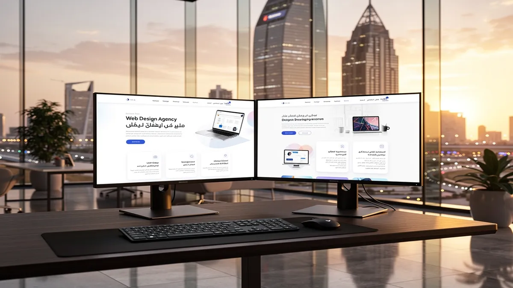
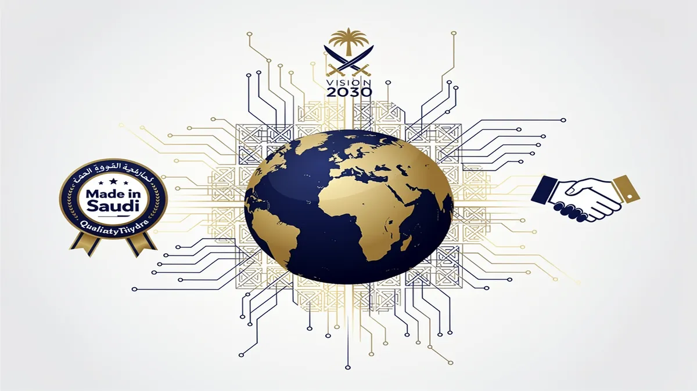
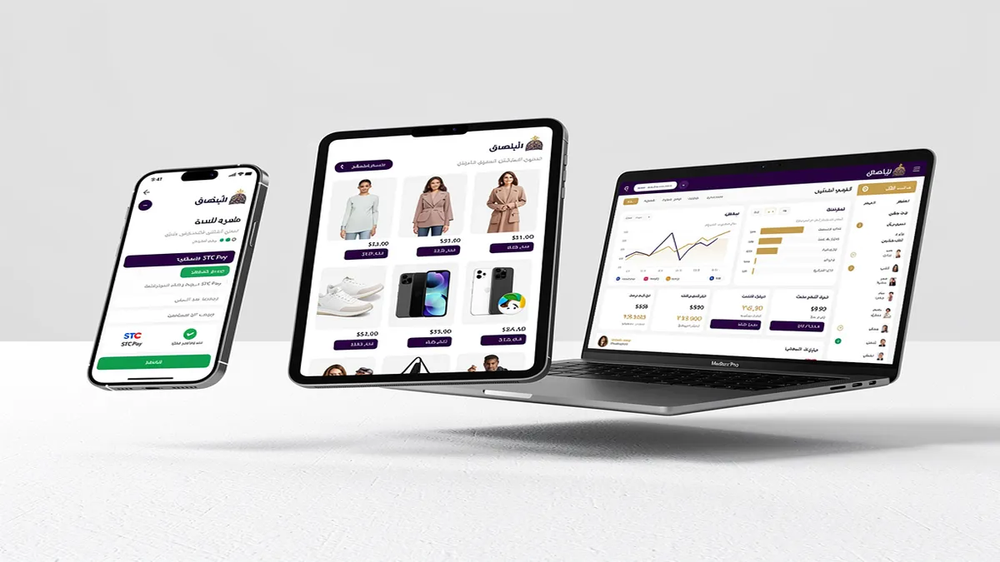
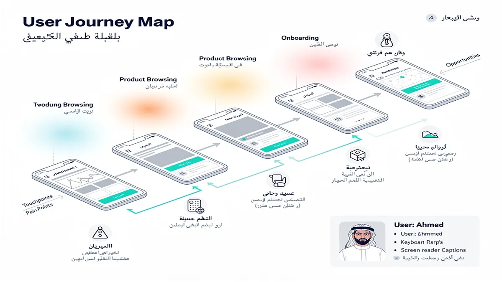
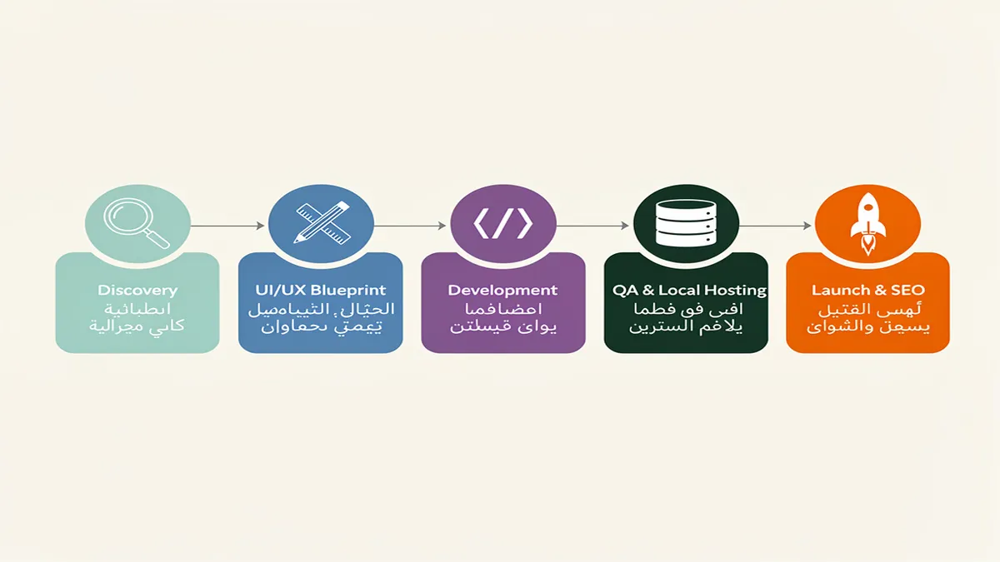
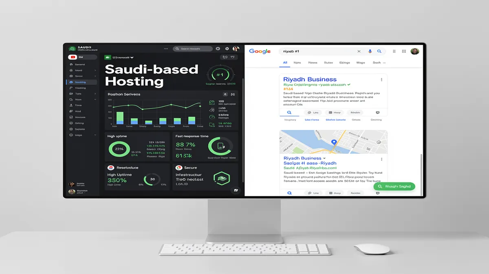

# Best Web Design Agency in Riyadh: Top Rated Solutions 2026

## Best Web Design Agency in Riyadh: Top Rated Solutions 2026

<!-- section_id: sec_01 -->

In the rapidly evolving digital landscape of Riyadh, your business visibility depends entirely on the caliber of your online presence. Partnering with a premier **Web Design Agency** ensures your brand transitions from a simple URL to a high-converting digital powerhouse that dominates the Saudi market. Elevate your digital strategy today by visiting the [CEMS IT Official Website](https://cems-it.com/) to secure a future-proof platform tailored for Riyadh’s competitive economy.

Success in the Kingdom’s capital requires more than just aesthetic appeal; it demands a fusion of cultural alignment and technical precision. **Web Design Riyadh** experts understand that local users expect seamless, high-speed mobile experiences that reflect the prestige of their brand. By integrating local hosting and CITC compliance, professional developers ensure your site remains both accessible and legally sound within the Saudi regulatory framework.

Your growth strategy must align with Saudi Vision 2030 digital goals to capture the massive influx of investment currently flooding the region. **Professional website developers in Riyadh** specialize in creating scalable architectures that handle high traffic volumes during major events like Riyadh Season. This local expertise guarantees that your digital infrastructure supports long-term expansion rather than just temporary visibility.

Building a high-performing site is only the first step toward market leadership in the Middle East. A top-tier **website design company in Riyadh** integrates advanced UX/UI design to reduce bounce rates and increase user dwell time. When your interface speaks the language of your audience through refined Arabic typography, you establish immediate trust and authority.

To maximize your return on investment, your platform must function as a lead-generation engine. A leading **digital marketing agency in Riyadh** ensures your design facilitates easy navigation and clear calls to action that convert visitors into loyal customers. This synergy between design and marketing is what separates market leaders from stagnant businesses.

Dominating search engine results pages requires specialized **SEO services Riyadh** that target high-intent local keywords. By optimizing your site’s technical structure and content for both English and Arabic queries, you capture a wider demographic and outpace competitors. Search visibility is the most sustainable way to drive organic growth without relying solely on paid advertising.

Modern Saudi consumers demand frictionless transaction capabilities within every e-commerce platform. Your **web development agency Riyadh** must prioritize Mada payment integration and STC Pay gateways to cater to local financial preferences. These secure, localized payment solutions are essential for building consumer confidence and streamlining the checkout process.

Mobile accessibility is no longer optional in a city where smartphone penetration is among the highest globally. **Mobile app development Riyadh** focuses on creating responsive web designs that adapt perfectly to every screen size and operating system. Whether your customers are browsing from a high-end smartphone or a tablet, their experience should remain consistent and professional.

For businesses selling products online, **e-commerce development Riyadh** provides the backbone for scalable retail operations. Integrating inventory management systems with a localized front-end ensures your operations run smoothly behind the scenes while customers enjoy a premium shopping experience. This technical depth is critical for maintaining a competitive edge in the burgeoning Saudi e-retail sector.

Your brand identity is the most valuable asset you own in a crowded marketplace. A dedicated **branding agency Riyadh** works alongside designers to ensure your logo, color palette, and messaging resonate with local cultural values. This holistic approach to identity ensures your business stands out as a "Made in Saudi" success story.

High-performance websites require a sophisticated technology stack to ensure security and speed. Utilizing modern frameworks like Next.js or optimized PHP environments allows for faster page loads, which is a key ranking factor for Google. According to [Google’s Web Vitals](https://web.dev/vitals/), loading speed directly impacts user retention and conversion rates.

User experience is the silent ambassador of your brand, dictating how customers feel about your services. **UX UI design Riyadh** focuses on the psychology of the Saudi user, ensuring that navigation patterns are intuitive and culturally relevant. By prioritizing RTL (Right-to-Left) design optimization, you create a natural flow for Arabic-speaking audiences.

Protecting your data and your customers’ privacy is a non-negotiable aspect of modern web development. Implementing SSL certificates, firewalls, and regular security audits prevents breaches that could damage your reputation. A reliable agency provides ongoing maintenance to ensure your software remains updated against evolving cyber threats.

The digital transformation of Riyadh is moving at an unprecedented pace, and your business must keep up. From medical and real-estate sub-pages to complex FinTech integrations, specialized solutions cater to the unique demands of your specific industry. Custom-built features allow you to solve specific business problems that off-the-shelf templates simply cannot address.

Investing in a premium digital presence is the most effective way to future-proof your business in the Saudi capital. By choosing a partner that offers comprehensive digital solutions, you ensure every aspect of your online footprint is optimized for success. Take the first step toward market dominance by visiting the CEMS IT Official Website and requesting a comprehensive audit of your current digital assets.

## Why Riyadh Businesses Trust Our Web Design Approach

<!-- section_id: sec_02 -->

In the fast-paced Riyadh market, your digital presence determines whether a customer chooses you or a competitor within seconds. Partnering with a specialized **Web Design Agency** ensures your business doesn't just exist online but dominates its niche through high-performance architecture and cultural precision.

Riyadh businesses face unique challenges, from navigating the rapid digital transformation of Saudi Vision 2030 to meeting the high expectations of a mobile-first population. We solve these hurdles by blending global technical standards with deep local insights to create websites that convert visitors into loyal brand advocates.

### Strategic Alignment with Saudi Vision 2030
Your growth is directly tied to the Kingdom's digital evolution, making it essential to work with a **website design company in Riyadh** that understands local regulatory frameworks. We ensure every project adheres to CITC compliance and National Cybersecurity Authority (NCA) guidelines to protect your data and reputation.

By aligning your digital infrastructure with national goals, you position your brand as a forward-thinking leader in the Saudi market. This strategic approach transforms your website from a simple URL into a powerful asset that supports long-term commercial scalability.

### Localized UX/UI for the Saudi Audience
Successful engagement in the Central Province requires more than just translating text; it demands expert **UX UI design Riyadh** services that prioritize Right-to-Left (RTL) layout logic. We optimize every interface for Arabic typography, ensuring that your messaging feels natural and authoritative to local users.

Our design philosophy focuses on "cultural usability," where visual cues and navigation patterns resonate with Saudi social norms. This attention to detail reduces bounce rates and fosters a sense of trust that generic, Western-centric templates simply cannot achieve.

### High-Performance E-commerce and Payment Integration
Scaling a retail brand requires robust **e-commerce development Riyadh** solutions that are fully integrated with the local financial ecosystem. We implement seamless gateways for Mada, STC Pay, and Apple Pay, ensuring your customers enjoy a frictionless checkout experience.

Beyond payments, your platform must handle the massive traffic spikes typical of local events like Riyadh Season or Ramadan sales. Our **web development agency Riyadh** team builds high-availability systems that remain fast and stable under heavy loads, securing your revenue during peak periods.

### Mobile-First Engineering for a Connected Capital
With Saudi Arabia boasting one of the highest smartphone penetration rates globally, **mobile app development Riyadh** and responsive web design are non-negotiable for your success. We utilize a mobile-first engineering approach, ensuring your site loads in under two seconds on 5G and 4G networks across the city.

A **responsive web design Riyadh** strategy ensures your brand looks flawless on everything from high-end iPhones to tablets used in corporate boardrooms. This ubiquity expands your reach and ensures you never lose a lead due to poor cross-device functionality.

### Data-Driven Growth with SEO and Marketing
Visibility in local search results is the lifeblood of modern business, which is why our **SEO services Riyadh** are baked into the core of your website’s code. We structure your site to rank for high-intent keywords, ensuring that when customers search for your services in the capital, your brand appears first.

As a comprehensive **digital marketing agency in Riyadh**, we bridge the gap between a beautiful design and measurable ROI. By integrating advanced tracking and analytics, you gain total transparency into how your website contributes to your bottom line and customer acquisition costs.

### Holistic Branding and Corporate Identity
Your website is the digital headquarters of your brand, necessitating a cohesive **branding agency Riyadh** approach to visual storytelling. We synchronize your digital presence with your physical corporate identity, creating a unified experience that builds instant credibility with stakeholders.

Professional **website design company in Riyadh** services include the creation of custom iconography and color palettes that reflect the prestige of your organization. This visual excellence ensures that your business stands out in a crowded marketplace, commanding higher price points and better market share.

### Technical Excellence with CEMS IT Principles
Modern web architecture requires more than just "pretty" pages; it demands the technical rigor provided by **CEMS IT** standards in systems integration. We specialize in connecting your website to existing ERP, CRM, and inventory management systems to streamline your internal operations.

Our **professional website developers in Riyadh** utilize modern stacks like Next.js and Headless CMS to provide unmatched security and speed. This technical edge prevents common vulnerabilities while giving you the flexibility to update content without needing a developer for every minor change.

### Reliability Through Local Hosting and Support
Hosting your data on **local hosting Saudi Arabia** servers significantly improves latency for your Riyadh-based users while satisfying data residency requirements. This local infrastructure ensures your site remains lightning-fast for the people who matter most—your local customers.

Post-launch, our **web development agency Riyadh** provides 24/7 technical support and proactive maintenance to keep your platform secure. You can focus on running your business while we handle the security patches, backups, and performance optimizations required for a world-class digital presence.

### Converting Traffic into Revenue
The ultimate goal of our approach is to turn your digital platform into a high-converting sales engine. We employ persuasive copywriting and strategic Call-to-Action (CTA) placements that guide users through a logical journey from curiosity to transaction.

Whether you are a boutique firm or a large enterprise, our tailored solutions ensure your website reflects the ambition of the Saudi capital. By choosing a partner that understands the nuances of the Riyadh market, you are investing in a digital future that is both profitable and sustainable.

## Comprehensive Digital Solutions for the Saudi Market

<!-- section_id: sec_03 -->

You can transform your digital presence into a high-performing asset by partnering with a **Web Design Agency** that understands the unique cultural and technical nuances of the Riyadh market. In a city driven by the ambitious goals of Saudi Vision 2030, your website must serve as more than a digital brochure; it must be a localized engine for growth.

We deliver tailored solutions that align with CITC compliance and local hosting requirements, ensuring your platform remains secure and accessible. By integrating Mada payment gateways and STC Pay, we remove friction from the transaction process, allowing you to capture the high purchasing power of Saudi consumers.

### Precision UI/UX Design for Local Engagement

You will achieve higher retention rates through a strategic approach to **UI/UX Design** that prioritizes the habits of the Saudi user. Our process focuses on **UX UI design Riyadh** standards, where we implement professional **Arabic typography** and **RTL design optimization** to ensure your content feels natural and authoritative.

We go beyond aesthetics to map out user journeys that reflect local search intent and browsing behaviors. By utilizing data-driven insights, we create intuitive interfaces that guide your visitors toward conversion, whether they are navigating via desktop or mobile devices.

### Scalable E-commerce Development in Riyadh

Your business can dominate the digital marketplace with custom **e-commerce development Riyadh** solutions built for speed and reliability. We specialize in creating robust online stores that handle high traffic volumes during peak events like Riyadh Season, ensuring zero downtime when your brand needs it most.

Our **web development agency Riyadh** team focuses on technical excellence, utilizing modern stacks like Next.js or headless CMS architectures for superior performance. This ensures your store loads instantly, providing the seamless experience necessary to compete in the Kingdom’s rapidly evolving retail sector.

### Integrated Digital Marketing and Branding

You can amplify your reach by collaborating with a **Digital Marketing Agency Saudi Arabia** that syncs your web presence with aggressive growth strategies. From **SEO services Riyadh** to high-impact **social media marketing**, we ensure your brand remains visible to your target audience across all digital touchpoints.

As a premier **branding agency Riyadh**, we help you craft a visual identity that resonates with both traditional values and modern aspirations. This holistic approach ensures that your **responsive web design Riyadh** works in harmony with your overall brand narrative to build long-term trust.

*   **Accelerated Growth**: Leverage a **digital marketing agency in Riyadh** to turn organic traffic into loyal, recurring customers.
*   **Mobile-First Excellence**: Dominate the mobile market with **mobile app development Riyadh** services that offer native-level performance.
*   **Technical Authority**: Work with **professional website developers in Riyadh** who prioritize clean code, fast indexing, and Google-friendly structures.
*   **Search Supremacy**: Benefit from a **website design company in Riyadh** that integrates technical SEO from the initial wireframing stage.

### Future-Proofing with Expert Web Development

You gain a significant competitive advantage when your platform is managed by a dedicated **web development agency Riyadh**. We provide continuous post-launch maintenance and security support, protecting your investment against emerging cyber threats while keeping your software up to date.

Our team bridges the gap between global technology standards and local market expectations. By choosing a partner that understands the importance of local hosting and Saudi digital regulations, you ensure your business remains compliant and performant in one of the world's fastest-growing economies.

## Beyond Aesthetics: Why Our UI/UX Design Wins in KSA

<!-- section_id: sec_04 -->

Your digital success in the Riyadh market depends on more than just a visually pleasing interface; it requires a strategic alignment with local user behaviors and technical excellence. By partnering with a specialized **web design agency**, you transform your platform from a static brochure into a high-performance engine that meets the sophisticated demands of the Saudi audience. We move beyond surface-level aesthetics to build digital ecosystems that prioritize speed, cultural relevance, and conversion-focused architecture.

In a city defined by rapid digital transformation and the ambitious goals of Saudi Vision 2030, your website must serve as a high-speed gateway to your brand. We integrate **UX UI design Riyadh** standards that respect local nuances, such as right-to-left (RTL) layout flow and high-quality Arabic typography, ensuring your users feel an immediate sense of trust and familiarity. This localized approach reduces friction and significantly lowers bounce rates among Saudi consumers who value seamless, culturally resonant digital interactions.

Superior **responsive web design Riyadh** ensures that your business remains accessible and high-performing across the diverse range of devices used throughout the Kingdom. Since a vast majority of local traffic originates from mobile devices, we optimize every element for thumb-friendly navigation and lightning-fast load times. This mobile-first strategy directly supports your growth by capturing high-intent users during their most critical decision-making moments on the go.

Our expertise in **mobile app development Riyadh** allows us to extend your brand’s reach into the pockets of your customers with intuitive, native experiences. We focus on building applications that are not only visually stunning but also technically robust, adhering to CITC compliance and local data sovereignty requirements. By bridging the gap between web and mobile, you provide a unified brand experience that encourages long-term loyalty and repeat engagement.

When you collaborate with **professional website developers in Riyadh**, you gain access to a deep technical stack designed for scalability and security. We implement advanced caching strategies and local hosting solutions within Saudi Arabia to ensure that your site remains resilient under heavy traffic loads, such as during major events like Riyadh Season. This technical foundation protects your reputation while providing the stability needed to handle complex transactional surges.

For businesses looking to dominate the digital marketplace, our **e-commerce development Riyadh** solutions integrate seamlessly with local financial ecosystems. We prioritize the inclusion of **Mada payment integration** and **STC Pay gateways**, which are essential for building consumer confidence and streamlining the checkout process. Removing payment friction is the fastest way to increase your average order value and improve overall ROI in the competitive KSA retail landscape.

A successful digital presence requires a holistic strategy, which is why we function as a comprehensive **digital marketing agency in Riyadh**. We don't just build your site; we ensure it is discovered by your target audience through data-driven **SEO services Riyadh** and targeted outreach. By optimizing your site’s technical structure for search engines from day one, we position your brand at the top of search results for the most valuable local keywords.

Our role as a leading **web development agency Riyadh** involves more than just writing code; it is about engineering business solutions that solve real-world problems. Whether you require a custom enterprise portal or a high-converting landing page, our team focuses on the specific KPIs that matter most to your stakeholders. We turn complex technical requirements into streamlined user journeys that guide visitors toward your desired conversion goals.

Establishing a unique identity in the Saudi market requires the touch of a specialized **branding agency Riyadh** that understands the intersection of tradition and innovation. We ensure that your digital assets reflect your core values while maintaining a modern, forward-thinking edge that appeals to the Kingdom’s young, tech-savvy demographic. This cohesive branding across all digital touchpoints reinforces your authority and makes your business the preferred choice in your industry.

To maintain your competitive advantage, we provide continuous monitoring and optimization based on real-time user data and heatmaps. This iterative process allows us to refine the **UX UI design Riyadh** elements of your site, ensuring that it evolves alongside changing consumer preferences and technological shifts. You receive a digital asset that doesn't just launch successfully but continues to grow in value and performance over time.

We understand that security and performance are non-negotiable for Riyadh-based enterprises operating in sensitive sectors like FinTech or Healthcare. Our development process includes rigorous testing phases and compliance checks to ensure your platform meets the highest global standards while remaining fully aligned with Saudi regulatory frameworks. You can operate with total peace of mind, knowing your data and your users' privacy are protected by industry-leading protocols.

By choosing to work with **professional website developers in Riyadh**, you are investing in a partnership that prioritizes your long-term business health over short-term trends. We provide the technical clarity and creative vision necessary to navigate the complexities of the Saudi digital market with confidence. Your website becomes your most powerful sales tool, working around the clock to attract, engage, and convert your ideal customers throughout the region.

The future of the Saudi economy is digital, and your brand deserves a platform that reflects the scale of your ambition. We combine global design standards with deep local insights to create experiences that resonate with the heart of the KSA market. Let us help you redefine what is possible for your business online with a website that is engineered for excellence and built to lead in 2026 and beyond.

For more information on the technical standards governing digital services in the Kingdom, you can visit the official [Communications, Space and Technology Commission (CST)](https://www.cst.gov.sa) website. This resource provides essential guidelines on compliance and digital regulations that we strictly follow for every project. Adhering to these standards ensures that your digital presence is not only effective but also fully integrated into the official Saudi digital infrastructure.

## Our Proven 5-Step Web Development Process

<!-- section_id: sec_05 -->

You gain a distinct competitive advantage in the Riyadh market when your digital presence is built on a foundation of strategic precision rather than guesswork. Our **web design agency** prioritizes a methodology that transforms your business goals into high-performing digital assets that resonate with local Saudi consumers.

Your journey begins with a deep-dive discovery phase where we align your brand vision with the specific requirements of the Saudi market. We analyze local user behavior and competitor gaps to ensure your platform meets the high expectations of a digitally-savvy audience in the capital.

Our **professional website developers in Riyadh** focus on creating a technical blueprint that balances global innovation with local cultural nuances. This stage involves mapping out the user journey to ensure that every interaction leads your customers closer to a conversion or inquiry.

You receive a high-fidelity **UX UI design Riyadh** specialists craft to ensure your interface is both visually stunning and functionally intuitive. We place a heavy emphasis on **Arabic typography** and **RTL design optimization** to provide a seamless experience for your local audience.

Your website’s aesthetic is built to reflect the prestige of your brand while adhering to the modern standards of **Saudi Vision 2030 digital goals**. By integrating authentic visual elements, we help you establish immediate trust with your visitors from the moment the page loads.

Our **web development agency Riyadh** team then breathes life into these designs using a cutting-edge technology stack tailored for scalability and speed. We utilize frameworks like Next.js or advanced PHP environments to ensure your site handles high traffic volumes during peak events like **Riyadh Season digital marketing** campaigns.

You benefit from a "mobile-first" approach that guarantees a **responsive web design Riyadh** users can navigate effortlessly on any device. Since the majority of Saudi web traffic originates from mobile phones, we optimize every touchpoint for speed and finger-friendly interaction.

Your e-commerce capabilities are supercharged through the seamless integration of local financial ecosystems to reduce checkout friction. We implement **Mada payment integration** and **STC Pay gateways**, ensuring your customers can complete transactions using their preferred local methods securely.

Our **e-commerce development Riyadh** experts also ensure your platform is fully compliant with **CITC compliance** and Saudi electronic commerce regulations. This commitment to local legal standards protects your business and builds long-term credibility with your customer base.

You achieve superior search engine visibility from day one because we embed **SEO services Riyadh** best practices directly into the site’s architecture. Our developers focus on clean code, schema markup, and lightning-fast load times to satisfy both Google’s algorithms and your users' patience.

We prioritize **local hosting Saudi Arabia** solutions to minimize latency and improve data sovereignty for your enterprise. By keeping your data within the Kingdom, you satisfy local regulatory requirements while providing the fastest possible experience for your domestic visitors.

Your project undergoes a rigorous Quality Assurance (QA) phase where we test every feature across multiple browsers and network conditions. We simulate real-world Saudi mobile network speeds to ensure that your site remains functional even in varying connectivity environments.

You can launch with total confidence knowing that our **digital marketing agency in Riyadh** mindset has been applied to every call-to-action and landing page. We don't just build websites; we build conversion engines designed to grow your market share in the region’s most competitive landscape.

Post-launch, you are never left alone, as we provide dedicated maintenance and security monitoring to thwart evolving cyber threats. Our team ensures your CMS and plugins are always up-to-date, maintaining the high performance and security your brand demands.

You have the opportunity to expand your reach further by integrating **mobile app development Riyadh** services that sync perfectly with your new web platform. This omnichannel approach ensures your brand remains at your customers' fingertips, whether they are on a desktop or a smartphone.

Our **branding agency Riyadh** specialists can also assist in refining your visual identity to ensure it matches the high quality of your new digital home. A cohesive brand message across all platforms is essential for dominating the local market and outshining international competitors.

You see measurable results through integrated analytics that track user behavior, heatmaps, and conversion funnels in real-time. This data-driven approach allows us to make continuous improvements, ensuring your website evolves alongside the rapidly changing Saudi digital economy.

By following this proven 5-step process, you transform your digital presence from a simple informational site into a powerful business tool. We invite you to explore more about high-performance infrastructure at Google Developers to understand the technical standards we uphold for every project.

## Frequently Asked Questions About Web Design in Riyadh

<!-- section_id: sec_06 -->

You deserve a digital presence that reflects the prestige of your business in the Saudi capital. Choosing the right web design agency ensures your brand doesn't just exist online but dominates its niche through superior user experience and technical excellence.

Finding a partner who understands the specific nuances of the Riyadh market is the difference between a generic template and a high-converting digital asset. These answers address the most critical factors for businesses aiming to align with Saudi Vision 2030 digital goals.

### **How much does a professional web design project cost in Riyadh?**

Your investment in a high-quality website typically scales with the complexity of your business requirements and the depth of customization needed. For a standard corporate site, the **Web Design Riyadh cost** generally starts at SAR 15,000, while more intricate enterprise solutions or custom platforms can exceed SAR 100,000.

Value-driven pricing reflects the integration of advanced features such as secure payment gateways and custom API connections. By investing in a professional **website design company in Riyadh**, you secure a robust architecture that reduces long-term technical debt and maximizes your return on investment.

### **How long does it take to develop a custom website for a Saudi business?**

A standard **Saudi web agency timeline** for a custom, high-performance website usually spans between 8 to 12 weeks from the initial discovery phase to the final launch. This duration allows for meticulous **UX UI design Riyadh** standards, ensuring every user journey is mapped to convert visitors into loyal customers.

Complex projects involving **e-commerce development Riyadh** or bespoke **mobile app development Riyadh** may require 4 to 6 months to ensure full stability. A structured process involving wireframing, prototyping, and rigorous quality assurance guarantees that your final product meets the highest international standards.

### **Do you provide bilingual (Arabic/English) support and RTL design optimization?**

Your website must cater to the linguistic diversity of the Kingdom by offering seamless **Arabic typography** and perfect Right-to-Left (RTL) layout mirroring. Expert **professional website developers in Riyadh** prioritize RTL design optimization to ensure that the visual hierarchy remains intuitive for Arabic-speaking users.

Beyond simple translation, a premier **branding agency Riyadh** focuses on cultural adaptation, ensuring that imagery and messaging resonate with local sensibilities. This dual-language approach expands your market reach while maintaining a consistent, high-end brand identity across all demographics.

### **Will my website be hosted on Saudi-based servers for CITC compliance?**

Data sovereignty and low latency are non-negotiable for modern Saudi enterprises, making **local hosting Saudi Arabia** a top priority for performance and security. Utilizing local data centers ensures your business remains in full **CITC compliance**, protecting sensitive user information within the Kingdom's borders.

Local hosting also provides a significant speed advantage, which is a critical factor for **Riyadh SEO support** and overall user retention. Fast-loading pages on local infrastructure improve your search engine rankings and provide a frictionless experience for users accessing your site via mobile networks.

### **Do you offer post-launch maintenance and SEO services in Riyadh?**

A successful launch is only the beginning, as your digital platform requires continuous optimization and **SEO services Riyadh** to stay ahead of the competition. Comprehensive support packages include regular security patches, performance monitoring, and content updates to keep your site aligned with evolving search algorithms.

Partnering with a full-service **digital marketing agency in Riyadh** ensures that your site benefits from ongoing **responsive web design Riyadh** adjustments and targeted campaigns. Whether you are scaling for **Riyadh Season digital marketing** or integrating **Mada payment integration** and **STC Pay gateways**, proactive maintenance keeps your business agile.

### **What technical stack is best for high-performance Saudi websites?**

Modern businesses in Riyadh benefit most from scalable technologies like Next.js, React, or robust CMS platforms like WordPress and Strapi for maximum flexibility. A top-tier **web development agency Riyadh** will select a stack that balances rapid load times with the ability to handle high traffic volumes during peak seasons.

By leveraging headless architecture or optimized PHP frameworks, you ensure your site remains future-proof and capable of integrating with the latest Saudi fintech solutions. This technical foundation supports your long-term growth and ensures a seamless experience across all devices and browsers.

### **How does web design contribute to Saudi Vision 2030 digital goals?**

Your digital transformation plays a vital role in the national shift toward a diversified, tech-driven economy by enhancing the Kingdom's online ecosystem. Professional web design supports these goals by improving digital accessibility, fostering e-commerce growth, and showcasing Saudi innovation to a global audience.

Aligning your digital presence with these national objectives builds immense trust with both local consumers and international partners. High-quality web solutions reflect the sophistication of the modern Saudi market and contribute to the overall competitiveness of the Riyadh business landscape.

### **Can you integrate local Saudi payment gateways like Mada and STC Pay?**

Seamless financial transactions are the backbone of any successful online venture, and integrating **Mada payment integration** is essential for capturing the local market. Expert developers ensure that your checkout process is secure, localized, and compatible with the most popular payment methods in the Kingdom, including **STC Pay gateways**.

This localization reduces cart abandonment and builds consumer confidence by providing familiar and trusted payment options. A secure, well-integrated payment system is a cornerstone of effective **e-commerce development Riyadh**, ensuring your revenue streams remain uninterrupted and scalable.

## Ready to Transform Your Digital Presence in Riyadh?

<!-- section_id: sec_07 -->

Your business in Riyadh deserves a digital presence that commands attention and converts visitors into loyal customers. Partnering with a premier Web Design Agency ensures your brand aligns with the rapid digital transformation of Saudi Vision 2030 while maintaining a competitive edge in the local market.

You will gain a high-performance platform built by professional website developers in Riyadh who understand the cultural nuances of the Kingdom. We focus on delivering measurable growth through responsive web design Riyadh businesses trust to function flawlessly across all mobile and desktop devices.

Your transition to a digital-first model requires more than just aesthetics; it demands a strategic digital marketing agency in Riyadh. By integrating advanced SEO services Riyadh, we ensure your website doesn't just look professional but also dominates search engine rankings for your specific industry.

You can capitalize on the massive local reach of events like Riyadh Season digital marketing by deploying high-speed landing pages. Our team specializes in RTL design optimization to ensure your Arabic content is as readable and persuasive as your English version, catering to the entire GCC audience.

Your e-commerce goals are within reach through specialized e-commerce development Riyadh solutions that simplify the path to purchase. We implement seamless Mada payment integration and STC Pay gateways, providing your customers with the familiar and secure checkout experiences they expect in Saudi Arabia.

You will benefit from a website design company in Riyadh that prioritizes CITC compliance and local hosting Saudi Arabia regulations. This commitment to local data standards ensures your business remains secure, fast, and fully aligned with national cybersecurity frameworks.

Your brand identity will be elevated by a branding agency Riyadh experts use to create emotional connections with your target demographic. We combine sophisticated Arabic typography with modern UX UI design Riyadh standards to create a user journey that feels both premium and intuitive.

You can expand your service offering with custom mobile app development Riyadh, bridging the gap between your web presence and your customers' smartphones. This holistic approach, managed by a leading digital marketing agency Saudi Arabia, ensures your brand message remains consistent across every digital touchpoint.

Your technical infrastructure will be handled by a premier web development agency Riyadh, utilizing cutting-edge stacks like Next.js or Laravel for maximum scalability. We focus on post-launch excellence, providing the maintenance and security support necessary to keep your digital assets running at peak performance.

You deserve a partner that treats your digital transformation as a catalyst for long-term ROI and market leadership. By choosing a comprehensive Web Design Agency, you are investing in a future-proof asset that reflects the prestige and ambition of your Riyadh-based enterprise.