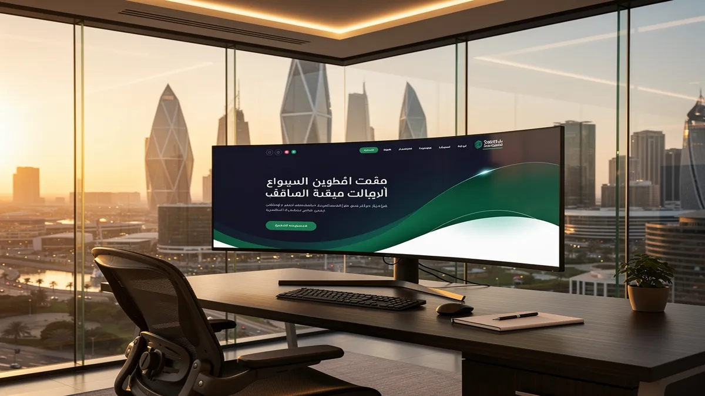
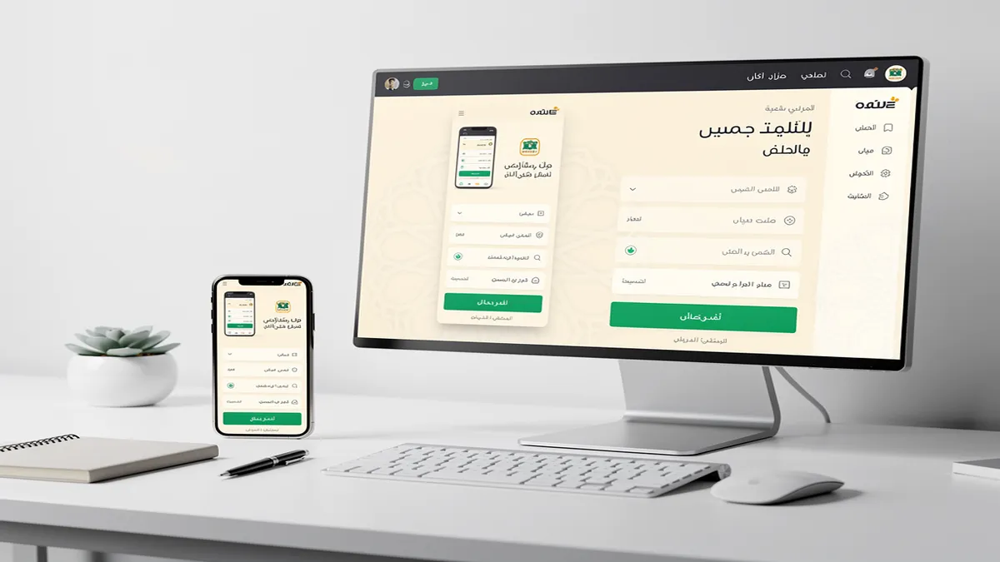
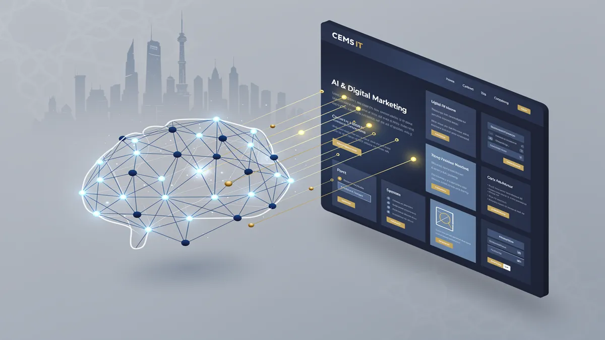
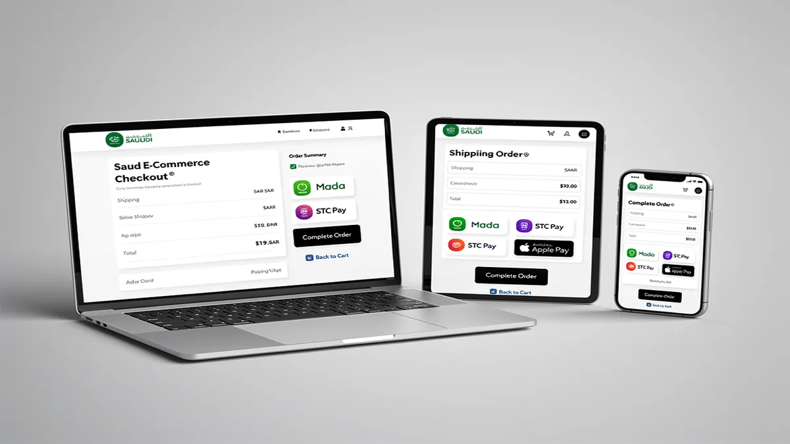
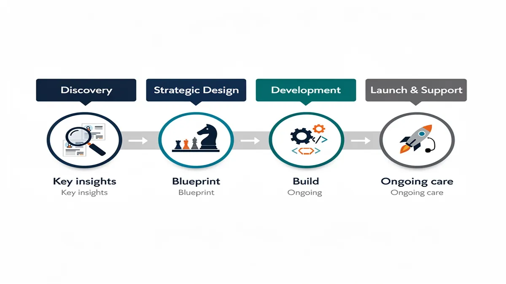

# Top Web Design Agency in Riyadh: Custom Digital Solutions 2024

## Why Your Business Needs a Premium Web Design Agency in Riyadh

<!-- section_id: sec_01 -->

Accelerate your market share in the Saudi capital by partnering with a specialized Web Design Agency that understands local consumer psychology. To start your journey toward digital dominance, [explore the premium solutions at CEMS IT Official Website](https://cems-it.com/) and secure a consultation today.

Your business deserves a digital presence that reflects the scale of Saudi Vision 2030 and the rapid evolution of the Riyadh market. A high-end Web Design Agency ensures your brand is not just visible but authoritative in a competitive landscape.

Achieve seamless Digital Transformation by integrating advanced Web Design and Development that aligns with local regulations and CITC Compliance. This strategic alignment protects your brand reputation while fostering trust among Saudi users and corporate stakeholders.

Maximize your revenue potential through a high-performance E-Commerce Store designed specifically for the Middle Eastern market. Our approach incorporates Mada Integration and localized payment gateways to reduce friction and increase successful transactions.

Capture the attention of Riyadh’s mobile-first population by prioritizing flawless mobile responsiveness across all devices and screen sizes. A responsive interface is no longer optional; it is the foundation of modern User Experience Saudi Arabia.

Enhance your operational efficiency by deploying custom AI Solutions that personalize the user journey and automate customer interactions. These intelligent systems analyze visitor behavior to provide real-time recommendations, significantly boosting your Conversion Rate Optimization.

Dominate search engine results pages with integrated SEO Services that target high-intent keywords relevant to your specific industry. We combine technical Web Development & Programming with localized content strategies to ensure your site outranks the competition.

Engage your audience with culturally resonant RTL Design and professional Content & Graphics that speak directly to the Saudi identity. Visual storytelling is essential for building emotional connections and establishing long-term brand loyalty in the Kingdom.

Streamline your project lifecycle with a transparent agency workflow that prioritizes clear communication and milestone-based delivery. This structured process ensures your vision is translated into a functional digital asset without unnecessary delays or technical overhead.

Future-proof your investment with dedicated maintenance and post-launch support that keeps your platform secure and up-to-date. Regular performance audits and security patches are critical for maintaining the integrity of your digital infrastructure in an era of rising cyber threats.

Transform your static website into a dynamic lead-generation machine by focusing on deep technical integration and data-driven design. Every element we build is engineered to support your business goals and deliver a measurable return on investment.

Build a robust digital foundation that adheres to the highest global standards while maintaining a strong local focus. Our expertise in Riyadh’s digital ecosystem allows us to create platforms that are both innovative and compliant with national digital mandates.

Elevate your brand authority by leveraging the latest advancements in web technology and interactive user interfaces. By choosing a premium partner, you ensure your business remains at the forefront of the digital revolution currently sweeping through Saudi Arabia.

Ready to redefine your digital footprint and lead your industry in Riyadh? Connect with the experts at CEMS IT Official Website to start building your custom digital solution now.

## Strategic Benefits of Localized UI/UX Design for Saudi Audiences

<!-- section_id: sec_02 -->

Maximize your market share in Riyadh by deploying a **Web Design Agency** strategy that prioritizes local cultural nuances and high-performance **UI/UX Design**. Partnering with experts ensures your digital presence aligns with Saudi consumer behavior to drive immediate growth.

Achieve higher engagement rates by implementing **Arabic/RTL design** structures that cater specifically to the linguistic flow of the Saudi market. Proper right-to-left alignment ensures that your users navigate naturally, reducing bounce rates and increasing time-on-site across all platforms.

Secure your competitive edge with **mobile responsiveness** that guarantees a flawless experience on the devices your customers use most. In a mobile-first economy like Saudi Arabia, a fast-loading, responsive interface is the foundation of high user retention and brand loyalty.

*   **Enhanced Conversion Rates**: Streamline the path to purchase with localized checkout flows and **Mada Integration** for seamless payments.
*   **Cultural Alignment**: Build deep trust through **Content & Graphics** that reflect local values while adhering to **CITC Compliance** standards.
*   **Future-Ready Scalability**: Leverage **AI Solutions** to personalize user journeys, providing automated recommendations that boost average order value.
*   **Technical Excellence**: Ensure long-term stability with robust **Web Development & Programming** that supports complex business logic and high traffic.
*   **Visibility and Growth**: Dominate search engine results through integrated **SEO Services** designed to capture high-intent local traffic.

Accelerate your **Digital Transformation** by adopting a user-centric approach that directly supports the goals of **Saudi Vision 2030**. Modernizing your infrastructure with advanced **Web Design and Development** positions your brand as a leader in the Kingdom’s evolving digital landscape.

Optimize your **E-Commerce Store** for the highest possible **Conversion Rate Optimization** by analyzing local user heatmaps and behavior patterns. Data-driven adjustments to your **User Experience Saudi Arabia** strategy ensure that every design element serves a specific business objective.

Integrate smart **AI Solutions** to automate customer interactions and provide 24/7 support through intelligent chatbots and predictive search. These technologies reduce operational overhead while significantly improving the overall satisfaction of your digital visitors.

Rely on professional **Web Development & Programming** to build secure, scalable backends that can handle the rapid expansion of your enterprise. Technical precision in your code architecture prevents downtime during peak shopping seasons and protects sensitive user data.

Maintain total compliance with local regulations by ensuring your hosting and data processing meet all **CITC Compliance** requirements. This commitment to security builds essential trust with your audience and protects your business from regulatory friction.

Elevate your brand authority with high-quality **Content & Graphics** that tell your story through a localized lens. Visual storytelling tailored to Riyadh’s demographic preferences creates an emotional connection that generic templates simply cannot replicate.

Drive sustainable ROI by viewing your website as a dynamic tool for **Digital Transformation** rather than a static brochure. Continuous updates and performance monitoring ensure your platform evolves alongside the fast-paced Saudi market trends.

Focusing on **User Experience Saudi Arabia** means more than just aesthetics; it involves deep technical integration of local payment gateways and logistics APIs. A holistic approach to design ensures that the backend functionality perfectly mirrors the front-end promise.

Utilize advanced **SEO Services** to ensure your custom digital solutions are discoverable by the right audience at the right time. Strategic keyword placement and technical optimization make your brand the first choice for users searching for premium services in Riyadh.

Empower your business with a **Web Design Agency** that understands the intersection of global technology and local culture. This strategic alignment is the key to unlocking new revenue streams and establishing a dominant digital footprint in the region.

## Why CEMS IT is the Preferred Digital Partner in Riyadh

<!-- section_id: sec_03 -->

Maximize your market share in Riyadh by partnering with CEMS IT, where we fuse advanced AI Solutions with high-performance Web Design and Development. Secure your digital future today by requesting a custom consultation with our expert team to dominate the Saudi market.

You gain a competitive edge through our specialized focus on Digital Transformation that aligns perfectly with Saudi Vision 2030. We don't just build websites; we engineer data-driven platforms designed to convert local traffic into loyal customers.

Your business benefits from a Web Design Agency that understands the nuances of the Riyadh market and CITC Compliance. We ensure every line of code and every pixel serves a strategic purpose in your growth trajectory.

Experience seamless global and local reach with our expert RTL Design and Mada Integration services. We eliminate technical friction, allowing your Saudi customers to navigate and transact with absolute confidence and ease.

Accelerate your sales growth by deploying a high-converting E-Commerce Store optimized for the unique purchasing behaviors of Saudi consumers. Our builds focus on User Experience Saudi Arabia to ensure your brand stands out in a crowded marketplace.

Leverage our sophisticated AI Solutions to personalize the customer journey and automate complex business processes. We integrate machine learning to predict user intent, significantly boosting your overall Conversion Rate Optimization.

Dominate search engine results through our premium SEO Services tailored for the Arabic and English competitive landscape. We ensure your brand remains visible to high-intent users searching for your specific products and services in Riyadh.

Empower your brand identity with professional Content & Graphics that resonate with local cultural values while maintaining global standards. Our creative team produces visuals that capture attention and drive meaningful engagement across all digital touchpoints.

Ensure your platform remains accessible on every device with our "mobile-first" approach to mobile responsiveness. Since the majority of Saudi users browse via smartphones, we prioritize speed and fluid layouts to reduce bounce rates.

Secure your long-term success with our robust Web Development & Programming infrastructure built for scalability. We provide the technical foundation that allows your digital presence to grow alongside your expanding business ambitions.

Trust in a Digital Marketing Agency Saudi Arabia that prioritizes transparency and measurable ROI in every campaign. We provide detailed analytics and performance tracking so you can see exactly how your investment translates into revenue.

Our step-by-step agency workflow ensures you are never in the dark about your project’s progress. From initial discovery to final deployment, we maintain a clear roadmap that emphasizes quality assurance and timely delivery.

Benefit from our deep technical expertise in AI-driven UX personalization, which tailors the interface to individual user preferences. This level of sophistication transforms a standard website into a proactive sales tool that works for you 24/7.

Maintain peak performance with our dedicated maintenance and post-launch support packages. We proactively monitor your site’s health, security, and speed to ensure your business never faces unnecessary downtime.

Your digital assets are protected by the latest security protocols, ensuring full data privacy for your Saudi Arabian clientele. We implement advanced encryption and secure hosting environments to build lasting trust with your audience.

Transform your vision into a functional reality through our collaborative design process. We listen to your specific business goals and translate them into a digital strategy that outperforms your local and international competitors.

Harness the power of integrated digital ecosystems where your website, social media, and search presence work in total harmony. Our holistic approach ensures consistent branding and messaging across the entire Saudi digital landscape.

Stay ahead of industry shifts with our continuous innovation in AI and machine learning integrations. We provide the tools you need to lead your industry, rather than simply following the latest digital trends.

Maximize your operational efficiency by automating routine tasks through our custom-built web applications. We focus on solving your specific business bottlenecks using intelligent programming and innovative software architecture.

Achieve sustainable growth in Riyadh’s fast-paced economy by leveraging our local market insights and global technical standards. CEMS IT is dedicated to being the engine that drives your digital success forward.

Take the definitive step toward digital leadership in Saudi Arabia. Contact CEMS IT now to start your journey toward a high-converting, AI-powered digital presence that delivers measurable results.

## Our Proven Track Record: Delivering Results for Saudi Enterprises

<!-- section_id: sec_04 -->

Accelerate your market expansion in Riyadh by partnering with a Web Design Agency that transforms digital presence into a measurable revenue driver. Our portfolio demonstrates how we help Saudi enterprises dominate their sectors through high-performance solutions.

Contact our expert team today to start your digital transformation journey and secure a competitive edge in the Saudi market. We specialize in turning complex business requirements into seamless, user-centric digital experiences.

Your business achieves sustainable growth when your E-Commerce Store is built on a foundation of conversion-centric design and Saudi-specific functionality. We have successfully launched numerous retail platforms that prioritize speed, security, and local payment preferences.

Enterprises across the Kingdom trust our Web Development & Programming expertise to handle complex backend integrations and high-traffic demands. Our technical architecture ensures your site remains stable during peak shopping seasons like Ramadan or National Day.

Maximize your visibility and organic reach with our comprehensive SEO Services tailored specifically for the competitive Riyadh landscape. We align every technical element of your site with Google’s latest ranking factors to ensure you stay ahead of local competitors.

Our approach to Web Design and Development focuses on creating a "Digital Headquarters" that reflects your brand’s authority and prestige. We combine aesthetic excellence with functional precision to serve the unique needs of the Saudi corporate sector.

Your customers enjoy a frictionless shopping experience when you implement Mada Integration and local shipping APIs within your online store. We ensure every transactional touchpoint is optimized for the Saudi consumer's trust and convenience.

Mobile responsiveness is no longer a luxury but a core requirement for capturing the 99% mobile penetration rate in Saudi Arabia. Our designs adapt perfectly to every screen size, ensuring your message is clear and actionable on any device.

Future-proof your operations by integrating advanced AI Solutions that personalize the user journey and automate customer support. We implement smart chatbots and recommendation engines that increase engagement and reduce operational overhead.

Realize the goals of Saudi Vision 2030 by adopting a digital-first strategy that emphasizes innovation and technological self-reliance. Our team ensures your digital assets contribute directly to the Kingdom’s evolving economic landscape.

Maintain full CITC Compliance and data sovereignty with our localized hosting and security protocols designed for Saudi enterprises. We prioritize your data integrity, ensuring all web assets meet the rigorous standards set by local regulatory bodies.

Elevate your brand perception with high-end Content & Graphics that resonate with local cultural values while maintaining global standards. Visual storytelling is at the heart of our design process, ensuring your brand leaves a lasting impression.

Native RTL Design ensures your Arabic-speaking audience experiences your website naturally and intuitively. We specialize in right-to-left UI/UX layouts that maintain visual balance and readability across all sections of your portal.

User Experience Saudi Arabia requires a deep understanding of local browsing habits and social proof triggers. We conduct extensive usability testing to ensure your navigation and calls-to-action align with how local users interact with technology.

Boost your bottom line through data-driven Conversion Rate Optimization (CRO) strategies that turn passive visitors into loyal customers. We analyze user behavior in real-time to remove friction points and streamline the path to purchase.

Our systematic Web Development & Programming workflow provides full transparency, from initial wireframing to final deployment and testing. You receive regular updates and milestone reports, ensuring the project aligns perfectly with your business objectives.

Experience the power of a custom-built digital ecosystem that integrates seamlessly with your existing ERP or CRM systems. We bridge the gap between your offline operations and online presence for a unified business management experience.

Your long-term success is guaranteed with our proactive maintenance and post-launch support packages designed for evolving enterprises. We monitor your site’s performance 24/7, applying security patches and performance updates as soon as they are needed.

Unlock new levels of efficiency by leveraging our expertise in API development and third-party software integrations. Whether it is logistics tracking or cloud-based accounting, we ensure your website communicates effectively with your entire tech stack.

Build deep trust with your audience by showcasing a professional, high-speed website that loads in under two seconds. We utilize advanced caching and Content Delivery Networks (CDNs) to provide the fastest possible experience for users in Riyadh.

Our SEO Services go beyond keyword placement to include deep technical audits and high-quality local backlink building. We focus on driving high-intent traffic that actually converts into leads and sales for your Saudi business.

Transform your legacy systems into modern, agile platforms through our dedicated Digital Transformation services. We help traditional enterprises migrate to the cloud and adopt modern web standards without disrupting their core operations.

Every E-Commerce Store we build is equipped with advanced analytics tools to help you track ROI and customer lifetime value. You gain actionable insights into which products are performing best and where your marketing budget is most effective.

Choose a partner that understands the nuances of the Riyadh market, from seasonal consumer behavior to the importance of localized customer service. Our local expertise ensures your digital strategy is culturally relevant and commercially successful.

We provide a clear roadmap for your digital growth, starting with a comprehensive discovery phase to identify your unique challenges. This ensures every line of code we write serves a specific business purpose and adds value to your brand.

Invest in a digital asset that grows with your company, thanks to our scalable architecture and modular design philosophy. As your business expands, your website can easily accommodate new features, products, and increased traffic volumes.

Our commitment to excellence is reflected in the success stories of our clients, ranging from ambitious startups to established government entities. We take pride in delivering results that exceed expectations and set new benchmarks in the industry.

Contact us now to schedule a consultation and receive a customized proposal for your next project. Let our team of specialists build the digital future your enterprise deserves in the heart of Riyadh.

## Our Seamless Web Development Process for Riyadh Businesses

<!-- section_id: sec_05 -->

Accelerate your business growth in Riyadh with a high-performance digital presence built on a foundation of strategic precision. Our Web Design Agency combines local market insights with global technical standards to ensure your brand stands out in the competitive Saudi landscape.

Secure your market share today by partnering with experts who understand the nuances of the Riyadh business ecosystem. Contact us now to start your journey toward a dominant digital presence.

Our process begins with a deep dive into your specific business goals and the unique demands of the Saudi market. We align your digital strategy with Saudi Vision 2030 objectives, ensuring every technical decision supports long-term scalability and local relevance.

You gain a competitive edge through our comprehensive Discovery and Strategy phase where we analyze competitor gaps in the Riyadh region. This initial roadmap defines the architecture of your Digital Transformation, focusing on high-impact user journeys and local consumer behavior.

Experience a design phase that prioritizes cultural resonance and sophisticated aesthetics tailored for a premium Saudi audience. We integrate RTL Design (Right-to-Left) principles from the ground up, ensuring your Arabic content feels natural and professional rather than like a translated afterthought.

Your brand identity is elevated through custom Content & Graphics that speak directly to your target demographic's values and aspirations. We focus on high-quality visual storytelling that builds immediate trust and establishes your authority in the local market.

Transform your ideas into a robust reality with our specialized Web Development & Programming phase. Our developers build lean, fast-loading architectures that prioritize mobile responsiveness, catering to the high mobile penetration rates across Saudi Arabia.

Optimize your sales funnel with a seamless E-Commerce Store setup that includes essential local integrations for a frictionless checkout. We implement Mada Integration and other localized payment gateways to ensure your customers enjoy a secure and familiar purchasing experience.

Future-proof your operations by incorporating advanced AI Solutions into your website’s core functionality. From intelligent chatbots to personalized user experiences, we use machine learning to drive engagement and automate complex customer interactions.

Maximize your visibility on search engines through integrated SEO Services that target both local Riyadh and broader regional keywords. We optimize your site’s technical structure and metadata to ensure you rank higher for the terms that drive actual revenue.

Ensure your platform remains secure and legally compliant by adhering to all CITC Compliance standards. This proactive approach protects your business from regulatory risks while building a foundation of transparency and reliability for your users.

Refine your performance through rigorous User Experience Saudi Arabia testing, where we gather data from local users to polish every interaction. This data-driven approach allows us to implement Conversion Rate Optimization (CRO) strategies that turn passive visitors into loyal clients.

Launch your project with total confidence knowing that our team provides comprehensive post-launch support and technical maintenance. We monitor performance metrics in real-time to ensure your site remains fast, secure, and fully optimized as your business scales.

Benefit from a partnership that views Web Design and Development as a continuous cycle of improvement and growth. We provide regular updates and strategic consulting to keep your digital assets aligned with evolving market trends and technological shifts.

Your success in the Riyadh market depends on a digital partner who prioritizes your ROI and technical excellence. Our structured roadmap is designed to eliminate guesswork and deliver a high-converting platform that grows with your ambitions.

Take the first step toward a superior digital future by booking a consultation with our specialized strategy team today. Let us transform your vision into a high-performing digital reality that dominates the Riyadh market.

## Frequently Asked Questions About Web Design in Riyadh

<!-- section_id: sec_06 -->

Achieving clarity on your digital investment is the first step toward a successful partnership with a **Web Design Agency** in Riyadh. Transparency regarding costs, technical requirements, and long-term support ensures your business aligns perfectly with the rapid **Digital Transformation** currently shaping the Saudi market.

### **How much does a professional web design project cost in Riyadh?**

You gain a competitive edge by investing in a solution tailored to your specific business goals rather than a generic template. Professional web design costs in Riyadh typically vary based on the complexity of the **Web Development & Programming** required to meet your objectives.

Small business sites or landing pages focused on lead generation generally start at a lower price point. These projects prioritize **User Experience Saudi Arabia** standards to ensure local visitors find information quickly and convert into customers effectively.

Enterprise-level platforms or a custom **E-Commerce Store** require a higher investment due to advanced integrations. These projects involve complex **Web Design and Development** workflows, including secure payment gateways and high-level data encryption to protect your users.

You receive a detailed breakdown of costs during the initial consultation phase to prevent any hidden fees. This transparency allows you to allocate your budget toward high-impact features like **AI Solutions** or advanced **SEO Services** that drive measurable ROI.

### **Do you provide full Right-to-Left (RTL) support for Arabic websites?**

Your brand gains immediate trust with local audiences through a flawless **RTL Design** that feels natural to Arabic speakers. We prioritize native alignment for all text, navigation menus, and call-to-action buttons to ensure a culturally relevant experience.

Proper RTL implementation goes beyond simple mirroring; it involves adjusting **Content & Graphics** to respect the natural eye-tracking patterns of Saudi users. This attention to detail significantly improves your **Conversion Rate Optimization** by reducing friction during the browsing process.

You benefit from a website that is fully compliant with local linguistic nuances and aesthetic preferences. Our **Web Development & Programming** team ensures that every structural element maintains its integrity across all devices while supporting the Arabic language.

### **What is the typical timeline for launching a custom website in Saudi Arabia?**

You can expect a standard professional website to launch within 6 to 10 weeks, depending on the scope of the features. This timeline accounts for discovery, wireframing, and rigorous testing to ensure your site meets **Saudi Vision 2030** digital standards.

Complex platforms requiring heavy **Web Design and Development** or bespoke software integrations may take 3 to 5 months. We follow a milestone-based approach so you can review progress and provide feedback at every critical stage of the build.

Your project timeline is strictly managed to balance speed with high-quality **Mobile Responsiveness** and technical stability. Rapid deployment is possible for simplified versions of your site, allowing you to establish an online presence while we finalize advanced features.

### **Does your agency provide ongoing maintenance and security updates?**

You protect your digital assets through proactive maintenance plans that include regular security patches and performance audits. This continuous oversight prevents downtime and ensures your **Web Design Agency** partnership remains a long-term asset for your business.

We ensure your site remains in full **CITC Compliance**, adhering to the latest data protection regulations in the Kingdom. Regular updates to your hosting environment and CMS plugins keep your platform resilient against emerging cyber threats and technical glitches.

You receive monthly reports detailing site health, speed optimizations, and any necessary adjustments to your **SEO Services** strategy. This commitment to maintenance ensures your website evolves alongside your business needs and remains a high-performing lead generation tool.

### **How do you ensure my website ranks on the first page of Google in Riyadh?**

You achieve higher search visibility by integrating technical **SEO Services** directly into the core architecture of your website. We focus on fast loading speeds and clean code, which are essential ranking factors for Google’s modern search algorithms.

Local search dominance is secured by optimizing your content for Riyadh-specific keywords and regional search intent. By focusing on **User Experience Saudi Arabia**, we reduce bounce rates and signal to search engines that your site provides high value to users.

Your site benefits from a comprehensive strategy that includes **Mobile Responsiveness** and high-quality **Content & Graphics** optimized for search engines. This holistic approach ensures your brand stays ahead of competitors and captures high-intent traffic consistently.

### **How do you handle local payment integrations like Mada?**

You simplify the checkout process for your customers by implementing seamless **Mada Integration** alongside other popular local payment methods. This builds regional credibility and directly increases the success rate of transactions on your **E-Commerce Store**.

Our developers ensure that all financial integrations are secure and provide a smooth **User Experience Saudi Arabia** for every shopper. By supporting local payment habits, you remove one of the biggest barriers to online sales in the Saudi market.

You gain access to a platform that is ready for the future of Saudi retail, supporting STC Pay, Apple Pay, and traditional credit cards. This flexibility ensures your business can cater to the diverse payment preferences of modern Saudi consumers.

### **Is your web design compatible with Saudi Vision 2030 digital goals?**

Your business aligns with the national shift toward a digital economy by adopting advanced **Digital Transformation** strategies. We build websites that emphasize innovation, accessibility, and high technical standards to match the Kingdom's ambitious growth plans.

We incorporate **AI Solutions** and smart automation to help your business operate more efficiently in a competitive digital landscape. This forward-thinking approach ensures your website remains relevant as the Saudi market continues to modernize and expand.

You contribute to a more robust local digital ecosystem by utilizing platforms that prioritize data sovereignty and local hosting. Our designs reflect the modern identity of Riyadh while maintaining the functional excellence required for global competitiveness.

### **Can you help with content creation and professional photography?**

You enhance your brand's visual authority with professional **Content & Graphics** tailored specifically for your target audience in Riyadh. High-quality imagery and localized copy ensure your message resonates deeply with potential clients and partners.

Our team provides strategic content development that supports your overall **SEO Services** and brand storytelling. This ensures that every word and image on your site serves a specific purpose in moving the user toward a conversion.

You save time and resources by utilizing our end-to-end creative services, from professional photography to expert copywriting. This unified approach ensures that your website's design and content are perfectly synchronized for maximum impact and professional appeal.

## Transform Your Digital Presence with Riyadh’s Leading Experts

<!-- section_id: sec_07 -->

Secure your market share in the Kingdom’s booming economy by partnering with a premier Web Design Agency that understands the local landscape. Contact us today to start your digital transformation and outpace your competitors with a high-performance website.

Elevate your brand authority in Riyadh with a custom digital ecosystem designed to convert high-value Saudi leads. Our team integrates advanced AI Solutions into every project to ensure your platform remains at the cutting edge of global technology standards.

Experience seamless Digital Transformation by migrating your legacy systems to a modern, high-speed architecture. We prioritize Web Development & Programming that aligns with Saudi Vision 2030, ensuring your business meets the highest national standards for innovation.

Maximize your reach across the GCC with an E-Commerce Store that features native Mada Integration and secure payment gateways. Our developers specialize in creating frictionless checkout experiences that significantly boost your local Conversion Rate Optimization.

Capture mobile-first users in Riyadh with flawless mobile responsiveness that ensures your site looks perfect on every device. By prioritizing User Experience Saudi Arabia, we reduce bounce rates and keep your audience engaged with your brand longer.

Drive organic growth through specialized SEO Services tailored for the specific search behaviors of the Saudi market. We optimize every technical element of your site to ensure you rank at the top of search results for high-intent keywords.

Communicate your brand’s story effectively through professional Content & Graphics designed to resonate with local cultural nuances. Our creative team ensures that every visual element supports your overarching business goals while maintaining a premium aesthetic.

Ensure full accessibility and cultural relevance with expert RTL Design that caters to Arabic-speaking audiences. We balance right-to-left layouts with modern design principles to provide a natural browsing experience for all your visitors in the region.

Stay ahead of regulatory requirements with platforms that maintain full CITC Compliance and local data hosting standards. We provide the peace of mind that your digital assets are secure, legal, and optimized for the Saudi Arabian business environment.

Transform your static website into a dynamic lead-generation machine with integrated Digital Marketing Agency Saudi Arabia strategies. We bridge the gap between Web Design and Development and active customer acquisition to ensure a measurable return on investment.

Benefit from a transparent, step-by-step agency workflow that keeps you informed from the initial discovery phase to the final deployment. Our process is designed to eliminate guesswork and deliver a final product that exceeds your initial expectations.

Leverage AI-driven UX personalization to deliver unique content experiences to every visitor based on their browsing history. This advanced approach to Web Design Agency services helps you build deeper brand loyalty and increases repeat customer visits.

Protect your digital investment with comprehensive maintenance and post-launch support that ensures zero downtime for your business. We monitor your site’s performance 24/7 to maintain the high speed and security your customers expect.

Analyze your success with detailed ROI case studies that demonstrate exactly how our designs improve your bottom line. We use data-driven insights to refine your digital strategy and ensure your website remains a competitive asset for years to come.

Scale your operations efficiently with cloud-based infrastructure that grows alongside your business requirements. Our technical team handles all the backend complexities so you can focus on your core business activities in Riyadh.

Modernize your customer service with AI chatbots that provide instant support to your visitors at any time of day. These intelligent tools reduce your overhead costs while significantly improving the overall satisfaction of your digital audience.

Refine your brand identity with custom iconography and typography that reflects the prestige of your Riyadh-based enterprise. We ensure that every pixel contributes to a cohesive and professional image that builds immediate trust with your clients.

Navigate the complexities of local hosting and domain registration with our expert guidance on Saudi-specific digital regulations. We simplify the technical setup process so your business can go live faster and with total confidence in your infrastructure.

Harness the power of data analytics to track user behavior and identify new growth opportunities within your target market. Our integrated tracking solutions provide you with the clarity needed to make informed marketing decisions.

Invest in a digital future that supports the Kingdom's technological evolution and positions your brand as a leader in its industry. We are committed to delivering excellence that reflects the ambition and scale of the Saudi market.

Ready to dominate the digital landscape in Riyadh? Contact our expert team now to receive a customized proposal and take the first step toward a world-class digital presence.