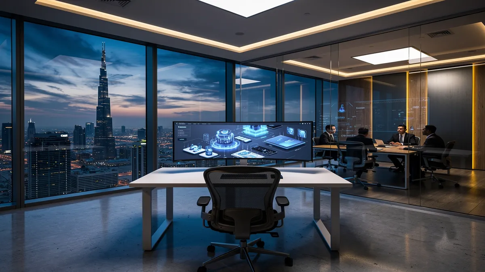
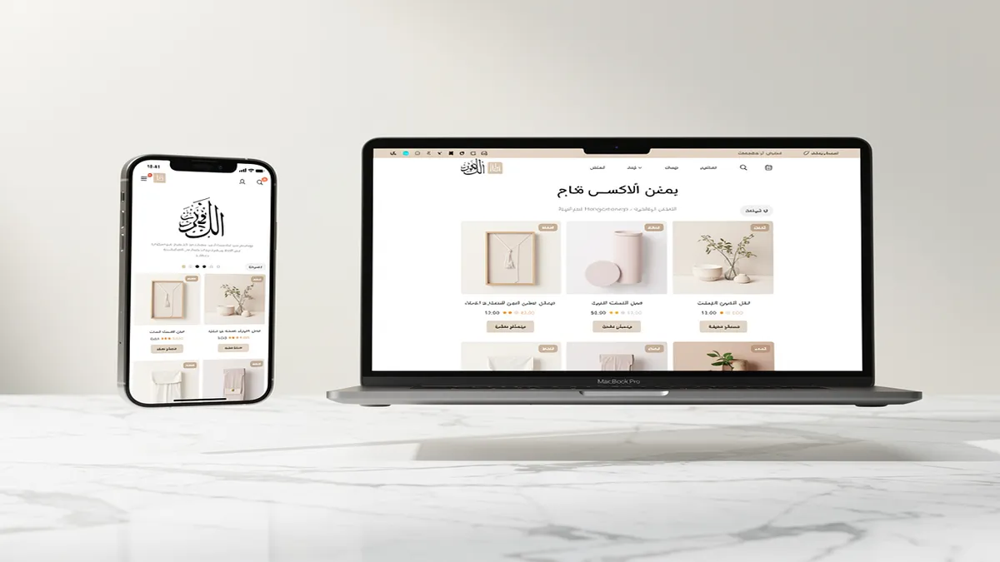
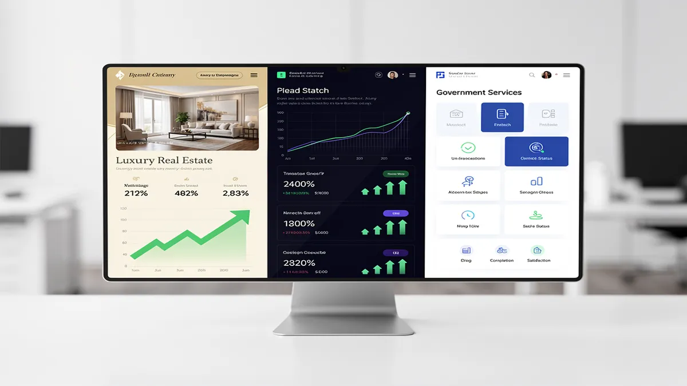
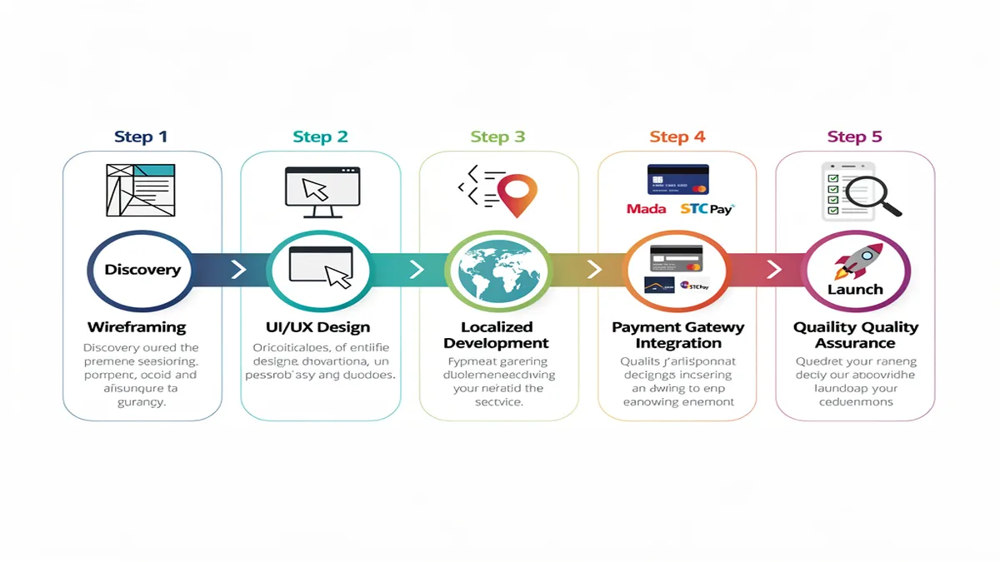
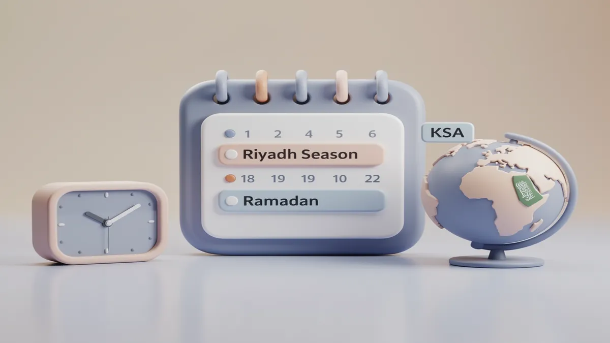

# Top Web Design Agency in Riyadh: Best Web Design Services 2025

## Premier Web Design Agency in Riyadh: Transforming Digital Presence for 2025

<!-- section_id: sec_01 -->

Your business can achieve a dominant market position in the Saudi capital by partnering with a specialized **Web Design Agency** that understands local consumer psychology. To start your digital transformation today, you can [consult with CEMS IT Official Website](https://cems-it.com/) to receive a tailored strategy for your brand.

Modern enterprises in Riyadh are moving beyond basic aesthetics to focus on high-performance digital assets that reflect the rapid growth of the Kingdom. By prioritizing **Web Design Riyadh** standards, you ensure your platform meets the sophisticated expectations of a tech-savvy local audience.

You gain a significant competitive edge when your site is built with **Mobile-first design Riyadh** principles, ensuring seamless access for the 98% of Saudi users who browse on smartphones. This approach reduces bounce rates and keeps potential customers engaged with your content for longer durations.

Your brand's credibility increases instantly through a **Bilingual website interface** that caters to both local Saudi citizens and the international business community. Providing a natural flow between English and Arabic helps you build trust across diverse demographic segments in the region.

You can streamline your operations and boost sales by integrating professional **E-commerce development Riyadh** solutions that support the local financial ecosystem. Our expertise ensures your store is fully compatible with **Mada payment integration**, which is essential for success in the Saudi market.

Your online store will benefit from specialized **Salla and Zid customization**, allowing you to leverage the power of local platforms while maintaining a unique brand identity. This localized technical depth ensures your checkout process is frictionless and optimized for high conversion rates.

You will see a direct impact on your bottom line by implementing **Conversion Rate Optimization (CRO)** techniques that turn passive visitors into active leads. Every element of your site is engineered to guide users toward a specific action, whether it is a purchase or a consultation request.

Your visibility in local search results will improve dramatically through strategic **Arabic SEO services** that target the specific keywords your customers are using. This ensures your business appears at the top of Google when clients search for services within the Riyadh area.

You benefit from a foundation of **Responsive Web Design KSA** that adapts perfectly to any screen size, from high-resolution office monitors to handheld devices. This technical flexibility is a core requirement for any business aiming to align with **Saudi Vision 2030 digital partners** and their standards.

Your users will enjoy a culturally relevant experience thanks to professional **RTL layout optimization** that respects the natural reading patterns of Arabic speakers. This attention to detail prevents layout breaks and ensures your typography remains legible and professional across all pages.

You can eliminate technical debt by starting your project with a comprehensive **Technical SEO audit KSA** to identify and fix performance bottlenecks. This proactive approach ensures your site loads faster than your competitors, which is a critical factor for both user retention and search rankings.

Your content management becomes effortless with **Custom WordPress development Saudi**, providing you with a secure and scalable backend that your team can manage with ease. We build bespoke themes that are lightweight and free from the bloat commonly found in generic templates.

You will gain deep insights into your audience's behavior through advanced **User journey mapping** that identifies exactly how people interact with your brand. This data-driven strategy allows us to refine your site structure for maximum efficiency and user satisfaction.

Your investment is protected by long-term maintenance and post-launch support that keeps your digital presence secure against evolving cyber threats. We provide regular updates and performance tuning to ensure your website remains a high-performing asset for years to come.

You deserve a digital partner that offers transparent pricing and clear ROI metrics, moving away from the vague promises of traditional agencies. We focus on measurable outcomes like lead generation, page load speeds, and organic traffic growth to prove our value.

Your project will be handled by experts who understand the nuances of the Riyadh market, from cultural sensitivities to local regulatory requirements. This local expertise ensures your website is not just a global template, but a specialized tool for the Saudi business landscape.

You can take the first step toward a superior digital presence by requesting a customized project brief that outlines your path to success. [Visit the CEMS IT Official Website](https://cems-it.com/) now to secure your 2025 digital strategy and dominate the Riyadh market.

## Strategic Benefits of Localized UI/UX Design for Saudi Consumers

<!-- section_id: sec_02 -->

You accelerate your market penetration in the Riyadh business landscape by deploying a sophisticated **UI/UX Design** strategy that mirrors the specific browsing habits of Saudi users. By moving beyond standard templates, your digital presence becomes a high-performance tool tailored to the nuances of local consumer behavior.

You secure a dominant position in the Saudi capital by partnering with a specialized **Web Design Agency** that prioritizes cultural resonance alongside technical excellence. This approach ensures your platform transitions from a simple website into a strategic asset that builds immediate trust with your target demographic.

Your brand achieves superior engagement rates through a **Bilingual website interface** that balances high-quality English typography with professional **RTL layout optimization**. This dual-language mastery allows you to capture the attention of both local citizens and the expanding international corporate sector in the Kingdom.

You maximize your reach across the region by utilizing **Mobile-first design Riyadh** standards, specifically engineered for a population where smartphone penetration is among the highest globally. This ensures your interface remains fluid and responsive, preventing the high bounce rates associated with poorly optimized mobile sites.

Your operational efficiency improves significantly when you leverage **Custom WordPress development Saudi** to create a backend that is both secure and remarkably easy for your local team to manage. This bespoke infrastructure eliminates the bloat of generic themes, providing you with a lightweight and lightning-fast digital foundation.

You drive higher transaction volumes by integrating professional **E-commerce development Riyadh** solutions that are fully optimized for the local financial ecosystem. By ensuring seamless **Mada payment integration**, you remove the primary friction point for Saudi shoppers, leading to a measurable increase in completed sales.

Your platform’s visibility in local search rankings is boosted by **Arabic SEO services** that align with the specific linguistic patterns and search intents of the Riyadh market. This strategic optimization ensures that your business appears at the top of results when high-value clients are searching for your specific expertise.

You benefit from a scientific approach to conversion through advanced **User journey mapping** that identifies and eliminates roadblocks in your sales funnel. This data-driven methodology allows for precise **Conversion Rate Optimization (CRO)**, turning a higher percentage of your traffic into loyal, paying customers.

Your digital assets remain future-proof and compliant with the ambitious goals of **Saudi Vision 2030 digital partners**, positioning your brand as a leader in the Kingdom’s economic transformation. This alignment demonstrates your commitment to the local market’s growth and fosters long-term institutional credibility.

You eliminate technical bottlenecks and performance lags by initiating your project with a comprehensive **Technical SEO audit KSA**. This proactive measure ensures that your site architecture is perfectly tuned for both user satisfaction and the latest search engine algorithms, providing a stable base for growth.

Your online store gains a significant competitive edge through specialized **Salla and Zid customization**, allowing you to utilize local platform power while maintaining a unique brand identity. This localized technical depth ensures your checkout process is frictionless and specifically optimized for high conversion rates in the region.

You provide your users with a flawless experience across all devices by implementing **Responsive Web Design KSA** principles that adapt to any screen size. Whether your clients are browsing on a high-resolution office monitor or a handheld device, your brand remains consistent, professional, and easily accessible.

Your business gains deep insights into audience behavior through the implementation of advanced tracking and analytics tailored to the Saudi market. This clarity allows you to refine your marketing spend and focus on the channels that deliver the highest return on investment for your Riyadh-based operations.

You protect your digital investment through long-term maintenance and post-launch support that keeps your platform secure against evolving cyber threats. Regular performance tuning ensures that your website remains a high-performing asset that continues to deliver value as your business scales within the Kingdom.

Your brand’s storytelling becomes more impactful when you incorporate high-quality localized content that speaks directly to the aspirations of the Saudi consumer. By focusing on cultural relevance, you foster a deeper emotional connection that generic, globally-focused websites simply cannot replicate.

You reduce customer acquisition costs by creating a user experience that prioritizes clarity, speed, and ease of navigation. When your site is easy to use, customers are more likely to return, increasing the lifetime value of each visitor and strengthening your overall market position in Riyadh.

Your project is handled by experts who understand the subtle nuances of the Saudi market, from specific color symbolism to local regulatory requirements. This local expertise ensures your website is not just a global template, but a specialized tool designed specifically for the Saudi business landscape.

You can take the first step toward a superior digital presence by requesting a customized project brief that outlines your specific path to success. This strategic roadmap provides you with the clarity needed to dominate the Riyadh market and achieve your 2025 business objectives with confidence.

## Why CEMS IT is the Preferred Digital Partner in Saudi Arabia

<!-- section_id: sec_03 -->

You accelerate your market penetration across the Kingdom by partnering with **CEMS IT**, a premier **Web Design Agency** that transforms static websites into high-conversion digital engines. Our strategic approach ensures your brand is perfectly positioned to capture the massive shift toward digital-first consumerism in the Riyadh business landscape.

You can achieve immediate alignment with national economic goals by collaborating with **Saudi Vision 2030 digital partners** who understand the technical requirements of the modern Saudi market. This partnership ensures your infrastructure is not only robust but also fully compliant with the latest governmental digital transformation standards.

Your business gains a significant edge in search visibility through our specialized **Digital Marketing Agency Saudi Arabia** services, which integrate high-level strategy with local execution. We focus on delivering measurable growth, moving your brand from the shadows of the second page to the top of Google’s search results.

You provide your customers with a flawless browsing experience by deploying **Responsive Web Design KSA** principles that adapt to every screen size. This technical flexibility is essential for a market where mobile usage dominates, ensuring your site remains professional and accessible on any device.

Your brand builds instant trust with the local population through a **Bilingual website interface** that honors linguistic nuances and cultural expectations. By offering seamless navigation in both Arabic and English, you broaden your market reach to include both local citizens and international stakeholders.

You ensure your content is naturally readable for native speakers through expert **RTL layout optimization** that prevents the alignment errors common in generic templates. This attention to detail reflects a high level of professionalism and respect for the Arabic-speaking user journey.

Your search engine rankings receive a localized boost through targeted **Arabic SEO services** that focus on the specific keywords and search intents of the Saudi audience. We optimize your metadata and on-page content to ensure you dominate the regional search landscape effectively.

You can streamline your online sales operations by utilizing our **E-commerce development Riyadh** expertise, which is designed to handle the complexities of the local retail market. We build scalable stores that are capable of managing high traffic volumes during peak shopping seasons like Ramadan.

Your transaction success rate increases significantly when you implement **Mada payment integration**, the preferred payment method for the vast majority of Saudi consumers. By removing payment friction, you directly improve your checkout completion rates and overall revenue.

You gain the flexibility of local platform power combined with bespoke branding through our specialized **Salla and Zid customization** services. This allows you to leverage the reliability of established Saudi e-commerce ecosystems while maintaining a completely unique visual identity.

Your team enjoys total control over your digital assets with **Custom WordPress development Saudi**, providing a secure and intuitive backend tailored to your specific workflow. We eliminate unnecessary plugins and bloat, ensuring your site remains fast, secure, and easy to update.

You identify and resolve hidden performance bottlenecks by starting your digital journey with a comprehensive **Technical SEO audit KSA**. This proactive analysis ensures your site architecture is optimized for both speed and crawlability, giving you a stable foundation for long-term growth.

Your mobile traffic converts at a higher rate when you prioritize **Mobile-first design Riyadh** standards, which focus on thumb-friendly navigation and lightning-fast load times. We ensure your mobile experience is never an afterthought, but rather the primary driver of your digital success.

You gain a deeper understanding of your customers' needs through advanced **User journey mapping** that tracks every interaction from landing page to conversion. This data-driven insight allows us to refine your site structure to match the exact behavior of your target demographic.

Your marketing budget delivers a higher return on investment when you apply **Conversion Rate Optimization (CRO)** techniques to every page of your website. We use A/B testing and heatmaps to ensure every design element is working toward a specific business objective.

You protect your brand's reputation and digital longevity through our dedicated maintenance and post-launch support programs. We provide continuous security monitoring and performance tuning to ensure your platform remains a high-performing asset as your business scales.

Your digital presence becomes a tool for storytelling through high-quality localized content that resonates with the aspirations of the Saudi consumer. By focusing on cultural relevance, you foster a deeper emotional connection that generic, globalized websites simply cannot replicate.

You reduce customer acquisition costs by creating a user experience that prioritizes clarity, speed, and ease of navigation. When your site is intuitive to use, visitors are more likely to return, increasing the lifetime value of each customer and strengthening your market position.

You benefit from a transparent partnership that focuses on clear ROI metrics and measurable outcomes rather than vague promises. Our team provides regular reporting on lead generation, page speeds, and organic traffic growth to prove the value of your investment.

Your project is managed by experts who understand the subtle nuances of the Riyadh market, from local regulatory requirements to specific color symbolism. This local expertise ensures your website is a specialized tool designed specifically for the unique Saudi business landscape.

You can take the first step toward a superior digital presence by requesting a customized project brief that outlines your specific path to success. This strategic roadmap provides the clarity needed to dominate the Riyadh market and achieve your 2025 business objectives with confidence.

## Proven Success: Delivering High-Impact Projects Across Riyadh’s Key Sectors

<!-- section_id: sec_04 -->

You accelerate your market penetration in the Riyadh business landscape by deploying a sophisticated UI/UX strategy that mirrors the specific browsing habits of Saudi users. Partnering with a specialized Web Design Agency ensures your digital presence becomes a high-performance tool tailored to the nuances of local consumer behavior.

You secure a dominant position in the Saudi capital by prioritizing cultural resonance alongside technical excellence. This approach ensures your platform transitions from a simple website into a strategic asset that builds immediate trust with your target demographic.

Your brand achieves superior engagement rates through a Bilingual website interface that balances high-quality English typography with professional RTL layout optimization. This dual-language mastery allows you to capture the attention of both local citizens and the expanding international corporate sector in the Kingdom.

You maximize your reach across the region by utilizing Mobile-first design Riyadh standards, specifically engineered for a population where smartphone penetration is among the highest globally. This ensures your interface remains fluid and responsive, preventing the high bounce rates associated with poorly optimized mobile sites.

Your operational efficiency improves significantly when you leverage Custom WordPress development Saudi to create a backend that is both secure and remarkably easy for your local team to manage. This bespoke infrastructure eliminates the bloat of generic themes, providing you with a lightweight and lightning-fast digital foundation.

You drive higher transaction volumes by integrating professional E-commerce development Riyadh solutions that are fully optimized for the local financial ecosystem. By ensuring seamless Mada payment integration, you remove the primary friction point for Saudi shoppers, leading to a measurable increase in completed sales.

Your platform’s visibility in local search rankings is boosted by Arabic SEO services that align with the specific linguistic patterns and search intents of the Riyadh market. This strategic optimization ensures that your business appears at the top of results when high-value clients are searching for your specific expertise.

You benefit from a scientific approach to conversion through advanced User journey mapping that identifies and eliminates roadblocks in your sales funnel. This data-driven methodology allows for precise Conversion Rate Optimization (CRO), turning a higher percentage of your traffic into loyal, paying customers.

Your digital assets remain future-proof and compliant with the ambitious goals of Saudi Vision 2030 digital partners, positioning your brand as a leader in the Kingdom’s economic transformation. This alignment demonstrates your commitment to the local market’s growth and fosters long-term institutional credibility.

You eliminate technical bottlenecks and performance lags by initiating your project with a comprehensive Technical SEO audit KSA. This proactive measure ensures that your site architecture is perfectly tuned for both user satisfaction and the latest search engine algorithms.

Your online store gains a significant competitive edge through specialized Salla and Zid customization, allowing you to utilize local platform power while maintaining a unique brand identity. This localized technical depth ensures your checkout process is frictionless and specifically optimized for high conversion rates.

You provide your users with a flawless experience across all devices by implementing Responsive Web Design KSA principles that adapt to any screen size. Whether your clients are browsing on a high-resolution office monitor or a handheld device, your brand remains consistent and professional.

Your business gains deep insights into audience behavior through the implementation of advanced tracking and analytics tailored to the Saudi market. This clarity allows you to refine your marketing spend and focus on the channels that deliver the highest return on investment for your Riyadh-based operations.

You protect your digital investment through long-term maintenance and post-launch support that keeps your platform secure against evolving cyber threats. Regular performance tuning ensures that your website remains a high-performing asset that continues to deliver value as your business scales.

Your brand’s storytelling becomes more impactful when you incorporate high-quality localized content that speaks directly to the aspirations of the Saudi consumer. By focusing on cultural relevance, you foster a deeper emotional connection that generic, globally-focused websites simply cannot replicate.

You reduce customer acquisition costs by creating a user experience that prioritizes clarity, speed, and ease of navigation. When your site is easy to use, customers are more likely to return, increasing the lifetime value of each visitor and strengthening your overall market position.

You benefit from a transparent partnership that focuses on clear ROI metrics and measurable outcomes rather than vague promises. Our team provides regular reporting on lead generation, page speeds, and organic traffic growth to prove the value of your investment.

Your project is handled by experts who understand the subtle nuances of the Riyadh market, from local regulatory requirements to specific color symbolism. This local expertise ensures your website is a specialized tool designed specifically for the unique Saudi business landscape.

You can take the first step toward a superior digital presence by requesting a customized project brief that outlines your specific path to success. This strategic roadmap provides the clarity needed to dominate the Riyadh market and achieve your 2025 business objectives with confidence.

You benefit from the reliability of world-class infrastructure by hosting your assets on platforms like [Google Cloud](https://cloud.google.com/), ensuring maximum uptime for your Riyadh operations. This technical foundation supports the high-speed demands of modern Saudi consumers.

Your search engine rankings receive a localized boost through targeted Arabic SEO services that focus on the specific keywords and search intents of the Saudi audience. We optimize your metadata and on-page content to ensure you dominate the regional search landscape effectively.

You can streamline your online sales operations by utilizing our E-commerce development Riyadh expertise, which is designed to handle the complexities of the local retail market. We build scalable stores that are capable of managing high traffic volumes during peak shopping seasons.

Your transaction success rate increases significantly when you implement Mada payment integration, the preferred payment method for the vast majority of Saudi consumers. By removing payment friction, you directly improve your checkout completion rates and overall revenue.

You gain the flexibility of local platform power combined with bespoke branding through our specialized Salla and Zid customization services. This allows you to leverage the reliability of established Saudi e-commerce ecosystems while maintaining a completely unique visual identity.

Your team enjoys total control over your digital assets with Custom WordPress development Saudi, providing a secure and intuitive backend tailored to your specific workflow. We eliminate unnecessary plugins and bloat, ensuring your site remains fast and easy to update.

You identify and resolve hidden performance bottlenecks by starting your digital journey with a comprehensive Technical SEO audit KSA. This proactive analysis ensures your site architecture is optimized for both speed and crawlability, giving you a stable foundation for growth.

Your mobile traffic converts at a higher rate when you prioritize Mobile-first design Riyadh standards, which focus on thumb-friendly navigation and lightning-fast load times. We ensure your mobile experience is never an afterthought, but rather the primary driver of your success.

You gain a deeper understanding of your customers' needs through advanced User journey mapping that tracks every interaction from landing page to conversion. This data-driven insight allows us to refine your site structure to match the exact behavior of your target demographic.

Your marketing budget delivers a higher return on investment when you apply Conversion Rate Optimization (CRO) techniques to every page of your website. We use heatmaps and data analysis to ensure every design element is working toward a specific business objective.

You protect your brand’s reputation and digital longevity through our dedicated maintenance and post-launch support programs. We provide continuous security monitoring and performance tuning to ensure your platform remains a high-performing asset as your business scales.

Your digital presence becomes a tool for storytelling through high-quality localized content that resonates with the aspirations of the Saudi consumer. By focusing on cultural relevance, you foster a deeper emotional connection that generic websites simply cannot replicate.

You reduce customer acquisition costs by creating a user experience that prioritizes clarity, speed, and ease of navigation. When your site is intuitive to use, visitors are more likely to return, increasing the lifetime value of each customer and strengthening your market position.

You benefit from a transparent partnership that focuses on clear ROI metrics and measurable outcomes rather than vague promises. Our team provides regular reporting on lead generation and organic traffic growth to prove the value of your investment.

Your project is managed by experts who understand the subtle nuances of the Riyadh market, from local regulatory requirements to specific color symbolism. This local expertise ensures your website is a specialized tool designed specifically for the unique Saudi business landscape.

You can take the first step toward a superior digital presence by requesting a customized project brief that outlines your specific path to success. This strategic roadmap provides the clarity needed to dominate the Riyadh market and achieve your 2025 business objectives with confidence.

## Our Agile Development Process: From Concept to Launch in the Saudi Market

<!-- section_id: sec_05 -->

You accelerate your market penetration in Riyadh by adopting an agile development methodology that transforms abstract concepts into high-performance digital assets. Partnering with a specialized Web Design Agency ensures your project moves through a structured lifecycle designed to meet the rapid-fire demands of the Saudi business landscape.

You gain a significant competitive advantage when your platform is built on a foundation of sophisticated UI/UX Design that mirrors local browsing habits. This user-centric approach ensures that every interaction on your site is intuitive, reducing friction and building immediate trust with your Riyadh-based audience.

Your brand achieves superior engagement rates by implementing a Bilingual website interface that caters to both Arabic and English speakers with equal precision. We prioritize professional RTL layout optimization to ensure that your Arabic content flows naturally, respecting the cultural and linguistic expectations of the Kingdom.

You maximize your reach across the region by utilizing Mobile-first design Riyadh standards, specifically engineered for a population with one of the highest smartphone penetration rates globally. This ensures your interface remains fluid and responsive, preventing the high bounce rates often seen on poorly optimized mobile sites.

Your operational efficiency improves significantly when you leverage Custom WordPress development Saudi to create a backend that is secure and easy for your team to manage. This bespoke infrastructure eliminates the bloat of generic themes, providing a lightweight and lightning-fast digital foundation for your business growth.

You drive higher transaction volumes by integrating professional Ecommerce development Riyadh solutions that are fully optimized for the local financial ecosystem. By ensuring seamless Mada payment integration, you remove the primary friction point for Saudi shoppers, leading to a measurable increase in completed sales.

Your online store gains a significant edge through specialized Salla and Zid customization, allowing you to utilize local platform power while maintaining a unique brand identity. This localized technical depth ensures your checkout process is frictionless and specifically optimized for the high conversion rates required in 2025.

You benefit from a scientific approach to growth through advanced User journey mapping that identifies and eliminates roadblocks in your sales funnel. This data-driven methodology allows for precise Conversion Rate Optimization (CRO), turning a higher percentage of your traffic into loyal, paying customers.

Your platform’s visibility in local search rankings is boosted by Arabic SEO services that align with the specific linguistic patterns of the Riyadh market. This strategic optimization ensures your business appears at the top of results when high-value clients are searching for your specific expertise.

You eliminate technical bottlenecks and performance lags by initiating your project with a comprehensive Technical SEO audit KSA. This proactive measure ensures that your site architecture is perfectly tuned for both user satisfaction and the latest search engine algorithms, providing a stable base for expansion.

Your digital assets remain future-proof and compliant with the ambitious goals of Saudi Vision 2030 digital partners. This alignment demonstrates your commitment to the Kingdom’s economic transformation and fosters long-term institutional credibility for your brand among local stakeholders.

You provide your users with a flawless experience across all devices by implementing Responsive Web Design KSA principles that adapt to any screen size. Whether your clients are browsing on a high-resolution office monitor or a handheld device, your brand remains consistent, professional, and easily accessible.

Your business gains deep insights into audience behavior through the implementation of advanced tracking and analytics tailored to the Saudi market. This clarity allows you to refine your marketing spend and focus on the channels that deliver the highest return on investment for your Riyadh-based operations.

You protect your digital investment through long-term maintenance and post-launch support that keeps your platform secure against evolving cyber threats. Regular performance tuning ensures that your website remains a high-performing asset that continues to deliver value as your business scales within the region.

Your brand’s storytelling becomes more impactful when you incorporate high-quality localized content that speaks directly to the aspirations of the Saudi consumer. By focusing on cultural relevance, you foster a deeper emotional connection that generic, globally-focused websites simply cannot replicate.

You reduce customer acquisition costs by creating a user experience that prioritizes clarity, speed, and ease of navigation. When your site is easy to use, customers are more likely to return, increasing the lifetime value of each visitor and strengthening your overall market position in Riyadh.

You benefit from the reliability of world-class infrastructure by hosting your assets on platforms like [Google Cloud](https://cloud.google.com/), ensuring maximum uptime for your operations. This technical foundation supports the high-speed demands of modern Saudi consumers who expect instantaneous page loads.

Your project is handled by experts who understand the subtle nuances of the Riyadh market, from local regulatory requirements to specific color symbolism. This local expertise ensures your website is not just a global template, but a specialized tool designed specifically for the unique Saudi business landscape.

You can take the first step toward a superior digital presence by requesting a customized project brief that outlines your specific path to success. This strategic roadmap provides the clarity needed to dominate the Riyadh market and achieve your 2025 business objectives with total confidence.

Your search engine rankings receive a localized boost through targeted Arabic SEO services that focus on the specific keywords used by your customers. We optimize your metadata and on-page content to ensure you dominate the regional search landscape effectively and sustainably over time.

You gain the flexibility of local platform power combined with bespoke branding through our specialized Salla and Zid customization services. This allows you to leverage the reliability of established Saudi ecommerce ecosystems while maintaining a completely unique visual identity that stands out from competitors.

Your team enjoys total control over your digital assets with Custom WordPress development Saudi, providing a secure and intuitive backend tailored to your workflow. We eliminate unnecessary plugins and bloat, ensuring your site remains fast, secure, and remarkably easy to update as your content grows.

You identify and resolve hidden performance bottlenecks by starting your digital journey with a comprehensive Technical SEO audit KSA. This proactive analysis ensures your site architecture is optimized for both speed and crawlability, giving you a stable foundation for long-term organic growth.

Your mobile traffic converts at a higher rate when you prioritize Mobile-first design Riyadh standards, which focus on thumb-friendly navigation and fast load times. We ensure your mobile experience is never an afterthought, but rather the primary driver of your digital success in a mobile-centric market.

You gain a deeper understanding of your customers' needs through advanced User journey mapping that tracks every interaction from landing page to conversion. This data-driven insight allows us to refine your site structure to match the exact behavior and preferences of your target demographic in Riyadh.

Your marketing budget delivers a higher return on investment when you apply Conversion Rate Optimization (CRO) techniques to every page of your website. We use heatmaps and data analysis to ensure every design element is working toward a specific business objective, such as lead generation or sales.

You protect your brand’s reputation and digital longevity through our dedicated maintenance and post-launch support programs. We provide continuous security monitoring and performance tuning to ensure your platform remains a high-performing asset as your business scales within the Kingdom's competitive market.

Your digital presence becomes a powerful tool for storytelling through high-quality localized content that resonates with the aspirations of the Saudi consumer. By focusing on cultural relevance, you foster a deeper emotional connection that generic websites simply cannot replicate for a local audience.

You benefit from a transparent partnership that focuses on clear ROI metrics and measurable outcomes rather than vague promises. Our team provides regular reporting on lead generation, page speeds, and organic traffic growth to prove the value of your investment in real-time.

Your brand builds instant trust with the local population through a Bilingual website interface that honors linguistic nuances and cultural expectations perfectly. By offering seamless navigation in both Arabic and English, you broaden your market reach to include both local citizens and international stakeholders.

You ensure your content is naturally readable for native speakers through expert RTL layout optimization that prevents the alignment errors common in generic templates. This attention to detail reflects a high level of professionalism and respect for the Arabic-speaking user journey in the Saudi market.

You can streamline your online sales operations by utilizing our Ecommerce development Riyadh expertise, which is designed to handle the complexities of the local retail market. We build scalable stores that are capable of managing high traffic volumes during peak shopping seasons like Ramadan and Eid.

Your transaction success rate increases significantly when you implement Mada payment integration, the preferred payment method for the vast majority of Saudi consumers. By removing payment friction at the checkout, you directly improve your completion rates and overall revenue generated through your digital platform.

You can achieve immediate alignment with national economic goals by collaborating with Saudi Vision 2030 digital partners who understand the technical requirements of the modern market. This partnership ensures your infrastructure is robust and compliant with the latest governmental digital transformation standards.

Your business gains a significant edge in search visibility through our specialized Arabic SEO services, which integrate high-level strategy with local execution. We focus on delivering measurable growth, moving your brand from the shadows of the second page to the top of Google’s search results in Riyadh.

You provide your customers with a flawless browsing experience by deploying Responsive Web Design KSA principles that adapt to every screen size seamlessly. This technical flexibility is essential for a market where mobile usage dominates, ensuring your site remains professional and accessible on any device.

Your project is managed by experts who understand the subtle nuances of the Riyadh market, from local regulatory requirements to specific cultural color symbolism. This local expertise ensures your website is a specialized tool designed specifically for the unique and evolving Saudi business landscape.

You can take the first step toward a superior digital presence by requesting a customized project brief that outlines your specific path to success. This strategic roadmap provides the clarity needed to dominate the Riyadh market and achieve your 2025 business objectives with confidence and precision.

## Frequently Asked Questions About Web Design Services in Riyadh

<!-- section_id: sec_06 -->

You gain a clear understanding of the investment required for a professional digital presence by evaluating the specific needs of your Riyadh-based business. A high-quality **Web Design Agency** typically structures pricing based on the complexity of the user journey, the number of custom integrations, and the level of Arabic SEO services required to compete in the Saudi market.

Your project costs in the Kingdom generally range from 15,000 SAR for high-performance landing pages to over 100,000 SAR for complex enterprise portals. This investment ensures your platform is built with a Mobile-first design Riyadh approach, providing a seamless experience for the local audience while adhering to global technical standards.

### **What is the average cost of hiring a professional web design agency in Riyadh?**

You achieve a superior return on investment by understanding that professional web design in the Saudi capital is priced according to technical depth and strategic value. For small to medium enterprises, a standard corporate site usually ranges between 20,000 and 45,000 SAR, covering essential features like **Web Design Riyadh** standards and basic lead generation tools.

Your costs increase when you require advanced features such as Custom WordPress development Saudi or intricate API integrations for local logistics and ERP systems. Enterprise-level solutions often exceed 70,000 SAR, reflecting the intensive labor required for deep Conversion Rate Optimization (CRO) and high-level security protocols.

You benefit from a transparent pricing model that prioritizes long-term scalability and performance over cheap, generic templates. Investing in a specialized agency ensures your site is a revenue-generating asset that aligns with the rapid economic growth seen across the Riyadh business landscape.

### **How long does it take to develop a bilingual (Arabic/English) website for a Saudi business?**

You can expect a professional bilingual website to be fully operational within 8 to 14 weeks, depending on the complexity of your content and design requirements. This timeline accounts for the meticulous RTL layout optimization necessary to ensure your Arabic interface is as intuitive and professional as the English version.

Your project begins with a discovery phase and User journey mapping, which typically takes 2 weeks to align with your brand's goals. The design and development phase follows, where designers create a **Bilingual website interface** that respects Saudi cultural nuances and linguistic patterns.

You ensure a high-quality launch by dedicating the final 2 to 3 weeks to rigorous testing, including a Technical SEO audit KSA and mobile responsiveness checks. This structured approach prevents post-launch errors and ensures your platform is ready to serve both local citizens and international partners immediately.

### **Do your web design services include integration with Mada and local Saudi payment gateways?**

You maximize your sales potential by ensuring your e-commerce platform is fully compatible with the local financial ecosystem through seamless **Mada payment integration**. Our services prioritize the integration of Saudi-specific gateways like Moyasar, Tap, and Geidea, which are essential for building trust with local shoppers.

Your online store benefits from specialized Salla and Zid customization, allowing you to leverage these powerful local platforms while maintaining a unique brand identity. This technical expertise ensures your checkout process is frictionless, meeting the high expectations of tech-savvy consumers in the Riyadh market.

You reduce cart abandonment rates significantly by providing the payment methods your customers prefer and trust most. By focusing on **E-commerce development Riyadh** best practices, we ensure your transaction flow is secure, fast, and compliant with the latest Saudi Arabian electronic commerce regulations.

### **How does CEMS IT ensure compliance with Saudi Arabian data privacy and CITC regulations?**

You protect your business from legal risks by partnering with experts who prioritize compliance with the National Data Management Office (NDMO) and CITC guidelines. We implement robust encryption standards and secure hosting solutions, often utilizing [Google Cloud](https://cloud.google.com/) regions in Saudi Arabia to ensure data residency requirements are met.

Your platform remains secure through the implementation of advanced firewalls and regular security patches tailored to the evolving threat landscape in the Middle East. This proactive stance on data privacy builds immense credibility with your users, who value the safety of their personal and financial information.

You benefit from a digital infrastructure that is fully aligned with the technical requirements of **Saudi Vision 2030 digital partners**. This commitment to regulatory excellence ensures your brand is positioned as a reliable leader within the Kingdom’s rapidly transforming digital economy.

### **Can you help optimize our website for Riyadh-specific local SEO and Google Maps?**

Your business achieves dominant visibility in local search results through targeted **Arabic SEO services** that focus on the specific keywords used by customers in the Riyadh region. We optimize your Google Business Profile and on-page content to ensure you appear at the top of the "Map Pack" when local clients search for your services.

You gain a competitive edge by implementing **Responsive Web Design KSA** principles, which Google prioritizes for local rankings. By focusing on Mobile-first design Riyadh standards, we ensure your site loads instantly for users searching on the go, directly increasing your foot traffic and lead volume.

Your local authority is further strengthened through high-quality localized content and technical optimization that speaks to the specific needs of the Saudi market. This comprehensive approach to **Digital Marketing Agency Saudi Arabia** strategies ensures your brand remains the first choice for consumers across the capital.

## Scale Your Business with Riyadh’s Leading Web Design Experts

<!-- section_id: sec_07 -->

You transform your digital presence into a high-velocity growth engine by collaborating with a premier Web Design Agency that specializes in the Riyadh market. To secure your 2025 digital strategy and dominate the local landscape, [consult with CEMS IT Official Website](https://cemsit.com/) to receive a tailored project brief.

Your brand achieves immediate market authority through a Bilingual website interface that bridges the gap between local cultural expectations and international corporate standards. By implementing professional RTL layout optimization, you ensure that your Arabic-speaking audience experiences a natural, fluid navigation flow that respects linguistic nuances.

You maximize your reach across the Kingdom by deploying Mobile-first design Riyadh standards, specifically engineered for a population where smartphone usage is the primary touchpoint. This technical precision prevents the high bounce rates common on non-optimized sites, ensuring your interface remains responsive and professional on every handheld device.

Your operational efficiency scales rapidly when you utilize Custom WordPress development Saudi to create a secure, bespoke backend tailored to your team’s specific workflow. This infrastructure eliminates the heavy bloat of generic templates, providing you with a lightweight digital foundation that facilitates lightning-fast content updates and management.

You drive higher revenue and transaction volumes by integrating professional Ecommerce development Riyadh solutions that are fully optimized for the local financial ecosystem. By ensuring seamless Mada payment integration, you remove the primary friction point for Saudi shoppers, leading to a measurable increase in completed sales and checkout success.

Your online store gains a significant competitive edge through specialized Salla and Zid customization, allowing you to leverage the power of local platforms while maintaining a unique brand identity. This localized technical depth ensures your checkout process is frictionless and specifically optimized for the high conversion rates required in the modern market.

You benefit from a scientific approach to audience engagement through advanced User journey mapping that identifies and eliminates roadblocks in your sales funnel. This data-driven methodology allows for precise Conversion Rate Optimization (CRO), turning a higher percentage of your traffic into loyal, long-term customers.

Your search engine visibility improves dramatically through strategic Arabic SEO services that target the specific keywords and search intents of your Riyadh-based audience. We optimize your metadata and on-page content to ensure your business appears at the top of Google results when high-value clients are searching for your expertise.

You eliminate technical debt and performance bottlenecks by initiating your project with a comprehensive Technical SEO audit KSA. This proactive measure ensures your site architecture is perfectly tuned for both user satisfaction and the latest search engine algorithms, providing a stable base for long-term organic growth.

Your business gains deep insights into consumer behavior through the implementation of advanced tracking and analytics tailored specifically to the Saudi market. This clarity allows you to refine your marketing spend and focus on the channels that deliver the highest return on investment for your regional operations.

You protect your digital investment through dedicated maintenance and post-launch support that keeps your platform secure against evolving cyber threats. Regular performance tuning ensures that your website remains a high-performing asset that continues to deliver value as your business scales within the competitive Riyadh landscape.

Your brand’s storytelling becomes more impactful when you incorporate high-quality localized content that speaks directly to the aspirations and values of the Saudi consumer. By focusing on cultural relevance, you foster a deeper emotional connection that generic, globally-focused websites simply cannot replicate for a local audience.

You reduce customer acquisition costs by creating a user experience that prioritizes clarity, speed, and ease of navigation across all touchpoints. When your site is intuitive and easy to use, customers are more likely to return, increasing the lifetime value of each visitor and strengthening your overall market position.

You benefit from the reliability of world-class infrastructure by hosting your digital assets on high-performance platforms like [Google Cloud](https://cloud.google.com/), ensuring maximum uptime for your Riyadh operations. This technical foundation supports the high-speed demands of modern Saudi consumers who expect instantaneous page loads and zero lag.

Your project is managed by experts who understand the subtle nuances of the Riyadh market, from local regulatory requirements to specific cultural color symbolism. This local expertise ensures your website is not just a global template, but a specialized tool designed specifically for the unique and evolving Saudi business landscape.

You can achieve immediate alignment with national economic goals by collaborating with Saudi Vision 2030 digital partners who understand the technical requirements of the modern market. This partnership ensures your infrastructure is robust and compliant with the latest governmental digital transformation standards and data privacy regulations.

Your business gains a significant edge in search visibility through our specialized Digital Marketing Agency Saudi Arabia services, which integrate high-level strategy with local execution. We focus on delivering measurable growth, moving your brand from the shadows of the second page to the top of search results in the capital.

You provide your users with a flawless experience across all devices by implementing Responsive Web Design KSA principles that adapt to any screen size seamlessly. Whether your clients are browsing on a high-resolution office monitor or a handheld device, your brand remains consistent, professional, and easily accessible.

You gain a deeper understanding of your customers' needs through advanced User journey mapping that tracks every interaction from the landing page to the final conversion. This data-driven insight allows us to refine your site structure to match the exact behavior and preferences of your target demographic in Riyadh.

Your marketing budget delivers a higher return on investment when you apply Conversion Rate Optimization (CRO) techniques to every page of your website. We use heatmaps and data analysis to ensure every design element is working toward a specific business objective, such as lead generation or direct sales.

You protect your brand’s reputation and digital longevity through our dedicated maintenance and post-launch support programs. We provide continuous security monitoring and performance tuning to ensure your platform remains a high-performing asset as your business scales within the Kingdom’s competitive market.

You can take the first step toward a superior digital presence by requesting a customized project brief that outlines your specific path to success. This strategic roadmap provides the clarity needed to dominate the Riyadh market and achieve your 2025 business objectives with total confidence.

Your search engine rankings receive a localized boost through targeted Arabic SEO services that focus on the specific keywords used by your customers. We optimize your metadata and on-page content to ensure you dominate the regional search landscape effectively and sustainably over time.

You gain the flexibility of local platform power combined with bespoke branding through our specialized Salla and Zid customization services. This allows you to leverage the reliability of established Saudi ecommerce ecosystems while maintaining a completely unique visual identity that stands out from competitors.

Your team enjoys total control over your digital assets with Custom WordPress development Saudi, providing a secure and intuitive backend tailored to your workflow. We eliminate unnecessary plugins and bloat, ensuring your site remains fast, secure, and remarkably easy to update as your content grows.

You identify and resolve hidden performance bottlenecks by starting your digital journey with a comprehensive Technical SEO audit KSA. This proactive analysis ensures your site architecture is optimized for both speed and crawlability, giving you a stable foundation for long-term organic growth.

Your mobile traffic converts at a higher rate when you prioritize Mobile-first design Riyadh standards, which focus on thumb-friendly navigation and fast load times. We ensure your mobile experience is never an afterthought, but rather the primary driver of your digital success in a mobile-centric market.

You gain a significant competitive advantage when your platform is built on a foundation of sophisticated UI/UX Design that mirrors local browsing habits. This user-centric approach ensures that every interaction on your site is intuitive, reducing friction and building immediate trust with your Riyadh-based audience.

Your brand builds instant trust with the local population through a Bilingual website interface that honors linguistic nuances and cultural expectations perfectly. By offering seamless navigation in both Arabic and English, you broaden your market reach to include both local citizens and international stakeholders.

You ensure your content is naturally readable for native speakers through expert RTL layout optimization that prevents the alignment errors common in generic templates. This attention to detail reflects a high level of professionalism and respect for the Arabic-speaking user journey in the Saudi market.

You can streamline your online sales operations by utilizing our Ecommerce development Riyadh expertise, which is designed to handle the complexities of the local retail market. We build scalable stores that are capable of managing high traffic volumes during peak shopping seasons like Ramadan and Eid.

Your transaction success rate increases significantly when you implement Mada payment integration, the preferred payment method for the vast majority of Saudi consumers. By removing payment friction at the checkout, you directly improve your completion rates and overall revenue generated through your digital platform.

You can achieve immediate alignment with national economic goals by collaborating with Saudi Vision 2030 digital partners who understand the technical requirements of the modern market. This partnership ensures your infrastructure is robust and compliant with the latest governmental digital transformation standards.

This strategic roadmap provides the clarity needed to dominate the Riyadh market and achieve your 2025 business objectives with confidence and precision. [Visit the CEMS IT Official Website](https://cemsit.com/) now to secure your 2025 digital strategy and dominate the Riyadh market.