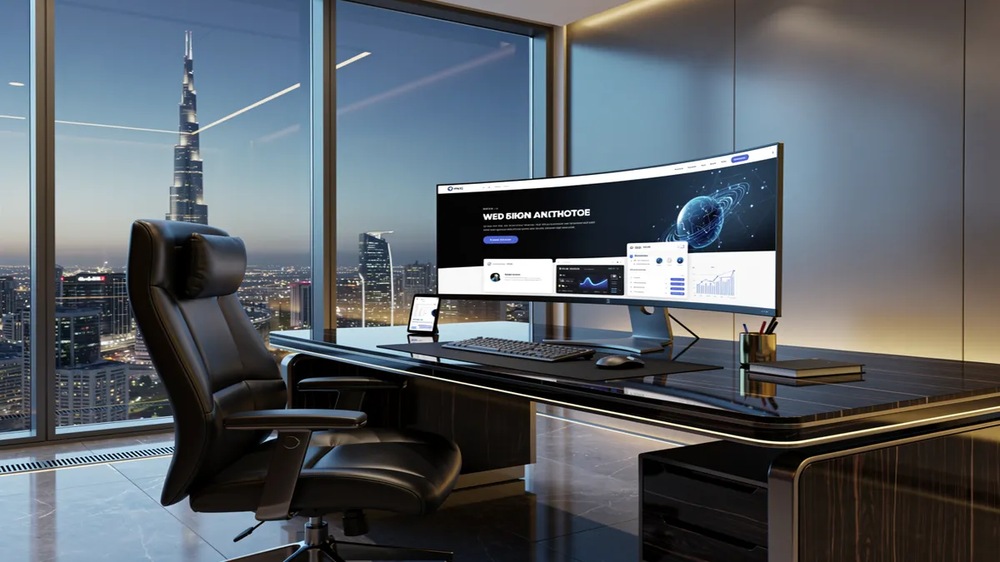
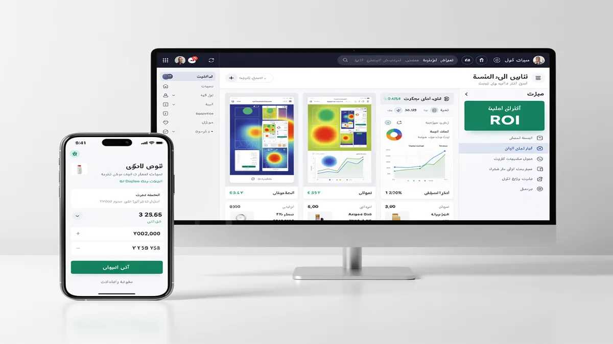
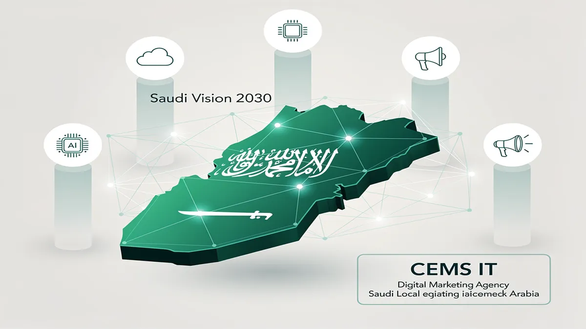
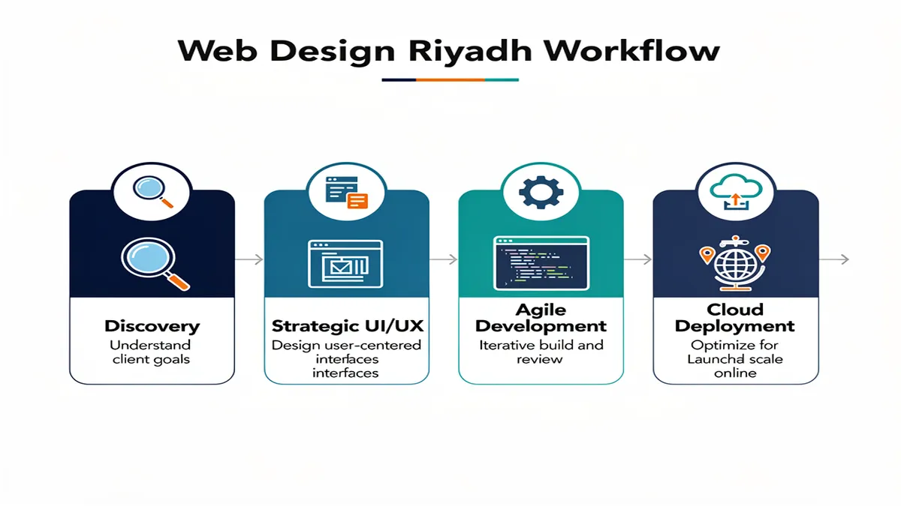
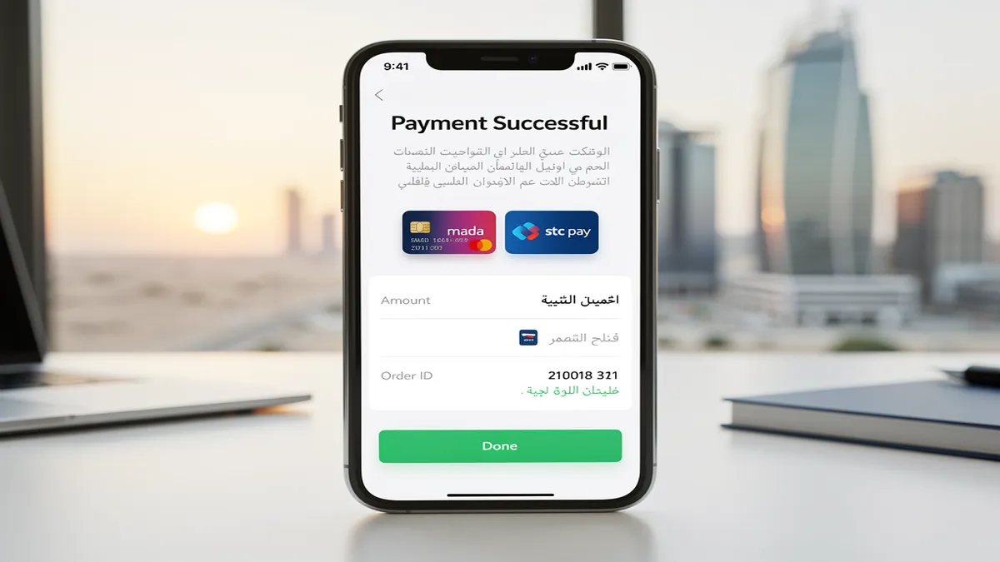
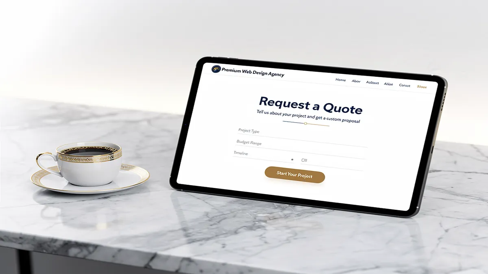

# Top Web Design Agency in Riyadh: Expert Web Solutions 2025

## Transforming Your Digital Presence: Premier Web Design Agency in Riyadh

<!-- section_id: sec_01 -->

**Secure your 2025 digital strategy** by partnering with a [Web Design Agency](https://cems-it.com/) that prioritizes high-conversion architectures and Saudi market nuances. In the competitive landscape of Riyadh, your website must function as a high-performance sales engine that aligns with Saudi Vision 2030 digital transformation goals.

**Dominate local search results** through integrated **SEO Services** that ensure your brand appears exactly when your customers are searching. By implementing mobile-first indexing specifically optimized for Saudi Arabia's high smartphone penetration, we bridge the gap between initial discovery and final transaction.

**Scale your revenue effortlessly** with robust **E-commerce** solutions featuring seamless **Mada Integration** and Apple Pay compatibility. Our development process focuses on **Conversion Rate Optimization**, ensuring that every visitor to your Riyadh-based platform is guided through a frictionless path to purchase.

**Future-proof your infrastructure** by leveraging advanced **Cloud Migration** and custom **AI Solutions** to automate customer interactions. We specialize in **RTL Design** and high-end **Content & Graphics** that resonate with the cultural aesthetic of the Middle East while maintaining global performance standards.

### Strategic Digital Capabilities for Riyadh Businesses

| Feature | Business Impact | Strategic Value |

| :--- | :--- | :--- |

| **RTL UX Design** | Enhanced local user engagement | Cultural alignment & trust |

| **Enterprise Web Solutions** | Support for high-traffic scalability | Long-term operational stability |

| **Machine Learning** | Personalized user experiences | Higher retention & LTV |

| **Digital Marketing** | Targeted lead generation | Measurable ROI & market share |

**Elevate your brand authority** with a cohesive **Branding** strategy that reflects the sophistication of modern **Web Development**. From initial wireframing to post-launch technical support, our approach ensures your digital presence remains a competitive asset rather than a static expense.

**Request your technical audit for the Riyadh market** today to identify growth opportunities and performance bottlenecks. Our team at **CEMS IT** is ready to transform your vision into a high-performing digital reality that leads the industry.

## Measurable Business ROI Through Strategic UI/UX Design

<!-- section_id: sec_02 -->

Your business gains a distinct competitive edge in the Riyadh market by deploying a high-performance **Web Design Agency** strategy that prioritizes conversion-centric **UI/UX Design**. You can accelerate your digital growth and capture a larger market share by requesting your 2025 digital strategy today to align your platform with evolving consumer behaviors.

**E-commerce** platforms optimized with personalized **Machine Learning** algorithms significantly increase average order values by predicting customer preferences in real-time. We integrate local payment solutions like **Mada Integration** to reduce cart abandonment and ensure a frictionless checkout experience for Saudi users.

**Branding** consistency across your digital ecosystem establishes immediate trust and authority, which is essential for successful **Digital Marketing** campaigns. Our **Web Development** approach utilizes **RTL Design** and high-end **Content & Graphics** to ensure your message resonates culturally while maintaining global performance standards.

### Strategic Technical Advantages for Riyadh Enterprises

| Feature | Business Impact | Technical Foundation |

| :--- | :--- | :--- |

| **Cloud Migration** | Ensures 99.9% uptime and global scalability | AWS/Azure Enterprise Infrastructure |

| **AI Solutions** | Automates customer support and lead scoring | Custom NLP & Predictive Analytics |

| **SEO Services** | Drives organic traffic via **Mobile-first Indexing Saudi Arabia** | Core Web Vitals Optimization |

| **Enterprise Web Solutions** | Supports high-volume transactions and data security | Robust Backend Architecture |

**Conversion Rate Optimization** (CRO) transforms your website from a static brochure into a 24/7 sales engine aligned with **Saudi Vision 2030** digital goals. By leveraging advanced data analytics, we identify and eliminate friction points, ensuring your technical infrastructure serves as a scalable asset for long-term ROI.

Request your technical audit for the Riyadh market to identify growth opportunities and performance bottlenecks.

## Why CEMS IT Leads the Saudi Digital Marketing Landscape

<!-- section_id: sec_03 -->

Maximize your market dominance in Riyadh by partnering with a **Web Design Agency** that integrates advanced **AI Solutions** to predict consumer behavior and automate high-value lead nurturing. Request your 2025 digital strategy today to align your technical infrastructure with the rapid economic shifts of the Saudi market.

Accelerate your platform’s performance through seamless **Cloud Migration** and **Web Development** frameworks that ensure 99.9% uptime during high-traffic local shopping seasons. By deploying **Enterprise Web Solutions** built on scalable architectures, your business maintains operational stability while expanding its digital footprint across the Kingdom.

Capture local search intent with specialized **SEO Services** optimized for **Mobile-first Indexing Saudi Arabia**, ensuring your brand ranks at the top of Google’s results. Our approach focuses on **Conversion Rate Optimization** to turn organic traffic into loyal customers through localized user journeys and high-performance technical foundations.

### High-Impact Digital Capabilities for the Saudi Market

| Strategic Pillar | Technical Execution | Business Outcome |

| :--- | :--- | :--- |

| **Digital Marketing Agency Saudi Arabia** | Data-driven omnichannel campaigns | Accelerated ROI and measurable brand growth |

| **Content & Graphics** | Cultural storytelling & high-fidelity visuals | Enhanced brand trust and local resonance |

| **RTL Design** | Native Right-to-Left UX architecture | Seamless navigation for Arabic-speaking users |

| **Mada Integration** | Secure local payment gateway connectivity | Reduced cart abandonment and higher checkout rates |

Strengthen your brand identity with cohesive **Branding** that reflects the vision of **Saudi Vision 2030** while utilizing **Machine Learning** to personalize every user interaction. This data-centric approach to **Digital marketing** ensures your **E-commerce** platform evolves alongside your customers' expectations and technological advancements.

Drive sustainable revenue growth by implementing sophisticated **Web Development** strategies that prioritize speed, security, and cultural relevance. Get your technical audit for the Riyadh market to identify performance bottlenecks and unlock new opportunities for digital expansion.

## Our Performance-Driven Web Development Process

<!-- section_id: sec_04 -->

**Accelerate your market entry in Riyadh** by partnering with a specialized Web Design Agency that synchronizes your technical architecture with the specific growth trajectories of the Saudi economy. Request your 2025 digital strategy today to ensure your platform is engineered for the high-velocity demands of the local market.

**Maximize your operational efficiency** through custom Web Development that integrates Machine Learning to automate complex user interactions and predict consumer buying patterns. This data-driven approach allows your business to scale Enterprise Web Solutions while maintaining the lean agility required for rapid expansion.

**Enhance your brand’s cultural resonance** by deploying high-fidelity Content & Graphics paired with native RTL Design to build immediate trust with your target audience. We ensure your digital presence reflects the sophistication of Saudi Vision 2030 while maintaining global performance standards across all touchpoints.

**Drive sustainable revenue growth** by implementing a technical foundation that prioritizes Mobile-first Indexing Saudi Arabia and seamless Mada Integration for frictionless transactions. Our performance-driven methodology focuses on the following core pillars to ensure long-term ROI:

| Strategic Focus | Technical Implementation | Business Outcome |

| :--- | :--- | :--- |

| **Scalability** | Cloud Migration & Enterprise Web Solutions | 99.9% uptime during peak Saudi shopping seasons |

| **Conversion** | Conversion Rate Optimization (CRO) | Reduced bounce rates and higher average order values |

| **Intelligence** | AI Solutions & Machine Learning | Personalized user journeys that increase customer LTV |

| **Visibility** | Advanced SEO Services | Dominant organic rankings for high-intent local keywords |

**Future-proof your digital infrastructure** by leveraging enterprise-grade frameworks that support complex E-commerce ecosystems and multi-channel Digital marketing campaigns. By aligning your Branding with high-performance code, you transform your website from a static asset into a powerful engine for market dominance.

## Proven Success: Driving Impact for Riyadh’s Leading Enterprises

<!-- section_id: sec_05 -->

Maximize your market share in Riyadh by partnering with a specialized **Web Design Agency** that synchronizes your technical architecture with the specific growth trajectories of the Saudi economy. Request your 2025 digital strategy today to ensure your platform is engineered for the high-velocity demands of the local market.

**Accelerate your platform’s performance** through seamless Cloud Migration and Web Development frameworks that ensure 99.9% uptime during high-traffic local shopping seasons. By deploying Enterprise Web Solutions built on scalable architectures, your business maintains operational stability while expanding its digital footprint across the Kingdom.

**Capture local search intent** with specialized SEO Services optimized for Mobile-first Indexing Saudi Arabia, ensuring your brand ranks at the top of Google’s results. Our approach focuses on Conversion Rate Optimization to turn organic traffic into loyal customers through localized user journeys and high-performance technical foundations.

**Enhance your brand’s cultural resonance** by deploying high-fidelity Content & Graphics paired with native RTL Design to build immediate trust with your target audience. We ensure your digital presence reflects the sophistication of Saudi Vision 2030 while maintaining global performance standards across all touchpoints.

| Strategic Pillar | Technical Execution | Business Outcome |

| :--- | :--- | :--- |

| Digital Marketing | Data-driven omnichannel campaigns | Accelerated ROI and measurable growth |

| Branding | Cultural storytelling & high-fidelity visuals | Enhanced brand trust and local resonance |

| Machine Learning | Predictive user behavior algorithms | Personalized experiences & higher LTV |

| Mada Integration | Secure local payment connectivity | Reduced cart abandonment rates |

**Maximize your operational efficiency** through custom Web Development that integrates AI Solutions to automate complex user interactions and predict consumer buying patterns. This data-driven approach allows your business to scale while maintaining the lean agility required for rapid expansion in the Riyadh market.

**Drive sustainable revenue growth** by implementing a technical foundation that prioritizes speed, security, and seamless Mada Integration for frictionless transactions. According to [Google’s Core Web Vitals documentation](https://web.dev/vitals/), optimizing for loading, interactivity, and visual stability is essential for maintaining a competitive edge in modern search landscapes.

## Frequently Asked Questions About Web Solutions in Saudi Arabia

<!-- section_id: sec_06 -->

### **What is the average timeline for a custom web design project in Riyadh?**

Standard enterprise projects typically require 8 to 12 weeks to move from initial wireframing to a live production environment. This duration ensures your **Web Design Agency** partner can conduct thorough local market research and iterative UX testing.

High-complexity platforms involving custom **Web Development** or extensive third-party integrations may extend to 16 weeks. Prioritizing a phased rollout allows you to capture market share early while refining advanced features in subsequent sprints.

### **Do you provide post-launch maintenance and technical support in Saudi Arabia?**

Continuous technical oversight ensures your platform maintains peak performance and remains protected against evolving cybersecurity threats. Professional support packages include real-time monitoring, library updates, and database optimization to prevent downtime during high-traffic periods.

Active maintenance also focuses on **Conversion Rate Optimization** by analyzing user heatmaps and behavior flow within the Riyadh market. Regular audits allow for incremental adjustments that align your digital presence with the latest search engine algorithm shifts.

### **How does your agency handle Arabic localization and RTL interface design?**

Native **RTL Design** involves more than simple text mirroring; it requires a complete reconfiguration of the visual hierarchy to match regional reading patterns. We ensure that **Content & Graphics** are culturally resonant and logically positioned to guide Saudi users toward your primary call to action.

Our development framework prioritizes linguistic precision and local typography that enhances readability across all device types. This specialized approach ensures your brand maintains its global identity while appearing natively built for the Middle East.

### **What are the typical pricing structures for enterprise-level web development?**

Investment levels for professional **Web Design Riyadh** services are generally calculated based on technical complexity, integration requirements, and the scale of data migration. Most elite agencies provide milestone-based pricing that aligns with specific delivery phases like prototyping, development, and QA.

| Project Tier | Core Focus | Estimated Value |

| :--- | :--- | :--- |

| Custom Corporate | Branding & Lead Gen | Middle-Market Investment |

| Advanced E-commerce | **Mada Integration** & UX | High-Growth Investment |

| Enterprise Solutions | **AI Solutions** & **Cloud Migration** | Strategic Asset Investment |

### **Can you integrate local Saudi payment gateways like Mada and STC Pay?**

Seamless transaction processing is achieved through direct API integration with local providers like Mada, STC Pay, and Apple Pay. These localized **E-commerce** solutions are essential for reducing cart abandonment and building consumer trust within the Kingdom.

We ensure all payment architectures comply with Saudi Arabian Monetary Authority (SAMA) standards for data security and encryption. This technical alignment provides your customers with a frictionless checkout experience while securing your revenue streams.

### **How does SEO impact my website's performance in the Riyadh market?**

Localized **SEO Services** ensure your business appears at the top of search results when regional customers look for specific solutions. By focusing on **Mobile-first Indexing Saudi Arabia**, we optimize your site for the high smartphone usage rates prevalent in the local economy.

Strategic keyword mapping and technical optimization increase your organic reach without the recurring costs of paid advertising. This long-term visibility strategy is vital for establishing authority and outperforming competitors in the digital landscape.

### **What role do AI and Machine Learning play in modern web solutions?**

Integrating **Machine Learning** allows your platform to deliver personalized content recommendations based on individual user browsing habits. These **AI Solutions** automate customer service through intelligent chatbots and predictive analytics, significantly improving operational efficiency.

By leveraging data-driven insights, your website evolves from a static page into an adaptive sales environment. This technological edge helps you stay ahead of market trends and meet the high expectations of tech-savvy Saudi consumers.

### **Why is branding consistency important for my digital strategy?**

A cohesive **Branding** strategy across all digital touchpoints establishes immediate credibility and differentiates your business in a crowded marketplace. It ensures that your visual identity and messaging remain synchronized, fostering long-term loyalty among your target audience.

Strong brand alignment supports your broader **Digital marketing** efforts by making your campaigns more recognizable and impactful. When your website reflects your core values, it becomes a more effective tool for converting visitors into brand advocates.

## Ready to Dominate the Riyadh Market? Let’s Build Your Digital Future

<!-- section_id: sec_07 -->

Partnering with a premier **Web Design Agency** in Riyadh allows your business to transcend traditional boundaries and capture the massive digital shift occurring under Saudi Vision 2030. You can immediately accelerate your market share by requesting your 2025 digital strategy to align your technical infrastructure with the rapid economic evolution of the Kingdom.

Your enterprise gains a decisive edge through high-performance **Web Development** that integrates **Machine Learning** to automate complex user interactions and predict consumer buying patterns. This data-centric approach ensures your **Enterprise Web Solutions** maintain the lean agility required for rapid expansion while supporting high-volume traffic.

**Digital Marketing Agency Saudi Arabia** expertise transforms your platform into a revenue engine by synchronizing your technical architecture with localized search behaviors. By deploying **AI Solutions** and **Cloud Migration**, you ensure 99.9% uptime and personalized journeys that significantly increase customer lifetime value.

| Strategic Pillar | Technical Execution | Business Outcome |

| :--- | :--- | :--- |

| **RTL Design** | Native Right-to-Left UX architecture | Seamless navigation for Saudi users |

| **Mada Integration** | Secure local payment connectivity | Reduced cart abandonment rates |

| **SEO Services** | **Mobile-first Indexing Saudi Arabia** | Dominant organic rankings for Riyadh |

| **Branding** | Cultural storytelling & high-fidelity visuals | Enhanced brand trust and local resonance |

You will drive sustainable revenue growth by implementing a foundation that prioritizes speed, security, and high-end **Content & Graphics** that resonate with the Middle Eastern aesthetic. Every element of your **E-commerce** ecosystem is optimized for **Conversion Rate Optimization**, ensuring that your **Digital marketing** spend translates into measurable ROI and market dominance.