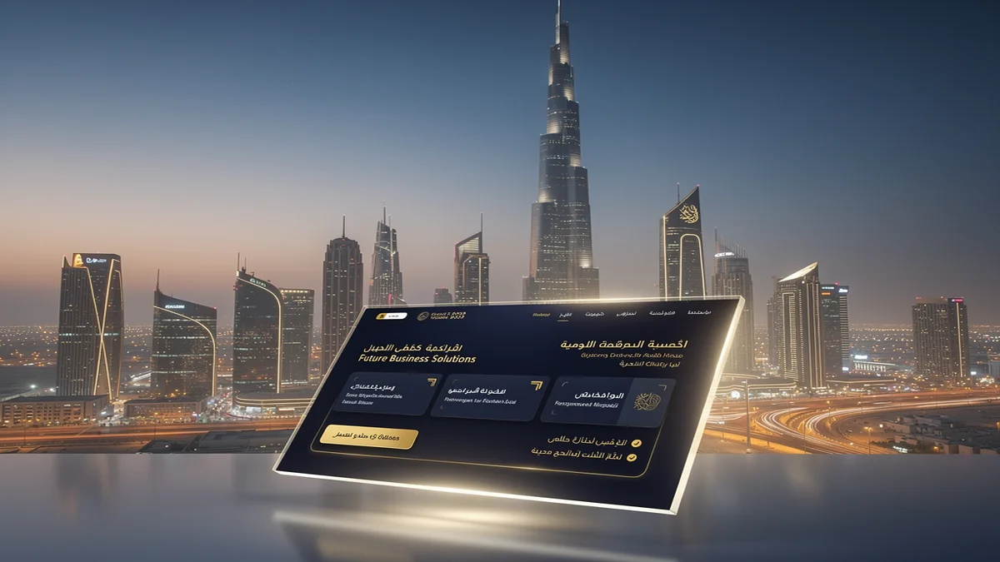
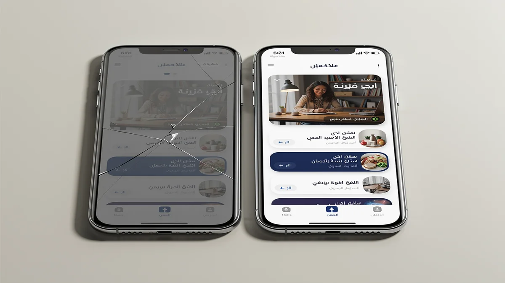
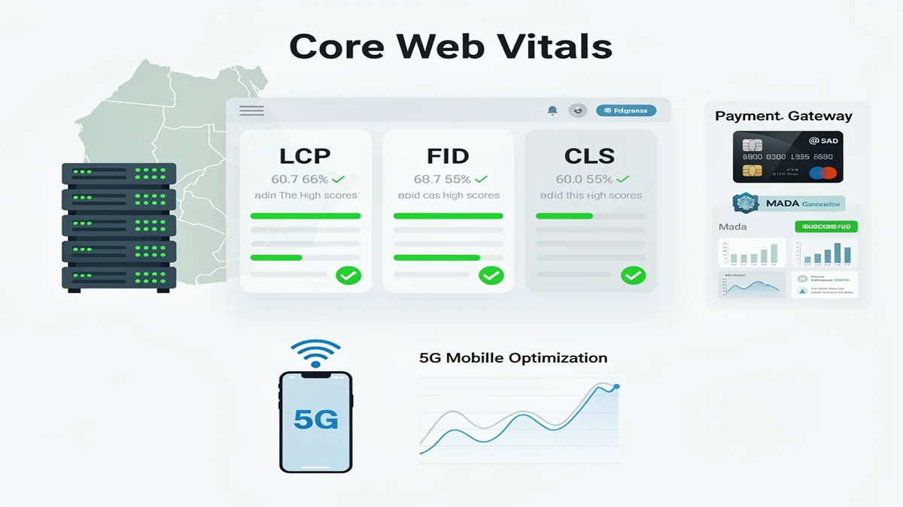
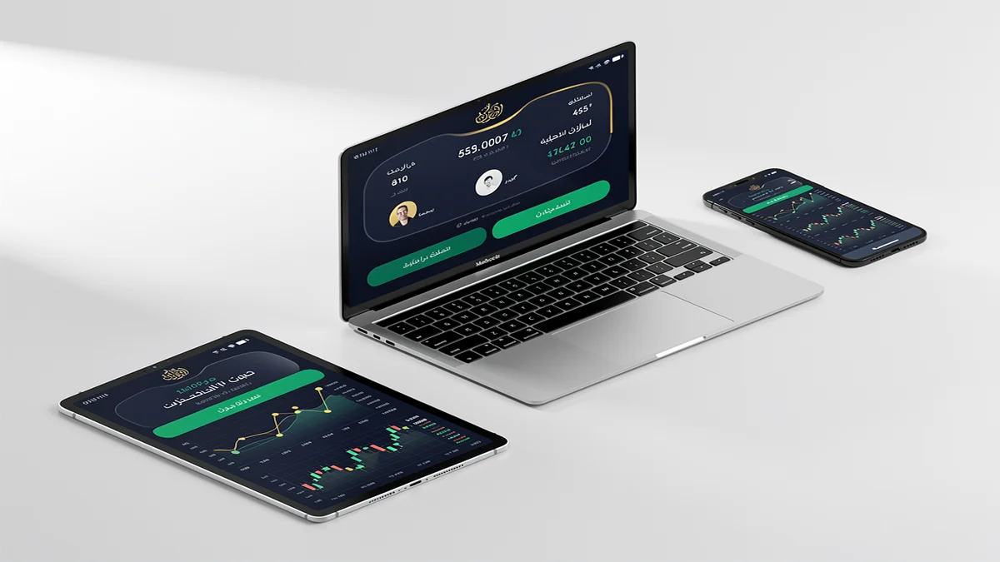
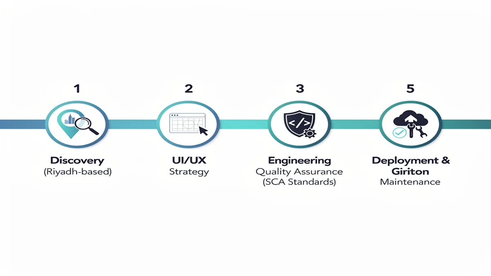

# Top Web Design Agency in Riyadh: Custom Digital Solutions 2024

## Top Web Design Agency in Riyadh: Custom Digital Solutions 2024

<!-- section_id: sec_intro -->

In the fast-evolving digital landscape of Saudi Arabia, partnering with a premier **Web Design Agency** in Riyadh is no longer a luxury but a strategic necessity for market leadership. **CEMS IT** delivers high-performance digital platforms that bridge the gap between global innovation and the specific cultural nuances of the Saudi market. [Secure your market share today with a custom-built digital experience from CEMS IT.](https://cems-it.com/)

Riyadh’s consumer base exhibits some of the highest mobile penetration rates globally, demanding web architecture that is both lightning-fast and mobile-first. Our approach to **Web Design Riyadh** focuses on capturing this local traffic by aligning every pixel with the ambitious digital standards set by Saudi Vision 2030. We transform standard websites into powerful conversion engines that resonate with local user expectations and browsing habits.

Beyond aesthetics, our comprehensive **web development** strategies integrate advanced **e-commerce** functionalities and robust **SEO services** to ensure your brand dominates search results. By prioritizing high-conversion UI/UX and technical excellence, we help businesses navigate the competitive Riyadh economy with confidence. Every solution we build is engineered to turn casual visitors into loyal customers through seamless, localized digital journeys.

## Why Generic Web Design Fails in the Riyadh Business Ecosystem

<!-- section_id: sec_market -->

In Riyadh’s hyper-competitive market, relying on generic offshore templates is a high-stakes gamble that often leads to total brand invisibility. A specialized **Web Design Agency** understands that a website failing to account for Saudi user behavior results in immediate abandonment and lost revenue. When local enterprises ignore the technical demands of the Riyadh business ecosystem, they risk alienating a demographic that expects instant, high-end digital interactions.

The technical risk of ignoring RTL (Right-to-Left) optimization is one of the primary drivers of high bounce rates among Saudi users. Standard **UI/UX Design** frameworks often break when flipped for Arabic, creating fragmented layouts that signal a lack of professionalism and local credibility. Without precise engineering for the local market, your digital presence becomes a liability that actively drives potential customers toward competitors who prioritize cultural alignment.

Slow loading speeds further compound these risks, as Riyadh-based users have zero tolerance for latency in a region defined by rapid digital transformation. Integrating advanced **cloud services** and localized **AI solutions** is no longer optional; it is the baseline for maintaining operational stability and user trust. Failing to modernize your infrastructure through expert **Web Design Riyadh** standards means your **branding** efforts will suffer under the weight of a sluggish, non-responsive interface.

## Engineering High-Performance Ecosystems: The CEMS IT Technical Stack

<!-- section_id: sec_tech -->

Our engineering philosophy centers on technical precision, positioning CEMS IT as a leading Web Design Agency in Riyadh for enterprises requiring high-performance infrastructure. We utilize a modern stack optimized for Saudi Arabia’s unique digital landscape, ensuring every line of code contributes to rapid load times and superior Core Web Vitals. By deploying on KSA-based cloud servers, we achieve ultra-low latency that caters specifically to the region's high-speed 5G mobile users.

The architectural backbone of our solutions integrates advanced programming standards to support complex system integration requirements. This technical depth allows us to bridge the gap between front-end aesthetics and backend reliability, particularly for high-traffic e-commerce platforms. Our developers prioritize clean, modular code that facilitates seamless scaling as your business operations expand across the Kingdom.

Security and localization are embedded within our technical framework, featuring native support for regional payment gateways and secure data handling. As a comprehensive Digital Marketing Agency Saudi Arabia, we ensure that every technical deployment is pre-optimized for search engine crawlers and local indexing. This rigorous approach to system integration guarantees that your digital ecosystem remains resilient, secure, and fully compliant with local data regulations.

## Measurable Impact: Transforming Saudi Enterprises through Strategic Design

<!-- section_id: sec_proof -->

Our track record as a premier Web Design Agency in Riyadh is defined by high-stakes deployments for the Kingdom’s most demanding sectors. We have successfully re-engineered digital architectures for Riyadh-based real estate conglomerates and fintech disruptors, ensuring every platform meets the rigorous performance benchmarks of the local market. By focusing on conversion-centric interfaces, we transform digital assets into high-yield instruments that dominate their respective niches.

In the government sector, our solutions prioritize absolute data integrity and compliance with Saudi Cybersecurity Authority (SCA) standards. We integrate advanced SEO services from the architecture phase, ensuring that public-facing portals achieve maximum visibility while maintaining the highest levels of national data privacy. These projects demonstrate our ability to balance complex local regulations with world-class user experience design.

The ROI delivered to our Saudi enterprise clients is reflected in significant upticks in lead generation and operational efficiency. We move beyond aesthetics to solve structural business challenges, such as reducing bounce rates for high-traffic e-commerce sites and optimizing mobile journeys for 5G-enabled users. Our portfolio serves as a testament to digital excellence that respects both regional cultural values and global technical standards.

## From Discovery to Deployment: Our 5-Step Riyadh Project Roadmap

<!-- section_id: sec_process -->

Transparency is the cornerstone of our partnership. When you collaborate with a leading **Web Design Agency** in Riyadh, you gain access to a structured workflow designed to align with the Kingdom’s fast-paced business environment. We begin with in-person discovery sessions at your Riyadh office to capture your specific objectives and local market requirements.

The transition from strategy to execution involves rigorous **web development** and prototyping. Our technical team utilizes advanced **programming** frameworks to build scalable architectures that handle high traffic volumes without compromising speed. This phase ensures that every functional requirement is stress-tested against the unique digital behaviors of Saudi users.

Deployment is not the end of our journey but the beginning of your platform's lifecycle. We manage the entire launch process, ensuring seamless server integration and immediate post-launch monitoring to maintain peak performance. Following the go-live date, we provide localized support within your time zone to handle updates and technical refinements.

Our maintenance cycle is proactive rather than reactive, focusing on long-term stability and security. We conduct regular audits to ensure your system remains compliant with evolving regional data standards and technical benchmarks. This transparent roadmap eliminates guesswork, providing your stakeholders with clear milestones and a reliable timeline for digital success.

## Expert Insights: Navigating Web Development in Saudi Arabia

<!-- section_id: sec_faq -->

### How does a Web Design Agency ensure compliance with Saudi data regulations?

Operating within the Riyadh digital ecosystem requires strict adherence to the National Data Management Office (NDMO) guidelines and localized cybersecurity frameworks. Agencies prioritize hosting on domestic **cloud services** to ensure data residency requirements are met while maintaining low-latency performance for local users.

### What role do AI solutions play in modern Saudi web development?

Integrating localized **AI solutions** allows businesses to automate customer service through Arabic-natural language processing tailored to regional dialects. These tools enhance user engagement by providing personalized experiences that align with the rapid digital transformation goals of Vision 2030.

### Why is RTL (Right-to-Left) optimization critical for the KSA market?

Effective web development in Saudi Arabia must account for the linguistic mechanics of Arabic to prevent layout fragmentation and poor user retention. Proper RTL mirroring ensures that navigation, typography, and visual hierarchy remain intuitive for the local demographic, fostering trust and professional credibility.

### How do global web standards adapt to Saudi Arabia’s hosting infrastructure?

While global coding standards provide the foundation, the local market reality necessitates infrastructure that supports high-speed 5G mobile penetration across the Kingdom. Technical architectures are often optimized for regional peering points to ensure that high-performance platforms remain accessible and stable during peak traffic periods.

## Future-Proof Your Brand with Riyadh’s Leading Web Design Agency

<!-- section_id: sec_conclusion -->

Securing a dominant position in the Kingdom’s capital requires more than a functional website; it demands a partnership with a specialized **Web Design Agency** that understands the velocity of the Riyadh market. Our implementation process is engineered to move your brand from a conceptual roadmap to a high-performance reality with surgical precision.

The transition from strategic wireframing to full-scale deployment involves a rigorous sprint where we synchronize your backend infrastructure with the specific demands of the Saudi digital ecosystem. **CEMS IT** manages every technical variable, from local server configuration to the integration of complex API layers, ensuring your platform is resilient enough to handle the scaling requirements of Vision 2030.

We eliminate the friction typical of large-scale digital transitions by providing a clear, phased rollout that prioritizes uptime and data integrity. This hands-on execution ensures that your brand does not just enter the market, but leads it through technical superiority and localized excellence. **Web Design Riyadh** is the foundation of your future market share, and our team is ready to deploy the architecture that will sustain your growth for years to come.