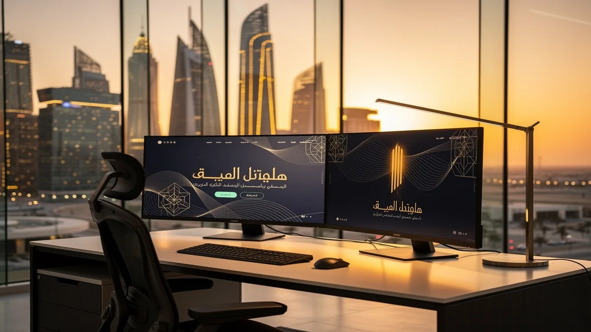
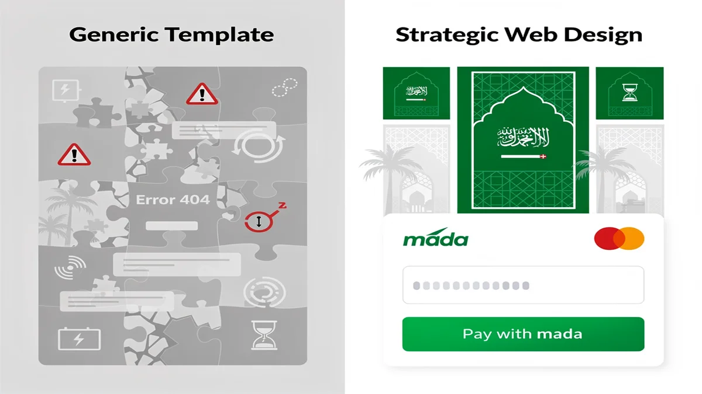
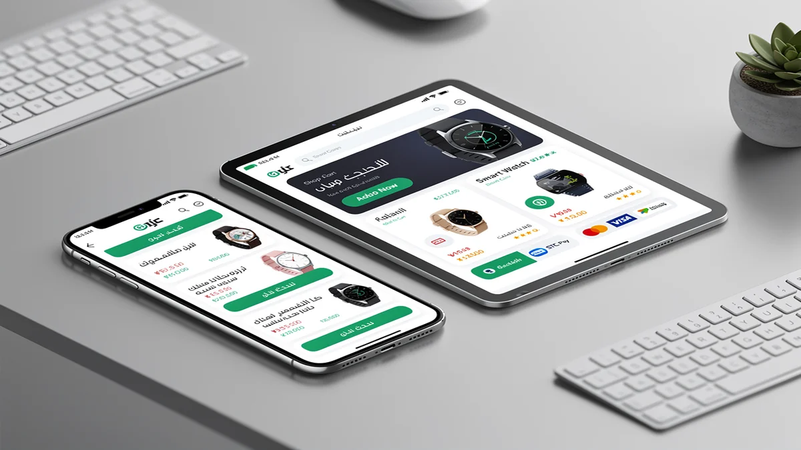
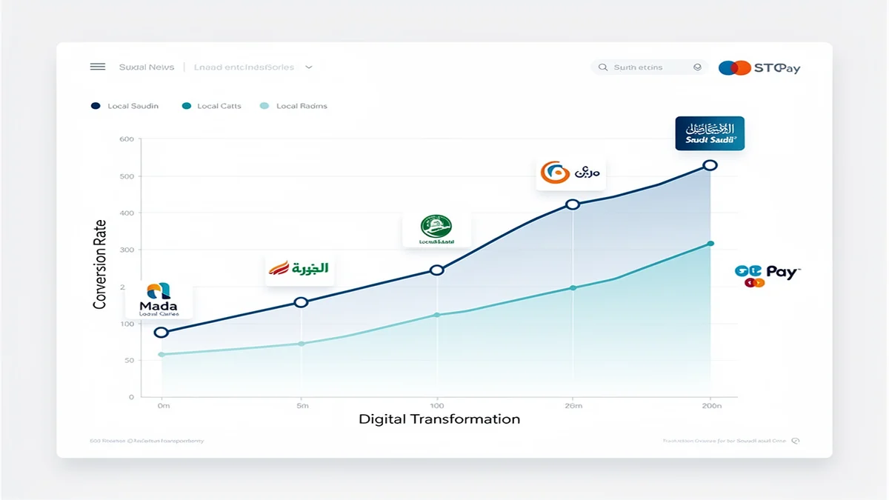
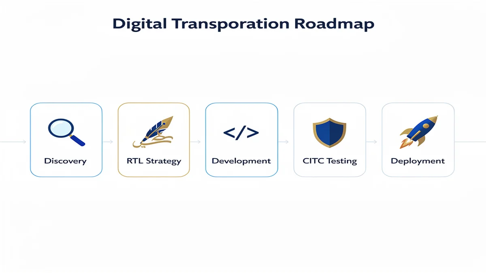

# Top Web Design Agency in Riyadh: Expert Solutions for 2026

## Riyadh’s Digital Evolution: Why Your Business Needs a Strategic Web Design Agency

<!-- section_id: sec_01 -->

In the heart of Saudi Arabia’s rapid digital transformation, your business faces a competitive landscape where a standard website is no longer enough to capture the market. Partnering with a premier **Web Design Agency** in Riyadh ensures you leverage high-performance platforms that align with the Kingdom’s Vision 2030 goals for a robust digital economy. By choosing CEMS IT Official Website, you gain access to a programming and web development agency that prioritizes speed, security, and local user behavior to give you a definitive edge.

Your growth depends on a seamless fusion of AI-driven digital solutions and sophisticated web content graphics solutions that convert visitors into loyal customers. Whether you are scaling a startup or modernizing an established enterprise, you need a strategic partner in Web Design Riyadh to navigate the shift toward digital-first commerce effectively. Start your digital transformation today with CEMS IT.

## The Risk of Generic Templates in the Saudi Market

<!-- section_id: sec_02 -->

Relying on a cheap, generic template is a significant gamble that can jeopardize your brand’s reputation in the competitive Riyadh market. When you work with a professional **Web Design Agency**, you avoid the "uncanny valley" of broken layouts and misaligned Arabic typography that often plagues off-the-shelf themes. Your Saudi customers expect a premium, localized experience, and failing to provide an Arabic-first UI/UX design can lead to immediate bounce rates and lost revenue.

Your business cannot afford the hidden costs of slow loading times on local mobile networks caused by bloated, unoptimized code. By prioritizing a custom-built solution, you ensure seamless responsive design and high-performance integration with local Saudi infrastructure. Beyond aesthetics, neglecting professional standards like secure cloud migration and scalable e-commerce websites leaves your digital assets vulnerable and unable to compete with sophisticated local players.

The specific risks of using generic templates in the Kingdom include:

*   **Cultural Disconnect:** Incompatible RTL (Right-to-Left) layouts that alienate your local Saudi audience.
*   **Performance Bottlenecks:** Heavy, unoptimized scripts that fail to load quickly on regional 5G and fiber networks.
*   **SEO Penalties:** Poorly structured code that prevents your site from ranking for critical local search terms.
*   **Security Vulnerabilities:** Outdated plugins and shared vulnerabilities that put your customer data at risk.

### Bilingual UX Excellence: Balancing Arabic and English

<!-- section_id: sec_03 -->

When you target the Riyadh market, your digital presence must respect the specific linguistic and cultural nuances of Saudi users. A professional **Web Design Agency** ensures that your Right-to-Left (RTL) Arabic interface is not just a mirrored version of an English site, but a purpose-built experience that prioritizes professional Arabic typography and intuitive navigation. Failing to harmonize these two languages often results in broken layouts and a disjointed user journey, which directly threatens your brand’s credibility and customer retention rates.

Your business risk increases significantly if your platform lacks a cohesive strategy for **web content graphics solutions** across both languages. By investing in a sophisticated **digital transformation**, you can leverage **machine learning integration** to automate content localization while maintaining high-performance **SEO services** for both Arabic and English search queries. This technical precision ensures that your site remains functional and aesthetically balanced, preventing the high bounce rates associated with poorly executed bilingual transitions.

## Future-Proofing with Advanced Programming and Web Development Agency Systems

<!-- section_id: sec_04 -->

To secure your competitive advantage in the Riyadh market, your digital infrastructure requires more than just aesthetic appeal; it demands a robust technical foundation. By partnering with a leading **Web Design Agency**, you ensure your platform is built on a modern stack that supports high-speed performance and seamless scalability. Your business will benefit from advanced systems that prioritize local data residency and strict adherence to [CITC regulations](https://www.citc.gov.sa), ensuring your operations remain compliant with Saudi Arabian data sovereignty laws.

Your transition toward a future-proof architecture is facilitated by a specialized programming and web development agency that integrates cutting-edge automation and security protocols. You can leverage a strategic cloud migration to reduce latency for your local users while maintaining the flexibility to expand globally. By adopting these high-performance systems, you protect your digital assets against technical debt and ensure your site remains functional as regional infrastructure evolves.

*   **AI-Driven Digital Solutions:** Implement smart automation and predictive analytics to personalize the user journey for your Saudi customers.
*   **Machine Learning Integration:** Utilize advanced algorithms to optimize search functionality and automate complex content categorization.
*   **Cloud-Native Architecture:** Deploy your applications on secure local servers to meet residency requirements and enhance loading speeds across the Kingdom.
*   **Scalable API Frameworks:** Ensure your website can effortlessly connect with local payment gateways and third-party logistics providers.

## Proven Success: Why We Are the Top Web Design Agency in Riyadh

<!-- section_id: sec_05 -->

When you choose us as your **Web Design Agency**, you are investing in a partner that consistently delivers high-performance results within the Riyadh market. Your business benefits from our deep expertise in local financial ecosystems, ensuring your platform is fully compatible with Mada and STC Pay to maximize your conversion rates.

Your project will adhere to the highest standards of the Saudi digital economy, including full compliance with the E-commerce Law and local data regulations. By integrating your brand into the local infrastructure, we function as a premier Digital Marketing Agency Saudi Arabia that prioritizes ROI through technical precision and cultural relevance.

| Metric / Integration | Business Impact for You | Riyadh Market Standard |
| :--- | :--- | :--- |
| Mada & STC Pay Integration | Increases your checkout success rate by up to 40% | Essential for Saudi Consumer Trust |
| Saudi E-commerce Law Compliance | Protects your business from legal risks and fines | Mandatory Regulatory Requirement |
| Local Server Latency (KSA) | Provides your users with sub-100ms loading speeds | Critical for Mobile User Retention |
| Arabic-First UI/UX Design | Enhances your brand authority with local audiences | Industry Best Practice |

## Your Digital Transformation Roadmap: From Discovery to Deployment

<!-- section_id: sec_06 -->

When you begin your journey with a professional **Web Design Agency**, your project moves through a structured lifecycle designed to align with the unique demands of the Riyadh market. This process starts with a discovery phase where we audit your current digital footprint and map out a strategy that integrates high-performance **SEO services** to ensure your brand is visible to local customers from day one.

Your vision then transitions into a collaborative design phase that prioritizes Saudi professional standards, ensuring your user interface respects cultural nuances and linguistic flow. We focus on building robust **e-commerce websites** and corporate platforms that undergo rigorous testing before deployment, facilitating a seamless **digital transformation** that prepares your business for long-term scalability in the Kingdom’s evolving economy.

### Phase 1: Localized UI/UX Strategy & Prototyping

<!-- section_id: sec_07 -->

Your digital presence starts with a blueprint tailored specifically to the cultural and behavioral nuances of the Riyadh market. When you partner with a professional **Web Design Agency**, our initial phase focuses on translating your business goals into a high-fidelity prototype that prioritizes local user expectations. We move beyond basic aesthetics to ensure your platform’s information architecture supports both English and Arabic speakers with equal efficiency.

During this stage, we place a heavy emphasis on localized **UI/UX Design** to master the complexities of Right-to-Left (RTL) navigation. You will review detailed wireframes that account for Arabic typography and visual hierarchy, ensuring your Saudi customers experience a natural and intuitive flow. This proactive approach allows you to visualize the final product and refine the user journey before a single line of code is written, saving you time and ensuring technical alignment with regional standards.

## Frequently Asked Questions About Web Design in Riyadh

<!-- section_id: sec_08 -->

### Does a Web Design Agency in Riyadh provide local hosting solutions?

When you develop a digital platform in the Kingdom, your data residency and loading speeds are governed by local performance standards. A professional **Web Design Agency** will typically recommend hosting your website on Saudi-based servers to ensure compliance with CITC regulations and to minimize latency for your local users. By keeping your data within the country, you provide a faster, more secure experience that aligns with the technical requirements of the Riyadh market.

### How is Arabic SEO managed for the Saudi market?

Your visibility on local search engines depends on a strategy that prioritizes the linguistic nuances of the Saudi audience. A specialized **Digital Marketing Agency Saudi Arabia** focuses on right-to-left (RTL) technical optimization and localized keyword research that reflects how users in Riyadh actually search. This approach ensures your content is not just translated, but culturally adapted to rank effectively for both Arabic and English queries.

### Is Mada integration mandatory for e-commerce in Riyadh?

If you are launching an e-commerce store, providing your customers with familiar payment methods is essential for building trust and completing transactions. Integrating Mada is a standard requirement for **Web Design Riyadh** projects, as it is the most widely used payment network in the Kingdom. Ensuring your checkout process supports Mada, alongside other local options like STC Pay, directly impacts your conversion rates and helps your business stay compliant with Saudi e-commerce laws.

## Secure Your Digital Future in Riyadh Today

<!-- section_id: sec_09 -->

Your business cannot afford to wait while the Riyadh market moves toward the 2026 digital standards. By partnering with a dedicated **Web Design Agency**, you ensure your implementation process is handled with technical precision, from initial architecture to the final deployment of localized assets. You will receive a scalable platform that is specifically engineered to handle the high-performance demands of the Saudi Arabian economy.

The transition to a dominant digital presence requires more than just a launch; it demands a partner like CEMS IT to manage your long-term technical evolution. You will benefit from a streamlined integration of Mada payment gateways and RTL-optimized interfaces that resonate with local users. Secure your market share in Web Design Riyadh today by choosing a framework built for speed, security, and cultural relevance.