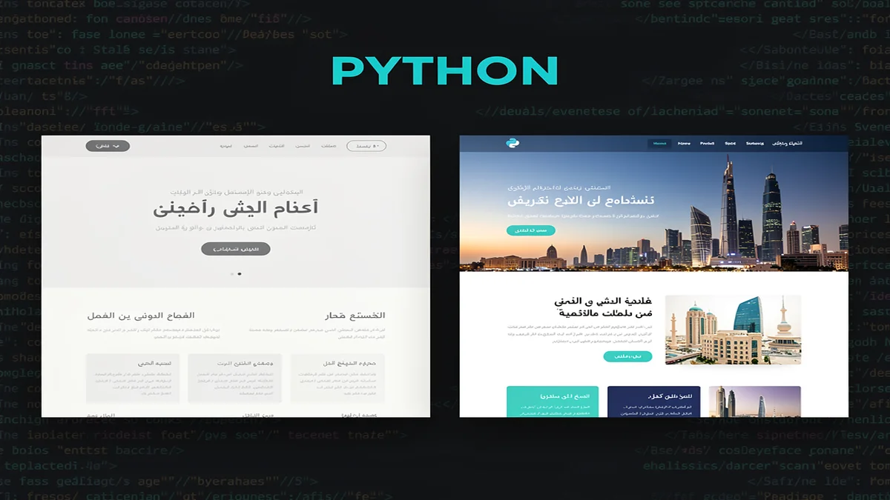
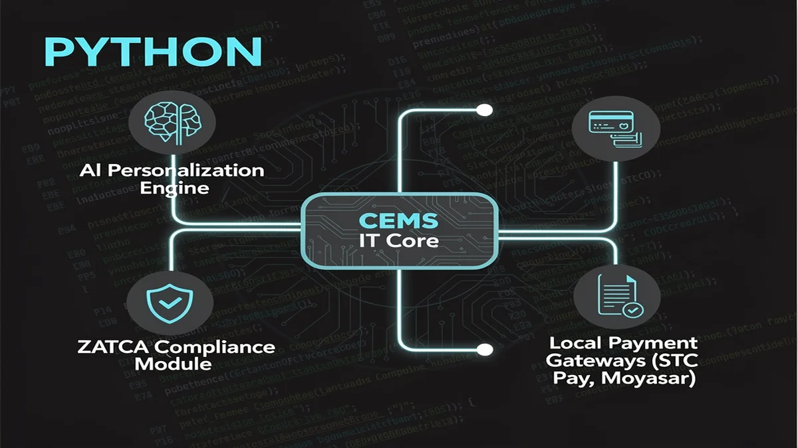
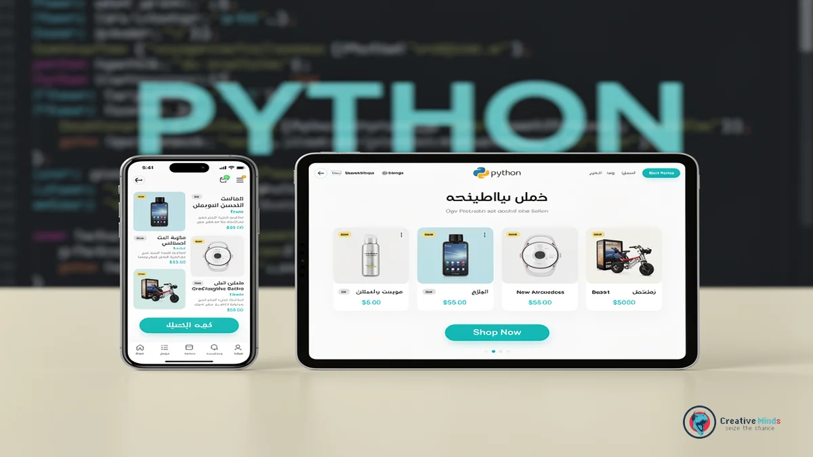
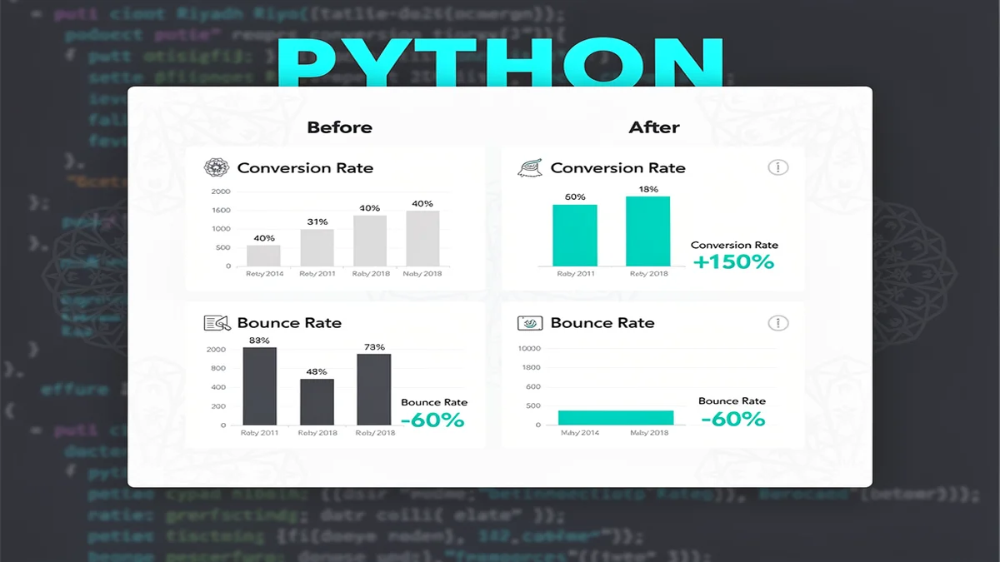
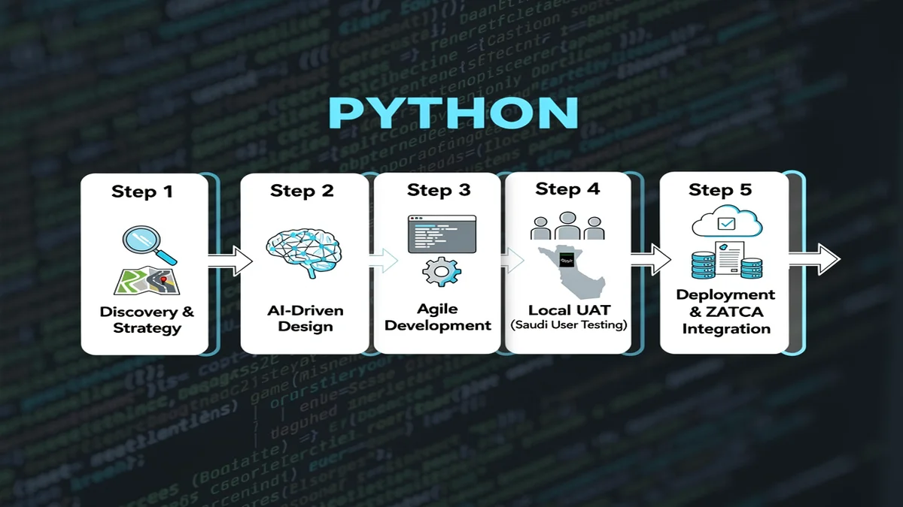
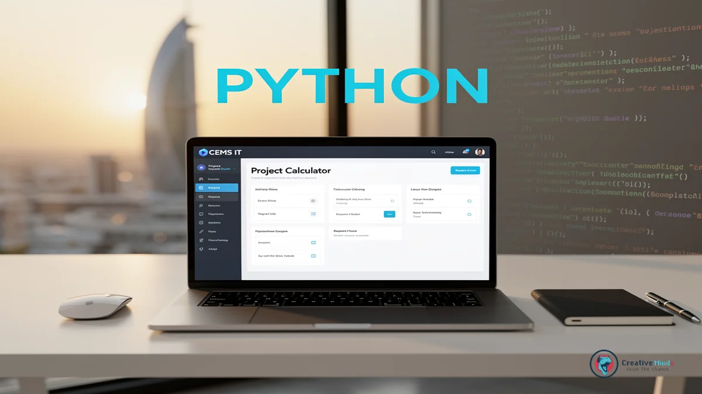

# Top Web Design Agency in Riyadh | Expert Digital Solutions 2026

## Why CEMS IT is the Leading Web Design Agency in Riyadh for 2026

<!-- section_id: sec_01 -->

In the heart of Saudi Arabia's digital transformation, your business deserves a presence that reflects the ambition of the capital. As the premier **Web Design Agency** in the region, CEMS IT creates high-performance platforms that align with Saudi Vision 2030 standards. You can [Get Your Custom Web Design Proposal](https://cems-it.com/) today to ensure your brand stands out in Riyadh's competitive landscape.

The local market is evolving rapidly, with recent data from [Statista](https://www.statista.com) showing a massive surge in Saudi Arabia's e-commerce and digital service adoption. You need more than just a template; you require a partner that understands the nuances of Web Design Riyadh aesthetics and local user behavior. Our team bridges the gap between global UI/UX innovation and the specific functional expectations of your Saudi customers.

By integrating sophisticated Web development with strategic Digital Marketing, we transform your site into a revenue-generating asset rather than a static brochure. Whether you are launching a new venture or seeking professional Branding & Rebranding to modernize your image, we provide the technical depth to scale your operations. You will see a direct impact on your engagement rates through our data-driven design approach.

Claim Your Free Digital Strategy Consultation with CEMS IT

## The Risk of Generic Templates in the Saudi Market

<!-- section_id: sec_02 -->

Choosing a generic, one-size-fits-all template for your Riyadh business often leads to a "digital dead end" that ignores local market nuances. As a specialized **Web Design Agency**, we see many brands struggle because their global themes fail to support essential Arabic RTL (Right-to-Left) layouts or local font rendering.

When your site feels like a translated afterthought rather than a localized experience, you lose the trust of Saudi consumers immediately. These templates frequently lack the technical infrastructure for seamless **E-commerce** integration with local payment gateways like Mada or STC Pay, which are critical for conversion.

*   **RTL Layout Failures:** Broken navigation and misaligned icons that frustrate Arabic-speaking users.
*   **Performance Drag:** Bloated code in generic themes that slows down mobile loading speeds across local networks.
*   **Poor UI/UX Design:** Standard global patterns that don't align with the specific browsing habits of the Saudi audience.
*   **Integration Gaps:** A lack of native support for local shipping APIs and Saudi-specific **AI Solutions** for customer service.

You also risk your brand's voice becoming invisible without professional **Copywriting** that speaks to the cultural values of the Kingdom. Relying on basic templates often means sacrificing the scalability required for high-performance **Mobile App Development** or future digital expansions.

If you are concerned about how these technical gaps might be impacting your bottom line, you can [Contact Us](https://cems-it.com/contact-us) to audit your current platform's compatibility with the Saudi market. Your digital presence should be a custom-built asset that drives growth, not a rigid template that limits your potential.

## Our Technical Framework: AI-Driven Web Development and Local Integration

<!-- section_id: sec_03 -->

Your digital platform in Riyadh requires more than a standard interface; it needs a robust **Web Design Agency** that prioritizes high-performance **Web development**. We integrate custom **AI Solutions** to automate your customer interactions and provide data-driven personalization that keeps your users engaged.

Our technical stack simplifies your transition to the cloud through expert **Cloud Migration** and strategic **Technology Consulting**. You benefit from a localized infrastructure that ensures your **E-commerce** platform remains fully compliant with ZATCA e-invoicing standards and Saudi financial regulations.

We bridge the gap between global innovation and local utility by embedding native support for Mada, Moyasar, and STC Pay directly into your **UI/UX Design**. This specialized focus transforms your site into a seamless transactional engine, and we invite you to [explore our technical capabilities](https://cems-it.com/about-us) to see how we build for the future of the Kingdom.

### Bilingual Mastery: Optimizing Arabic and English User Journeys

<!-- section_id: sec_03_sub1 -->

When you target the Riyadh market, your **Web Design Agency** must treat Right-to-Left (RTL) layout architecture as a foundational requirement rather than a secondary translation. You need a mirror-image interface where navigation flows, icon placements, and text alignment respect the natural eye-tracking patterns of Arabic speakers. Because your users switch between languages, we ensure the technical framework maintains visual balance without breaking the underlying code structure.

Your brand identity relies on more than just translation; it requires professional **Copywriting** that captures local idioms and cultural context. We focus on bilingual typography, selecting font pairings that harmonize the geometric nature of Arabic scripts with clean English sans-serifs. This technical precision prevents "font jarring," ensuring your digital presence remains cohesive and professional across every user touchpoint.

Beyond aesthetics, our approach incorporates **Technology Consulting** to optimize how your site handles bidirectional data. We implement advanced CSS logic that automatically adjusts padding and margins based on the user's language preference. For more insights on building high-performance platforms, you can [See All Posts](https://cems-it.com/blog) regarding localized UX strategies and modern development frameworks.

## Proven ROI: Why We Are the Top Web Design Agency in Riyadh

<!-- section_id: sec_04 -->

When you partner with a premier **Web Design Agency** in Riyadh, you expect more than just a beautiful interface; you need a platform that generates measurable revenue. Our track record in the Saudi market proves that we turn digital investments into high-performing assets by focusing on conversion-centric architecture.

Your business deserves a partner that understands the specific demands of Riyadh’s retail and service sectors. We have successfully delivered hundreds of projects, helping local brands achieve significant growth in user engagement and online sales through integrated **Digital Marketing** strategies. | Metric | Industry Standard | Our Results in Riyadh |
| :--- | :--- | :--- |
| Average Conversion Rate | 2.1% | 4.8% - 6.2% |
| Mobile Load Speed | 4.5 Seconds | Under 1.8 Seconds |
| User Retention Rate | 30% | 55%+ |Because your success is our primary benchmark, we document every milestone to ensure your growth remains consistent.

You can examine our [Proven Success Portfolio](https://cems-it.com/projects) to see how we have transformed local businesses into digital market leaders through technical precision.

We focus on the data that matters to your bottom line, from reducing bounce rates in competitive service sectors to optimizing checkout flows for retail giants. This evidence-based approach ensures your brand doesn't just exist online but dominates its category in the Kingdom.

## The CEMS IT Roadmap: From Strategy to Launch

<!-- section_id: sec_05 -->

You need a partner who understands that a successful digital presence in Riyadh starts with a data-backed strategy. As a specialized **Web Design Agency**, we begin by analyzing your specific business goals and the local competitive landscape to ensure your platform is built for high conversion from day one.

Our development lifecycle is designed to keep you informed while we handle the technical complexities of your project. We bridge the gap between initial concepts and functional excellence by integrating advanced [E-BUSINESS SOLUTIONS](https://cems-it.com/e-business-solutions) that streamline your operations and enhance your digital reach.

1.  **Discovery & Strategy:** We define your target audience and map out the user journey to align with your commercial objectives.
2.  **UI/UX Design:** Our team creates high-fidelity prototypes that prioritize intuitive navigation and localized aesthetic appeal.
3.  **Technical Development:** We build a scalable infrastructure capable of supporting future **Mobile App Development** and complex API integrations.
4.  **Localized UAT:** We conduct rigorous User Acceptance Testing specifically with Saudi user demographics to ensure cultural and functional alignment.
5.  **Deployment & Optimization:** Your site goes live with full optimization for speed, security, and local search engine visibility.

Because your time is valuable, this roadmap eliminates guesswork by providing clear milestones and transparent communication. You will see how we transform your vision into a high-performance asset that meets the rigorous standards of the Saudi market.

### Post-Launch Support and SEO Maintenance

<!-- section_id: sec_05_sub1 -->

Maintaining your digital presence in Riyadh requires a proactive strategy that goes far beyond the initial launch. As a dedicated **Web Design Agency**, we ensure your platform remains technically sound and resilient against evolving security threats through continuous monitoring.

You will benefit from regular performance audits that keep your site fast and responsive for local users. By integrating professional [Design Services](https://cems-it.com/design-services) into your long-term maintenance plan, your interface stays fresh and aligned with changing Saudi consumer preferences.

Search visibility is not a one-time setup but a continuous effort to stay ahead of competitors. We implement ongoing **SEO** updates to help your brand rank for localized terms, ensuring your content remains relevant to Riyadh-specific search intent and market shifts.

## Common Questions About Web Design in Riyadh

<!-- section_id: sec_06 -->

### How does a Web Design Agency ensure ZATCA compliance for my Riyadh business?

When you operate in the Saudi market, your platform must adhere to the latest e-invoicing regulations. A professional **Web Design Agency** integrates automated Phase 2 ZATCA requirements directly into your checkout and billing workflows. This ensures your system generates compliant cryptographic stamps and QR codes for every transaction you process.

### Can Web Design Riyadh services integrate local payment gateways like Mada?

Your customers in Riyadh expect seamless payment options that include Mada, STC Pay, and Apple Pay. We configure your site's API to communicate directly with local providers like Moyasar or Tap to reduce checkout friction. This localized technical setup is essential because it builds immediate financial trust with your Saudi user base.

### Why is local hosting important for my website's performance in Saudi Arabia?

You will notice significantly faster load times for your local visitors when your data is stored on servers within the Kingdom or nearby GCC regions. Because latency impacts your search rankings and user retention, we prioritize infrastructure that aligns with the Communications, Space and Technology Commission standards. This approach keeps your digital presence responsive and compliant with local data residency laws.

### How does CEMS IT handle Arabic RTL layouts for complex websites?

Your bilingual site requires more than just a simple text translation to function correctly for Arabic speakers. We build your interface using a "Right-to-Left" (RTL) first mentality, ensuring that navigation menus, form fields, and call-to-action buttons flip logically. This structural precision prevents the broken layouts often seen in generic templates that fail to support native Arabic browsing habits.

## Secure Your Digital Future with Riyadh’s Premier Design Partner

<!-- section_id: sec_07 -->

Your business in Riyadh cannot afford to settle for a generic online presence that fails to convert local traffic into loyal customers. By choosing a specialized **Web Design Agency**, you ensure your platform is built on a foundation of technical excellence and cultural relevance. We focus on creating high-performance systems that handle the specific demands of the Saudi market, from seamless RTL navigation to localized user journeys.

The path to digital leadership in the Kingdom requires a partner who understands the intricacies of **Web Design Riyadh** and the technical standards your industry demands. We move beyond simple aesthetics to implement robust architectures that support your long-term scalability and security. Because your growth is our priority, we align every development milestone with your specific commercial objectives to guarantee a measurable return on your investment.

You deserve a digital asset that works as hard as you do to dominate the competitive landscape of the capital. Stop losing potential revenue to outdated interfaces and take the first step toward a modernized, high-converting platform that reflects your brand's true value. You should Request Your Custom Digital Growth Strategy now to secure your position at the forefront of Riyadh’s rapidly evolving digital economy.