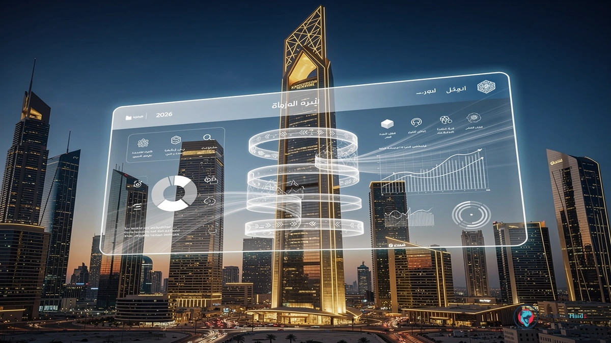
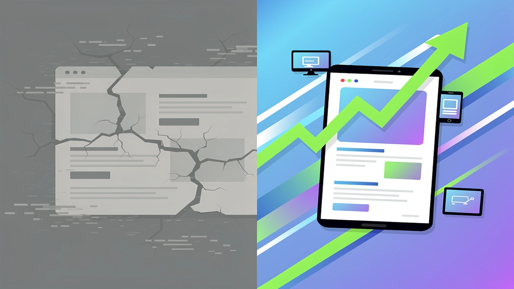
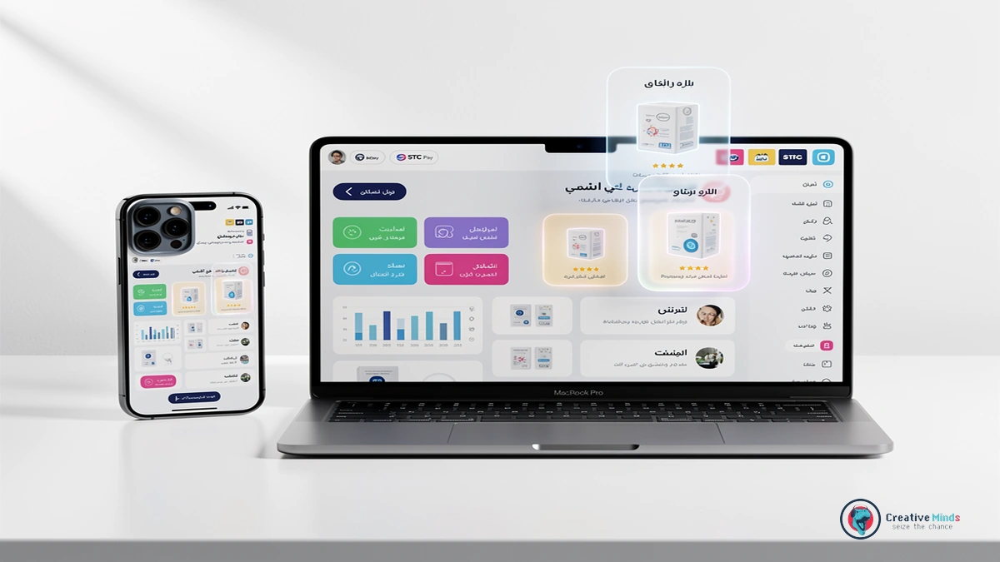
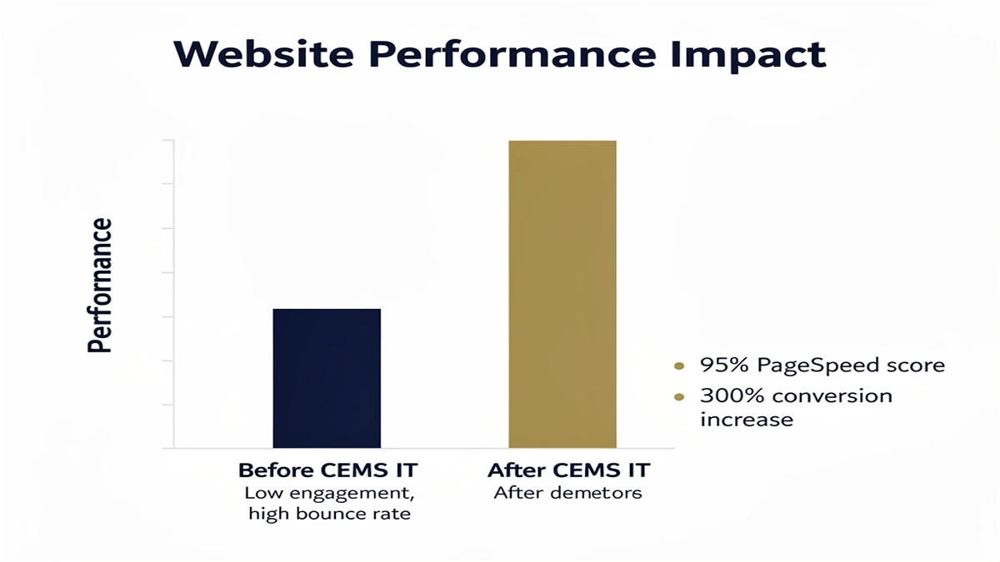
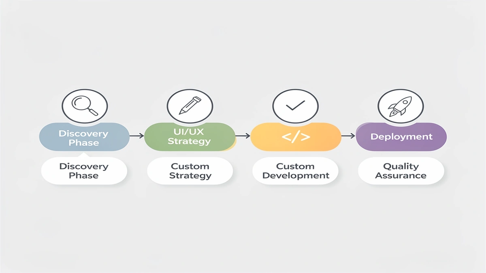
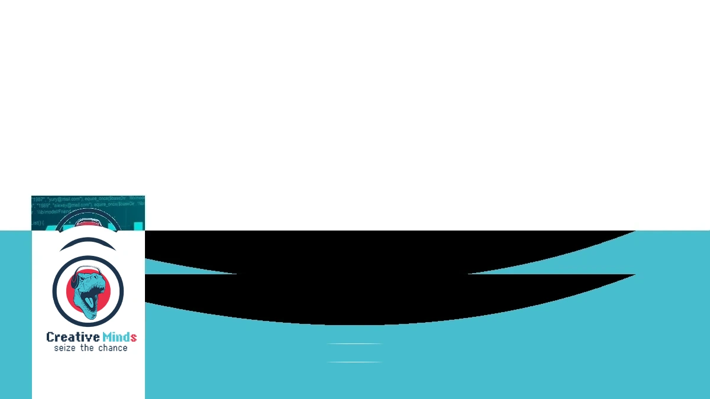

# Top Web Design Agency in Riyadh: Specialized 2026 Digital Solutions

## Why CEMS IT is the Leading Web Design Agency for Riyadh’s 2026 Digital Landscape

<!-- section_id: sec_01 -->

As Riyadh transforms into a global tech hub, your business needs a **Web Design Agency** that understands the shift from basic sites to high-performance digital assets. The 2026 market demands world-class standards where speed and local relevance dictate your brand's authority.

Choosing **CEMS IT** means you are partnering with experts who prioritize [UI/UX design](https://cems-it.com/) tailored for the Saudi market's unique user behaviors. We build every Responsive layout to ensure your presence remains flawless across the capital’s mobile-first demographic.

The evolution of the King Abdullah Financial District and the rise of local startups mean your old digital strategy won't suffice. You need advanced E-commerce solutions and a Web Design Riyadh strategy that aligns with Vision 2030 digital transformation goals.

Get Your Custom 2026-Ready Web Design Proposal

## The Risk of Stagnation: Why Generic Templates Fail Saudi Enterprises

<!-- section_id: sec_02 -->

Choosing a low-cost, generic template for your Riyadh business might seem like a shortcut, but it often leads to a "digital dead end" that kills your conversion rates. Most off-the-shelf themes are bloated with unnecessary code that slows down **page speed optimization**, causing potential Saudi clients to bounce before your site even loads.

When you rely on a cookie-cutter layout, you miss out on the critical **Arabic-first design** nuances required to engage the local market effectively. These templates often struggle with Right-to-Left (RTL) alignment, making your brand look unprofessional and untrustworthy to a high-value audience in KSA.

*   **Custom coding** ensures your site remains lightweight and scales as your enterprise grows without security vulnerabilities.
*   **Mobile-friendly websites** built from scratch adapt perfectly to the specific devices and local 5G networks used across Riyadh.
*   **Responsive design** that is manually tested prevents the layout shifts and broken buttons common in cheap, automated templates.
*   Superior user retention occurs when your interface feels native to the local culture rather than a translated afterthought.

Your competitors are likely investing in high-performance assets that prioritize user experience and speed. If your site feels sluggish or looks like a thousand others, you are actively handing your market share to those who chose a professional **Web Design Agency** to build a bespoke digital presence.

Stagnant websites fail because they cannot adapt to the rapid shift in Saudi consumer behavior or the latest search engine requirements. To secure your ROI, you must move beyond basic themes and [Contact Us](https://cems-it.com/contact-us) to discuss a custom-engineered solution that reflects your brand’s true authority.

## Our Technical Framework: Bridging UI/UX Excellence with AI Integration

<!-- section_id: sec_03 -->

Building your digital presence in Riyadh requires more than just aesthetics; it demands a robust **Web Design Agency** that prioritizes high-performance technical architecture. You gain a competitive edge through our specialized focus on **UI and UX design** that natively supports Right-to-Left (RTL) layouts, ensuring your Saudi audience navigates your site with natural ease.

We integrate **Machine learning integration** to personalize user journeys and automate data-driven decisions, transforming your website from a static page into an intelligent asset. Your business will benefit from seamless **E-commerce development** that connects directly to local payment gateways like Mada and STC Pay, facilitating frictionless transactions for your customers.

To ensure your brand remains visible and fast, our engineers optimize every line of code for **Core Web Vitals** and lightning-fast loading speeds on local 5G networks. This technical precision is the backbone of your **Digital transformation**, providing a scalable framework that grows alongside your enterprise. If you are ready to modernize your infrastructure, [lets talk](https://cems-it.com/about-us) about how our specialized tech stack can secure your market position.

### Advanced Machine Learning & Cloud Migration

<!-- section_id: sec_03_sub1 -->

Integrating **AI Solutions** into your digital architecture allows your business to move beyond static interfaces and offer personalized experiences to every visitor in Riyadh. By deploying machine learning models, your website analyzes user behavior in real-time to adjust content and recommendations dynamically.

You can ensure your platform handles sudden traffic spikes through strategic **Cloud migration** that provides infinite scalability for your growing enterprise. This modernization ensures your infrastructure remains robust while maintaining peak performance during high-demand periods across the Kingdom.

Your data remains secure and fully compliant with local regulations, as we prioritize hosting environments that align with CITC data residency requirements. For more technical insights on maintaining a high-performance site, you can [See All Posts](https://cems-it.com/blog) in our engineering library.

## Proven Results: Why We Are the Top Web Design Agency in Saudi Arabia

<!-- section_id: sec_04 -->

When you partner with our **Web Design Agency**, you gain access to a proven track record of digital success across Riyadh and the wider Kingdom. We have successfully delivered over 150 high-performance projects that directly support the digital transformation goals of Saudi Vision 2030.

Our team combines advanced technical architecture with strategic **SEO services** to ensure your brand dominates local search results. By focusing on measurable ROI and user retention, we transform your digital presence into a high-converting asset that outperforms the competition. | Feature | Generic Templates | Our Specialized Solutions |
| :--- | :--- | :--- |
| **Loading Speed** | 4.5+ Seconds Average | Under 1.8 Seconds on 5G |
| **Mobile UX** | Basic Responsiveness | Mobile-First RTL Precision |
| **Search Visibility** | Minimal Indexing | Integrated **SEO services** |
| **Vision 2030 Alignment** | None | Full Digital Compliance |Your business deserves a platform that reflects its true authority in the Saudi market.

By viewing our [Success-Driven Project Portfolio](https://cems-it.com/projects), you can see how we bridge the gap between aesthetic design and technical excellence for leading local enterprises.

## The Roadmap to Your New Digital Asset

<!-- section_id: sec_05 -->

Your journey with a professional **Web Design Agency** in Riyadh begins with a deep-dive discovery phase to align your project with the local market's specific demands. We map out your digital strategy by balancing global technical standards with the cultural nuances of the Saudi audience.

This collaborative process ensures that every step, from wireframing to the final code, serves your business objectives. Our team prioritizes seamless communication to integrate your feedback into the core of the development lifecycle.

1. Discovery and Strategy: Defining your goals and analyzing the Riyadh competitive landscape.
2. Architecture and Design: Creating bilingual UX wireframes and high-fidelity **Content and graphics**.
3. **Web development**: Engineering a robust, scalable backend and front-end optimized for 5G performance.
4. Testing and Optimization: Rigorous quality assurance across all mobile devices and local browsers.
5. Launch and Support: Deploying your asset and providing ongoing maintenance to ensure long-term stability.

Once the structure is solid, we focus on the technical implementation of [E-BUSINESS SOLUTIONS](https://cems-it.com/e-business-solutions) to handle your transactions and customer data securely. This phase transitions your site from a visual concept into a functional tool that drives measurable growth.

We finalize the roadmap by ensuring your platform is fully compliant with local data regulations and optimized for search visibility. Your new digital asset is then ready to perform as a high-speed, reliable extension of your brand in the Kingdom.

### Post-Launch Maintenance & Growth

<!-- section_id: sec_05_sub1 -->

Your relationship with a **Web Design Agency** shouldn't end the moment your site goes live in Riyadh. You need a partner that provides consistent technical monitoring to prevent downtime and ensures your platform evolves with the fast-paced Saudi market.

We handle the heavy lifting of security patches and server optimizations so you can focus entirely on your core business operations. By choosing [Design Services](https://cems-it.com/design-services) that include proactive maintenance, you protect your digital investment from emerging cyber threats and performance lags.

Our team at CEMS IT aligns support schedules with Riyadh business hours to provide immediate assistance when your traffic peaks. This localized approach to Web Design Riyadh ensures your site remains a high-performing asset that grows alongside your expanding customer base.

To maintain peak authority, we regularly audit your site's speed and user data to identify new opportunities for functional improvements. You deserve a digital presence that stays as fresh and reliable as the day it launched, backed by a team that understands your long-term vision.

## Frequently Asked Questions About Web Design in Riyadh

<!-- section_id: sec_06 -->

### How long does a Web Design Agency typically take to launch a project in Riyadh?

You can usually expect a professional timeline of 8 to 12 weeks for a custom build. This duration allows your **Web Design Agency** to handle deep discovery, local market research, and rigorous testing on Saudi 5G networks to ensure your site performs flawlessly from day one.

While smaller landing pages might launch faster, complex enterprise platforms require more time for custom integrations and Arabic RTL optimization. Rushing this process often leads to technical debt, so prioritizing quality ensures your digital asset remains stable as your Riyadh business scales.

### Can you integrate local Saudi payment gateways like Mada and STC Pay?

Yes, your website can be fully synchronized with the Kingdom’s financial ecosystem to provide a frictionless checkout experience for your customers. Modern **Web Design Riyadh** strategies prioritize these local integrations because they directly influence trust and conversion rates among Saudi shoppers.

By following the official technical standards set by the [Saudi Central Bank (SAMA)](https://www.sama.gov.sa), your platform will securely process transactions while remaining compliant with national financial regulations. This local technical alignment is a core requirement for any serious e-commerce venture in the region.

### Does my website hosting need to comply with Saudi data residency laws?

If you are handling sensitive user data or working with government-related entities, your hosting must comply with CITC regulations regarding data residency. You should ensure your provider utilizes local data centers within the Kingdom to minimize latency and meet legal requirements.

Choosing a partner like **CEMS IT** helps you navigate these complexities by selecting infrastructure that keeps your data within Saudi borders. This approach not only ensures legal compliance but also significantly improves loading speeds for your visitors located in Riyadh and surrounding provinces.

### How do you handle Right-to-Left (RTL) layouts for Arabic-first audiences?

Designing for the Saudi market requires more than just translating text; you need a layout that mirrors the natural eye movement of Arabic speakers. Your interface elements, navigation bars, and call-to-action buttons must be strategically flipped to maintain a high-quality user experience.

A professional **Web Design Agency** builds these RTL frameworks from the ground up rather than using automated plugins that often break the visual hierarchy. This attention to detail ensures your brand feels native to the local culture and provides a professional impression to your high-value Saudi audience.

## Secure Your Competitive Edge in Riyadh Today

<!-- section_id: sec_07 -->

Your business cannot afford to wait while the Riyadh digital landscape shifts toward the 2026 standards of speed and precision. Partnering with a specialized **Web Design Agency** ensures your transition from a legacy site to a high-performance asset happens through a structured, data-backed implementation.

We initiate your project by mapping your specific goals against the competitive local market to ensure every technical decision serves your bottom line. By focusing on a mobile-first, Arabic-optimized architecture, you provide a seamless experience that captures the attention of the capital’s most sophisticated users.

The window to define your brand’s authority in the Kingdom is narrowing as competitors modernize their infrastructure. You must act now to integrate advanced systems that turn your digital presence into a primary revenue driver. Secure Your Custom 2026-Ready Web Design Proposal to dominate the Riyadh market today.