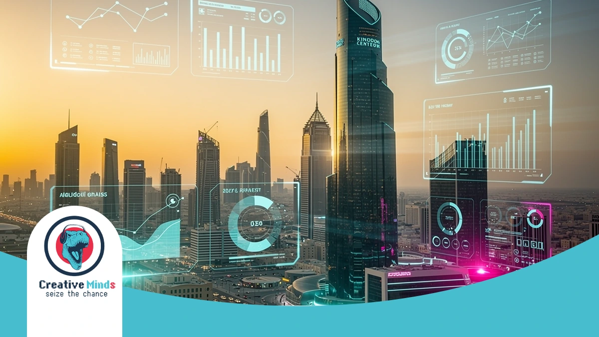
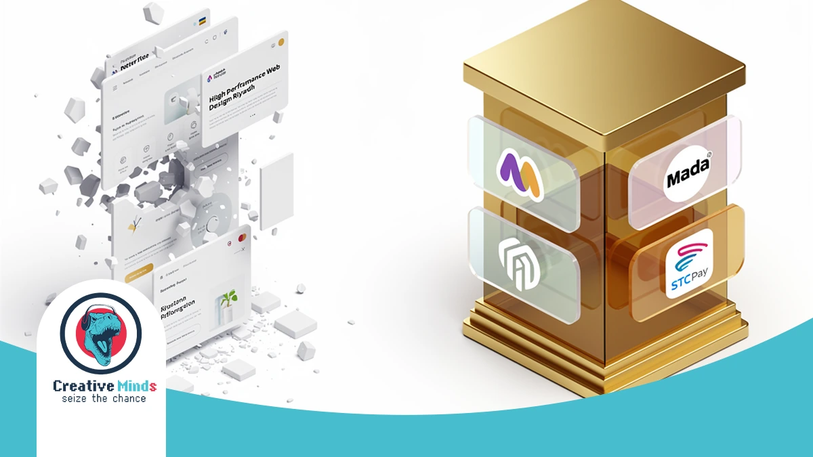
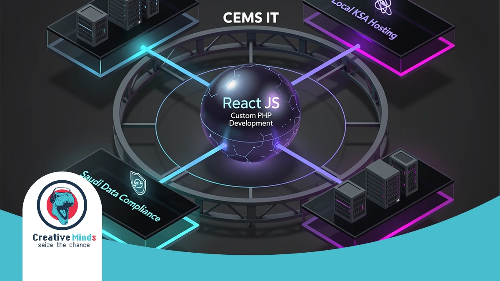
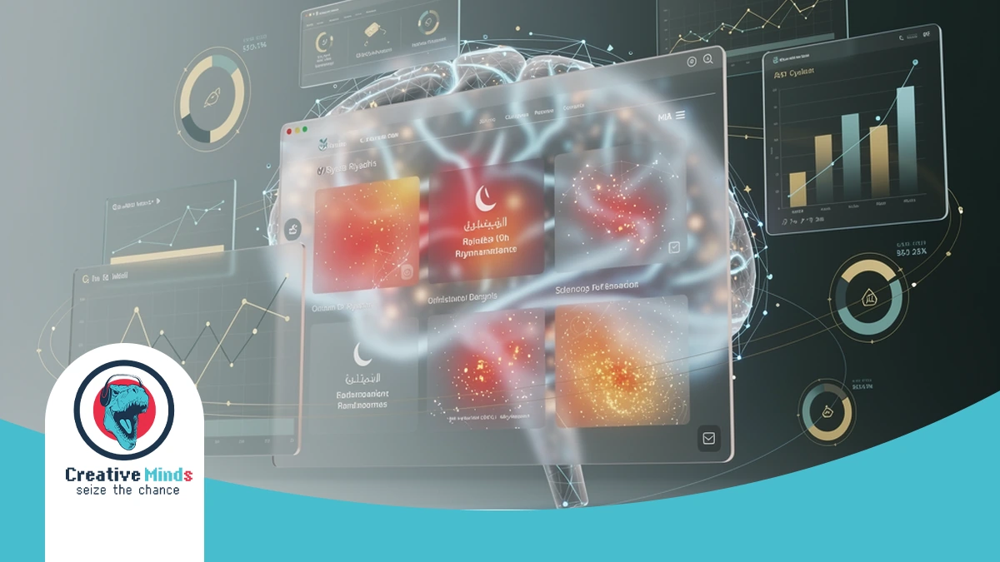
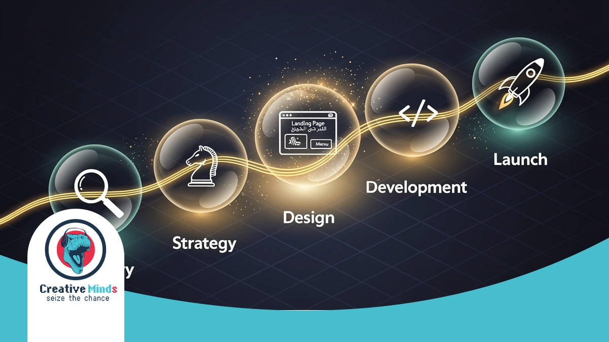
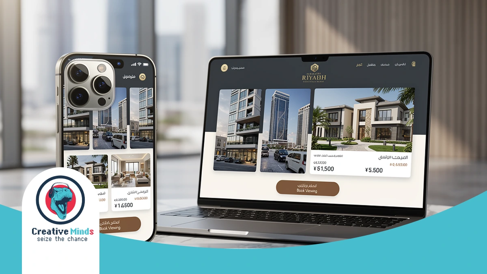

# Top Web Design Agency in Riyadh: Custom Solutions for 2026

## Riyadh’s Leading Web Design Agency: Building Your Digital Future in 2026
<!-- section_id: sec_01 -->

**Contact our team today and get your project moving within days.**

In Riyadh’s fast-moving market, a generic website is no longer enough to compete. As a premier **Web Design Agency**, CEMS IT helps you dominate the digital landscape by integrating [premium web design in Riyadh](https://cems-it.com/en/web-design-riyadh/) that aligns with Saudi Vision 2030. Request your custom digital roadmap today to outpace your competitors before the 2026 market shift.

Our methodology moves beyond aesthetics to focus on your specific business goals. We utilize a proven three-step process—consultation, customized design, and seamless execution—to ensure your project is delivered on time and within budget. By leveraging **Custom PHP Development** for secure backends and **React JS Web Interfaces** for speed, we build platforms that convert visitors into loyal customers.

The reality of Digital Transformation Riyadh demands high-performance tools that reflect your brand’s authority. CEMS IT has already delivered success for government entities like the Qatar General Authority of Customs and major construction firms. Don't let your brand fall behind—Start Your Project With CEMS IT Today to secure your lead in the 2026 digital economy.
## Why Generic Templates Fail Riyadh’s High-Growth Businesses
<!-- section_id: sec_02 -->

**Get a free consultation with our specialists — zero commitment required.**

Choosing a cookie-cutter template for your **Web Design Agency** project in Riyadh is a gamble with your brand’s reputation. These off-the-shelf themes often carry bloated code that destroys your loading speeds and tanks your search rankings.

Your local customers expect instant responsiveness and cultural relevance. When you rely on generic layouts, you risk alienating users through poor [strategic UI/UX design services](https://cems-it.com/en/ui-ux-design/) that fail to prioritize the right-to-left (RTL) flow essential for Arabic-first interfaces.

*   **Performance Bottlenecks:** Heavy templates slow down mobile access, causing high bounce rates in the competitive Riyadh market.
*   **Integration Gaps:** Most global themes lack native support for **Mada Payment Integration** or STC Pay, creating friction at checkout.
*   **SEO Limitations:** Generic structures often prevent the implementation of **Bilingual SEO Web Design**, making it harder to rank for local keywords.
*   **Security Risks:** Standardized templates are frequent targets for vulnerabilities, jeopardizing your **Vision 2030 Digital Solutions** and data integrity.

A website that doesn't speak the local language—both technically and culturally—is a liability. By ignoring the specific UX patterns preferred in Saudi Arabia, you essentially hand your market share over to competitors who invest in custom, high-performance platforms.
## The CEMS IT Framework: Advanced Technical Systems for 2026
<!-- section_id: sec_03 -->

**Don't let your competitors launch first — start your digital project now.**

At CEMS IT, your digital infrastructure is built on a foundation of high-performance frameworks like React and PHP. Our **Web Design Agency** ensures your platform remains scalable and lightning-fast for the Riyadh market's 2026 demands.

We manage every technical detail through Jira and Confluence to ensure absolute transparency. By prioritizing [custom WordPress development](https://cems-it.com/en/wordpress-development/) for your content needs, we deliver a seamless balance between complex backend security and intuitive user interfaces. | Feature | CEMS IT Technical Standard | Riyadh Market Benefit |
| :--- | :--- | :--- |
| **Data Residency** | Local Hosting & CITC Compliance | Meets Saudi Data Compliance |
| **Architecture** | React JS & Secure PHP Backends | Superior speed and cyber-resilience |
| **Management** | Agile Methodology & Jira Tracking | Full project visibility and deadlines |

**See how our team can turn your vision into measurable digital results.**
| **Payment** | Mada & STC Pay Native Integration | Optimized E-commerce Development Riyadh |Our systems are specifically engineered to handle local hosting requirements and strict Saudi Data Compliance.

This technical precision allows your business to maintain high-speed mobile access while strictly adhering to the latest CITC regulations for data sovereignty.

### AI-Driven User Behavior Analysis

<!-- section_id: sec_04 -->

CEMS IT transforms how you engage with your audience by integrating smart AI tools into your digital infrastructure. We analyze real-time data to understand how your customers interact with your **Web Design Agency** project in Riyadh.

By identifying specific Saudi consumer patterns, such as shifting search behaviors during Ramadan or late-night browsing habits, we optimize your interface for maximum engagement. Our team builds these intelligent systems using fast and scalable React interfaces to ensure your site reacts instantly to user needs.

This technical approach allows us to refine your conversion funnels based on actual evidence rather than assumptions. Whether we are deploying customized WordPress solutions or complex backends, our AI-driven insights ensure your platform remains a high-performing asset in the competitive Saudi market.
## Our Proven Process: From Consultation to Launch
<!-- section_id: sec_05 -->

**Our experts are standing by — reach out and get direct answers today.**

CEMS IT follows a rigorous three-step methodology to ensure your digital presence excels in Riyadh. We begin with detailed consultations to gather your requirements, creating a comprehensive plan that aligns your goals with a high-performing **Web Design Agency** strategy.

Our creative team then builds a customized solution using innovative techniques and the latest technology. We prioritize a [mobile-first development approach](https://cems-it.com/en/mobile-app-development-riyadh/) to ensure your bilingual Arabic and English content remains intuitive and engaging for every local user.

1.  **Consultation:** We analyze your B2B or B2C objectives to build a tailored project roadmap.
2.  **Customized Design:** Our experts craft unique UI/UX interfaces that strengthen your brand identity.
3.  **Technical Execution:** We develop secure backends using PHP and interactive front-ends with React.
4.  **Launch & Management:** We oversee the entire deployment to ensure on-time delivery and CITC compliance.

Once you approve the design, we move into the execution phase with seamless project management. We handle the technical complexity of your **Web Design Agency** project so you can focus on growing your business within the Saudi market.
## Measurable Impact: Why We Are Riyadh’s Top-Rated Agency
<!-- section_id: sec_06 -->

**Your path to digital success starts with one conversation — let's begin.**

When you partner with **CEMS IT**, you gain more than a website; you secure a high-performance digital asset. Our role as a leading **Web Design Agency** in Riyadh is backed by a track record of delivering measurable growth.

We have successfully helped local enterprises increase their digital engagement by focusing on user-centric layouts and technical precision. You can [view our successful projects](https://cems-it.com/en/portfolio/) to see how we blend Saudi cultural nuances with global coding standards.

Our team ensures your platform remains fully compliant with CITC regulations while maintaining elite speeds. By choosing us, you ensure your business stays ahead of Riyadh's shifting market demands through data-backed design and robust security.
## Case Study: Scaling Digital Presence for Riyadh Real Estate

<!-- section_id: sec_07 -->

When a major real estate firm in Riyadh needed to modernize, they faced a cluttered market and slow-loading legacy systems. Your property listings must load instantly to retain high-value investors who have no patience for technical delays. We overhauled their digital architecture using **Web Design Riyadh** strategies that prioritized localized user journeys and lightning-fast property filtering.

Our team implemented a custom-coded interface that handled thousands of concurrent visitors without a single second of downtime. You can explore how we transform complex requirements into high-converting platforms by viewing our portfolio of successful digital transformations. This transition didn't just improve aesthetics; it fundamentally changed how their sales team captured and qualified local leads.

By integrating a right-to-left (RTL) optimized flow, we ensured your Arabic-speaking clients experience a natural, intuitive navigation path. We focused on reducing friction at every touchpoint, from the initial landing page to the final inquiry form. This case study proves that a data-backed approach to design is the most reliable way for your Riyadh business to secure a dominant market position.

## Frequently Asked Questions About Web Design in Riyadh

<!-- section_id: sec_08 -->

### How long does a typical project take with a Web Design Agency?
Timeline depends on complexity, but CEMS IT follows a structured three-step methodology—consultation, customized design, and execution—to ensure high-quality results are delivered on time. Simple sites may take weeks, while complex platforms require more integration.

### Do you provide local hosting and data compliance for Riyadh businesses?
Yes, we prioritize Saudi data sovereignty. Our team ensures your digital infrastructure aligns with local regulations and CITC standards, utilizing secure backends developed with robust PHP technologies to keep your sensitive business information protected within the Kingdom.

### Can CEMS IT integrate local Saudi payment gateways?
Our developers specialize in connecting your platform with essential local services like Mada, STC Pay, and Apple Pay. By choosing **Web Design Riyadh** experts, you ensure your e-commerce flow is optimized for the specific purchasing habits of Saudi consumers.

### Is your web design optimized for Arabic and English?
We build high-performance, bilingual interfaces from the ground up. Using React JS, we create fast, interactive front-ends that support seamless right-to-left (RTL) navigation, ensuring your Saudi audience enjoys a natural and culturally relevant user experience.

### What technologies does CEMS IT use for custom websites?
We don't rely on generic templates that slow down your performance. Instead, we build powerful, scalable solutions using custom WordPress development, React for dynamic interfaces, and smart AI tools to automate and improve your overall visitor engagement.

### Do you offer support after the website launch?
We believe in building long-term relationships rather than just completing projects. You receive ongoing technical support and optimization to ensure your platform remains a high-performing asset that evolves alongside the fast-moving digital market in Riyadh.

## Secure Your Competitive Edge with Riyadh’s Digital Experts

<!-- section_id: sec_09 -->

Your business deserves a digital platform that mirrors your professional authority in the Riyadh market. By partnering with a specialized **Web Design Agency**, you ensure every technical detail—from rapid loading speeds to Saudi-compliant data security—is handled with precision.

Our implementation process removes the guesswork, providing you with a transparent roadmap toward a high-converting interface. You can explore our high-performance digital solutions to see how we transform complex requirements into seamless, localized user experiences that drive growth.

Don't let your competitors capture the 2026 market share while you settle for a generic template. Secure your industry leadership and Start Your Project With CEMS IT Today to build a future-proof asset that delivers measurable results.