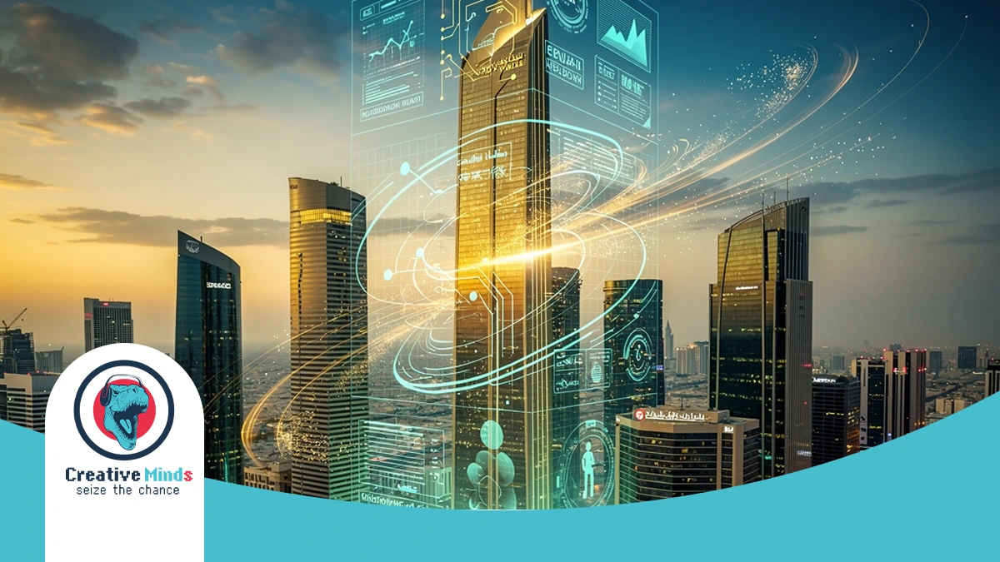
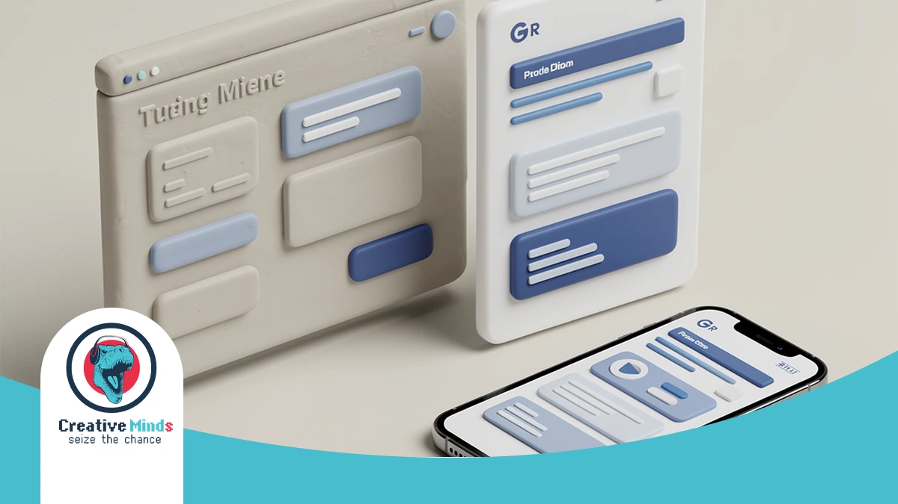
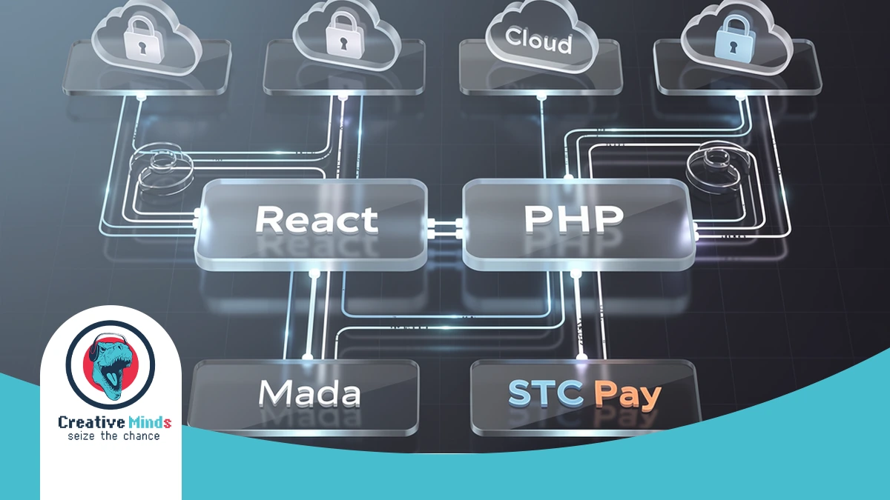
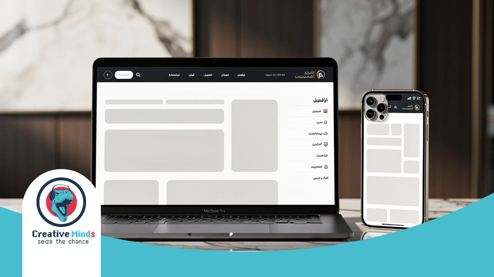
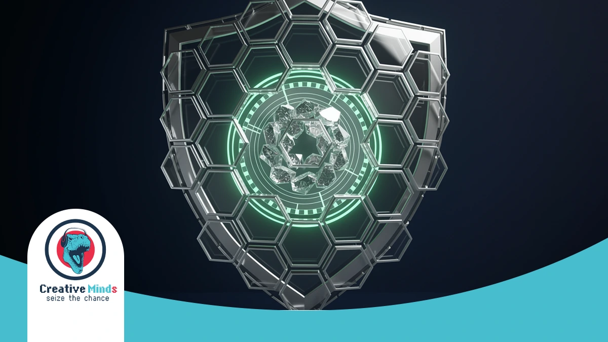
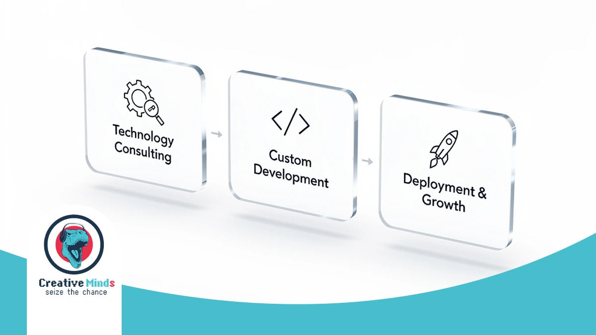
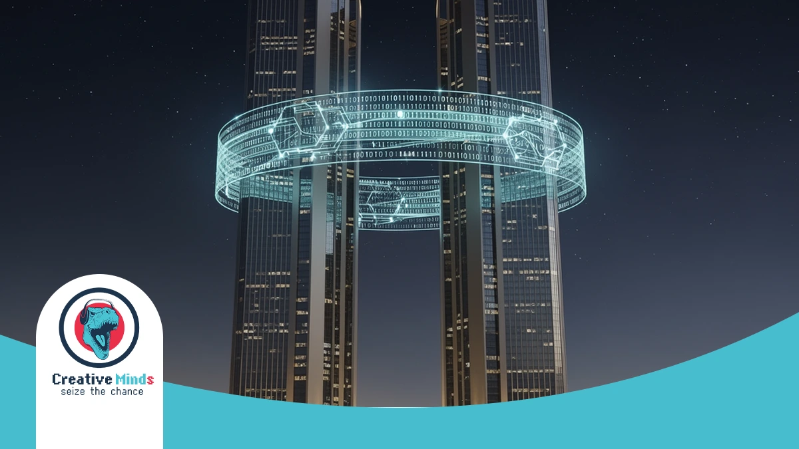

# Top Web Design Agency in Riyadh: Custom Digital Solutions 2026

## Redefining Your Digital Presence with a Premier Web Design Agency in Riyadh
<!-- section_id: sec_01 -->

**Contact our team today and get your project moving within days.**

In Riyadh’s rapidly evolving 2026 business climate, your digital storefront is often the first point of contact for global investors and local consumers. As a premier **Web Design Agency**, CEMS IT helps you dominate this competitive landscape by aligning your digital assets with Saudi Vision 2030 goals. [Secure your high-performance web solution today](https://cems-it.com/) to ensure your brand stays ahead of the curve.

We don’t just build websites; we engineer high-speed digital experiences using a specialized technology stack. By implementing [React for interactive front-ends](https://react.dev/) and secure PHP backends, our team ensures your platform handles heavy local traffic with seamless efficiency. Our three-step methodology—consultation, customized planning, and high-quality execution—guarantees a product tailored to your exact commercial objectives.

Beyond standard development, CEMS IT functions as a comprehensive digital marketing agency and programming agency, integrating advanced AI solutions and smart chat-bots to automate your user engagement. Whether you are in real estate or government administration, our UI/UX focus improves usability and conversions. Contact our Riyadh office now to transform your vision into a scalable, future-proof reality.
## The Hidden Risks of Generic Templates in the Saudi Market
<!-- section_id: sec_02 -->

**Get a free consultation with our specialists — zero commitment required.**

Choosing a generic template for your Riyadh business creates a massive risk for your brand identity. These pre-made layouts often fail to support proper RTL (Right-to-Left) Arabic script, leading to broken layouts that alienate local users.

Your customers in the KSA expect a seamless **mobile-first** experience that loads instantly. Generic templates are bloated with unnecessary code, causing slow speeds that hurt your search rankings and drive frustrated users straight to your competitors.

Relying on "off-the-shelf" designs puts your business at risk of:

*   **Broken RTL layouts** that disrupt the natural reading flow of Saudi consumers.
*   **Slow local loading speeds** due to unoptimized global servers and heavy code.
*   **Poor mobile responsiveness** that fails to meet the KSA’s high smartphone usage.
*   **Security vulnerabilities** common in mass-produced themes without custom patches.
*   **Lack of integration** with essential local **cloud services** and payment gateways.

Standard templates lack the technical depth required for complex **e-commerce development** or specialized **mobile app development**. Without a professional **Web Design Agency**, you risk launching a site that feels "foreign" rather than localized.

By prioritizing bespoke UI and UX design, you ensure your digital presence aligns with the sophisticated expectations of the Saudi market while maintaining peak performance on any device.
## Our Technical Framework: How CEMS IT Builds Future-Proof Platforms
<!-- section_id: sec_03 -->

**Don't let your competitors launch first — start your digital project now.**

At **CEMS IT**, we engineer high-performance platforms specifically for the Riyadh market. By utilizing [advanced React and PHP web development services](https://cems-it.com/services/web-development), your business gains a scalable architecture that handles local traffic surges with ease.

Our **Web Design Agency** prioritizes localized technical depth. We integrate Mada and STC Pay to ensure your customers enjoy frictionless transactions. This precision in e-commerce development turns visitors into loyal Saudi consumers.

| Feature | Technology Stack | Local Business Benefit |
| :--- | :--- | :--- |
| Frontend | React | Lightning-fast, interactive user interfaces |
| Backend | Secure PHP | Robust data protection and system stability |
| Automation | AI solutions | Smart chatbots for 24/7 client engagement |

**See how our team can turn your vision into measurable digital results.**
| Payments | Local Gateways | Seamless Mada and STC Pay integration |Beyond standard coding, we provide technology consulting to align your stack with Saudi Vision 2030 standards. From WordPress customization to specialized SEO services, our framework ensures your digital presence remains future-proof and competitive.

### RTL-First Design Methodology for Arabic Users

<!-- section_id: sec_03_sub1 -->

When you target the Riyadh market, simple CSS mirroring isn't enough to satisfy sophisticated local users. Our **Web Design Agency** utilizes a native RTL-first methodology, ensuring your layout's logic, navigation, and alignment are built from the ground up for Arabic script.

We move beyond basic translation by focusing on specialized UI and UX design that respects the natural right-to-left eye tracking of Saudi consumers. By utilizing React for front-end development, we ensure your site remains lightning-fast and structurally sound without the layout "breaking" common in generic templates.

At CEMS IT, our technical workflow is managed through Jira and Marvel App to ensure every design element aligns with Saudi cultural nuances in typography. This precision prevents technical debt and ensures your digital platform delivers a seamless, high-performance experience that feels native to your local audience.
## Proven Results: Why We Are the Top Web Design Agency for Saudi Enterprises
<!-- section_id: sec_04 -->

**Our experts are standing by — reach out and get direct answers today.**

At CEMS IT, we validate our status as a premier **Web Design Agency** through a rigorous project workflow managed via Jira and Confluence. This structured environment ensures every technical requirement for your Riyadh enterprise is documented, approved, and executed with precision.

Our success in the GCC market stems from a commitment to high-quality content and responsive layouts that eliminate user confusion. By balancing text value with optimized imagery, we ensure your platform captures attention while maintaining the technical integrity required for high-traffic Saudi portals.

*   **Agile Methodology:** We use Kanban boards to track every task, ensuring your project hits every milestone on schedule.
*   **Marvel App Integration:** You can review all UI/UX designs in a dedicated environment to provide real-time feedback before development begins.
*   **Data Security:** Our administration services include daily and weekly source code backups to protect your digital assets.
*   **Proven Experience:** We have successfully delivered complex solutions for the Qatar General Authority of Customs and diverse construction sectors.

We invite you to explore [our extensive portfolio of Saudi enterprise projects](https://cems-it.com/portfolio) to see how our three-step methodology transforms complex business needs into seamless digital experiences. Our focus on HTML5 and Javascript ensures your site remains future-proof against evolving technology trends.
## Case Study: Modernizing Digital Infrastructure for Regional Leaders
<!-- section_id: sec_05 -->

**Your path to digital success starts with one conversation — let's begin.**

When you partner with CEMS IT, you gain access to a **Web Design Agency** that has successfully delivered high-stakes infrastructure for the Qatar General Authority of Customs. We specialize in government-grade digital transformation.

Our team provides expert **technology consulting** to ensure your platform meets the rigorous regulatory standards of Riyadh. By choosing us as your **programming agency**, you ensure your complex digital assets are secure, scalable, and efficient.

We invite you to see our high-impact results by exploring our portfolio of regional enterprise projects, where we demonstrate our ability to manage large-scale architectural challenges with precision and cultural alignment.
## The 3-Step Path to Launching Your Custom Digital Solution

<!-- section_id: sec_06 -->

Our approach ensures your vision translates into a high-performance reality. We begin with a deep-dive consultation to align your goals with the Riyadh market's specific demands, ensuring every technical requirement is documented before we start.

We then move into a [strategic UI/UX design and planning phase](https://cems-it.com/services/ui-ux-design) to map out your user journey. By focusing on how your customers interact with your brand, we create a blueprint for long-term digital success.

1. **Discovery & Analysis**: We define your project scope, identifying the best **web design agency** strategies to reach your target audience in Saudi Arabia.
2. **Customized Development**: Our team builds your solution using a robust **web development agency** framework, integrating secure PHP backends and interactive frontends.
3. **Cloud Integration & Launch**: We deploy your platform using scalable **cloud services** to ensure 24/7 availability and lightning-fast loading speeds for local users.

Finally, we execute the build with precision, utilizing WordPress for flexibility or React for complex interfaces. Your project undergoes rigorous testing to ensure it handles high traffic volumes while maintaining peak security standards.

### Post-Launch Growth: Maintenance and SEO Support

<!-- section_id: sec_06_sub1 -->

Your website’s journey doesn't end at launch; it’s where your long-term ROI begins. At CEMS IT, we provide continuous maintenance and **SEO services** to ensure your platform remains secure, fast, and visible to your Riyadh target audience.

Our post-production phase involves setting the groundwork for growth through detailed research and organization. By analyzing insights from Google Ads, we help you refine your buyer personas and deliver targeted messaging that resonates with the local Saudi market.

We manage your digital assets with a structured methodology, performing regular source code backups and security patches. This proactive approach, combined with our role as a digital marketing agency, ensures your site adapts to evolving search trends and technical standards.

## Frequently Asked Questions About Web Design in Riyadh

<!-- section_id: sec_07 -->

### How long does it take a Web Design Agency to launch a site in Riyadh?
The timeline for your project typically depends on the complexity of your requirements. Most custom builds at CEMS IT follow a structured three-step methodology—consultation, design planning, and execution—which generally spans 6 to 12 weeks to ensure high-quality construction.

### Does Web Design Riyadh include local payment gateway integration?
Yes, localizing your checkout process is essential for the Saudi market. We integrate secure PHP backends that support regional providers like Mada and STC Pay, ensuring your customers experience frictionless transactions that align with local banking standards.

### Can you build a website that supports both Arabic and English?
We specialize in creating high-performance, bilingual platforms from the ground up. By utilizing React for scalable front-end interfaces, we ensure your site handles Right-to-Left (RTL) Arabic script perfectly without compromising the layout or user experience for your English-speaking visitors.

### Do you provide hosting and maintenance after the website is live?
Our commitment to your vision continues long after the initial launch. CEMS IT offers comprehensive management services, including daily source code backups and security patches, to keep your digital assets protected and performing at peak efficiency within the KSA’s digital landscape.

### Is your web development compatible with Saudi Vision 2030 standards?
We align our technical stack with the Kingdom’s digital transformation goals by implementing advanced features like AI-driven tools and smart bots. This approach ensures your business stays competitive and meets the sophisticated technological expectations of both government entities and private sector consumers.

### How do you ensure my website ranks well on Google in Saudi Arabia?
Visibility is a core part of our delivery process. We optimize your site’s architecture and speed to meet modern search requirements, helping you attract the right audience through customized web development services that prioritize both technical SEO and superior UI/UX design.

## Secure Your Market Lead with Riyadh’s Digital Architects

<!-- section_id: sec_08 -->

Your business cannot afford to wait while competitors modernize. By partnering with a dedicated **Web Design Agency**, you ensure your brand transitions from a simple participant to a dominant force in Riyadh’s 2026 digital economy.

We streamline your growth through a specialized implementation process that aligns every line of code with Saudi Vision 2030 standards. You can accelerate your market entry by leveraging our custom web development services to build a scalable, high-performance platform.

Don't let technical debt or outdated layouts stall your progress in the KSA. Secure your competitive advantage today by consulting with our Riyadh-based technical architects to launch a future-proof digital solution that converts local traffic into loyal customers.