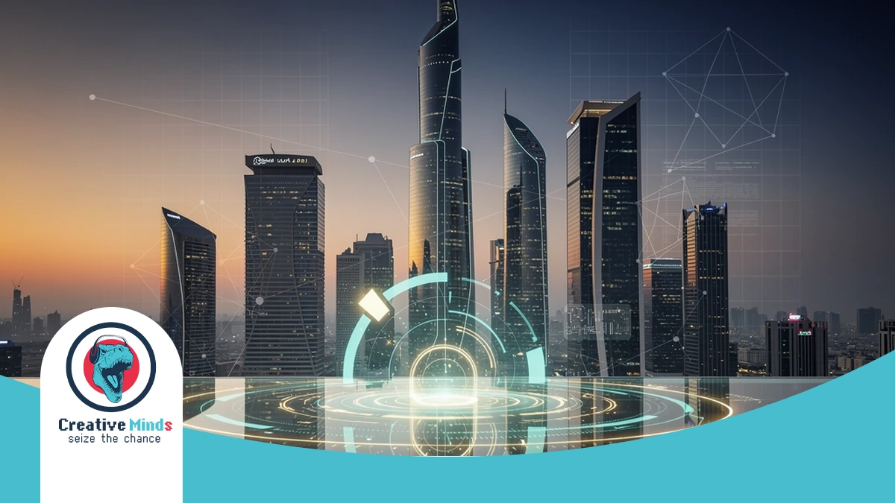
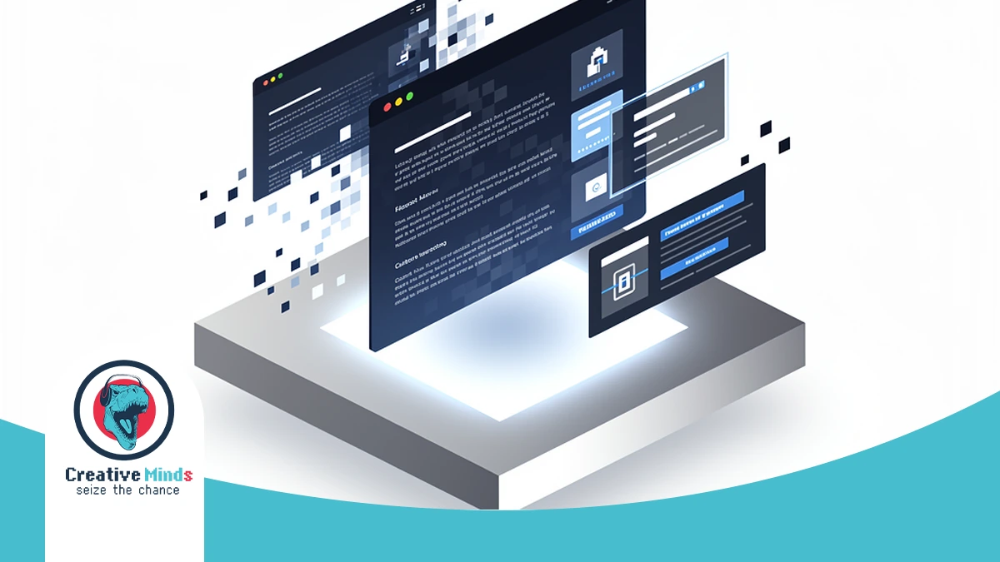
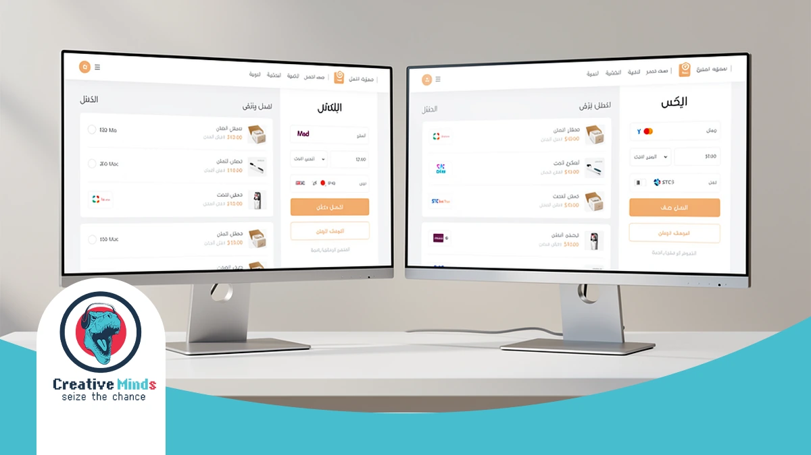
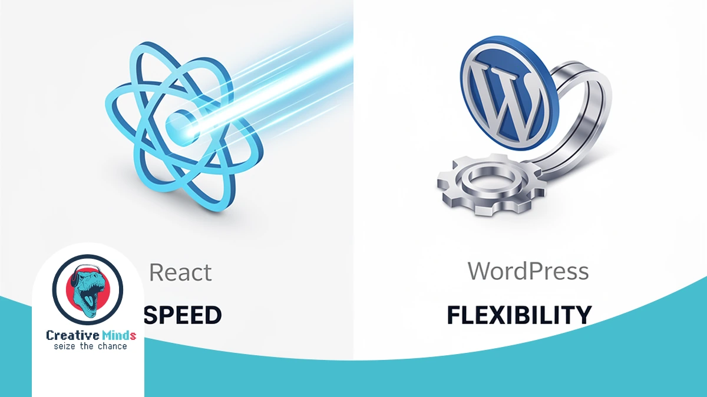
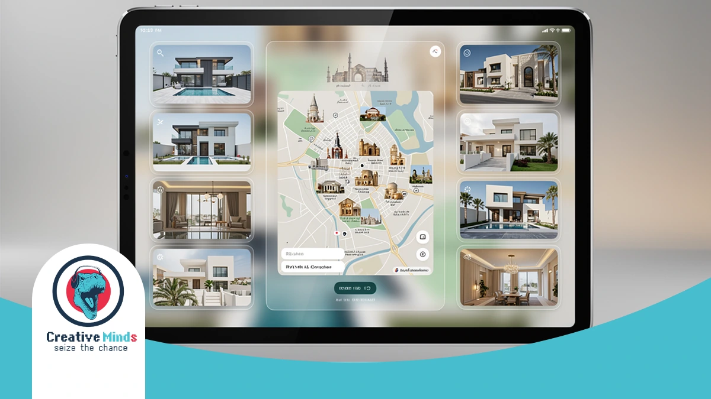
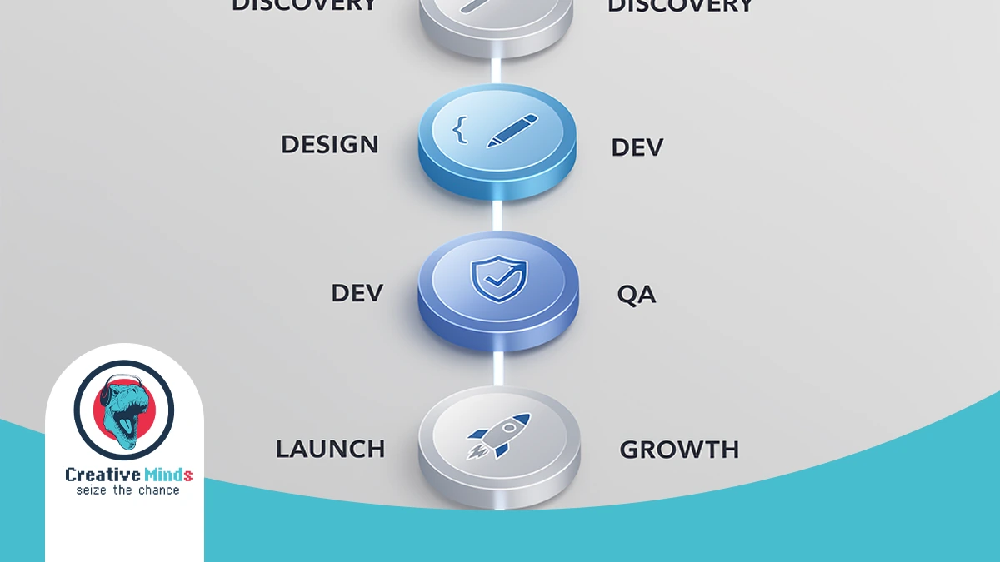
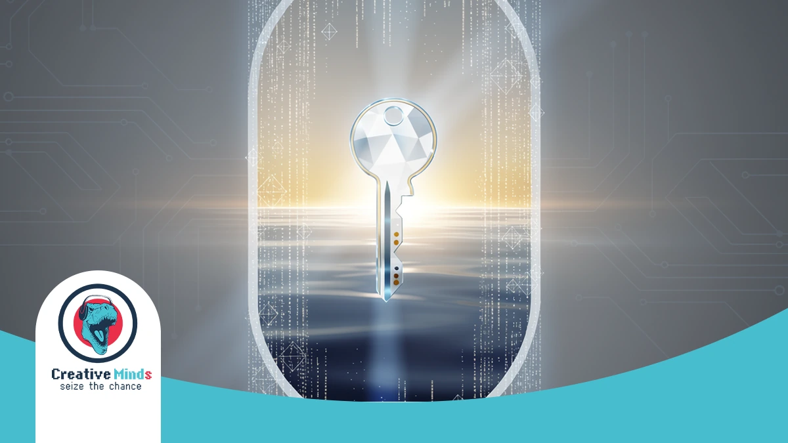

# Top Web Design Agency in Riyadh: Custom Solutions for 2026

## Partnering with a Premier Web Design Agency in Riyadh for 2026 Success
<!-- section_id: sec_01 -->

**Contact our team today and get your project moving within days.**

[Secure your free 2026 digital growth consultation today](https://cems-it.com/)

Your business in Riyadh faces a rapidly evolving market where a basic website no longer suffices. To lead, you need a premier **Web Design Agency** that understands the local shift toward "Digital First" models.

We specialize in high-end **web development** and **responsive design** tailored for the Kingdom's unique landscape. Our team ensures your brand aligns with [Saudi Vision 2030](https://www.vision2030.gov.sa) by prioritizing Arabic-first interfaces and seamless **UX/UI design**.

Don't let your competitors capture the Riyadh market first. Contact us now to build a future-proof platform that converts visitors into loyal customers before the 2026 digital surge.
## The Risk of Generic Templates in the Saudi Market
<!-- section_id: sec_02 -->

**Get a free consultation with our specialists — zero commitment required.**

Your Riyadh business risks losing significant revenue by relying on "off-the-shelf" templates. These generic structures often suffer from high latency because they aren't optimized for local hosting environments within the Kingdom.

At CEMS IT, we replace these slow, rigid templates with [high-performance web development services](https://cems-it.com/services/web-development/) built on specialized stacks like React and PHP. Our custom approach ensures your site handles high traffic without the performance optimization bottlenecks common in pre-made themes.

*   **Payment Failures:** Generic templates often lack native hooks for Mada or STC Pay, leading to abandoned carts.
*   **Slow Load Times:** Hosting a template-heavy site on distant servers creates lag that frustrates local users and hurts SEO.
*   **Rigid Scalability:** Unlike our custom PHP backends, templates limit your ability to integrate complex e-commerce platforms or AI-driven tools.
*   **Weak Branding:** A "cookie-cutter" design dilutes your branding services, making you look identical to every other competitor in the market.

You need a digital presence that functions as a professional tool, not just a placeholder. By choosing a specialized **Web Design Agency**, you ensure your platform integrates seamlessly with Saudi logistics and digital marketing ecosystems.
## Why Choose CEMS IT for Your Riyadh Web Design Project
<!-- section_id: sec_03 -->

**Don't let your competitors launch first — start your digital project now.**

You deserve a partner that transcends basic templates. At **CEMS IT**, we build high-performance platforms in Riyadh using React and custom PHP to ensure your digital infrastructure remains scalable, fast, and remarkably secure.

Your growth depends on sophisticated technical integration. We leverage machine learning integration and AI Solutions to automate user journeys, ensuring your website evolves alongside your business needs while maintaining peak performance across all local hosting environments.

*   **Advanced Tech Stack:** We utilize React and Node.js for ultra-fast, app-like web experiences.
*   **Intelligent Automation:** Seamless machine learning integration to personalize content for every Riyadh-based visitor.
*   **Arabic-First Precision:** Expert implementation of [localized UX/UI design principles](https://cems-it.com/services/ui-ux-design/) to capture the Saudi market's cultural nuances.
*   **Cloud Resilience:** Robust cloud migration strategies that guarantee 99.9% uptime during high-traffic seasonal surges.

We go beyond aesthetics by embedding search engine optimization into the core code. This technical rigor ensures your UX/UI design isn't just beautiful but also discoverable, driving consistent organic traffic to your Riyadh enterprise.

### Custom React Development vs. Scalable WordPress Solutions

<!-- section_id: sec_04 -->

Choosing the right technical foundation is vital for your Riyadh business. At CEMS IT, we help you navigate whether a custom React frontend or a scalable WordPress backend suits your specific goals.

Our **Web Design Agency** specializes in high-performance web development that balances speed with functional depth. We ensure your platform handles local traffic spikes while maintaining a seamless, responsive design. | Feature | Custom React Frontend | Scalable WordPress Solutions |
| :--- | :--- | :--- |
| **Best For** | Complex real estate portals & SaaS | Educational blogs & content sites |
| **Performance** | Ultra-fast, app-like interactions | Optimized for SEO & easy updates |
| **Scalability** | High; handles massive data sets | Moderate; perfect for growing SMEs |

**See how our team can turn your vision into measurable digital results.**
| **Maintenance** | Requires specialized developer support | User-friendly dashboard for teams |Whether you need an AI-driven real estate platform or a secure legal portal, our technical stack ensures performance optimization.

We focus on building resilient infrastructure that grows alongside your enterprise's digital needs in Saudi Arabia.
## Proven ROI: Justifying Our Status as a Leading Web Design Agency
<!-- section_id: sec_05 -->

**Our experts are standing by — reach out and get direct answers today.**

Your business deserves more than just a website; it requires a high-performance engine that fuels growth. We have consistently delivered measurable success by integrating advanced **search engine optimization** into every custom build.

By analyzing **digital marketing** trends specific to the Riyadh market, our team ensures your platform outperforms competitors. You can explore [our portfolio of high-converting digital assets](https://cems-it.com/portfolio/) to see how we transform local brands.

We prioritize technical precision to guarantee your investment yields a high return. Your company will benefit from our cross-border expertise, ensuring your site meets international standards while resonating deeply with Saudi consumers and local search algorithms.
## Case Study: Scaling a Real Estate Platform in the Region
<!-- section_id: sec_06 -->

**Your path to digital success starts with one conversation — let's begin.**

We recently partnered with a prominent real estate developer to navigate the Riyadh property boom. By delivering a full-featured platform, CEMS IT proved how a specialized **Web Design Agency** can transform complex local market requirements into high-performance digital assets.

Our team executed a strategic cloud migration to ensure the platform handles massive traffic spikes during Vision 2030 infrastructure announcements. We integrated secure backends using PHP to manage extensive property listings with zero latency for users across the Kingdom.

To maintain a premium feel, we applied comprehensive branding services that resonate with Saudi investors. This custom approach, built with React, resulted in an interactive interface that significantly outperformed generic templates in both speed and user retention.
## Our 6-Step Implementation Process: From Vision to Deployment

<!-- section_id: sec_07 -->

Our strategy begins with a deep-dive consultation to align your digital goals with Riyadh’s unique market etiquette. We listen to your specific requirements to ensure every technical decision supports your long-term business vision.

Once we define the roadmap, our team moves into agile development. We prioritize **performance optimization** and clean architecture, ensuring your platform is fast, secure, and ready to scale alongside the Kingdom’s rapid economic expansion.

1. Discovery & Strategic Consultation: Aligning with your brand values and Saudi market expectations.
2. Architecture & UI/UX Design: Creating intuitive, Arabic-friendly interfaces for your local audience.
3. Development & **machine learning integration**: Building smart, automated features into your custom backend.
4. Rigorous QA Testing: Stress-testing every module for speed, security, and cross-device responsiveness.
5. Deployment & Cloud Sync: Launching your site on localized servers for peak regional performance.
6. Post-Launch Optimization: Continuous monitoring to ensure your platform evolves with emerging digital trends.

We finalize the process by integrating advanced analytics to track your success. This transparent approach ensures you maintain full control over your digital asset while we handle the complex technical heavy lifting.

## FAQs About Web Design in Riyadh

<!-- section_id: sec_08 -->

### How long does a typical project with a Web Design Agency take?
Timeline varies based on complexity, but most custom projects in Riyadh require 8 to 12 weeks. Your business needs specific phases for discovery, Arabic-first interface design, and rigorous testing on local Saudi Arabian hosting environments.

### Can you integrate local payment gateways like Mada and STC Pay?
Yes, integrating local financial tools is essential for the Saudi market. We ensure your platform connects seamlessly with Mada and STC Pay, providing your customers with the secure, familiar checkout experiences they expect.

### Does Web Design Riyadh include mobile responsiveness?
Every site we build uses responsive design to ensure your brand looks professional on all devices. Since most Saudi users browse via smartphones, we prioritize mobile performance to help you capture high-value mobile traffic effectively.

### How does CEMS IT handle Arabic SEO and RTL layouts?
We implement Right-to-Left (RTL) coding standards from the ground up rather than using simple translations. This technical precision ensures your custom web development solutions rank higher on local search engines and provide natural navigation for Arabic speakers.

### Is hosting provided within Saudi Arabia for better speed?
We recommend hosting your data on servers located within the Kingdom to minimize latency. By reducing the physical distance between your data and your Riyadh-based audience, you significantly improve page load speeds and user retention.

## Secure Your Digital Future with Riyadh's Custom Web Experts

<!-- section_id: sec_09 -->

Your business in Riyadh deserves a digital foundation that triggers growth. By partnering with a specialized **Web Design Agency**, you ensure your platform transitions from a simple site to a high-performance sales engine.

Our implementation process integrates custom web development solutions with localized precision. We align your technical architecture with the rapid economic shifts of Saudi Vision 2030 to keep you ahead.

Stop losing potential customers to slow, outdated templates. Contact our team today to build a future-proof platform that secures your dominant position in the competitive Riyadh market before the 2026 digital surge.