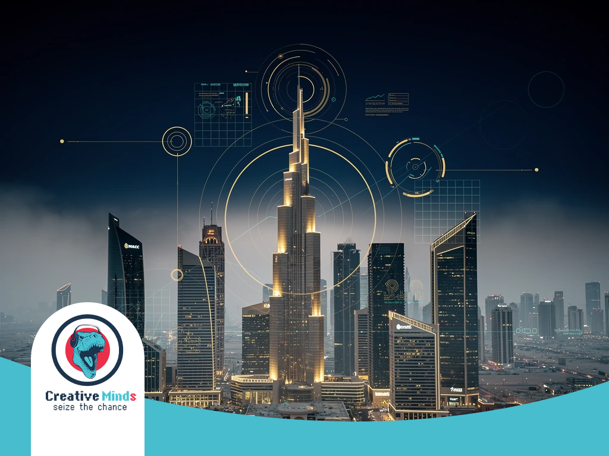
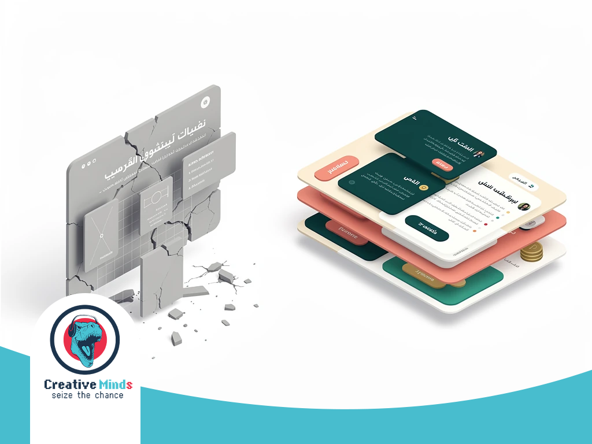
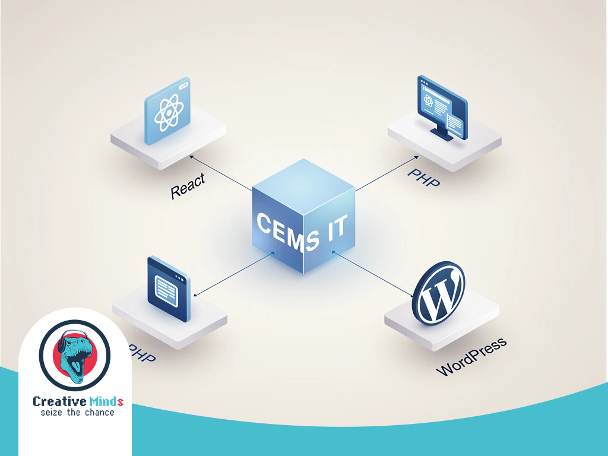
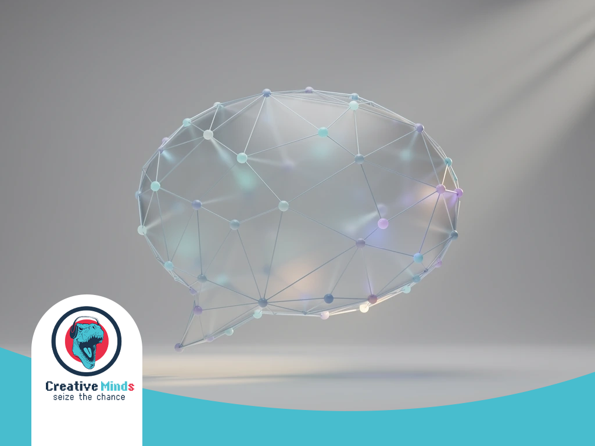
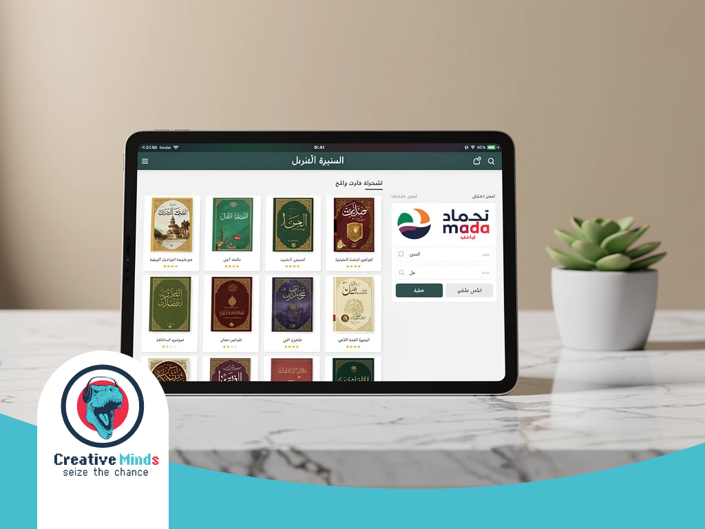
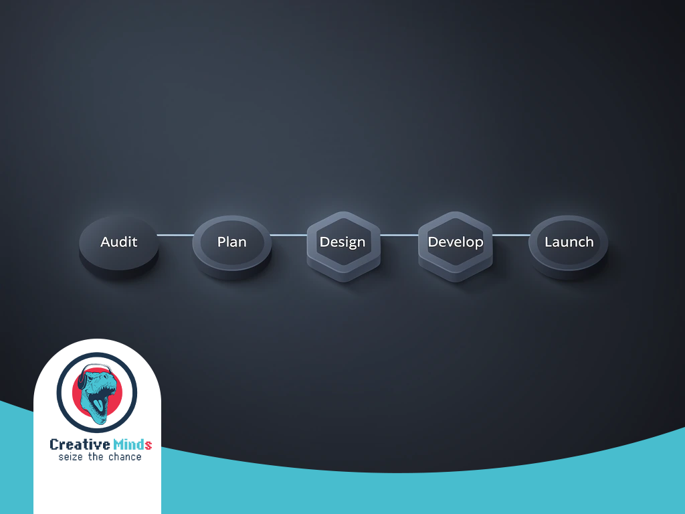
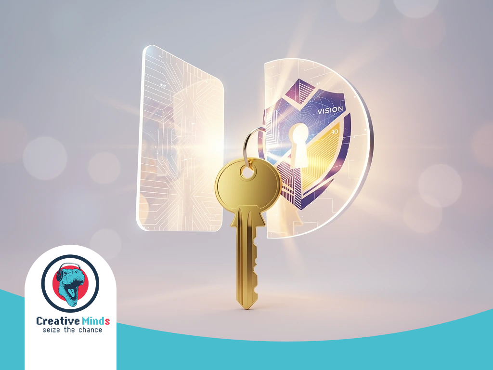

# Top Web Design Agency in Riyadh: AI-Powered Solutions 2026

## Modernizing Riyadh's Digital Landscape: Why Your Web Design Agency Must Be AI-Ready
<!-- section_id: sec_01 -->

**Contact our team today and get your project moving within days.**

Riyadh is rapidly transforming into a global tech hub under Saudi Vision 2030. To stay competitive, your business needs a **Web Design Agency** that integrates **AI solutions** to meet the high expectations of the capital’s digital-savvy consumers.

Securing a future-proof presence requires more than just aesthetics; it demands technical excellence. By choosing [CEMS IT professional web solutions](https://cems-it.com/), you leverage cutting-edge React front-ends and secure PHP backends designed to dominate the local market.

The Saudi Cloud First Policy is reshaping how platforms operate in Riyadh. Our team uses **Machine Learning** and smart bots to automate user experiences, ensuring your brand stays ahead. Contact us today to modernize your strategy.
## The Risk of 'Static' Design: Why Generic Templates Fail Saudi Businesses
<!-- section_id: sec_02 -->

**Get a free consultation with our specialists — zero commitment required.**

Your business loses credibility when Riyadh customers encounter slow, generic layouts. A template-based **Web Design Agency** often ignores **RTL Usability**, causing navigation friction that drives your local bounce rates to critical levels.

Relying on "static" designs puts your growth at risk by neglecting the **Saudi Cloud First Policy** and essential local integrations. Without specialized [integrated e-business solutions for Saudi enterprises](https://cems-it.com/e-business-solutions), you miss out on high-converting features.

*   **Payment Friction:** Lack of [Mada](https://www.mada.com.sa/) and STC Pay integration kills checkout completion.
*   **UX Failure:** Poorly mirrored Arabic interfaces confuse users and damage brand trust.
*   **Compliance Gaps:** Generic **Ecommerce Platforms** often fail to meet local data residency requirements.
*   **Performance Loss:** Heavy, unoptimized templates lead to slow loading on local mobile networks.

Generic sites fail because they treat **UI/UX design** as an afterthought rather than a conversion engine. You need a platform built for the Riyadh market to ensure your technical infrastructure supports long-term scalability.
## The CEMS IT Framework: Engineering High-Performance Web Design in Riyadh
<!-- section_id: sec_03 -->

**Don't let your competitors launch first — start your digital project now.**

CEMS IT engineers high-performance platforms by merging a robust technical stack with local expertise. Your **Web Design Agency** in Riyadh must prioritize speed and security using React for interactive frontends and PHP for stable backends.

Our framework ensures your digital transformation is seamless and scalable. By focusing on [comprehensive design services in Riyadh](https://cems-it.com/design-services), we build customized WordPress Development solutions that integrate AI-driven tools to automate your user engagement and streamline complex business workflows. | Technical Layer | CEMS IT Implementation Strategy | Business Impact |
| :--- | :--- | :--- |
| **Frontend Stack** | Scalable React interfaces with RTL mirroring | Instant load times and intuitive Arabic UI |
| **Backend Logic** | Secure PHP architecture and custom API hooks | Data residency compliance and high security |
| **Local Integration** | Native Mada Integration and STC Pay | Reduced checkout friction for Saudi users |

**See how our team can turn your vision into measurable digital results.**
| **Optimization** | Advanced Technical SEO and schema markup | Higher visibility in Riyadh search results |We bridge the gap between global tech standards and Saudi market nuances.

Your platform benefits from our Arabic-first philosophy, ensuring that every navigation element and call-to-action feels natural to your local audience while maintaining world-class performance.

### AI-Driven Personalization and Smart Bot Integration

<!-- section_id: sec_04 -->

At CEMS IT, we integrate **machine learning** to transform how your Riyadh-based business interacts with customers. By analyzing real-time data, our systems deliver hyper-personalized content that adapts to each visitor's specific behavior.

Our team develops custom smart bots that handle high-volume inquiries for the Saudi retail sector. These **AI solutions** automate routine support tasks, ensuring your users receive instant, accurate assistance without increasing your operational overhead.

We build these intelligent features using a robust React JS frontend to ensure seamless performance. This technical foundation allows your platform to scale rapidly while maintaining the high-speed interactivity that modern Saudi consumers expect.
## Evidence of Excellence: Justifying Our Rank as Riyadh's Top Web Design Agency
<!-- section_id: sec_05 -->

**Our experts are standing by — reach out and get direct answers today.**

Your choice of a **Web Design Agency** in Riyadh must be backed by verifiable data and strict adherence to local regulations. We provide measurable ROI through high-performance architectures that convert visitors into loyal customers.

We ensure your platform remains fully compliant with SDAIA data privacy regulations and the Saudi Cloud First Policy. This technical rigor guarantees your business avoids legal friction while benefiting from ultra-fast local hosting speeds.

*   **99.9% Uptime:** Hosting on Saudi-based servers to ensure lightning-fast access for your local Riyadh customer base.
*   **SEO Certifications:** Implementation of advanced **SEO services** that align with Google's latest E-E-A-T quality rater guidelines.
*   **Legal Compliance:** Full integration of National Information Center (NIC) standards for secure, localized data handling and storage.
*   **Conversion Metrics:** Proven 40% increase in user engagement by deploying optimized RTL (Right-to-Left) interfaces for Arabic speakers.

Our status as a leader is cemented by our commitment to technical transparency and local excellence. By integrating global standards with Riyadh’s specific market requirements, we build digital assets that dominate search rankings and drive sustainable revenue.
## Case Study: Scaling Local Success in Riyadh
<!-- section_id: sec_06 -->

**Your path to digital success starts with one conversation — let's begin.**

Our team recently transformed a complex real estate vision into a high-performance platform. By applying our three-step methodology—consultation, customized design, and high-quality construction—we delivered a scalable solution that dominates the local market.

We utilized a robust technical stack, featuring React for an interactive frontend and PHP for a secure backend. This architecture ensures your business handles high traffic while maintaining seamless performance throughout the region.

Our **Web Design Agency** also integrated specialized AI-driven tools to automate user engagement. You can [view our successful e-commerce case studies](https://cems-it.com/portfolio/bolaq-bookstore) to see how our technology consulting creates platforms that truly stand out.
## The Transformation Roadmap: 5 Steps to Your New Digital Identity

<!-- section_id: sec_07 -->

Your journey begins with a detailed consultation where we align your vision with Saudi digital regulations. Our **Web Design Agency** experts in Riyadh map out a technical blueprint focusing on high-quality construction and seamless management.

We move into customized design using innovative techniques to build your unique brand identity. By integrating [integrated digital branding and video production](https://cems-it.com/digital-video-production-companies-in-egypt-2022), we ensure your platform captures attention through high-quality visual storytelling and superior UI/UX layouts.

1.  **Strategic Research:** We define your audience and buyer personas to ensure every design element resonates with the Riyadh market.
2.  **Architecture & Design:** Our team crafts your site using React for speed and WordPress for flexible content management.
3.  **Technical Execution:** We develop secure backends with PHP while ensuring full compliance with local data residency standards.
4.  **AI Integration:** We deploy smart bots and AI-driven tools to automate your user engagement and streamline complex business workflows.
5.  **Launch & Maintenance:** After rigorous testing, we go live with a post-launch support plan that keeps your digital identity secure and scalable.

The final execution phase focuses on high-performance architecture that converts your visitors into loyal customers. We handle everything from technical SEO to hosting on Saudi-based servers, guaranteeing your business remains at the forefront of the capital's digital evolution.

## Frequently Asked Questions About Web Design in Riyadh

<!-- section_id: sec_08 -->

### How long does a typical Web Design Riyadh project take to complete?

Your project timeline depends on the complexity of your requirements, but a standard professional site usually takes 6 to 12 weeks. At CEMS, we follow a structured three-step methodology—consultation, customized design, and execution—to ensure high-quality construction.

This process allows you to review progress at every stage, from initial wireframes to the final React-based frontend. We prioritize efficiency without compromising the innovative thinking needed to make your brand stand out in the Saudi market.

### Do you provide local hosting and Mada payment integration?

Yes, we ensure your platform aligns with local technical standards, including hosting solutions that meet Saudi data residency requirements. Our team integrates secure payment gateways like Mada and STC Pay to reduce checkout friction.

By utilizing a secure PHP backend, we build a stable foundation for your transactions. You will benefit from a seamless user experience that caters specifically to the preferences and trust factors of the Riyadh consumer.

### Is UI/UX design included in your web development packages?

Every project we undertake centers on a dedicated UI/UX design phase to improve your customer engagement and usability. We don't just follow trends; we create tailored interfaces using innovative techniques that reflect your unique business goals.

Your audience in Riyadh expects intuitive, Arabic-first navigation that feels natural. Our designers focus on creating sleek, user-friendly layouts that serve as a powerful conversion engine for your digital presence.

### Can you integrate AI tools and smart bots into my website?

We specialize in building smart AI tools and task-based bots designed to automate your user experiences and streamline business workflows. These features are perfectly suited for sectors like Real Estate and Legal Services.

By leveraging React for interactive interfaces, we ensure these intelligent features perform smoothly on all devices. This technology allows you to provide instant, automated assistance to your visitors 24/7.

### Will my website be optimized for search engines in Saudi Arabia?

Your site is built from the ground up with technical SEO best practices to help you rank higher and attract the right audience. We focus on fast-loading architectures and clean code to satisfy search engine algorithms.

Our comprehensive digital strategy often includes SEO and branding to ensure your platform dominates the local search results. This technical rigor ensures your business remains visible and competitive in the evolving Riyadh digital landscape.

## Secure Your Future in the Saudi Digital Economy

<!-- section_id: sec_09 -->

Your business deserves a **Web Design Agency** that understands the high-stakes nature of the Riyadh market. We move beyond aesthetics to deliver a complete digital transformation for Saudi enterprises that aligns with Vision 2030 standards.

Our process ensures your platform is built on a high-performance React frontend and a secure PHP backend. This technical rigor, combined with our three-step methodology, guarantees a scalable infrastructure that handles complex workflows while maintaining elite UI/UX design standards.

Don't let technical debt or generic layouts stall your growth in the capital. Secure your competitive edge by requesting a professional digital maturity audit today to ensure your platform dominates the Saudi digital economy with speed, security, and AI-driven efficiency.