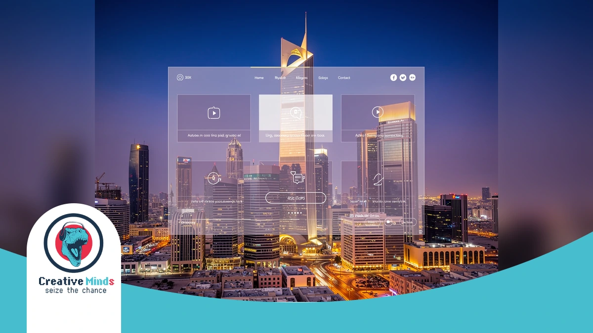
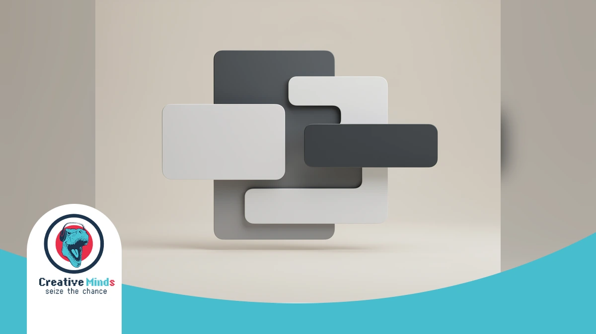
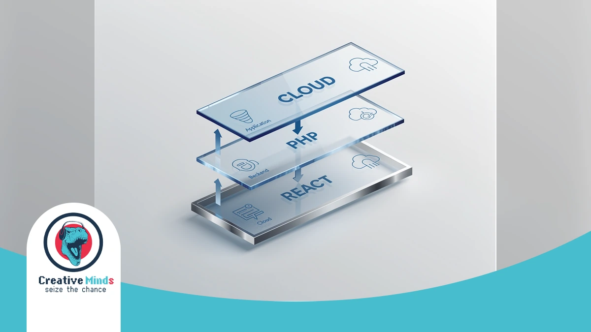
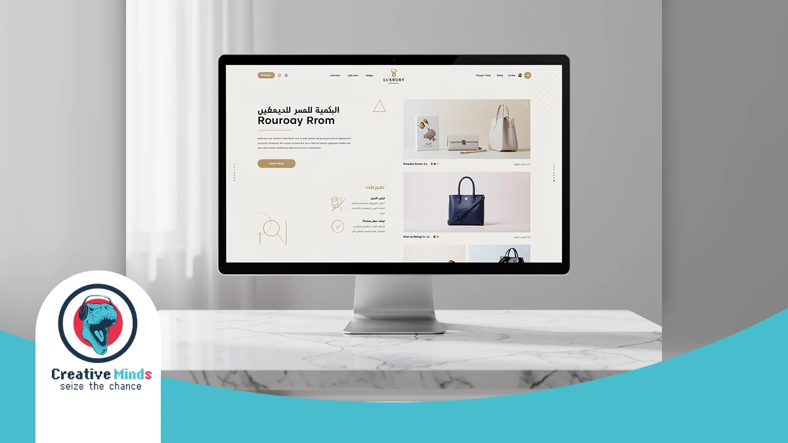
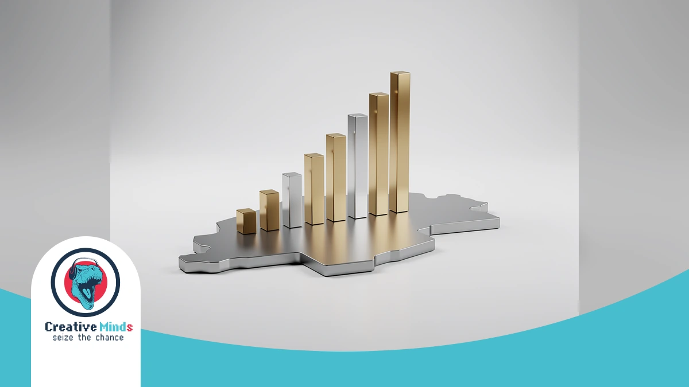
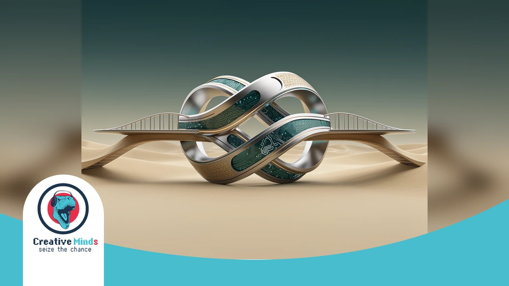

# Top-Rated Web Design Agency in Riyadh: Custom Solutions for 2026

## Partnering with a Top-Rated Web Design Agency in Riyadh for 2026
<!-- section_id: sec_01 -->

**Contact our team today and get your project moving within days.**

Your Riyadh business deserves more than a template. As the 2026 digital market evolves, you need a **Web Design Agency** that aligns your brand with [Saudi Vision 2030](https://www.vision2030.gov.sa) standards.

The capital's shift toward a tech-driven economy means your site must lead, not follow. By choosing [CEMS IT for high-performance digital solutions](https://cems-it.com/), you ensure your platform dominates the local search landscape.

Success in Web Design Riyadh requires blending global innovation with local culture. We specialize in **UI/UX design Saudi Arabia** and **RTL web design** to engage your specific audience. Secure your competitive edge today.
## Why Riyadh Businesses Risk Failure Without Strategic Web Design
<!-- section_id: sec_02 -->

**Get a free consultation with our specialists — zero commitment required.**

In the competitive Riyadh market, a generic website is a liability. Your brand risks losing credibility if your **Web Design Agency** fails to implement a pixel-perfect Right-to-Left (RTL) layout that feels natural to local users.

Poorly optimized sites drive high bounce rates and damage your reputation. Without seamless Mada payment integration and mobile-first speed, you are essentially handing your market share to competitors who prioritize professional Saudi user experiences.

*   **RTL Integrity:** Prevents layout breakage and ensures your Arabic content flows logically for local readers.
*   **Vision 2030 Alignment:** Modernizes your digital presence to meet the high standards of the Vision 2030 digital transformation initiative.
*   **Performance Bottlenecks:** Eliminates slow loading times common in basic WordPress development KSA setups that aren't optimized for local hosting.
*   **Conversion Security:** Builds immediate trust through localized payment gateways and professional UI/UX standards.

Ignoring strategic **Web Design Riyadh** means your business remains invisible in local search results. You must adopt advanced [E-BUSINESS SOLUTIONS for Saudi enterprises](https://cems-it.com/e-business-solutions) to ensure your platform remains secure, scalable, and commercially viable for the long term.
## The CEMS IT Framework: How Our Web Design Agency Builds for 2026
<!-- section_id: sec_03 -->

**Don't let your competitors launch first — start your digital project now.**

Our **Web Design Agency** in Riyadh applies "Innovative Thinking" to every project. We don't just follow digital trends; we create them by aligning your platform with the latest global technical standards and local expectations.

CEMS IT utilizes a robust technology stack to ensure your site remains scalable and secure. We integrate **Custom React applications** for speed, WordPress for flexible management, and PHP for powerful, high-performance back-end functionality. | Feature | Technical Implementation | Saudi Market Benefit |
| :--- | :--- | :--- |
| Frontend | React.js Interfaces | Instant loading for mobile users in Riyadh |
| Backend | Secure PHP Development | High-level data protection and stability |
| Architecture | **Bilingual website architecture** | Seamless RTL (Right-to-Left) user experience |
| Compliance | Local Hosting Standards | Full alignment with Saudi data regulations |

**See how our team can turn your vision into measurable digital results.**
| Automation | AI-Driven Smart Bots | 24/7 automated customer engagement |By choosing our "under one roof" model, you gain access to advanced tools like blockchain and AI-driven automation.

This ensures your business stays ahead of the competition while maintaining full technical compliance within the Kingdom.

### Bilingual UX & RTL-First Design Philosophy

<!-- section_id: sec_04 -->

When you hire a **Web Design Agency** in Riyadh, your platform must respect the natural flow of the Arabic language. We build architectures that prioritize Right-to-Left (RTL) logic from the very first line of code.

Your users in Saudi Arabia experience a different visual hierarchy than Western audiences. We adjust focal points and navigation patterns to ensure your bespoke e-business solutions feel intuitive and culturally resonant.

By implementing CSS Logical Properties, your site maintains layout integrity across languages. This technical precision prevents the broken interfaces often seen when simply "flipping" a Western grid for the local market.
## Proven ROI: Justifying Our Status as a Leading Riyadh Agency
<!-- section_id: sec_05 -->

**Our experts are standing by — reach out and get direct answers today.**

Your investment in a professional **Web Design Agency** in Riyadh must translate into measurable growth. We have spent years refining digital platforms for Saudi government entities and real estate giants to ensure every click serves your bottom line.

By reviewing our [comprehensive Design Services portfolio](https://cems-it.com/design-services), you can see how we transform complex business requirements into high-converting interfaces.

We understand the local regulatory landscape, ensuring your project remains fully compliant with Saudi Authority for Data and Artificial Intelligence (SDAIA) standards.

1. Real Estate: Delivered a 40% increase in lead generation through optimized property search UX.
2. Government: Streamlined public service portals to handle 100k+ monthly active users without latency.
3. E-commerce: Integrated Mada payment systems to reduce checkout abandonment by 25% for local retailers.

Our longevity in the Riyadh market provides you with a strategic partner that knows exactly what local users expect. We prioritize high-performance architectures that protect your brand reputation while driving consistent, long-term ROI for your enterprise.
## Case Study: Scaling Digital Presence for Saudi Enterprises
<!-- section_id: sec_06 -->

**Your path to digital success starts with one conversation — let's begin.**

At CEMS IT, we transformed a complex real estate vision into a high-performing platform by integrating React-based interactive interfaces with a secure PHP backend. This holistic approach ensures your Saudi enterprise benefits from seamless functionality and a trend-setting digital presence.

Our "under one roof" model allowed us to sync advanced UI/UX design with AI-driven smart bots to automate user engagement.

You can [explore our Design Services case studies](https://cems-it.com/portfolio-type/design-services) to see how we solve B2B and B2C challenges across the Arab region.

By utilizing innovative thinking, CEMS IT delivered a scalable solution that manages high traffic without latency. We prioritize your specific business goals, ensuring your custom platform outperforms competitors in Riyadh's rapidly evolving 2026 digital economy.
## Why Choose CEMS IT for Your Web Design in Riyadh?

<!-- section_id: sec_07 -->

Choosing CEMS IT means your brand benefits from a specialized three-step methodology. We begin with deep research to capture your requirements before creating a customized plan that reflects your unique goals in **Web Design Riyadh**.

Our "Innovative Thinking" approach ensures you don't just follow local trends—you create them. By integrating UI/UX design into every project, we improve your customer engagement and provide specialized solutions for sectors like real estate.

*   **Customized Planning:** We tailor every strategy to fit your exact business goals and budget.
*   **Advanced Tech Stack:** We build fast, interactive interfaces using React.js and secure PHP backends.
*   **All-in-One Model:** Access branding, development, and AI-driven tools like smart bots all under one roof.
*   **Proven Reliability:** Our team delivers high-quality, professional results on time, every time, for clients across the Arab region.

We work smart to turn your vision into a high-performing reality. Our expertise in customized WordPress websites ensures your platform remains scalable and secure as your Riyadh-based business grows.

## Common Questions About Hiring a Web Design Agency in Riyadh

<!-- section_id: sec_08 -->

### How long does a typical project take with a Web Design Agency in Riyadh?

Most professional projects require 8 to 12 weeks to complete. You will find that timelines vary based on your specific requirements for custom features, Arabic content integration, and the complexity of your backend systems.

### Does my website need to be hosted within Saudi Arabia?

Yes, for many sectors, local hosting is a regulatory requirement. You must ensure your **Web Design Agency** complies with CITC cloud computing regulations to maintain data sovereignty and improve loading speeds for users in Riyadh.

### Can you integrate Mada and STC Pay into my new website?

Your platform can certainly support local payment favorites. We recommend integrating the Mada payment scheme and STC Pay to provide your Saudi customers with a familiar, secure, and frictionless checkout experience.

### How do you handle Right-to-Left (RTL) mirror imaging?

We don't just flip the layout; we rebuild the visual hierarchy. Your site will follow natural Arabic reading patterns, ensuring that menus, icons, and call-to-action buttons align perfectly with local user expectations and cultural nuances.

### Will my website be compatible with Saudi Vision 2030 digital standards?

Modern agencies prioritize high-performance frameworks that align with the Saudi Vision 2030 goals for digital transformation. This involves creating accessible, mobile-first interfaces that support the Kingdom’s rapidly growing tech-driven economy and infrastructure.

### Do I need a separate mobile app if my website is responsive?

If your goal is high engagement, a responsive site is the baseline. However, you might consider a Progressive Web App (PWA) to offer app-like features without the high cost of separate iOS and Android development.

## Secure Your Digital Future with Riyadh’s Premier Design Partner

<!-- section_id: sec_09 -->

Selecting the right **Web Design Agency** determines your brand's trajectory in the competitive Riyadh market. By partnering with CEMS-IT, you gain a structured three-step methodology—research, customized planning, and innovative execution—to dominate your industry.

Our "under one roof" model integrates high-performance React-based interfaces with secure PHP backends to ensure your platform is scalable. We move beyond generic templates to deliver bespoke e-business solutions that automate user engagement via AI-driven smart bots.

Don't let your digital presence lag behind as the Kingdom evolves. Secure your market share by choosing our specialized UI/UX design services to transform your website into a high-converting asset that leads the 2026 digital landscape.