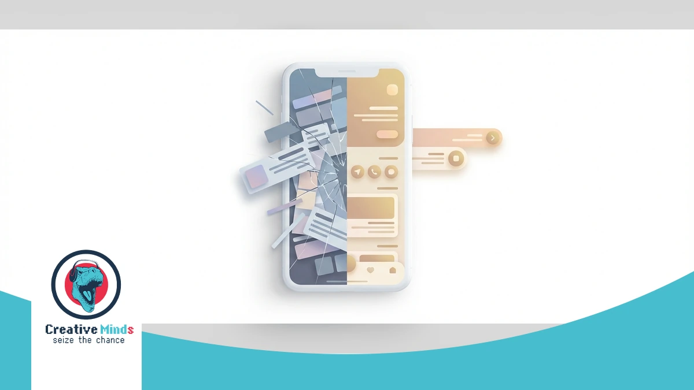
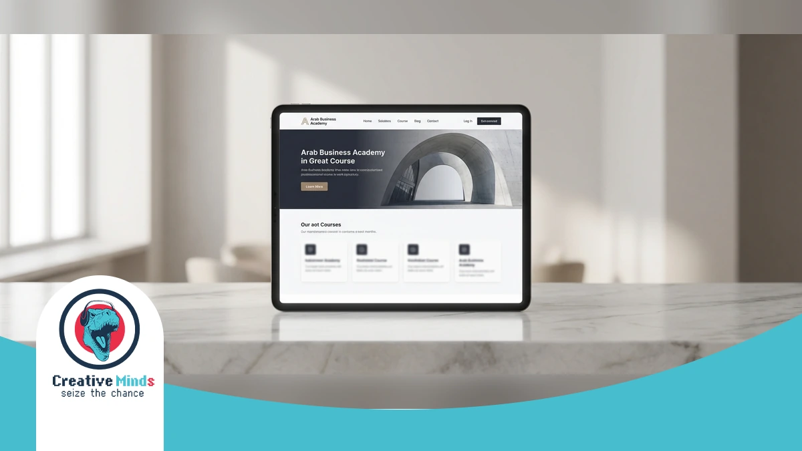
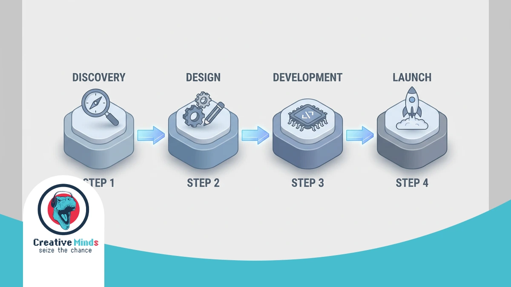
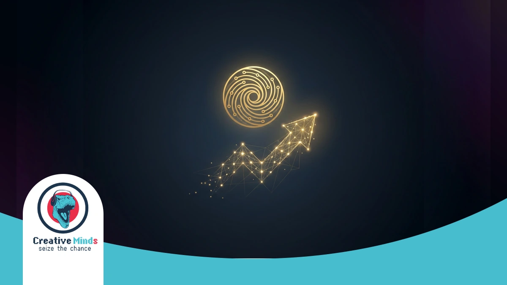

# Top Web Design Agency in Riyadh: Best Digital Solutions 2026

<!-- section_id: sec_01 -->

In Riyadh’s fast-paced economy, your digital presence is no longer just a virtual business card. As Saudi Arabia shifts toward Vision 2030 standards, a professional **Web Design Agency** must bridge the gap between basic aesthetics and high-performance engines.

CEMS IT transforms your ideas into visual mockups, ensuring information is structured to capture market share. We utilize a modern stack including React and WordPress to build [high-quality, smart, and affordable web designs](https://cems-it.com/) that outperform your local competitors.

Don't let outdated technology stall your growth. Our "creative minds" replace old systems with innovative, responsive solutions tailored to your budget. Secure your market position today by visiting the CEMS IT Official Website to launch your project.

## The Risk of Generic Layouts in the Riyadh Digital Marketplace
<!-- section_id: sec_02 -->

**Contact our team today and get your project moving within days.**

In Riyadh’s competitive digital landscape, a generic website template is a silent profit killer. Most standard themes ignore the intricate requirements of Arabic **UI/UX design**, leading to broken layouts and alienated local users.

Poorly executed RTL (Right-to-Left) mirroring often results in misaligned navigation and unreadable typography. You risk losing high-value Saudi customers when your site feels like a translated afterthought rather than a local authority.

*   **RTL Optimization:** Native Arabic alignment for seamless navigation.
*   **Mobile-first performance testing:** Ensuring 100% usability on STC/Mobily networks.
*   **CRM integrations:** Connecting your site directly to your sales pipeline.
*   **Speed Benchmarks:** Achieving sub-2-second loads to meet [Google’s Core Web Vitals](https://developers.google.com/search/docs/appearance/core-web-vitals) standards.

Slow loading speeds on local mobile networks can increase bounce rates by over 50%. CEMS IT builds custom React and Node.js solutions to ensure your **Web Design Riyadh** project maintains elite performance.

Don't let a "cheap" template undermine your brand's credibility. Investing in [premium Design Services](https://cems-it.com/design-services) ensures your business scales with **Performance-driven marketing** and robust, conversion-optimized architecture.
## How Our Web Design Agency Engineers High-Conversion Systems
<!-- section_id: sec_03 -->

**Get a free consultation with our specialists — zero commitment required.**

When you partner with a **Web Design Agency** in Riyadh, your technical infrastructure determines your market speed. CEMS IT engineers high-performance systems using React and HTML5 to ensure your interface remains fluid and fast.

Our **Discovery & planning** phase translates your specific goals into visual mockups before any code is written. We integrate localized Saudi payment solutions like Mada and STC Pay to streamline your transactional success. | Technology | Business Benefit for Riyadh Enterprises |
| :--- | :--- |
| React JS | Lightning-fast, interactive user interfaces that reduce bounce rates. |
| WordPress | Flexible content management tailored for scalable business growth. |
| Mada/STC Pay | Localized payment integration to build trust with Saudi consumers. |
| Responsive Design | Seamless functionality across all mobile and desktop devices. |

**Don't let your competitors launch first — start your digital project now.**
We replace outdated systems with innovative IT solutions that prioritize [advanced web development](https://cems-it.com/web-design-company-in-egypt) to help you outperform local competitors.

Since mobile traffic dominates the Kingdom, our **Responsive Web Design** ensures your site loads perfectly on all networks. According to [W3C Standards](https://www.w3.org/standards/), clean code is essential for cross-browser compatibility and long-term digital accessibility.

Don't let technical debt stall your growth in the Saudi market. Secure your competitive advantage by requesting a technical audit from CEMS IT today to launch your high-conversion system before the next quarter.

### Arabic-First UI/UX Optimization Strategies

<!-- section_id: sec_03_sub1 -->

True RTL optimization is more than just flipping a layout; it requires a deep understanding of Saudi user behavior. At CEMS-IT, we ensure your **Web Design Agency** project prioritizes Arabic-first content by adjusting every visual element.

We use React and WordPress to build interfaces where typography and navigation flow naturally from right to left. You can explore our professional design services to see how we create intuitive, high-quality digital experiences for the Riyadh market.

Our "creative minds" replace outdated systems with modern HTML5 and JavaScript solutions that respect local cultural nuances. Secure your competitive advantage by launching your high-conversion system with our specialized technical team today.
## Why Choose CEMS IT for Your Web Design Riyadh Project
<!-- section_id: sec_04 -->

**See how our team can turn your vision into measurable digital results.**

At CEMS IT, we don’t just follow digital trends; we create them by replacing outdated Flash-based systems with high-performance React and HTML5 frameworks. Your Riyadh-based business deserves a **Web Design Agency** that understands the local B2B and B2C landscape, from retail to education.

Our "creative minds" philosophy ensures your vision transitions from conceptual mockups into a responsive reality. We build flexible interfaces that adapt to any screen, ensuring your site remains functional while hosted on [reliable Web Hosting](https://cems-it.com/hosting) for maximum uptime.

*   **Customized WordPress Builds:** Tailored site architectures that align with your specific Riyadh business goals and budget.
*   **Modern Tech Stack:** We utilize JavaScript and React to deliver fast, scalable front-end interfaces for sectors like publishing and retail.
*   **Methodical Design:** Every project begins with detailed visual mockups to define information categorization before a single line of code is written.
*   **Intuitive UI/UX:** Our team prioritizes user experience to ensure your digital platform is both smart and easy to navigate.

We work efficiently to deliver high-quality, affordable designs without compromising on excellence. Whether you are in the education or retail sector, CEMS IT builds the long-term relationships and innovative IT solutions your company needs to thrive.
## Proven Results: Justifying Our Status as a Leading Agency
<!-- section_id: sec_05 -->

**Our experts are standing by — reach out and get direct answers today.**

Our record of delivering high-performance platforms across Riyadh reflects a deep mastery of modern frameworks. By replacing outdated systems with HTML5 and React, we ensure your business maintains a competitive edge.

We justify our status through **Web Design Riyadh** projects that consistently pass rigorous mobile-first performance testing. You can witness our technical precision by browsing our [portfolio of successful Websites](https://cems-it.com/portfolio-type/websites) to see how we scale regional brands.

Our "creative minds" methodology transforms your specific goals into visual mockups before development begins. This process ensures your site meets global standards while remaining affordable, helping you outperform local competitors and secure your market share today.
## A Case Study in Excellence: Transforming Digital Identity
<!-- section_id: sec_06 -->

**Your path to digital success starts with one conversation — let's begin.**

Our work with the Arab Business Academy demonstrates how a professional **Web Design Agency** bridges the gap between educational vision and financial authority. In Riyadh’s growing professional development sector, your platform must command trust.

We initiated the project with rigorous Discovery & planning to align the academy’s B2B and B2C goals. By creating detailed visual mockups in Figma, we ensured the information architecture supported seamless navigation for banking professionals.

You can see the results of this strategic approach by exploring the [Arab Business Academy case study](https://cems-it.com/portfolio/arab-business-academy) to understand how we prioritize UX/UI ergonomics. Our team replaced outdated structures with a responsive, high-performance interface.
## Our 4-Stage Implementation Process for Riyadh Enterprises

<!-- section_id: sec_07 -->

At CEMS IT, we initiate your project by analyzing the Riyadh market to align your goals with local consumer behavior. We translate your vision into detailed visual mockups to define information categorization before development.

Our experts use a modern stack including HTML5 and React to build fast, interactive interfaces. We ensure your data remains in a secure online space by integrating robust hosting solutions from the start.

1. **Discovery & Local Analysis**: We evaluate your specific Riyadh business goals and budget to create a tailored roadmap.
2. **Visual Mockups & UI/UX**: Our "creative minds" design intuitive layouts that replace outdated systems with modern, responsive structures.
3. **Technical Development**: We utilize JavaScript and WordPress for customized builds, ensuring high-quality **Web Design Riyadh** standards for every device.
4. **Testing & Deployment**: Rigorous performance checks guarantee your E-commerce Web Development project is smart, affordable, and ready to scale.

We replace slow, legacy technologies with innovative IT solutions designed for the education and retail sectors. You can secure your competitive advantage today by launching a high-performance system that outperforms local competitors immediately.

### Post-Launch Maintenance and Local SEO Support

<!-- section_id: sec_07_sub1 -->

Maintaining your digital presence in Riyadh requires more than just a one-time setup. Our **Web Design Agency** provides continuous technical oversight to ensure your platform remains compatible with the latest mobile OS updates and browser standards.

We implement **Local SEO optimization** by auditing your site against Riyadh-specific search trends. This ensures your brand stays visible to Saudi consumers who rely on precise, location-based queries to find trusted retail or educational services.

Through **performance-driven marketing** and real-time monitoring, we protect your investment from technical decay. Our team handles everything from security patches to database optimization, keeping your user experience seamless as your business scales across the Kingdom.

## Frequently Asked Questions About Web Design in Riyadh

<!-- section_id: sec_08 -->

### Frequently Asked Questions About Web Design in Riyadh

### How does CEMS IT ensure a website works on all mobile devices in Saudi Arabia?
At **CEMS IT**, we prioritize responsive and flexible designs that adapt to any screen size. By replacing outdated Flash with HTML5 and JavaScript, your site remains functional across all local mobile networks.

### What is the difference between web design and web development for my project?
Web design focuses on the creative "look and feel," where our designers translate your ideas into visual mockups. Development involves the actual coding, using React or WordPress, to make those visual structures functional.

### Does your Web Design Riyadh service include Right-to-Left (RTL) Arabic optimization?
Yes. We structure information specifically for the Saudi market, ensuring typography and navigation flow naturally. Our UI/UX process categorizes content to provide an intuitive experience for both desktop and mobile Arabic users.

### How long does it take for a Web Design Agency to deliver a mockup?
The timeline varies, but our "creative minds" methodology starts with defining the structure and appearance immediately. We focus on smart, affordable workflows that finalize your site’s categorization before moving into the technical coding phase.

### Can CEMS IT integrate Saudi payment gateways like Mada or STC Pay?
We specialize in innovative IT solutions that align with local business goals. Our team integrates standard code and affiliate software to ensure your retail or publishing site handles transactions securely and efficiently.

## Conclusion

<!-- section_id: sec_09 -->

Choosing the right **Web Design Agency** in Riyadh means moving beyond simple templates to embrace a high-performance architecture that supports Saudi Arabia’s Vision 2030 digital standards. Our team at CEMS IT specializes in transforming your specific business goals into detailed visual mockups, ensuring every element of the user interface is mapped out before the development phase begins. This methodical implementation process guarantees that your final product is not only visually stunning but also technically superior and ready to capture significant market share.

We utilize a modern technology stack, including React.js and Node.js, to build scalable platforms like the B2C e-commerce solution we delivered for Baddel in Riyadh. By replacing outdated systems with these innovative IT solutions, you ensure your site remains responsive across all mobile and desktop devices. You can take the first step toward a dominant online presence by choosing to launch your high-performance digital system with our specialized technical team today to outperform your local competitors.

Our "creative minds" focus on delivering smart, affordable designs that integrate local payment gateways and intuitive RTL navigation for the Saudi market. Whether you operate in retail, education, or publishing, we provide the technical oversight needed to maintain your competitive edge. Don't let your brand fall behind with stagnant technology; instead, secure your professional web design audit now to ensure your business scales effectively within the Kingdom’s rapidly evolving digital landscape.