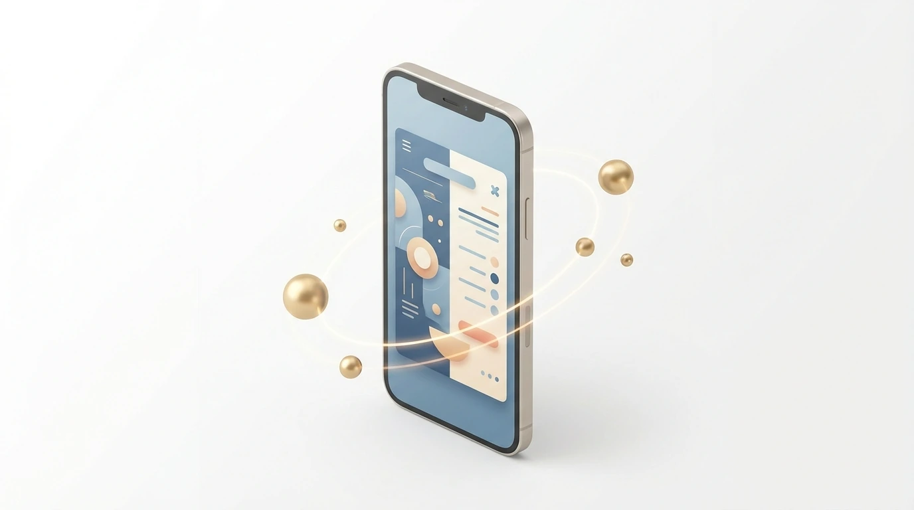
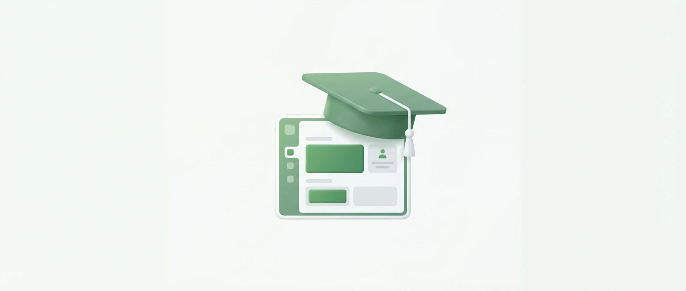
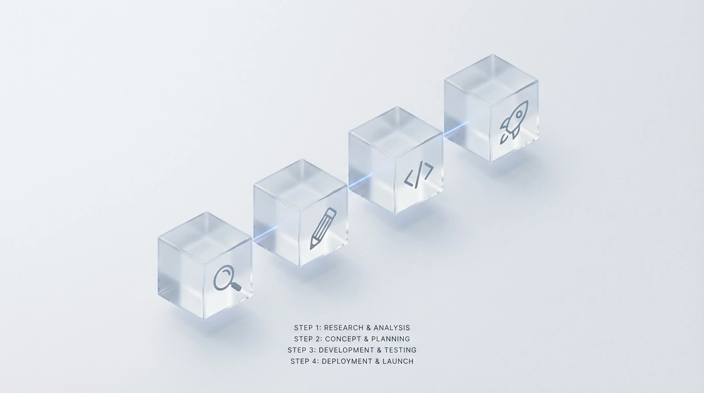

# Top Web Design Agency in Riyadh: Professional Services 2026

<!-- section_id: sec_01 -->

In Riyadh’s fast-moving market, your digital presence is often the first handshake with a potential client. As a leading **Web Design Agency**, CEMS IT helps you navigate Saudi Arabia’s rapid digital transformation by building high-performance platforms.

We specialize in **web development** using advanced frameworks like React.js and Node.js to ensure your site is fast and secure. You can [partner with CEMS IT for expert digital solutions](https://cems-it.com/) that align perfectly with Saudi Vision 2030 standards.

Our team delivers premium **UI and UX design** and **responsive design** that adapts to any screen. Don't let competitors outpace you; secure your professional website consultation now to launch your project before the next quarter begins.

## The High Stakes of Digital Presence in the Riyadh Market
<!-- section_id: sec_02 -->

**Contact our team today and get your project moving within days.**

Operating in the **Web Design Riyadh** market without a localized strategy creates a massive disconnect with your audience. Generic templates often fail to support Arabic-first layouts, leading to broken user interfaces and lost revenue.

Your business risks significant bounce rates if you ignore the specific technical needs of Saudi users. Slow loading times on local networks like STC or Mobily will drive your potential customers straight to your competitors.

*   **RTL Optimization:** Proper Right-to-Left alignment ensures your Arabic-speaking customers can navigate your site intuitively.
*   **Mobile Performance:** Strategic optimization for local 5G and fiber networks prevents high abandonment rates during peak hours.
*   **Local SEO:** Tailoring your content for Riyadh-specific search intent helps you capture high-intent traffic before others do.
*   **E-commerce websites:** Secure, localized payment gateways are essential for building trust and completing transactions in the Kingdom.

According to [Google's Web Vitals benchmarks](https://developers.google.com/search/docs/appearance/core-web-vitals), even a one-second delay in page load can reduce conversions by up to 20%. You cannot afford these technical oversights in a competitive landscape.

Failing to adapt to the Saudi digital ecosystem means your brand stays invisible. You need a partner who understands these high stakes and can deliver high-performance, **Arabic-first** platforms that actually convert.
## Why Choose CEMS IT for Your Web Design in Riyadh
<!-- section_id: sec_03 -->

**Get a free consultation with our specialists — zero commitment required.**

Choosing **CEMS IT** means your Riyadh business benefits from a smart, flexible, and affordable **Web Design Agency** model. We translate your vision into functional mockups, focusing on high-quality structure and accessible user experience (UX).

Our technical approach utilizes modern stacks like HTML5, JavaScript, and React to build responsive interfaces. We ensure your site adapts dynamically to all screen sizes, providing a seamless transition between mobile, tablet, and desktop environments. | Feature | CEMS IT Technical Standard | Business Benefit |
| :--- | :--- | :--- |
| Core Tech Stack | HTML5, React, and WordPress | High-speed, scalable performance |
| Local Integration | **Saudi payment gateways** (Mada, STC Pay) | Higher conversion in the KSA market |
| Language Support | Full **RTL optimization** | Native browsing for Arabic speakers |
| Design Philosophy | Originality over generic trends | Unique brand identity in Riyadh |

**Don't let your competitors launch first — start your digital project now.**
We specialize in [comprehensive web development](https://cems-it.com/web-design-company-in-egypt) that integrates essential local tools.

According to [W3C Standards](https://www.w3.org/standards/), valid code is the backbone of accessibility and long-term site health.

Don't let technical gaps stall your growth; secure your professional website consultation now to launch your project before the next quarter begins and outpace your competitors in the Saudi market.

### Arabic-First Cultural UX/UI Design

<!-- section_id: sec_03_sub1 -->

In Riyadh, your digital interface must respect local reading patterns. A professional **Web Design Agency** ensures your layout flows naturally from right to left, preventing the visual friction that often drives Saudi users away.

CEMS IT implements precise Arabic typography and RTL mirroring to keep your audience engaged. You can enhance your brand with our localized UI/UX expertise to ensure your retail or education platform feels native to KSA.

Your technical framework must handle complex Arabic scripts without breaking. Since the Riyadh market demands speed, we optimize every element for local networks. Claim your professional website consultation now to outpace your competitors this quarter.
## Proven ROI: Justifying Our Status as a Leading Agency
<!-- section_id: sec_04 -->

**See how our team can turn your vision into measurable digital results.**

Choosing CEMS IT as your **Web Design Agency** ensures your Riyadh business moves beyond generic templates. We prioritize original, high-quality ideas that reflect your brand’s unique identity instead of following passing digital trends.

Our methodology focuses on the B2B and B2C sectors, translating your vision into functional mockups. We use React and HTML5 to build responsive interfaces that maintain performance across all Saudi mobile and desktop networks.

1.  **Collaborative Strategy**: We listen and go the extra mile to bring your specific vision to life.
2.  **Customized Development**: Every project is tailored to fit your exact business goals and budget requirements.
3.  **Technical Excellence**: Our team leverages WordPress and modern front-end stacks for scalable, secure results.
4.  **Regulatory Compliance**: We ensure your platform meets local CITC regulations and Saudi data hosting standards.

We work smart and efficiently to deliver excellence for retail, education, and publishing clients. You can [secure local Web Hosting](https://cems-it.com/hosting) to ensure your new interface remains fast, compliant, and always accessible to your audience.

Our commitment to innovation means we build relationships, not just websites. Since we only take on a limited number of projects each quarter, contact us now to justify your digital investment with a high-performance platform.
## Success Spotlight: How We Revolutionized Digital Platforms
<!-- section_id: sec_05 -->

**Our experts are standing by — reach out and get direct answers today.**

Our work with the Arab Business Academy demonstrates how a specialized **Web Design Agency** can transform educational platforms in Riyadh. We focused on branding and positioning to establish authority within the Saudi banking sector.

By utilizing Figma for ergonomic UX/UI design, we ensured the platform met the high standards of Riyadh’s professional learners. You can see the full transformation in our [Arab Business Academy case study](https://cems-it.com/portfolio/arab-business-academy) to understand our high-impact methodology.

We integrated responsive course listings and registration hubs using a modern tech stack. This approach ensures your platform remains competitive and accessible across all devices in the rapidly growing Saudi digital education market.
## Our Strategic 4-Step Web Design Process
<!-- section_id: sec_06 -->

**Your path to digital success starts with one conversation — let's begin.**

Our approach begins with a deep discovery phase where we align your digital vision with the specific nuances of the Riyadh market. We analyze your local competitors and target audience behavior to ensure your platform stands out.

1. **Discovery & Strategy**: Aligning your business goals with Riyadh’s market trends.
2. **UI/UX Design**: Creating high-fidelity mockups that prioritize user flow and local aesthetics.
3. **Development**: Coding a fast, responsive site using modern frameworks.
4. **Testing & Launch**: Rigorous quality checks across all devices before going live.

We then transition into the design phase, where your ideas become functional mockups. You can review our **[portfolio of responsive Websites](https://cems-it.com/portfolio-type/websites)** to see how we balance high-end aesthetics with technical performance.

Finally, our developers build a dynamic interface optimized for local 5G networks. This ensures your site remains fast and accessible, helping you secure a competitive advantage in the growing **Web Design Riyadh** landscape.

### Discovery and Responsive Prototyping

<!-- section_id: sec_06_sub1 -->

Your vision for a digital presence in Riyadh starts with a collaborative discovery phase. At CEMS IT, our designers translate your specific goals into functional mockups that prioritize structure and **Web Design Agency** standards.

Since mobile penetration in Riyadh is among the highest globally, we utilize a mobile-first approach. We ensure your user experience (UX) remains accessible by testing responsive prototypes across diverse screen sizes before any coding begins.

Our team focuses on original ideas rather than fleeting trends to build long-term brand authority. By leveraging modern technologies like React and HTML5, we create dynamic interfaces that adapt seamlessly to smartphones, tablets, and desktops.
## Common Questions About Professional Web Design in Riyadh

<!-- section_id: sec_07 -->

### How much does a professional website cost in Riyadh?
At **Web Design Agency** CEMS IT, we provide smart, flexible, and affordable pricing tailored to your specific goals. Since we focus on original ideas rather than generic trends, costs vary based on your required structure and complexity.

### Do you provide localized hosting and payment gateways?
Yes, our methodology ensures your site is ready for the Saudi market. We integrate essential local tools and offer reliable solutions to keep your platform fast, compliant, and accessible to your target audience across the Kingdom.

### Is my website optimized for mobile users in Saudi Arabia?
Absolutely. CEMS IT specializes in responsive and dynamic designs that adjust content for all screen sizes. Your site will function seamlessly on mobile phones, tablets, and desktops to meet the high demand for mobile access in Riyadh.

### Which technologies do you use for web development?
We utilize modern technologies like HTML5, JavaScript, and React for front-end interfaces to ensure high-quality performance. For customized site development, we leverage WordPress, allowing for a manageable and scalable online presence for your business.

### How does the design process work at CEMS IT?
Our collaborative process involves translating your vision into functional mockups. Designers focus on appearance, structure, and user experience (UX) to ensure easy accessibility, while our engineers then translate those creative elements into clean, effective code.

## Ready to Lead the Riyadh Digital Landscape?

<!-- section_id: sec_08 -->

Your digital transformation in Riyadh requires more than just a template; it demands a strategic partner. As a dedicated **Web Design Agency**, CEMS IT translates your unique business goals into high-performance, responsive interfaces.

Our implementation process is built on original ideas, utilizing a powerful tech stack including React and WordPress. We focus on creating a seamless user experience (UX) that ensures your brand stands out in the competitive Saudi market.

By choosing our specialized services, you gain a platform optimized for local 5G networks and mobile accessibility. You can [establish your online presence with professional web hosting](https://cems-it.com/meaning-of-web-hosting-2022-have-your-own-online-space) to ensure your new site remains fast and reliable.

As Riyadh moves toward Vision 2030, the demand for sophisticated digital platforms is peaking. Secure your consultation today to launch your project before the next quarter and gain a decisive advantage over your local competitors.