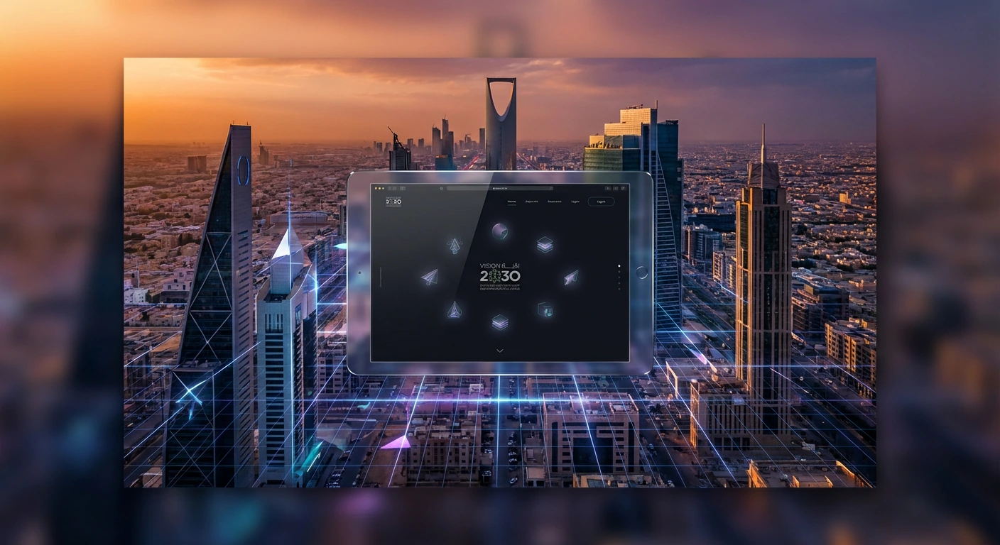
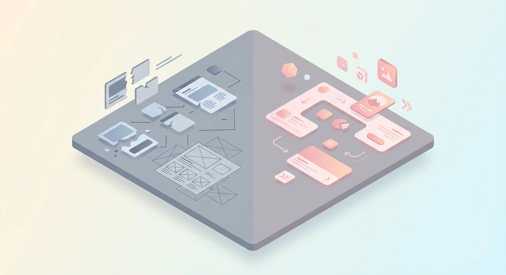
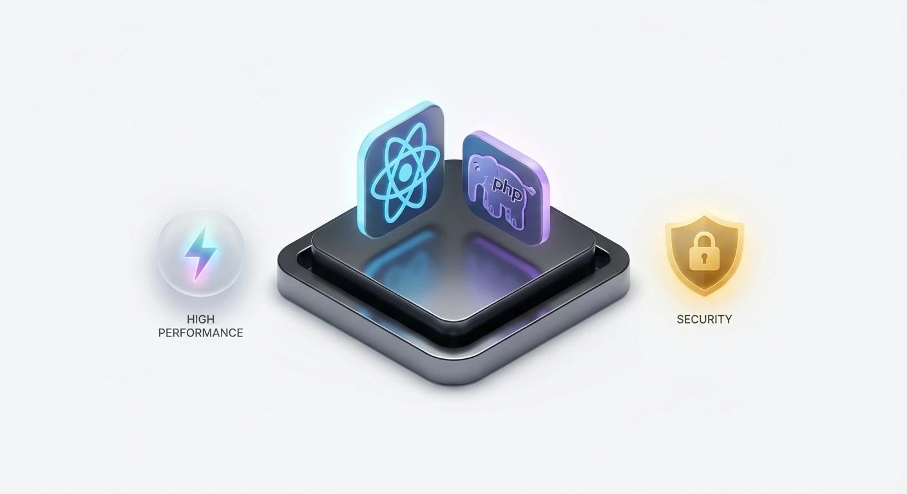
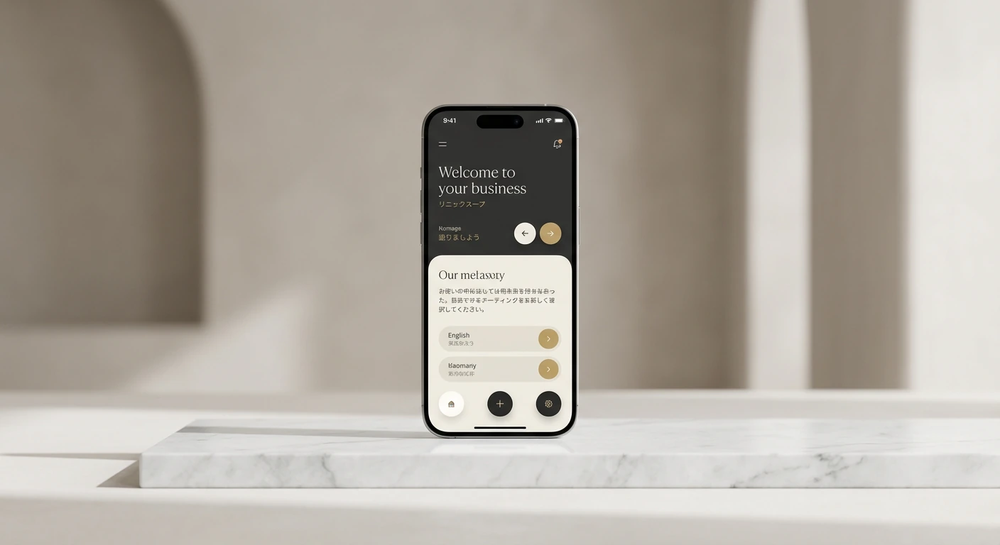
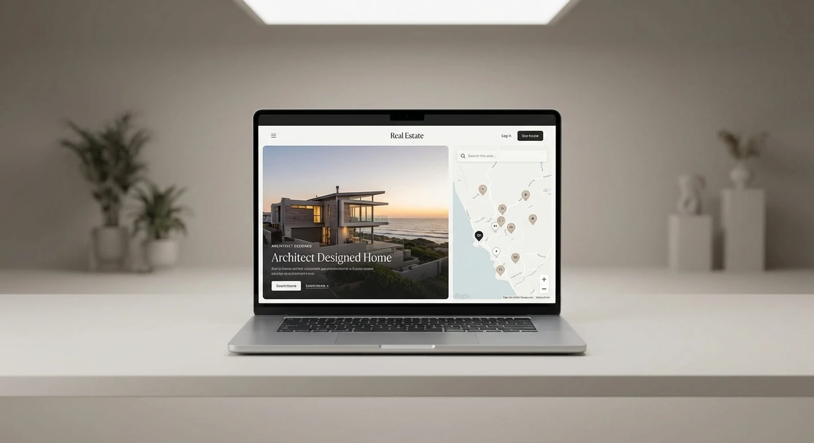
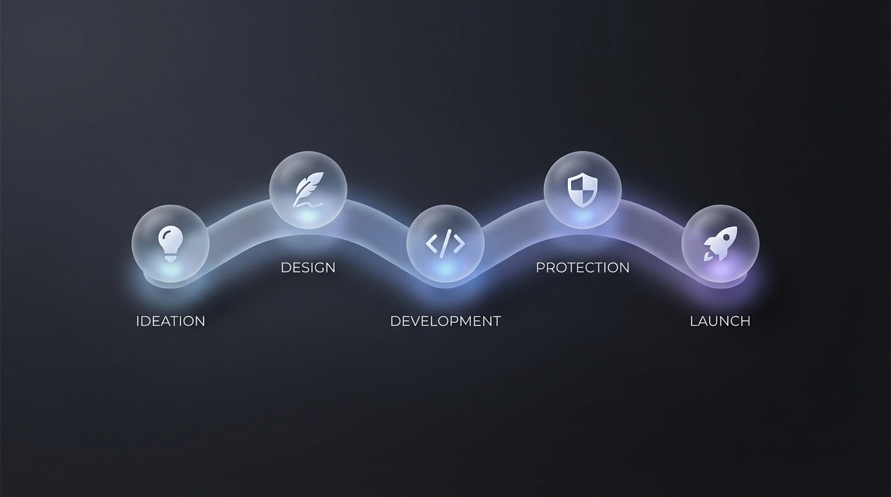
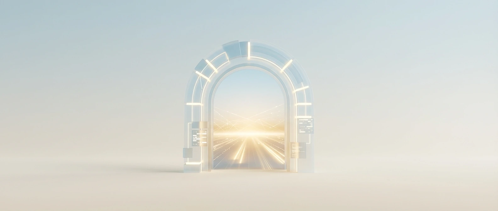

# Best Web Design Agency in Riyadh: Top Rated Services 2026

<!-- section_id: sec_01 -->

Riyadh’s digital landscape is shifting rapidly under **Saudi Vision 2030 Digital** standards. Your business needs more than a basic site; it requires a high-performance platform that handles localized market demands and complex consumer behaviors.

As a premier **Web Design Agency**, CEMS IT builds smart, responsive interfaces using React for front-end fluidity and secure PHP back-ends. You can [partner with CEMS IT for expert web development](https://cems-it.com/) to ensure your brand dominates the local search results today.

We specialize in **UI/UX Localization** and **RTL Web Development**, ensuring your Arabic-speaking audience enjoys a seamless experience. Our team translates your vision into functional mockups before coding, guaranteeing a professional first impression that converts visitors.

Don’t let competitors capture your market share while you settle for outdated templates. Secure your digital future in KSA by visiting the CEMS IT Official Website now to request a specialized technical audit for your project.

## Why Generic Templates Fail the Riyadh Market
<!-- section_id: sec_02 -->

**Contact our team today and get your project moving within days.**

Using generic website templates in the Riyadh market creates significant business risks. You often face broken layouts because standard themes rarely prioritize **Web Design Riyadh** standards for Right-to-Left (RTL) Arabic scripts. This misalignment ruins your user experience and drives local customers straight to your competitors.

Poorly optimized templates also suffer from massive latency issues within the Kingdom. Your visitors will abandon your site if it loads slowly, which is why you should invest in **Bilingual Website Design** that utilizes local servers. You can secure your digital infrastructure and improve conversions by choosing [professional Design Services](https://cems-it.com/design-services) tailored specifically for the Saudi B2B and retail sectors.

*   **RTL Layout Shifts:** Icons and text often align incorrectly, making your brand look unprofessional to Arabic speakers.
*   **Slow Local Performance:** Heavy, unoptimized code in generic templates fails to meet [Google's Core Web Vitals](https://developers.google.com/search/docs/appearance/core-web-vitals) benchmarks in KSA.
*   **Security Vulnerabilities:** Many free templates lack robust **PHP Backend Security**, leaving your sensitive customer data exposed to breaches.
*   **Poor Mobile UX:** Standard designs often fail at **Responsive Web Design KSA** requirements, frustrating the high volume of mobile shoppers in Riyadh.

Relying on "one-size-fits-all" solutions puts your market share at risk during this critical economic expansion. You need a platform built for the specific nuances of the Saudi consumer to avoid costly re-development later. Stop settling for basic layouts and ensure your business dominates the local search results by upgrading to a high-performance, localized digital presence today.
## Our Technical Framework for High-Performance Websites
<!-- section_id: sec_03 -->

**Get a free consultation with our specialists — zero commitment required.**

Our **Web Design Agency** prioritizes a "Mockup-First" philosophy to eliminate guesswork. You see your exact digital architecture before a single line of code is written, ensuring the final product matches your Riyadh business goals.

We build your site using a **React Frontend Riyadh** stack for lightning-fast transitions. This modern framework ensures your platform remains stable while handling the high traffic volumes typical of the Saudi market's rapid expansion. | Technical Component | Feature Benefit | Local Impact |
| :--- | :--- | :--- |
| React JS | Component-based UI | Instant loading for mobile users |
| PHP Backend | Secure data handling | Robust protection for KSA enterprises |
| Bilingual Logic | Native RTL support | Seamless Arabic/English switching |
| Mobile-First | Responsive grid | Targets 98% smartphone penetration |

**Don't let your competitors launch first — start your digital project now.**
Your enterprise deserves a platform that scales without technical debt.

You can [access advanced web development](https://cems-it.com/web-design-company-in-egypt) through our specialized engineering team to ensure your infrastructure outperforms competitors. According to [W3Techs data](https://w3techs.com/technologies/details/pl-php), PHP powers over 75% of the web, providing the reliable backbone your secure Riyadh operations require.

Don't let an outdated system stall your growth during this economic boom. Reach out to **CEMS IT** today to secure your technical audit and launch a high-performance site that dominates the local market.

### Bilingual UI/UX and RTL Optimization

<!-- section_id: sec_03_sub1 -->

When you target the Riyadh market, standard Western layouts often fail. Arabic is a right-to-left (RTL) language, requiring more than just text justification; it demands a complete structural mirror of your **Web Design Agency** strategy.

CEMS IT ensures your interface feels natural to local users by implementing precise RTL optimization. We use React to build fluid, high-performance frontends that handle bidirectional text without layout shifts. You can explore our specialized design services to see how we maintain professional typography and functional alignment for Saudi audiences.

Our team creates detailed visual mockups before coding to ensure your brand's cultural nuances are preserved. By utilizing secure PHP backends, CEMS IT provides a stable foundation for your **Web Design Riyadh** project. You should partner with our expert engineering team today to secure a high-converting, bilingual platform before your competitors claim the digital space.
## Proven Success: How CEMS IT Drives ROI in the Region
<!-- section_id: sec_04 -->

**See how our team can turn your vision into measurable digital results.**

Beyond standard aesthetics, your Riyadh business requires a **Web Design Agency** that guarantees technical reliability. CEMS IT delivers this by translating your unique vision into high-fidelity visual mockups before any code is written.

Our methodology ensures your information structure is flawless, utilizing a robust stack of HTML5, JavaScript, and React for frontend fluidity. We prioritize secure PHP backends to protect your data while maintaining alignment with regional digital standards.

*   **Mockup-First Design:** You approve the look and feel before development begins to ensure professional first impressions.
*   **Technical Excellence:** We build using React and PHP for scalable, high-performance platforms that handle heavy Saudi market traffic.
*   **Strategic Usability:** Our UX specialists and developers collaborate to ensure your site is responsive and adaptive across all screen sizes.
*   **Tailored Solutions:** From education to retail, we customize every WordPress or custom-coded build to fit your specific budget and goals.

By focusing on innovation rather than just trends, CEMS IT builds relationships that grow with your brand. You can explore our [portfolio of successful Websites](https://cems-it.com/portfolio-type/websites) to see how we’ve helped regional leaders dominate their digital space.
## Case Study: Scaling Digital Solutions for the Real Estate Sector
<!-- section_id: sec_05 -->

**Our experts are standing by — reach out and get direct answers today.**

When you look at the Riyadh real estate market, the competition for digital visibility is immense. You need a platform that does more than list properties; it must establish immediate trust through professional UX/UI.

By analyzing the **Aqar Ya Masr case study**, you can see how CEMS-IT transformed a complex property portal into a high-converting web application. We utilized a robust technical stack including a secure PHP backend and a React-driven frontend to ensure seamless performance for both B2B and B2C users.

Our team prioritized a "mockup-first" strategy, allowing the client to approve every structural detail before development. If you want to achieve similar market authority in KSA, you should [examine the Aqar Ya Masr case study](https://cems-it.com/portfolio/aqar-ya-masr-web-app) to understand our scalable architecture.

This project highlights why choosing the right **Web Design Agency** is critical for handling localized SEO and mobile optimization. We integrated custom CMS tools and advanced analytics to track user behavior, ensuring the platform remains a leader in its sector.
## Why Choose CEMS IT for Your Riyadh Web Project
<!-- section_id: sec_06 -->

**Your path to digital success starts with one conversation — let's begin.**

Choosing CEMS IT means you gain a partner that prioritizes your business growth through technical precision. We provide high-fidelity mockups before development begins, ensuring your **Web Design Agency** strategy aligns perfectly with your specific visual and functional goals in Riyadh.

Our engineering team builds your site using a React-driven frontend and a secure PHP backend to handle high traffic volumes. You can protect your digital assets by opting for [secure Web Hosting solutions](https://cems-it.com/hosting) that ensure 2026-ready performance and data integrity.

By focusing on custom-coded infrastructure rather than restrictive templates, we eliminate technical debt for your enterprise. You should contact our Riyadh specialists today to start your project and secure your competitive advantage in the rapidly expanding Saudi market.
## Our 5-Step Roadmap to Your New Digital Identity

<!-- section_id: sec_07 -->

Building a high-performance site in Riyadh requires a structured approach that aligns with your specific business goals. As your chosen **Web Design Agency**, we start by translating your vision into high-fidelity mockups.

Once you approve the visual direction, our engineers move into the development phase. We use a React-driven frontend and a secure PHP backend to ensure your platform handles high traffic volumes while maintaining CITC compliance.

1.  Discovery & Strategy: We define your project goals and local market requirements.
2.  UI/UX Prototyping: You review detailed mockups before any coding begins.
3.  Agile Development: Our team builds your responsive, RTL-optimized interface.
4.  Quality Assurance: Rigorous testing ensures speed and security across all devices.
5.  Deployment & Support: We launch your site and provide maintenance within the KSA time zone.

Our process concludes with a seamless transition to your live environment, backed by ongoing technical support. We prioritize your long-term growth by eliminating technical debt and ensuring your digital infrastructure remains scalable as the Saudi market expands.

### From Creative Mockups to Secure Deployment

<!-- section_id: sec_07_sub1 -->

You deserve to see exactly how your digital platform will function before the first line of code is written. Our **Web Design Agency** starts by crafting high-fidelity mockups that reflect your Riyadh brand’s unique identity.

This visual phase allows you to refine user flows and layouts, ensuring every button and menu aligns with your business goals. By finalizing these details early, you avoid expensive mid-project changes and ensure a faster launch.

Once you approve the visuals, we transition into a high-performance development phase. We utilize a React-driven frontend for speed and a secure PHP backend to handle the specific data privacy and local hosting requirements of the Riyadh market.

## Frequently Asked Questions About Web Design in Riyadh

<!-- section_id: sec_08 -->

### How long does a Web Design Riyadh project typically take?
The timeline for a **Web Design Agency** project depends on complexity, but CEMS IT usually delivers professional mockups within the first two weeks. Full development follows after your approval.

You will see the complete information structure and visual feel before we begin coding. This "mockup-first" strategy ensures your Riyadh business avoids delays and launches a functional, high-quality platform on schedule.

### Does your Web Design Agency provide RTL support for Arabic?
Yes, we specialize in bilingual websites where the interface mirrors perfectly for Arabic speakers. CEMS IT uses React to ensure fluid transitions and stable layouts for right-to-left scripts.

Your visitors in Riyadh will experience a natural, professional UI that handles bidirectional text without errors. We focus on responsive designs that adapt your content seamlessly across all mobile and desktop screen sizes.

### Can CEMS IT handle secure backend development for KSA businesses?
We utilize secure PHP for back-end development to ensure your data remains protected. This is critical for Riyadh enterprises in retail or education that handle sensitive customer information daily.

Our engineers translate visual designs into robust code, prioritizing both speed and security. You receive a custom-coded infrastructure that eliminates the vulnerabilities often found in generic, unoptimized website templates.

### What technologies does your Web Design Agency use for performance?
CEMS IT builds modern interfaces using HTML5, JavaScript, and React for front-end fluidity. We combine these with PHP back-ends to create websites that are both fast and highly scalable.

Your site will meet modern performance benchmarks, ensuring quick load times for your local audience. By avoiding heavy, outdated plugins, we help you maintain a competitive edge in the rapidly expanding Saudi digital market.

## Launch Your Premier Digital Presence with CEMS IT Today

<!-- section_id: sec_09 -->

Your vision for a high-performance digital platform in Riyadh deserves a technical partner that prioritizes precision and scalability. At CEMS IT, our **Web Design Agency** methodology begins by translating your specific business goals into high-fidelity visual mockups.

This visual-first approach ensures you approve the information structure and user flow before a single line of code is written. By choosing our specialized team for your next Web Design Riyadh project, you eliminate technical debt and ensure your brand stands out with a professional, functional first impression.

Don’t let your competitors capture the expanding Saudi market while you settle for outdated templates. Secure your digital future today by requesting a specialized technical audit for your enterprise to ensure your infrastructure is ready for the 2026 digital economy.