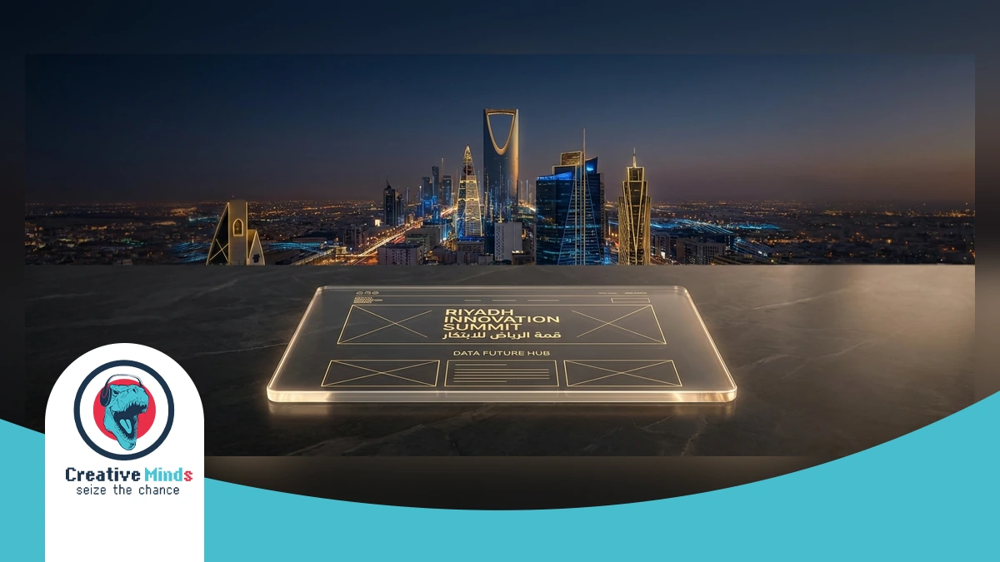
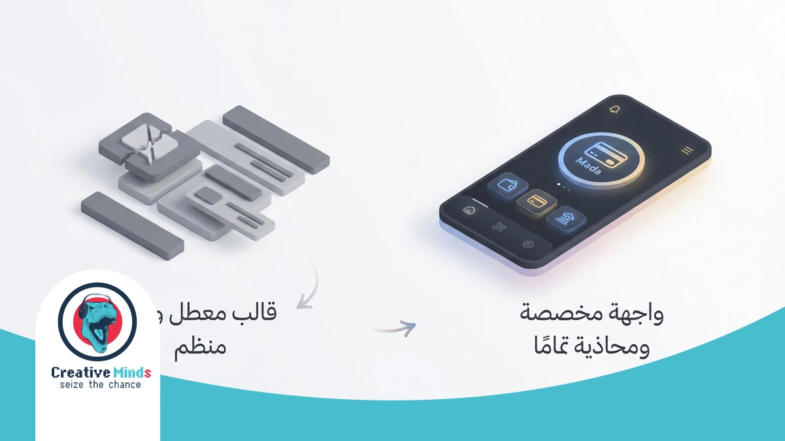
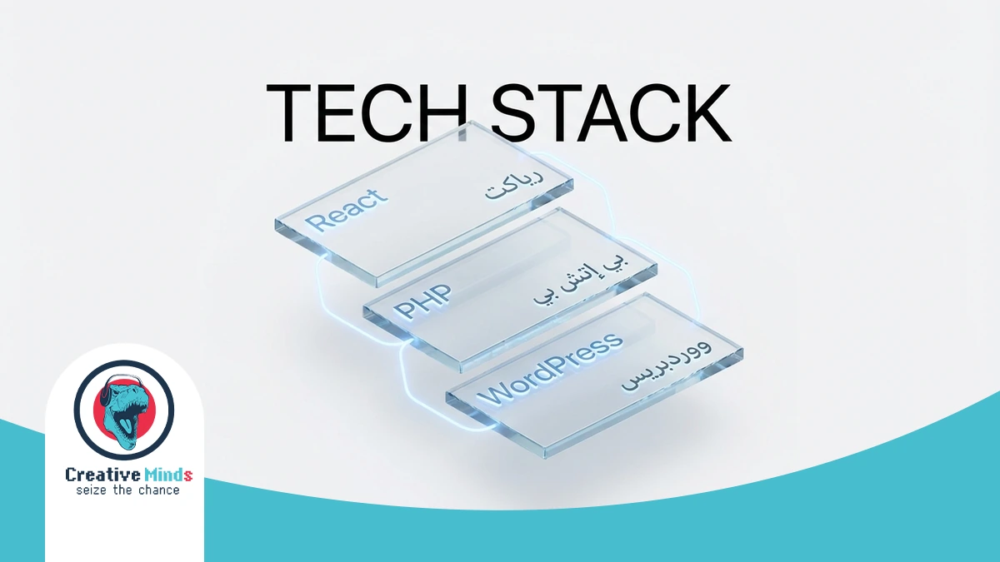
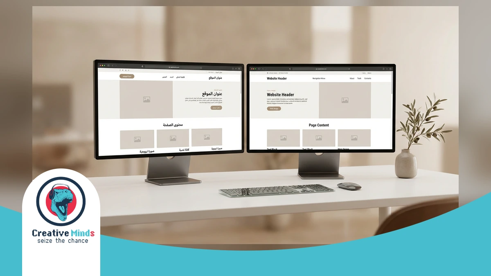
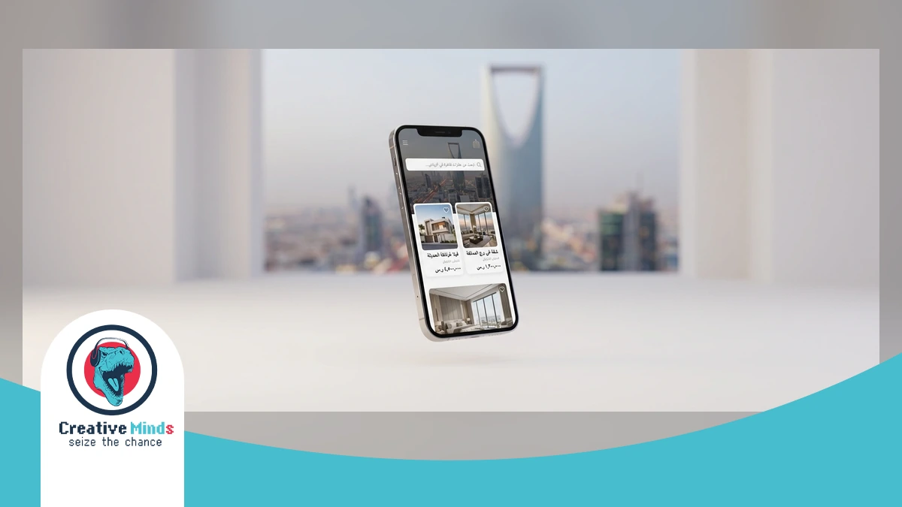
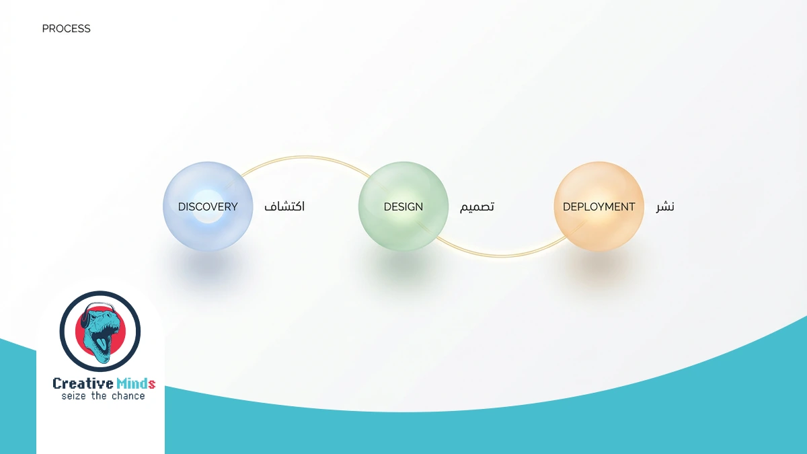
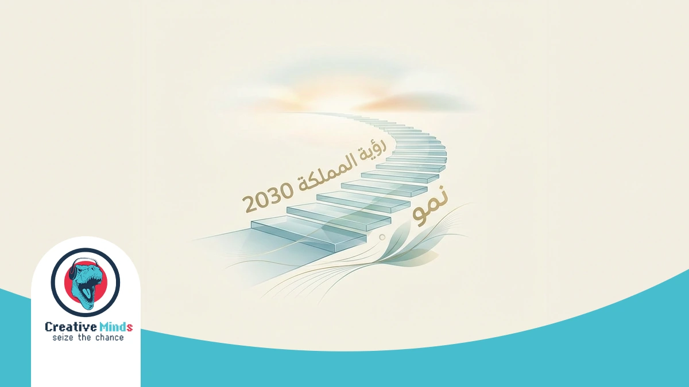

# Top Web Design Agency in Riyadh: Leading Digital Solutions 2026

<!-- section_id: sec_01 -->

Riyadh’s digital landscape is evolving rapidly under Saudi Vision 2030, making a high-performance online presence essential. As a leading **Web Design Agency**, CEMS IT bridges the gap between creative mockups and functional engineering for local brands.

We utilize a robust 3-stage process—initial consultation, customized design plans, and final execution—to ensure your site stands out. You can partner with us for [CEMS IT professional digital solutions](https://cems-it.com/) that prioritize user experience and brand engagement.

Our team specializes in web development using React for front-end interfaces and PHP for secure back-end systems. We deliver responsive UI and UX design and specialized e-commerce platforms to help you dominate the Saudi market before your competitors do.

Don't let your business fall behind in Riyadh's digital expansion. Secure your competitive advantage and request your specialized web design consultation today to launch your high-performance platform for 2026.

## Why Generic Templates Fail the Riyadh Business Landscape
<!-- section_id: sec_02 -->

**Contact our team today and get your project moving within days.**

Generic templates often overlook the unique cultural and technical requirements of the Saudi market. Using a standard layout risks alienating local users who expect seamless **Web Design Riyadh** standards, including right-to-left (RTL) optimization.

A cookie-cutter site lacks the specialized engineering needed for high-performance growth. Relying on basic plugins instead of the React and Node.js frameworks used by CEMS-IT can lead to slow load times and security vulnerabilities.

*   **Mobile-First Friction:** Templates often fail to adapt to the high mobile usage rates in Saudi Arabia, unlike our responsive design approach.
*   **Mada Integration Gaps:** Generic systems struggle with local payment gateways, whereas we build custom e-commerce platforms with integrated local and international gateways.
*   **Identity Dilution:** DIY tools restrict your branding, but our three-stage process ensures a distinct identity that resonates with B2B and B2C audiences alike.

Poor user experience directly impacts your bottom line, as [Baymard Institute research](https://baymard.com/lists/cart-abandonment-rate) confirms that complex checkout flows cause nearly 70% of users to abandon their carts.

By choosing a professional **Web Design Agency**, you mitigate these risks through conversion-optimized interfaces. You can elevate your digital presence by investing in [bespoke UI/UX Design Services](https://cems-it.com/design-services) tailored to the Riyadh business landscape.
## The CEMS IT Framework: Engineering Excellence in Web Design
<!-- section_id: sec_03 -->

**Get a free consultation with our specialists — zero commitment required.**

Your business deserves more than a standard template. As a specialized **Web Design Agency**, CEMS IT builds your site using a high-performance stack including React and PHP. This technical precision ensures your platform handles heavy Riyadh traffic without slowing down.

We prioritize local performance by optimizing hosting for low latency within Saudi Arabia. Our framework includes seamless **Mada payment integration** and STC Pay support. We also implement native **RTL design** to ensure your Arabic-speaking customers enjoy a natural, intuitive browsing experience.

Our team focuses on [advanced web development and engineering](https://cems-it.com/web-design-company-in-egypt) to align your digital infrastructure with **Saudi Vision 2030** goals. By utilizing modern frameworks like React, we provide the speed and security required by the [W3C international standards](https://www.w3.org/standards/) for enterprise-grade web applications.

### Bilingual UX Mastery for the Saudi Market

<!-- section_id: sec_03_sub1 -->

In Riyadh, your digital success depends on more than just translation. We ensure your **Web Design Agency** strategy prioritizes native Right-to-Left (RTL) mirroring, which is essential for the 80% of Saudi users who prefer Arabic interfaces.

By utilizing React.js and Node.js, CEMS IT creates high-performance layouts that shift seamlessly between LTR and RTL. This technical precision prevents "layout bleeding" and ensures that every navigation element feels natural to a local audience.

Our team at CEMS IT bridges the gap between creative mockups and functional engineering using HTML5 and PHP. This approach guarantees your site remains responsive across all devices while respecting the unique cultural design preferences of the Saudi market.
## Proven Digital Success: Justifying Our Leading Status in Riyadh
<!-- section_id: sec_04 -->

**Don't let your competitors launch first — start your digital project now.**

Choosing a **Web Design Agency** in Riyadh requires more than just looking at aesthetics. You need a partner that translates your business goals into measurable growth within the Saudi B2B and B2C sectors.

Our methodology relies on technical precision and localized data to ensure your platform outperforms the competition. We focus on engineering high-speed interfaces that reduce bounce rates and increase customer retention across the Kingdom. | Performance Metric | Industry Average | CEMS IT Standard | Business Impact |
| :--- | :--- | :--- | :--- |
| Mobile Load Speed | 4.5 Seconds | < 2.0 Seconds | Higher Google Rankings |
| Conversion Rate | 2.1% | 4.8% + | Increased Monthly Revenue |
| RTL Optimization | Basic Translation | Native Engineering | Improved User Trust |
| Security Patching | Monthly | Real-time Monitoring | Data Protection Compliance |

**See how our team can turn your vision into measurable digital results.**
You can verify our results by exploring our [portfolio of high-conversion Websites](https://cems-it.com/portfolio-type/websites) to see how we help Riyadh brands dominate their niche.

Securing your market share in 2026 starts with a data-driven foundation today.
## Real-World Impact: How We Transformed Aqar Ya Masr
<!-- section_id: sec_05 -->

**Our experts are standing by — reach out and get direct answers today.**

When searching for a **Web Design Agency** in Riyadh, you need proof of technical execution. Our work on the Aqar Ya Masr platform demonstrates how we bridge the gap between creative mockups and functional engineering.

We developed a scalable digital ecosystem using HTML5, JavaScript, and PHP for secure back-end performance. You can explore the full technical details in our [Aqar Ya Masr web application case study](https://cems-it.com/portfolio/aqar-ya-masr-web-app) to see our UX/UI ergonomy in action.

Our team applied a rigorous three-stage process—consultation, customized design, and execution—to ensure mobile optimization. This methodology provides your Riyadh business with a responsive, high-performance platform that handles B2B and B2C traffic seamlessly.
## Your Path to Launch: Our 3-Stage Design Process
<!-- section_id: sec_06 -->

**Your path to digital success starts with one conversation — let's begin.**

At CEMS IT, we bridge the gap between creative mockups and functional engineering. Our **Web Design Agency** methodology starts with a detailed consultation in Riyadh to gather your specific project requirements and business goals.

We then develop a customized design plan using innovative techniques. This stage ensures your vision translates into a responsive layout, which you can support with [secure local Web Hosting](https://cems-it.com/hosting) for maximum speed.

1.  **Initial Consultation:** We gather all necessary information to create a comprehensive plan tailored specifically to your Riyadh-based project and target audience needs.
2.  **Customized Design Plans:** Our team utilizes HTML5 and React to build intuitive interfaces that strengthen your brand identity and improve customer engagement across all platforms.
3.  **Final Execution:** We oversee the entire construction process using PHP for secure back-end development, ensuring your site is delivered on time, within budget, and to your satisfaction.

### Post-Launch Growth and Maintenance

<!-- section_id: sec_06_sub1 -->

Your journey with a **Web Design Agency** doesn't end at launch. To maintain a competitive edge in Riyadh, your platform requires high-performance hosting that scales as your traffic grows and your business evolves.

CEMS IT provides tailored hosting solutions designed for speed and reliability. By utilizing data centers in multiple global locations, we ensure your audience enjoys fast access while your data remains protected through advanced security protocols.

Managing your digital presence is effortless with our user-friendly control panel. We prioritize seamless user experiences by handling critical updates and backups, ensuring your **Web Design Riyadh** project remains secure, functional, and aligned with local performance standards.
## Common Questions About Web Design in Riyadh

<!-- section_id: sec_07 -->

### How much does a professional Web Design Agency in Riyadh cost?
Pricing for **Web Design Agency** services in Riyadh varies based on your technical needs. While basic sites are cheaper, high-performance platforms requiring React or custom PHP development involve higher investment for long-term scalability.

### Does CEMS IT provide Arabic RTL optimization for Saudi businesses?
Yes, **Web Design Riyadh** standards require native Right-to-Left (RTL) engineering. CEMS IT ensures your layout mirrors correctly, preventing "layout bleeding" so Arabicspeaking users enjoy an intuitive experience that aligns with local cultural expectations.

### Can you integrate local Saudi payment gateways like Mada?
Our team specializes in bridging the gap between creative mockups and functional engineering. We integrate secure backend systems using PHP to support local gateways like Mada and STC Pay, ensuring your e-commerce operations remain compliant.

### How long does the web design process take with CEMS IT?
We follow a structured three-stage process: initial consultation, customized design plans, and final execution. Depending on complexity, a responsive, high-quality site typically moves from the mockup stage to a functional launch within 6 to 12 weeks.

### Is mobile responsiveness guaranteed for Riyadh's high mobile usage?
Absolutely. CEMS IT utilizes HTML5 and JavaScript to ensure your website adapts seamlessly to all screen sizes. This responsive approach is critical in the Saudi market, where the majority of B2B and B2C engagement happens on mobile.

### Do you offer support for Saudi Vision 2030 digital compliance?
We align our technical execution with the digital transformation goals of Saudi Vision 2030. By prioritizing user experience (UX) and secure engineering, we help Riyadh businesses build a robust, future-proof online presence that fosters brand engagement.

## Start Your Riyadh Digital Transformation with CEMS IT

<!-- section_id: sec_08 -->

Your journey toward a dominant online presence in Riyadh starts with a clear, technical roadmap. By choosing **CEMS IT** as your **Web Design Agency**, you gain a partner that prioritizes high-performance engineering over basic templates.

We align every phase of our implementation process with your specific business goals to ensure a seamless transition. You can see our high-conversion website results to understand how we transform complex requirements into functional, localized digital platforms.

Don't let your competitors capture the Riyadh market while you rely on outdated systems. Contact our team today to start your professional web design project and secure your brand's digital future before the 2026 expansion.