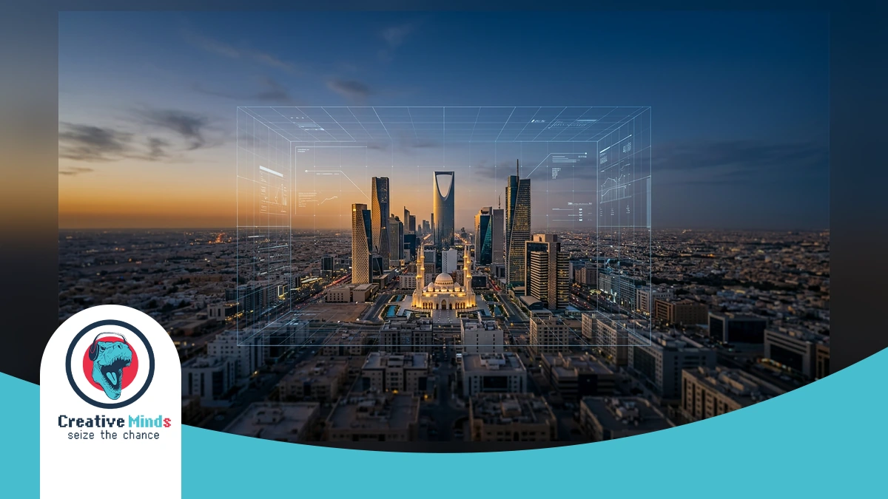
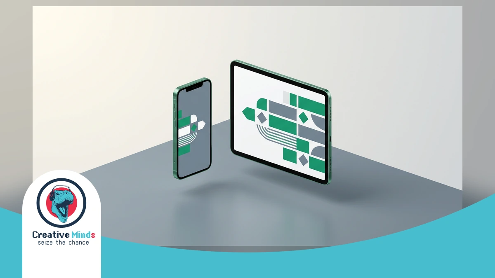
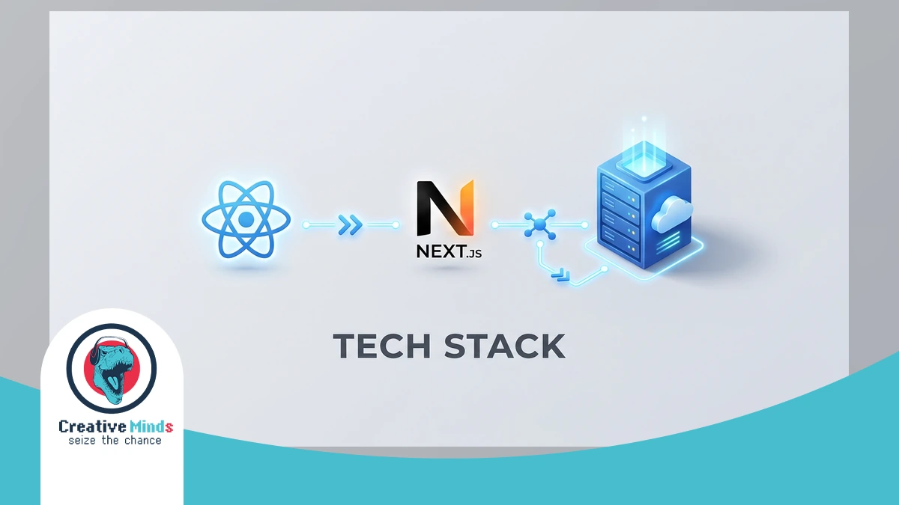
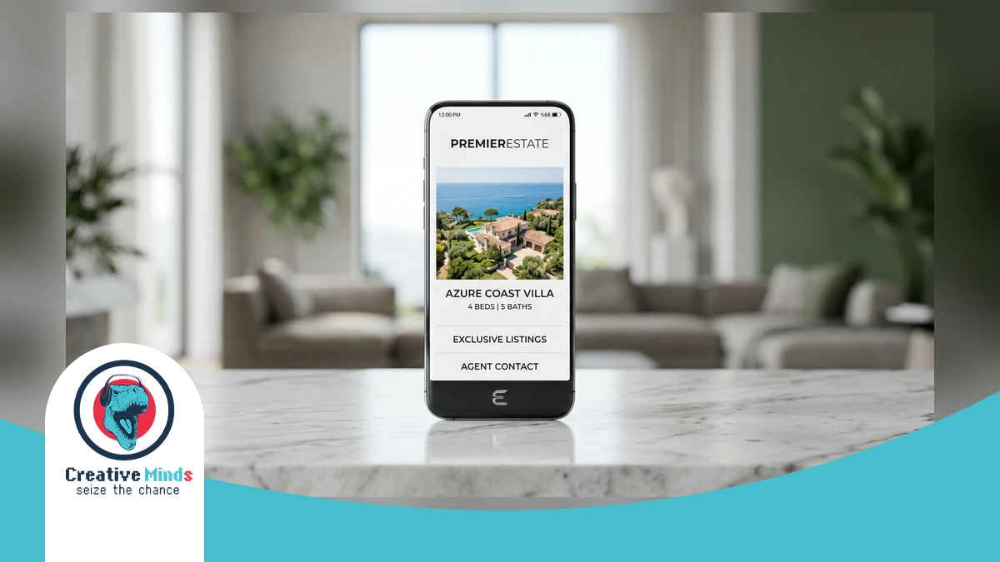
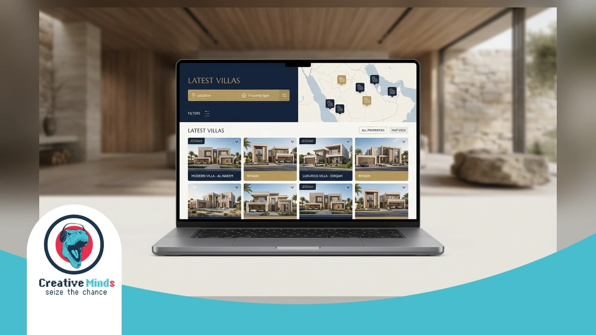
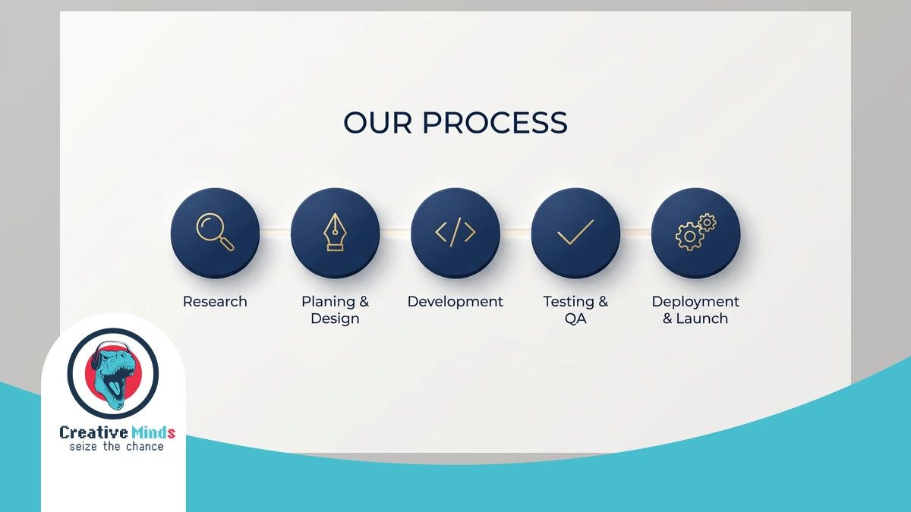
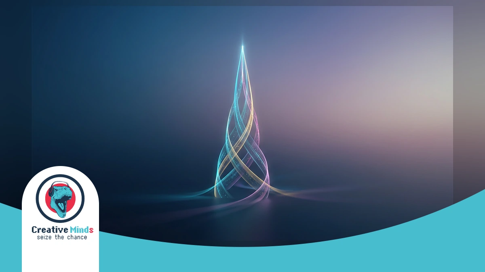

# Top Web Design Agency in Riyadh: Leading Digital Solutions 2026

<!-- section_id: sec_01 -->

Riyadh is transforming into a global tech hub. As the KAFD skyline grows, your business needs more than a basic site; you require a high-performance digital presence to compete in this rapidly shifting market.

The **Web Design Agency** landscape in Saudi Arabia is evolving toward UI/UX excellence. CEMS IT builds responsive, React-based platforms that align with Vision 2030, ensuring your brand stands out during this massive [digital transformation Saudi Arabia](https://cems-it.com/) is experiencing.

Success in Riyadh’s B2B and B2C sectors demands speed and precision. We replace outdated tech with modern HTML5 and JavaScript to capture market share before your competitors do. Secure your CEMS IT Official Website consultation today to lead the 2026 digital wave.

## Why Partner with CEMS IT for Web Design in Riyadh
<!-- section_id: sec_02 -->

**Contact our team today and get your project moving within days.**

Choosing the wrong **Web Design Agency** in Riyadh means risking your brand's reputation on slow, outdated technology. CEMS IT eliminates this business risk by replacing insecure Flash with high-performance HTML5 and JavaScript.

Our team specializes in **Arabic-first web design** to ensure your RTL (Right-to-Left) layout feels natural to Saudi users. We bridge the gap between creative mockups and technical engineering to build [premium Design Services](https://cems-it.com/design-services) that convert.

*   **RTL Optimization:** Precision alignment for Arabic typography and layouts.
*   **Modern Tech Stack:** We utilize React and WordPress for fast-loading, secure interfaces.
*   **Responsive Architecture:** Seamless transitions between mobile, tablet, and desktop screens.
*   **Performance First:** Eliminating legacy plugins to meet [Google’s Core Web Vitals standards](https://web.dev/vitals/).

Your competitors are already adopting **Vision 2030 digital solutions** to dominate the KSA market. CEMS IT ensures your **Web Design Riyadh** project delivers a **responsive web design KSA** users trust. Don't let a technical lag cost you market share; secure your professional digital transformation today.
## Our Technical Framework: Building High-Performance Riyadh Websites
<!-- section_id: sec_03 -->

**Get a free consultation with our specialists — zero commitment required.**

Our **Web Design Agency** in Riyadh bridges the gap between creative vision and technical engineering. We replace outdated technologies like Flash with high-performance HTML5 and JavaScript to ensure your site remains fast and secure.

By utilizing React for dynamic front-end interfaces, we build scalable platforms that handle high traffic effortlessly. You can benefit from our [expert web development](https://cems-it.com/web-design-company-in-egypt) to ensure your technical infrastructure aligns with global [W3C Standards](https://www.w3.org/standards/) for code quality.

Our team specializes in custom WordPress development Riyadh businesses trust for flexible content management. We prioritize UI/UX excellence across all devices, ensuring your brand delivers a seamless, responsive experience that converts visitors into loyal customers.

### Responsive Architecture for Mobile-First Saudi Users

<!-- section_id: sec_03_sub1 -->

In Riyadh, your audience isn't just browsing; they are living on their smartphones. With Saudi Arabia boasting one of the world’s highest mobile internet penetration rates, a **Web Design Agency** must prioritize fluid, adaptive layouts.

Your site needs to detect device specifications instantly to adjust its grid. Because Riyadh users expect immediate access, we optimize every breakpoint to ensure your content remains readable without zooming or horizontal scrolling.

Our technical approach ensures your site passes every mobile-usability test. You can secure a competitive edge by choosing Web Design Riyadh strategies that cater specifically to the high-speed mobile demands of the local market.
## Proven Success: A Riyadh Web Design Agency Case Study
<!-- section_id: sec_04 -->

**Don't let your competitors launch first — start your digital project now.**

When you look at the Riyadh property market, the **Web Design Agency** you choose must deliver more than just aesthetics. Our work on the "Aqar Ya Masr" project proves how CEMS IT transforms complex real estate requirements into high-performance web applications. By utilizing a modern tech stack including React and customized WordPress, we built a scalable platform that handles high traffic volumes while maintaining the professional UI/UX standards your Saudi users expect.

We don't just follow trends; we create them by bridging the gap between creative mockups and technical engineering. For this project, our engineers replaced outdated structures with fast-loading HTML5 and JavaScript to ensure every listing loads instantly on mobile and desktop. To see how these technical choices drive real-world ROI for property platforms, you can [VIEW PROJECT](https://cems-it.com/portfolio/aqar-ya-masr-web-app) details and explore our specialized architecture.

Your business deserves a digital identity that reflects your brand's unique goals. At CEMS IT, we work smart and efficiently to deliver high-quality results on time, every time, ensuring your responsive design adapts seamlessly to the Riyadh market's demands. Don't let your competitors dominate the 2026 digital wave while you rely on legacy systems; VIEW PROJECT outcomes now to understand how our tailored solutions can scale your business today.
## Validation of Excellence: Why We Are Riyadh's Leading Choice
<!-- section_id: sec_05 -->

**See how our team can turn your vision into measurable digital results.**

Choosing a **Web Design Agency** in Riyadh requires more than looking at a portfolio; you need a partner that delivers measurable dominance in the Saudi market. Your business deserves a platform that converts.

We justify our leadership through technical precision and sector-specific results. By aligning your digital infrastructure with local user behavior, we ensure your brand outperforms competitors who still rely on slow, legacy systems. | Performance Metric | Industry Average | CEMS IT Standard |
| :--- | :--- | :--- |
| Average Load Speed | 4.2 Seconds | Under 1.8 Seconds |
| Mobile Optimization | Basic Responsive | Mobile-First Adaptive |
| Security Protocols | Standard SSL | Enterprise-Grade Encryption |
| Arabic UX/UI Flow | Translated Layout | Native RTL Engineering |

**Our experts are standing by — reach out and get direct answers today.**
Our track record includes transforming complex requirements into high-conversion tools for Riyadh's B2B and B2C enterprises.

You can verify our expertise by exploring our [successful Websites portfolio](https://cems-it.com/portfolio-type/websites) to see how we scale Saudi brands.
## The Five-Step Journey to Your New Riyadh Website
<!-- section_id: sec_06 -->

**Your path to digital success starts with one conversation — let's begin.**

Your journey with CEMS-IT begins with deep market research tailored to the Riyadh landscape. We analyze local user behavior and sector-specific trends in education, retail, or publishing to ensure your **Web Design Agency** strategy aligns with your brand goals.

Our experts then transition into a two-phase technical execution to build your high-performance platform:

1.  **Creative Mockup Phase:** Our designers translate your vision into aesthetic structures, focusing on UI/UX excellence and brand identity.
2.  **Technical Engineering:** Our coders use HTML5, JavaScript, and React to turn those mockups into fast-loading, functional reality.
3.  **Custom CMS Integration:** We specialize in tailored WordPress setups, giving you flexible control over your site’s content.
4.  **Responsive Testing:** Every layout is rigorously tested to ensure seamless adaptation across mobile, tablet, and desktop screens.
5.  **Deployment & Optimization:** We replace outdated tech like Flash with modern frameworks to meet the speed demands of the Riyadh market.

By choosing **Web Design Riyadh** services that distinguish between creative artistry and engineering precision, you avoid the pitfalls of slow, legacy systems. You can further enhance your site’s performance by securing [reliable Web Hosting](https://cems-it.com/hosting) to ensure 2026-ready speeds and 99.9% uptime.

Because Riyadh users expect immediate access on their smartphones, our engineers prioritize a mobile-first approach during the development phase. Do not let technical debt or non-responsive layouts cost you market share this year. Contact our team today to initiate your five-step transformation and lead your industry with a cutting-edge digital presence.

### Bilingual Content Strategy and Deployment

<!-- section_id: sec_06_sub1 -->

In Riyadh, your digital presence must speak the local language with cultural precision. A professional **Web Design Agency** ensures your site transitions seamlessly between English and Arabic without breaking the user experience or layout.

We implement right-to-left (RTL) mirror-imaging to ensure your Arabic typography feels native to Saudi users. This process involves recalibrating navigation menus and call-to-action buttons so they align perfectly with regional reading patterns.

By balancing these dual-language requirements, CEMS IT helps you maintain a consistent brand voice across all demographics. This strategic deployment ensures your Web Design Riyadh project remains functional, fast, and culturally relevant for the 2026 market.
## Frequently Asked Questions About Web Design in Riyadh

<!-- section_id: sec_07 -->

### How long does a typical project take with a Web Design Agency?

Timeline depends on your specific requirements, but most professional projects move through a two-phase technical execution. At CEMS IT, designers first translate your vision into creative mockups focusing on UI/UX excellence.

Once you approve the aesthetics, our engineers begin the technical development using HTML5 and React. This structured approach ensures your **Web Design Agency** partner delivers a high-performance platform without compromising on quality or speed.

### Does Web Design Riyadh include full Arabic language support?

Yes, catering to the local market requires more than simple translation. We implement native RTL (Right-to-Left) engineering to ensure your typography and navigation menus feel natural to Saudi users across all digital devices.

By focusing on cultural precision, CEMS IT recalibrates your layout patterns to align with regional reading habits. This strategic deployment ensures your brand maintains a consistent and professional voice for both B2B and B2C audiences.

### How does CEMS IT ensure my website is mobile-responsive?

We prioritize a mobile-first architecture because Riyadh users expect immediate access on their smartphones. Our methodology utilizes modern frameworks like JavaScript and React to create fluid, adaptive layouts that detect device specifications instantly.

Your site will undergo rigorous testing to ensure seamless transitions between mobile, tablet, and desktop screens. We replace outdated technologies like Flash with fast-loading HTML5 to meet the high-speed demands of the 2026 Saudi market.

### Can I manage my own content after the site is launched?

You will have full control through a customized WordPress integration tailored to your specific business goals. CEMS IT builds flexible content management systems that allow you to update your retail or publishing site easily.

Our engineers bridge the gap between complex technical engineering and user-friendly interfaces. This ensures you can scale your digital presence independently while maintaining the high-quality UI/UX standards established during the initial design phase.

## Elevate Your Riyadh Business with CEMS IT Today

<!-- section_id: sec_08 -->

As Riyadh approaches the 2026 economic milestone, your business cannot afford a stagnant digital presence. Partnering with a specialized **Web Design Agency** ensures your technical implementation aligns with the rapid growth of the Saudi market.

We streamline your transition by replacing legacy systems with high-performance frameworks like React. You can transform your digital infrastructure today to ensure your brand remains competitive and fully optimized for the upcoming 2026 shift.

The final phase of our process focuses on launching a secure, RTL-optimized platform that scales with your ambitions. Don't let technical debt hold you back; secure your professional Web Design Riyadh consultation now to dominate your industry.