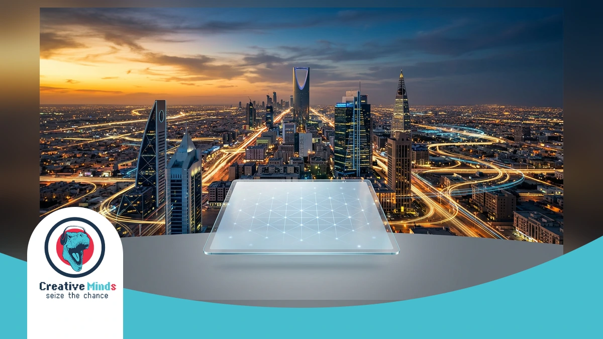
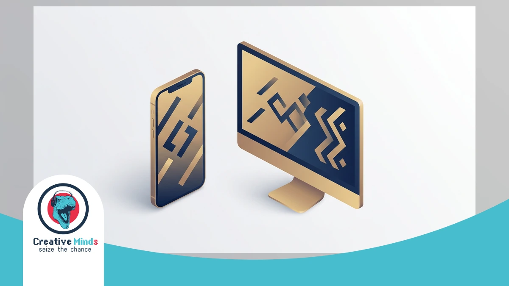
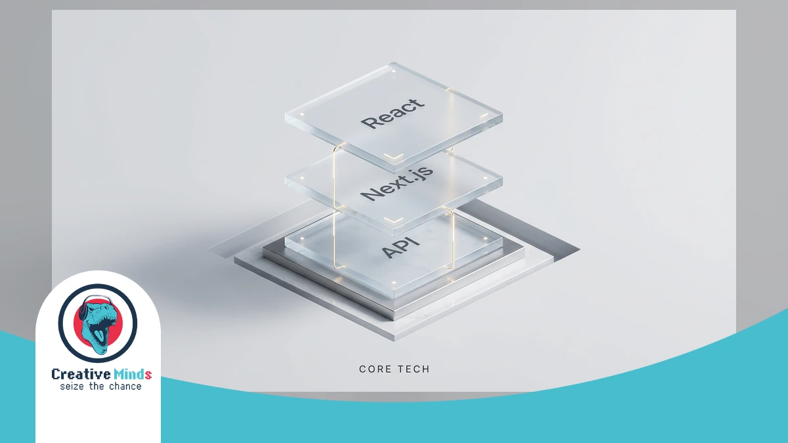
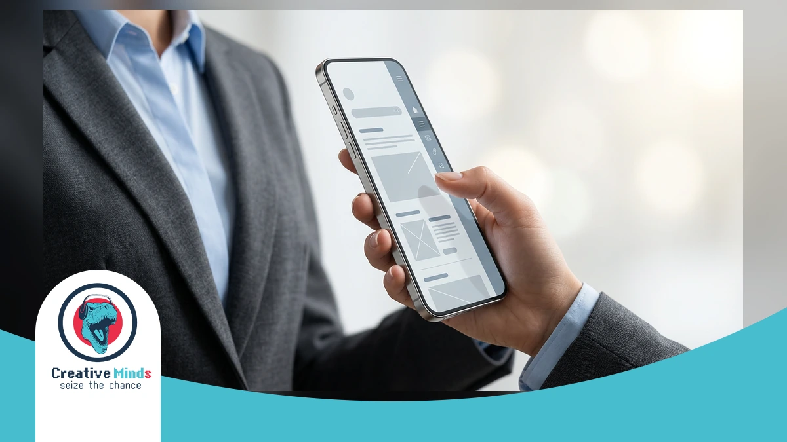
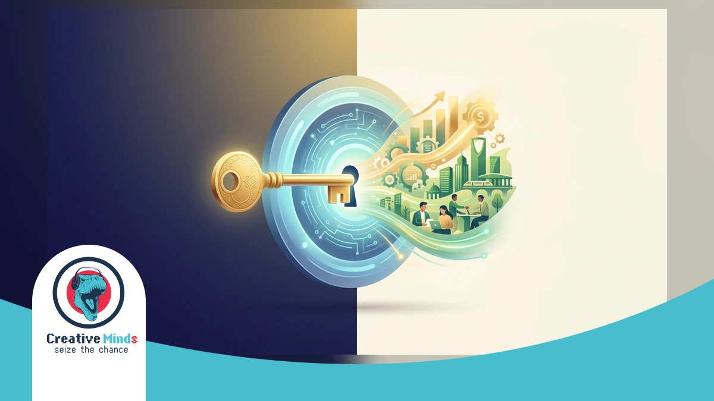
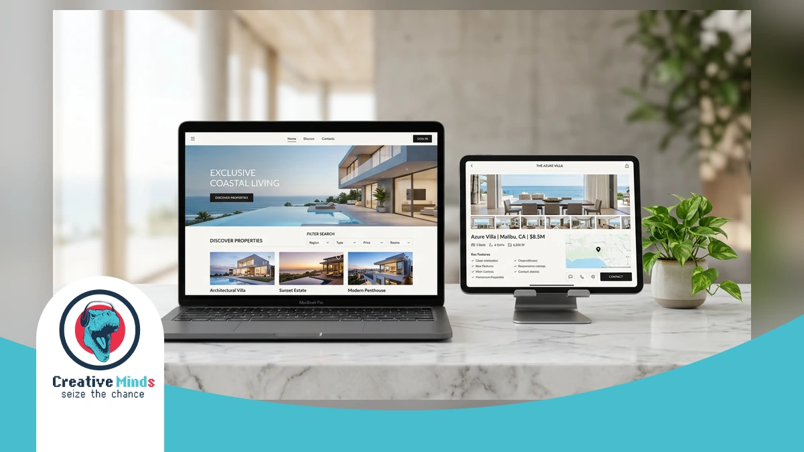

# Top Web Design Agency in Riyadh: Best Creative Solutions 2026

<!-- section_id: sec_01 -->

!Elite Web Design Agency in Riyadh providing high-performance digital solutions for Saudi Vision 2030.

In Riyadh’s fast-paced digital market, a standard website no longer cuts it. To dominate the local landscape, your business needs a high-performance **Web Design Agency** that understands the shift toward mobile-first, Arabic-centric consumer habits.

CEMS IT delivers this edge by blending **UI/UX design** with Saudi Vision 2030’s digital goals. We transform your ideas into visual mockups using React and WordPress to ensure a premium **user experience** across all devices.

As the leading choice for **Web Design Riyadh**, we invite you to [explore the CEMS IT Official Website](https://cems-it.com/) to see how our "creative minds" philosophy can outpace your competitors and secure your market share today.

## Why Your Riyadh Business Needs a Localized Web Design Agency
<!-- section_id: sec_02 -->

**Contact our team today and get your project moving within days.**

Generic templates often fail in the Saudi market because they ignore the technical complexities of an **RTL layout**. You risk alienating your audience if your site feels like a mirrored afterthought rather than a native experience.

Choosing a specialized **Web Design Riyadh** partner ensures your brand respects local UX expectations. By integrating [professional Design Services](https://cems-it.com/design-services) focused on cultural nuances, you avoid the high bounce rates associated with broken Arabic typography.

*   **Arabic-first content**: Prioritizing the local language ensures your message resonates with Saudi consumers immediately.
*   **Cultural Aesthetics**: Utilizing color palettes and imagery that align with KSA’s unique social and business values.
*   **Bilingual Websites**: Seamlessly switching between languages without breaking the visual structure or navigation flow.
*   **Mobile Optimization**: Addressing the fact that [over 90% of Saudi users](https://www.citc.gov.sa) access the internet primarily via smartphones.

Don't let a non-local agency jeopardize your market share with "English-first" thinking. Secure your competitive edge by prioritizing **bilingual websites** that speak directly to the Riyadh business landscape today.
## The CEMS IT Framework: High-Performance Web Design Agency Systems
<!-- section_id: sec_03 -->

**Get a free consultation with our specialists — zero commitment required.**

CEMS IT builds high-performance digital foundations using a modern tech stack centered on React, HTML5, and WordPress. In Riyadh, your business requires more than just a website; it needs a robust system capable of handling **digital transformation KSA** demands. Our framework ensures your platform remains fast, secure, and ready to scale as your local market share grows.

We prioritize a **mobile-first design** to capture the 99% of Saudi users browsing via smartphones. By integrating React for dynamic interfaces and WordPress for flexible content management, CEMS IT creates adaptable systems that function seamlessly across all desktop and tablet browsers. Our technical approach translates your initial visual mockups into high-speed reality, ensuring every interaction facilitates deep user engagement.

| Technical Feature | Business Benefit for Riyadh Market |
| :--- | :--- |
| **React & HTML5** | Ultra-fast loading speeds and interactive UI components |
| **Local API Integration** | Seamless connectivity with Mada, STC Pay, and Saudi logistics |
| **WordPress Customization** | Flexible, easy-to-manage content without technical debt |
| **Scalable Architecture** | Systems that grow alongside your Saudi Vision 2030 goals |

**Don't let your competitors launch first — start your digital project now.**
Our engineering team specializes in [agile web development](https://cems-it.com/web-design-company-in-egypt) to ensure your project stays on schedule and within budget. According to the [W3C Standards](https://www.w3.org/standards/), utilizing clean HTML5 code is essential for cross-browser compatibility and long-term accessibility. As a specialized **Web Design Agency**, we bridge the gap between creative branding and the technical complexity required to dominate the competitive Riyadh landscape.

### Arabic-First UI/UX and RTL Mastery

<!-- section_id: sec_03_h3_1 -->

In Riyadh, your digital success depends on more than just translation; it requires a structural shift. Local users interact with interfaces from right to left, meaning their eyes naturally land on the top-right corner first.

As a specialized **Web Design Agency**, CEMS IT masters this RTL flow by mirroring layouts to match Saudi navigation habits. We ensure your primary call-to-action is placed where local users expect to find it.

Our team utilizes React and WordPress to build interfaces that feel native to the Arabic language. By prioritizing this technical alignment, Web Design Riyadh projects avoid the common "mirrored afterthought" feel that drives away potential customers.
## Why Choose CEMS IT as Your Web Design Agency in Riyadh
<!-- section_id: sec_04 -->

**See how our team can turn your vision into measurable digital results.**

Beyond just a beautiful interface, your business in Riyadh needs a digital partner that prioritizes measurable growth. As your **Web Design Agency**, **CEMS IT** focuses on converting visitors into loyal customers through data-driven strategies.

We differentiate ourselves by blending "creative minds" with a focus on your bottom line. You can [secure Web Hosting](https://cems-it.com/hosting) that guarantees the speed and reliability required to stay ahead of your competitors in the Saudi market.

1. Local CITC compliance and regulatory understanding.
2. Direct support from our Riyadh-based technical experts.
3. Strategic focus on ROI and lead generation.
4. Seamless bilingual user experiences for local audiences.

Our team ensures your platform meets every local standard while maintaining a global creative edge. You deserve a partner that understands the Riyadh business landscape and delivers results that actually impact your revenue today.
## Proven Results: How We Transformed Digital Presence in the Region
<!-- section_id: sec_05 -->

**Our experts are standing by — reach out and get direct answers today.**

When you partner with a premier **Web Design Agency**, you expect more than aesthetics; you need a platform that dominates the Riyadh market. Our work on the Aqar Ya Masr project demonstrates this.

We translated complex real estate data into a high-performance interface using React and WordPress. This technical synergy ensures your visitors enjoy seamless navigation whether they are browsing on a smartphone or a desktop.

By focusing on information architecture and responsive design, we helped the client achieve high user engagement. You can [VIEW PROJECT details and results](https://cems-it.com/portfolio/aqar-ya-masr-web-app) to see our "creative minds" philosophy in action.

Our methodology involves creating visual mockups that define your brand’s look before development begins. This precision-led approach is why CEMS IT remains a trusted name for Web Design Riyadh, delivering scalable HTML5 solutions.
## Justifying the Standard: Riyadh’s Leading Web Design Agency Metrics
<!-- section_id: sec_06 -->

**Your path to digital success starts with one conversation — let's begin.**

Choosing a **Web Design Agency** in Riyadh requires looking beyond aesthetics to find measurable technical excellence. CEMS-IT bases every project on a rigorous methodology, starting with visual mockups that define information architecture before any coding begins.

Our team ensures your success by utilizing a modern tech stack featuring React and HTML5 for high-speed interfaces. You can validate our results by browsing our [full portfolio of Websites](https://cems-it.com/portfolio-type/websites) to see how we prioritize user engagement.

By moving away from outdated technologies like Flash, CEMS-IT delivers flexible WordPress solutions tailored for the Saudi market. We invite you to secure your digital future and outpace competitors by launching a high-performance platform this quarter.
## Frequently Asked Questions About Web Design in Riyadh

<!-- section_id: sec_07 -->

### How long does a typical project take with a Web Design Agency in Riyadh?
Most projects at CEMS IT follow a structured methodology to ensure efficiency. We begin by translating your ideas into visual mockups to define the architecture. This phase typically takes 2 to 4 weeks.

The development stage depends on complexity, especially when integrating React or WordPress. A standard professional site usually requires 8 to 12 weeks. We prioritize quality to ensure your platform functions seamlessly on all devices.

### Does Web Design Riyadh include support for local payment gateways?
Yes, local integration is a core part of our service. We build smart, flexible websites that connect with Saudi payment providers like Mada and STC Pay. This ensures a smooth transactional experience for your customers.

Our team utilizes HTML5 and JavaScript to create secure interfaces for these gateways. By focusing on the Saudi market, we help you overcome technical barriers. This approach facilitates high engagement and trust with your local audience.

### How do you handle Arabic RTL layouts and bilingual content?
At CEMS IT, we specialize in responsive and adaptive designs that prioritize the Arabic user experience. We move away from outdated technologies to ensure your RTL layout feels natural and easy to navigate.

We categorize information so that bilingual switching does not break the site structure. Your content will look perfect on mobile, tablet, and desktop browsers. This cultural alignment is essential for reaching B2B and B2C sectors in Riyadh.

### Why is a mobile-first approach critical for the Saudi market?
With the majority of users in KSA accessing the web via smartphones, mobile-first design is no longer optional. CEMS IT ensures your site is easy to access and facilitates usage on small screens.

Our "creative minds" philosophy focuses on UI/UX design to keep your mobile bounce rates low. We use a modern tech stack, including React, to deliver high-speed performance. This ensures your brand remains competitive in Riyadh’s mobile-centric digital landscape.

## Secure Your Digital Future with Riyadh’s Creative Experts

<!-- section_id: sec_08 -->

Your journey toward a dominant online presence in Riyadh begins with a structured implementation process. At CEMS-IT, we translate your unique business goals into visual mockups that define your site's information architecture before development starts.

By choosing our **Web Design Agency**, you ensure your project utilizes a modern tech stack including React and WordPress. You can secure a reliable foundation with the Meaning Of Web Hosting to support your high-performance platform.

Don't let your competitors capture the Riyadh market while you settle for outdated templates. Our creative experts are ready to build a responsive, bilingual site that drives real engagement and secures your digital future today.