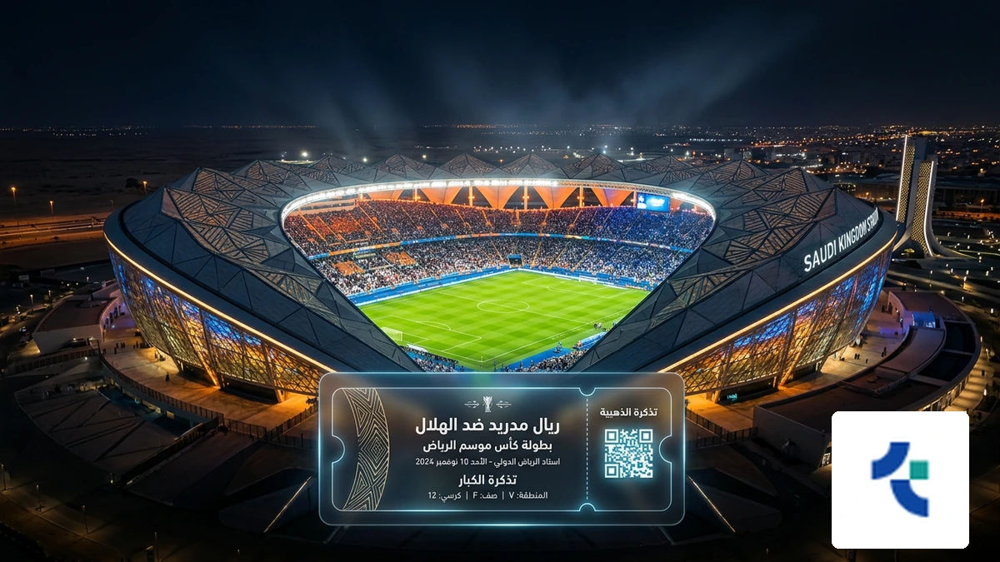
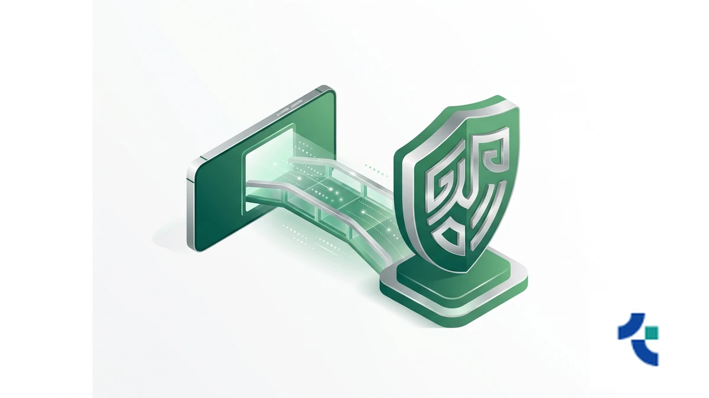
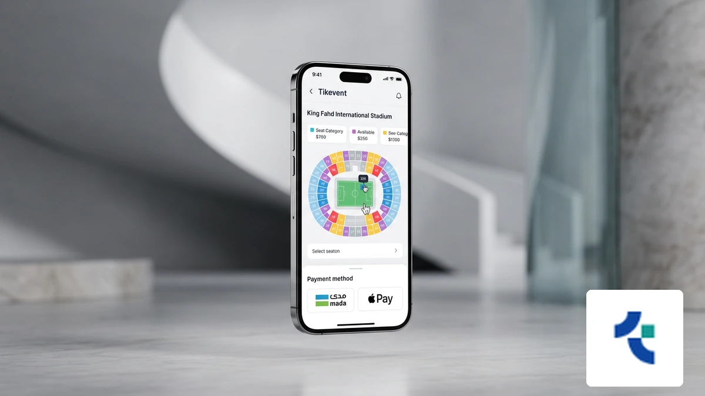
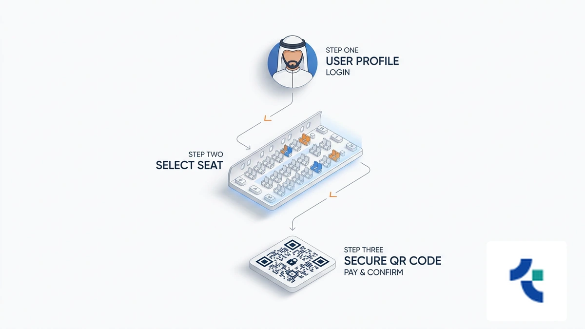
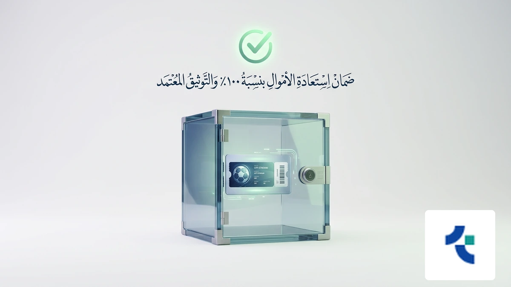

# رابط حجز تذاكر المباريات في السعودية 2026: الأسعار والمنصات الرسمية

<!-- section_id: sec_01 -->

!واجهة رقمية حديثة لعملية حجز تذاكر المباريات في ملاعب السعودية المتطورة

تنتظر الملاعب السعودية في الرياض وجدة والدمام عاماً استثنائياً في 2026، حيث يتصاعد شغفكم لمتابعة أقوى البطولات المحلية والعالمية من قلب الحدث. إن ضمان مقعدك وسط هذه الأجواء الحماسية يتطلب تحركاً ذكياً قبل نفاذ المقاعد المخصصة للمشجعين.

يمكنك الآن عبر **حجز تذاكر المباريات** تأمين حضورك وتجنب استغلال السوق السوداء الذي يظهر عادةً في المواجهات الكبرى. للحصول على تجربة شرائية آمنة تماماً، ننصحك باستخدام منصة حجز تذاكر المباريات الرسمية التي تضمن لك ملكية قانونية فورية لكل تذكرة تشتريها لدعم فريقك المفضل.

لا تترك متعة المدرج للصدفة، فالحصول على تذاكر المباريات الآن يمنحك الأولوية في اختيار أفضل المواقع والزوايا داخل الملعب. سارع بتأمين مكانك عبر حلول حجز التذاكر الموثوقة من تيك إيفنت واستفد من خيارات الدفع المحلية المرنة قبل اكتمال العدد المقرر للجماهير.

## واقع سوق حجز تذاكر المباريات في السعودية العربية لعام 2026
<!-- section_id: sec_02 -->

**تواصل مع فريقنا اليوم وابدأ مشروعك في أقرب وقت.**

تغيرت تجربة حضور الفعاليات الرياضية في السعودية العربية بشكل جذري، حيث أصبح النظام الرقمي هو الوسيلة الوحيدة والآمنة لضمان مقعدك. الاعتماد على المنصات الرسمية يحميك من عمليات الاحتيال والتلاعب في **حجز تذاكر المباريات** التي تنتشر غالباً في المواقع غير المصرح بها.

عندما تقرر شراء تذاكر كرة القدم عبر القنوات المعتمدة، فإنك تستفيد من الربط المباشر مع تطبيق توكلنا، مما يسهل عملية دخولك للملعب ويضمن صحة التذكرة. هذا التحول الرقمي ساهم في استقرار أسعار تذاكر الدوري ومنع استغلال السوق السوداء للجماهير، خاصة مع اقتراب منافسات كبرى مثل حجز تذاكر كأس العالم 2026 التي تتطلب معايير أمان عالية. وفقاً لتقارير [وزارة الرياضة السعودية](https://www.mos.gov.sa/)، فإن أتمتة الأنظمة قللت من الشكاوى المتعلقة بالتذاكر المزيفة بنسبة كبيرة جداً.

*   تكامل تقني كامل مع الهوية الرقمية لضمان ملكية التذكرة.
*   تحديثات فورية حول تذاكر مباريات الدوري السعودي للمحترفين وتوافر المقاعد.
*   إمكانية استعراض خريطة الملعب واختيار الفئة السعرية المناسبة قبل الدفع.
*   تسهيل إجراءات الحصول على تذاكر مباريات المنتخب السعودي في التصفيات العالمية.
## لماذا تختار منصة تيك إيفنت لضمان حجز تذاكر المباريات؟
<!-- section_id: sec_03 -->

**احصل على استشارة مجانية من خبرائنا المتخصصين — بدون أي التزام.**

تدرك منصة تيك إيفنت أن **حجز تذاكر المباريات** يتجاوز مجرد الحصول على مقعد، بل هو استثمار في تجربة ترفيهية آمنة. لذلك، صممنا نظاماً يحميك من مخاطر السوق السوداء والتذاكر المزيفة عبر تقنيات ربط مباشر تضمن ملكيتك القانونية لكل تذكرة تشتريها.

نحن نوفر لك مرونة مالية استثنائية عبر خيار تقسيط الدفعات حتى 12 دفعة، مما يسهل عليك حضور أقوى مواجهات تذاكر مباريات الدوري السعودي للمحترفين دون ضغط على ميزانيتك. بادر الآن بتأمين مقعدك عبر منصة تيك إيفنت الموثوقة لحجز التذاكر واستمتع بحلول دفع محلية آمنة تشمل مدى وApple Pay.

*   **تقسيط مريح:** إمكانية سداد قيمة التذاكر على دفعات شهرية تصل إلى 12 شهرًا.
*   **أمان عالي:** نظام تشفير متطور بالتعاون مع مستشارين عالميين لحماية حقوق المشترين.
*   **دعم فوري:** فريق مختص متاح على مدار الساعة لمعالجة استفساراتك وضمان وصولك للملعب.
*   **سياسة استرجاع مرنة:** خيارات استرداد الأموال وفق شروط واضحة تضمن حقك في حال تغيرت خططك.
*   **تغطية شاملة:** وصول حصري لتذاكر كأس خادم الحرمين الشريفين ودوري أبطال آسيا.

تعتمد مواقع حجز التذاكر لدينا على واجهة رقمية سريعة تمنع الازدحام وتتيح لك اختيار فئتك السعرية المفضلة من خريطة الملعب التفاعلية بكل دقة. ولأننا نلتزم بمعايير الشفافية، نتبع توجيهات [الاتحاد السعودي لكرة القدم](https://www.saff.com.sa/) لضمان تنظيم عادل لعمليات البيع. لا تخاطر بأموالك في منصات غير رسمية؛ احصل على تذكرتك المضمونة واضمن مكانك في قلب الحدث قبل نفاذ الكمية.
## المسار التقني: كيف تضمن شراء تذاكر كرة القدم بنجاح؟
<!-- section_id: sec_04 -->

**لا تدع منافسيك يسبقونك — ابدأ مشروعك الرقمي الآن.**

تبدأ عملية **حجز تذاكر المباريات** في السعودية عبر تطبيق "تيك إيفنت" باختيار الفعالية وتحديد الفئة السعرية من الخريطة التفاعلية. يضمن لك نظامنا التقني حجز مقعدك فوراً لتجنب الازدحام الرقمي عند طرح التذاكر الكبرى.

عند الوصول لمرحلة الدفع، تطلب البنوك السعودية رمز التحقق (OTP)؛ لذا تأكد من استقرار اتصال جوالك لاستلام الرسالة وإتمام **شراء تذاكر كرة القدم** بنجاح. يوفر لك نظام "تيك إيفنت" أماناً عالياً وتشفيراً متطوراً لحماية بياناتك المالية.

إذا واجهت ضغطاً على الميزانية، يمكنك الاستفادة من حلولنا المبتكرة عبر تقسيط قيمة التذاكر حتى 12 دفعة لتسهيل التكلفة. نلتزم بتوفير دعم فوري ومستمر لمعالجة أي تحديات تقنية قد تعيق عملية **حجز مقاعد المباريات** الخاصة بك.
## دليل أسعار تذاكر المباريات والمنصات المعتمدة 2026
<!-- section_id: sec_05 -->

**اكتشف كيف يمكننا تحويل رؤيتك إلى نتائج رقمية حقيقية.**

عند التخطيط لحضور المناسبات الكبرى في المملكة، تبرز فئات التذاكر المتنوعة لتلبي تطلعاتك وميزانيتك. تبدأ **أسعار تذاكر الدوري** للمقاعد الموحدة من مستويات اقتصادية تناسب العائلات، بينما ترتفع تدريجياً للفئات الفضية والذهبية.

تضمن لك منصة تيك إيفنت شفافية كاملة في عرض الرسوم الإضافية قبل إتمام الدفع. يمكنك الآن الاستفادة من ميزة تقسيط قيمة التذاكر حتى 12 دفعة لتسهيل التكلفة وحجز مقعدك في أقوى البطولات الآسيوية والمحلية. | فئة التذكرة | النطاق السعري التقريبي (ريال سعودي) | المزايا الإضافية |
| :--- | :--- | :--- |
| الموحدة (Standard) | 30 - 150 ريال | إطلالة كاملة على الملعب |
| الذهبية / الفضية | 300 - 800 ريال | مداخل خاصة ومقاعد مريحة |
| كبار الشخصيات (VIP) | 1,500 - 5,000+ ريال | ضيافة فاخرة ومواقف خاصة |
| حجز تذاكر كأس العالم 2026 | تحدد لاحقاً (فيفا) | معايير تنظيمية دولية |

**خبراؤنا جاهزون للإجابة على كل تساؤلاتك — تواصل معنا الآن.**
بالنظر إلى الإقبال التاريخي المتوقع عند بدء حجز تذاكر كأس العالم 2026، فإن الاعتماد على أنظمة حجز مرنة توفر خيارات الاسترجاع والتقسيط يعد استثماراً ذكياً لضمان حضورك.

سارع بتأمين مكانك عبر منصة تيك إيفنت الموثوقة لحجز التذاكر واستمتع بأمان رقمي متطور يحمي حقوقك كبائع أو مشترٍ.
## أدلة الموثوقية: ضمانات تيك إيفنت لحماية المشجعين
<!-- section_id: sec_06 -->

**خطوتك الأولى نحو النجاح تبدأ بمحادثة واحدة — دعنا نبدأ.**

تلتزم منصة تيك إيفنت بأعلى معايير الموثوقية عند **حجز تذاكر المباريات** في السعودية، حيث توفر نظام أمان متطوراً تم تطويره بالتعاون مع مستشارين عالميين لضمان حماية حقوق المشترين والبائعين في السوق الثانوية.

نحن نضمن لك ملكية قانونية كاملة لكل تذكرة، مع خيارات مرنة تشمل استرجاع القيمة وفق شروط واضحة، بالإضافة إلى إمكانية تقسيط قيمة التذاكر حتى 12 دفعة لتسهيل الحضور دون ضغط مالي.

تتبع المنصة بدقة ضوابط وزارة الرياضة السعودية ورابطة الدوري، مما يمنع التلاعب أو الاحتيال الرقمي، ويمكنك الآن تأمين مقعدك عبر منصة تيك إيفنت الموثوقة لحجز التذاكر لضمان تجربة حضور آمنة ومثالية.
## الأسئلة الشائعة حول حجز تذاكر المباريات في السعودية

<!-- section_id: sec_07 -->

### كيف أضمن صحة التذكرة وربطها بتطبيق توكلنا؟
عند إتمام **حجز تذاكر المباريات** عبر المنصات المعتمدة، ترتبط التذكرة برقم هويتك آلياً. يظهر التصريح في محفظة توكلنا الرقمية فور التأكيد، مما يمنع التزوير ويضمن لك دخولاً سريعاً للمدرجات السعودية بكل أمان.

### متى يتم الإعلان عن مواعيد طرح التذاكر للمباريات الكبرى؟
تعتمد **مواعيد طرح التذاكر** عادةً على أهمية الحدث؛ حيث تتوفر قبل اللقاء بـ 3 إلى 7 أيام. ننصحك بمتابعة حسابات الأندية الرسمية في الرياض وجدة لتجنب ضغط اللحظات الأخيرة وضمان مقعدك بأسعارها الرسمية.

### هل تتوفر مواقف سيارات مخصصة عند حجز التذاكر؟
توفر الملاعب السعودية الكبرى مثل "الجوهرة" و"الأول بارك" مواقف مرتبطة بفئة تذكرتك. تمنحك فئات VIP والمنصة أولوية الوصول لمواقف خاصة قريبة من البوابات، مما يسهل لك تجربة الحضور دون عناء البحث عن مكان للوقوف.

### كيف أحصل على تذاكر مباريات المنتخب السعودي في التصفيات؟
يمكنك شراء **تذاكر مباريات المنتخب السعودي** عبر منصة "ساهم" أو المواقع التي يحددها الاتحاد السعودي لكرة القدم. تأكد من تحديث بياناتك البنكية مسبقاً، حيث تنفد تذاكر "الأخضر" بسرعة هائلة نظراً للإقبال الجماهيري الكثيف في المملكة.

### ماذا أفعل إذا واجهت مشكلة تقنية أثناء الدفع؟
إذا تعثرت عملية الشراء، تحقق من استقرار اتصالك بالإنترنت وصلاحية بطاقة "مدى". توفر الأنظمة التقنية الحديثة في السعودية دعماً فورياً عبر المحادثات المباشرة لمعالجة أخطاء الخصم أو تأخر صدور رمز التحقق (OTP) الخاص ببنكك.

## ابدأ الآن: طريقك الآمن نحو مدرجات الملاعب السعودية

<!-- section_id: sec_08 -->

تدرك منصة تيك إيفنت أن **حجز تذاكر المباريات** في المملكة يتجاوز مجرد تأمين مقعد؛ إنه استثمار في تجربة ترفيهية آمنة تليق بشغفك الرياضي في ملاعب الرياض وجدة.

نحن نوفر لك نظاماً تقنياً متطوراً يحميك من مخاطر السوق السوداء، مع منحك مرونة مالية استثنائية عبر خيار تقسيط قيمة التذاكر حتى 12 دفعة لضمان حضورك أقوى المواجهات.

بادر الآن بتأمين مكانك في المدرجات واضمن الحصول على تذاكر المباريات الآن عبر حلول دفع محلية آمنة تشمل مدى وApple Pay لتستمتع بحماس كرة القدم السعودية دون تأجيل.