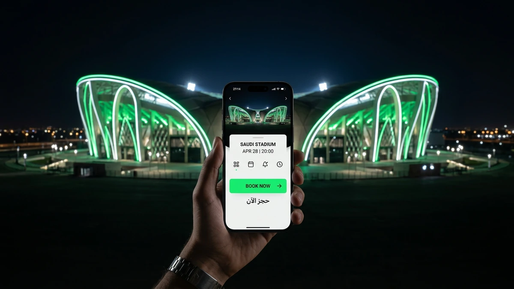
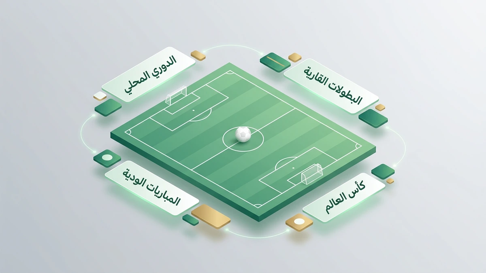
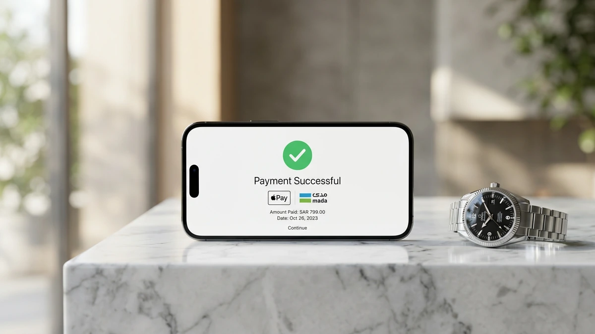
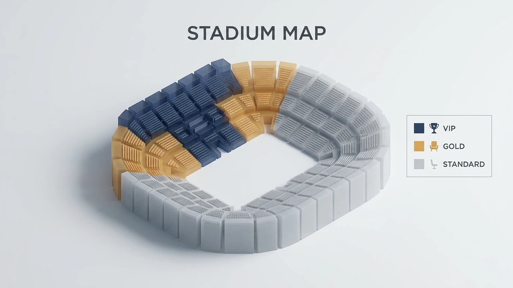
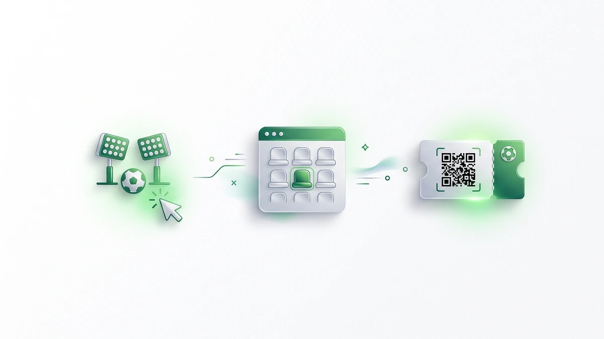
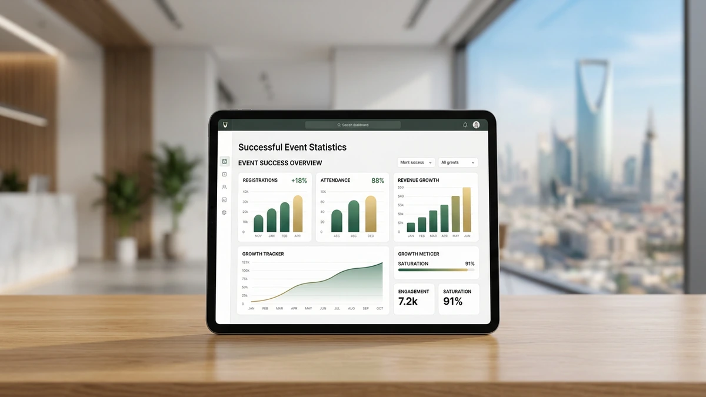

# دليل حجز تذاكر المباريات في السعودية: الخطوات والأسعار لعام 2026

<!-- section_id: sec_01 -->

!واجهة تطبيق حجز تذاكر المباريات في ملعب سعودي حديث

تنتظرك مدرجات الملاعب السعودية في موسم 2026 بتجربة كروية عالمية، حيث يتجلى الشغف الجماهيري في أبهى صوره بملعب الجوهرة ومرسول بارك. يمكنك الآن ضمان مقعدك وسط هذا الحماس عبر **حجز تذاكر المباريات** إلكترونياً.

توفر لك منصة حجز تذاكر المباريات الرسمية وصولاً سهلاً لأقوى مواجهات تذاكر الدوري السعودي بضغطة زر. سارع بتأمين حضورك الآن لتجنب نفاد المقاعد في القمم الكروية الكبرى والاستمتاع بأسعار تذاكر الملاعب التنافسية.

لا تدع الفرصة تفوتك لمؤازرة فريقك من قلب الحدث والحصول على تذاكر المباريات الآن بأمان تام. استثمر في شغفك عبر شراء تذاكر الفعاليات الرياضية الكبرى قبل اكتمال الطاقة الاستيعابية للملاعب وتضاعف الأسعار.

## واقع سوق حجز تذاكر المباريات في السعودية لعام 2026
<!-- section_id: sec_02 -->

**تواصل مع فريقنا اليوم وابدأ مشروعك في أقرب وقت.**

أصبحت عملية **حجز تذاكر المباريات** في المملكة العربية السعودية تجربة رقمية متكاملة تواكب تطلعات المشجعين في عام 2026. لم يعد المشجع بحاجة لانتظار الطوابير، بل بات بإمكانك الوصول لمقعدك في دوري روشن أو كأس خادم الحرمين الشريفين عبر حلول ذكية توفرها منصة تيك إيفنت، مع ضمان الشفافية الكاملة في الأسعار وتوافر التذاكر حتى في اللحظات الأخيرة.

تطور السوق السعودي ليتيح لك خيارات مرنة تتناسب مع ميزانيتك، حيث يمكنك الآن الاستفادة من خدمة تقسيط تذاكر مباريات كرة القدم التي تصل إلى 12 دفعة ميسرة. هذه القفزة النوعية في الخدمات، المدعومة بخبرات مستشارين عالميين، تضمن لك تجربة شراء آمنة وموثوقة بعيداً عن مخاطر السوق السوداء، مما يعزز من كفاءة منظومة الفعاليات الرياضية الكبرى.

*   **سرعة التنفيذ:** إتمام عملية شراء تذاكر كرة القدم أونلاين بخطوات بسيطة ومن أي مكان.
*   **مرونة مالية:** حلول دفع مبتكرة تشمل التقسيط لتسهيل حضور البطولات الكبرى مثل دوري أبطال آسيا.
*   **دعم فني متكامل:** قنوات تواصل متعددة لضمان حل أي استفسار تقني فوراً.
*   **سياسة استرجاع واضحة:** إمكانية استعادة قيمة التذكرة وفق شروط ميسرة في حال تغيرت خططك.

وفقاً لتقارير [الاتحاد الآسيوي لكرة القدم](https://www.the-afc.com)، شهدت الملاعب السعودية طفرة في الحضور الجماهيري نتيجة سهولة الوصول للخدمات الرقمية. إذا كنت تسعى لتأمين حضورك في القمة القادمة، يمكنك الآن شراء تذاكر الفعاليات الرياضية الكبرى عبر منصة تيك إيفنت لضمان مقعدك وسط أجواء الحماس والإثارة الكروية العالمية.
## لماذا تختار تيك إيفنت عند حجز تذاكر المباريات؟
<!-- section_id: sec_03 -->

**احصل على استشارة مجانية من خبرائنا المتخصصين — بدون أي التزام.**

تدرك تماماً أن الوقوع في فخ الاحتيال عند **حجز تذاكر المباريات** هو أكبر تهديد يواجهك كمشجع في السعودية، خاصة مع انتشار منصات إعادة البيع غير الموثوقة. نحن في تيك إيفنت نضع أمانك المالي والتقني كأولوية قصوى، حيث نوفر لك بيئة شرعية تضمن صحة كل تذكرة تصدر من خلالنا بعيداً عن تلاعب السوق السوداء.

تعتمد تجربتك معنا على الشفافية المطلقة، فبمجرد اختيار فئتك المفضلة، ستحصل على تأكيد فوري يحميك من مخاطر تكرار بيع التذاكر أو إلغائها المفاجئ. ولأننا نعلم تفضيلاتك في المملكة، وفرنا لك حلول دفع محلية آمنة مثل "مدى" و Apple Pay لتسهيل العملية بضغطة زر واحدة.

*   ضمان استرداد الأموال بالكامل في حال إلغاء الفعالية أو وجود خلل فني.
*   حماية بياناتك البنكية عبر بروتوكولات تشفير عالمية متطورة.
*   دعم فني سعودي متاح على مدار الساعة لمعالجة أي تحديات تواجهك أثناء الدخول للملعب.
*   أسعار رسمية ومنافسة تخضع لرقابة صارمة لمنع الاستغلال الموسمي.
*   تكامل تقني سريع يتيح لك استلام تذكرتك رقمياً فور إتمام الدفع.

وفقاً لما تشير إليه معايير [الاتحاد الدولي لكرة القدم (FIFA)](https://www.fifa.com) بشأن حماية حقوق المشجعين، فإن الاعتماد على المنصات المرخصة هو السبيل الوحيد لضمان قانونية الحضور. نحن نطبق هذه المعايير بصرامة لنمنحك راحة البال الكاملة، مما يجعلك تركز فقط على تشجيع فريقك والاستمتاع باللحظة دون قلق من ضياع استثمارك المالي.
## خارطة أسعار وفئات تذاكر المباريات في الملاعب السعودية
<!-- section_id: sec_04 -->

**لا تدع منافسيك يسبقونك — ابدأ مشروعك الرقمي الآن.**

تعتمد تكلفة حضور المباريات في الملاعب السعودية بمدن الرياض وجدة والدمام على نظام فئات دقيق يراعي زاوية الرؤية والخدمات الملحقة. تبدأ الأسعار من الفئة الموحدة التي تناسب العائلات والروابط، وتتصاعد لتشمل باقات الضيافة الفاخرة.

تتيح لك منصة تيك إيفنت **حجز تذاكر المباريات** بمرونة عالية، حيث يمكنك اختيار الموقع الذي يناسب ميزانيتك مع ضمان استلام التذكرة رقمياً فور إتمام الدفع. نوفر لك أنظمة تشفير متطورة لحماية بياناتك المالية أثناء الشراء أونلاين. | فئة التذكرة | متوسط السعر (ريال سعودي) | المزايا التقنية والخدمية |
| :--- | :--- | :--- |
| الموحدة (Standard) | 20 - 150 | دخول سريع عبر البوابات الإلكترونية ومقاعد مرقمة |
| الفضية (Silver) | 200 - 600 | إطلالة جانبية ممتازة وقريبة من مرافق الخدمات |
| الذهبية (Gold) | 500 - 1500 | مقاعد في المنصة الوسطى مع ضيافة خفيفة |
| كبار الشخصيات (VIP) | 2000+ | مواقف خاصة، خدمات فندقية، ورؤية بانورامية للملعب |

**اكتشف كيف يمكننا تحويل رؤيتك إلى نتائج رقمية حقيقية.**
يمكنك الآن شراء تذاكر كرة القدم وتوزيع التكلفة عبر حلولنا المبتكرة التي تسمح بتقسيط المبلغ على 12 دفعة ميسرة.

نضمن لك تجربة شراء آمنة مدعومة بخبرات مستشارين عالميين لتجنب مخاطر السوق السوداء وضمان صلاحية تذكرتك.

استعد لمؤازرة فريقك في كأس خادم الحرمين الشريفين أو دوري أبطال آسيا من خلال تأمين مقعدك الآن. إذا تغيرت خططك، نوفر لك خيار استرجاع التذاكر وفق شروط ميسرة لضمان راحة بالك الكاملة قبل انطلاق صافرة البداية.
## خطوات حجز تذاكر المباريات أونلاين عبر تيك إيفنت
<!-- section_id: sec_05 -->

**خبراؤنا جاهزون للإجابة على كل تساؤلاتك — تواصل معنا الآن.**

تبدأ رحلتك لتأمين مقعدك في مدرجات الملاعب السعودية باختيار الفعالية وتحديد الفئة المناسبة لميزانيتك. توفر لك منصة تيك إيفنت واجهة ذكية تتيح تصفح أقوى مواجهات كأس خادم الحرمين الشريفين ودوري أبطال آسيا بوضوح تام.

بمجرد اختيار المباراة، حدد عدد المقاعد وموقعها بدقة عبر الخريطة التفاعلية للملعب. يمكنك الآن إتمام **حجز تذاكر المباريات** والدفع عبر خيارات مرنة تشمل "مدى" وApple Pay، أو تقسيط المبلغ على 12 دفعة ميسرة.

1. اختر المباراة والبطولة المفضلة من القائمة المتاحة.
2. حدد فئة التذكرة (موحدة، فضية، ذهبية، أو VIP).
3. أدخل بياناتك الشخصية واختر طريقة الدفع المناسبة لك.
4. استلم تذكرتك الرقمية فوراً عبر البريد الإلكتروني أو الجوال.
5. اربط التذكرة بتطبيقات الفعاليات المعتمدة لضمان دخول سريع للملعب.

بعد تأكيد الدفع، تصلك التذكرة مشفرة لضمان الأمان ومنع التلاعب. في حال تغيرت خططك، تتيح لك المنصة خيار استرجاع القيمة وفق شروط ميسرة، مما يضمن لك تجربة حجز خالية من القلق والتعقيدات التقليدية.

### كيفية تفعيل خيار تقسيط التذاكر بمرونة

<!-- section_id: sec_05_h3_1 -->

تدرك منصة "تيك إيفنت" أن شغفك بحضور القمة الكروية لا يجب أن يضغط على ميزانيتك، لذا وفرت لك آلية **حجز تذاكر المباريات** بنظام التقسيط المريح. يمكنك الآن توزيع تكلفة تذكرتك على 12 دفعة شهرية ميسرة، مما يسهل عليك حضور نهائيات كأس خادم الحرمين الشريفين أو مواجهات دوري أبطال آسيا دون عناء مالي.

تبدأ العملية باختيار المباراة وتحديد فئة المقعد، وعند الانتقال لصفحة الدفع، ستجد خيارات التقسيط متاحة بمرونة تامة عبر شركاء المنصة المحليين في المملكة. ننصحك بالاستفادة من هذه الميزة عند شراء تذاكر كرة القدم بالتقسيط المريح لضمان مقعدك في الأدوار الإقصائية الكبرى قبل نفادها، مع استلام تأكيد الحجز رقمياً وفورياً.

تتميز هذه الخدمة بكونها مدعومة بخبرات مستشارين عالميين لضمان أمان معاملاتك المالية وحماية بياناتك عند طلب تذاكر المباريات الآن. إذا تطلبت ظروفك تغيير الموعد، تتيح لك المنصة خيار استرجاع التذاكر وفق شروط ميسرة، مما يمنحك تجربة حجز تتسم بالموثوقية والشفافية الكاملة بعيداً عن تعقيدات السوق السوداء.
## أرقام وحقائق: لماذا نعد الوجهة الرائدة في سوق التذاكر؟
<!-- section_id: sec_06 -->

**خطوتك الأولى نحو النجاح تبدأ بمحادثة واحدة — دعنا نبدأ.**

تثبت الأرقام ريادة "تيك إيفنت" في السوق السعودي، حيث نجح مستشارونا العالميون في إدارة عمليات ضخمة شملت بطولات كبرى مثل دوري أبطال آسيا ومهرجان قطر لكرة القدم، مما يضمن لك تجربة احترافية تتجاوز مجرد **حجز تذاكر المباريات** التقليدي.

تعتمد موثوقيتنا على حقائق ملموسة وحلول مبتكرة صُممت خصيصاً لتلبية احتياجاتك في المملكة، ومن أبرزها:

*   تغطية شاملة لأقوى المنافسات المحلية والقارية مثل كأس خادم الحرمين الشريفين.
*   شراكات استراتيجية مع خبراء دوليين لتطوير آليات سوق التذاكر الثانوية بأعلى معايير الأمان.
*   نظام دفع مرن هو الأول من نوعه، يتيح لك تقسيط قيمة التذكرة على 12 دفعة شهرية.
*   سياسة استرجاع مرنة تضمن لك استعادة أموالك بسهولة في حال تغيرت خططك الشخصية.
*   دعم فني متخصص يعمل على مدار الساعة لمعالجة استفساراتك وضمان دخولك للملعب بسلامة.

نحن لا نوفر لك مقعداً فحسب، بل نمنحك نظاماً تقنياً متطوراً يحميك من استغلال السوق السوداء عبر تشفير رقمي متقدم، مما يجعل عملية شراء تذاكر كرة القدم لدينا هي الأكثر أماناً واستدامة للمشجعين الطموحين.

استثمر في شغفك الآن واحصل على تذاكر المباريات الآن لتضمن مكانك في قلب الحدث الكروي القادم، واستفد من خبراتنا العالمية التي تجعل من حضورك للمدرجات تجربة استثنائية لا تُنسى.
## أسئلة شائعة حول حجز تذاكر المباريات في السعودية

<!-- section_id: sec_07 -->

### هل يمكنني استرجاع مبلغ التذكرة إذا لم أحضر المباراة؟
تعتمد إمكانية الاسترداد على السياسة التقنية للمنصة المزودة، حيث تتيح الأنظمة الحديثة خيار إعادة العرض أو الاسترجاع وفق شروط ميسرة تضمن لك حفظ حقوقك المالية قبل انطلاق صافرة البداية بوقت كافٍ.

### كيف يتم الربط بين التذكرة الرقمية وتطبيقات الدخول الرسمية؟
بمجرد إتمام **حجز تذاكر المباريات**، يرسل النظام رمز استجابة سريعة (QR Code) مشفرًا؛ يمكنك دمجه مباشرة مع محفظتك الرقمية أو التطبيقات المعتمدة في السعودية لضمان عبور البوابات الإلكترونية بذكاء وسرعة فائقة.

### ما هي الإجراءات المتبعة في حال ضياع بيانات الحساب أو التذكرة؟
لا تقلق إذا فقدت الوصول لبياناتك، فأنظمة الدعم الفني المتاحة على مدار الساعة تمكنك من استعادة التذكرة عبر البريد الإلكتروني الموثق أو رقم الجوال، مما يحميك من مخاطر السوق السوداء وضياع مقعدك.

### هل تتطلب المباريات الإقليمية في السعودية استخدام بطاقة هيا عام 2026؟
وفقاً للتحديثات التقنية، يتم دمج خصائص التحقق الرقمي لبطاقة هيا في الفعاليات الكبرى لتسهيل دخول المشجعين من خارج المملكة، مما يجعل عملية شراء تذاكر كرة القدم تجربة متكاملة تربط بين التأشيرة وتذكرة الملعب.

### كيف أضمن صحة التذكرة عند الشراء من منصات إعادة البيع؟
الضمان الوحيد هو الاعتماد على المنصات التي توفر تشفيراً رقمياً مرتبطاً بقواعد بيانات الاتحاد، حيث تمنحك هذه الأنظمة تأكيداً فورياً يمنع تكرار بيع التذكرة الواحدة ويؤمن لك تجربة حضور آمنة تماماً.

## الخلاصة: ابدأ رحلتك التشجيعية الآن مع تيك إيفنت

<!-- section_id: sec_08 -->

تدرك تماماً أن مقعدك في المدرجات السعودية لعام 2026 يتطلب سرعة التنفيذ قبل نفاذ الكميات، خاصة مع الإقبال التاريخي المتوقع. يمكنك الآن إتمام عملية **حجز تذاكر المباريات** عبر خطوات رقمية بسيطة تضمن لك استلام التذكرة فوراً.

ابدأ باختيار مواجهتك المفضلة وحدد فئة الجلوس التي تناسب ميزانيتك، ثم استفد من نظام الدفع المرن لتقسيط تذاكر المباريات الذي يمنحك راحة مالية تامة. لا تترك شغفك للصدفة أو لمخاطر السوق السوداء التي قد تحرمك من الحضور.

نحن نضمن لك تجربة شرعية وآمنة مدعومة بخبرات عالمية لتأمين حضورك في كافة المحافل الكروية الكبرى بالمملكة. سارع بتأمين تذاكر المباريات الآن عبر منصة تيك إيفنت لتكون في قلب الحدث وتدعم فريقك من الصفوف الأولى قبل اكتمال الطاقة الاستيعابية للملعب.