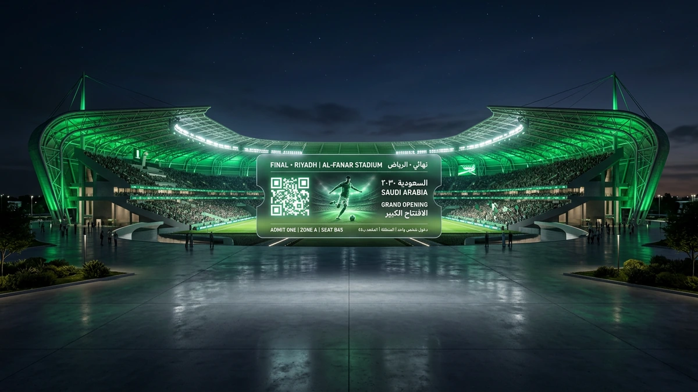
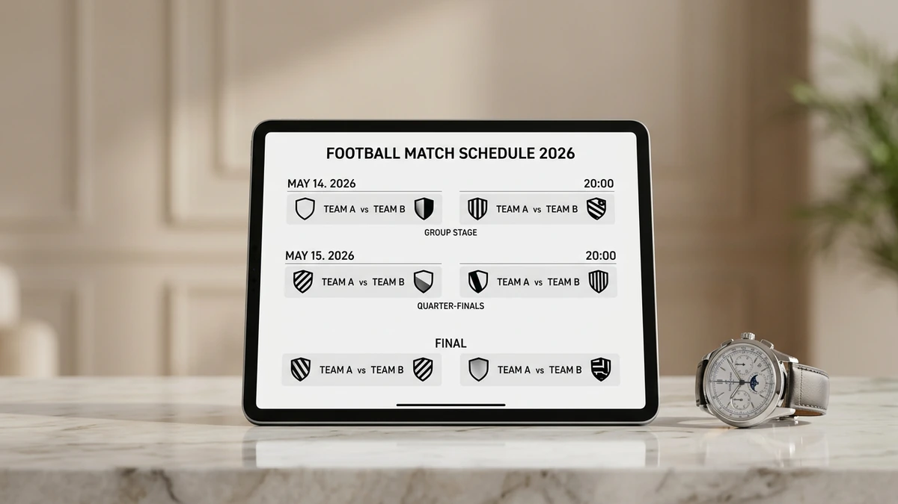
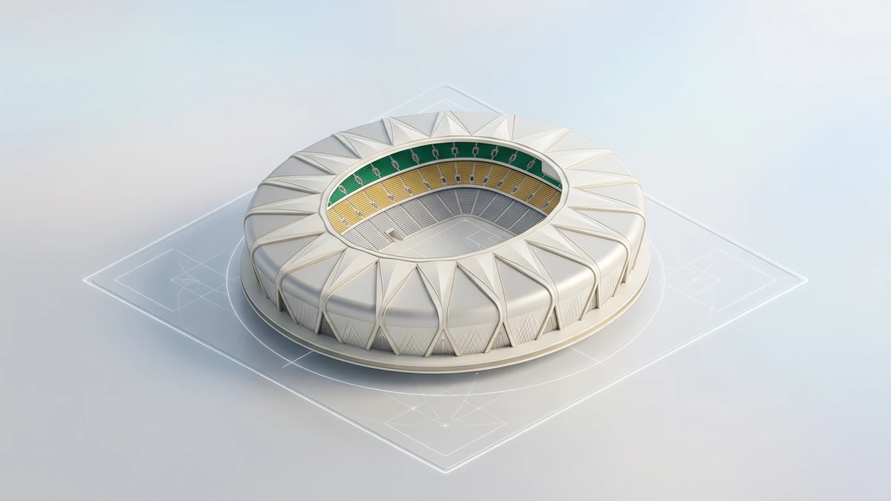
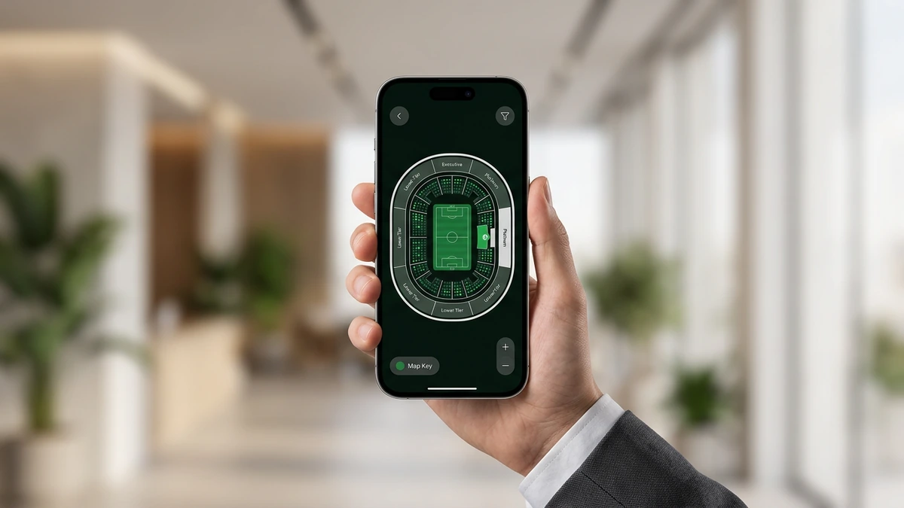
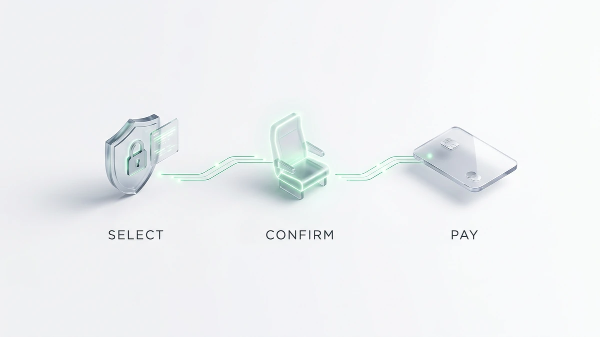

# أفضل منصة حجز تذاكر المباريات في السعودية لعام 2026: احجز تذكرتك الآن

<!-- section_id: sec_01 -->

تستعد الملاعب السعودية لاستقبال موسم استثنائي في عام 2026، حيث يترقب المشجعون بشغف تجربة **حجز تذاكر المباريات** التي شهدت طفرة رقمية هائلة. سواء كنت تخطط لحضور ديربي الرياض أو دعم المنتخب، فإن المقاعد تنفد بسرعة البرق.

الآن هو وقتك لتأمين مكانك في المدرجات؛ يمكنك استخدام منصة حجز تذاكر المباريات الرسمية للحصول على تذاكر الدوري السعودي والفعاليات الكبرى فور طرحها. لا تسمح للزحام الرقمي أن يحرمك من متعة مؤازرة فريقك المفضل من قلب الحدث.

تذكر أن أسعار التذاكر 2026 تخضع لطلب مرتفع للغاية، لذا فإن التحرك السريع يضمن لك أفضل رؤية وأقل تكلفة. سارع بزيارة منصة Webook أو تطبيقنا المعتمد لتأكيد حجزك الآن قبل إغلاق نافذة البيع ونفاذ الكمية المخصصة للجمهور.

## واقع سوق حجز تذاكر المباريات في السعودية لعام 2026
<!-- section_id: sec_02 -->

**تواصل مع فريقنا اليوم وابدأ مشروعك في أقرب وقت.**

تعتمد تكلفة **حجز تذاكر المباريات** في الملاعب السعودية لعام 2026 على فئة المقعد وأهمية المواجهة. تبدأ أسعار التذاكر الموحدة عادة من 20 ريالاً سعودياً في المباريات الاعتيادية، بينما ترتفع لتلائم التجهيزات العالمية في الملاعب الكبرى.

في مدينة الملك عبدالله الرياضية أو **ملعب الجوهرة**، تتنوع الخيارات بين المقاعد خلف المرمى والمنصة الذهبية التي توفر رؤية بانورامية وخدمات ضيافة متكاملة. يمكنك الاطلاع على تفاصيل المسابقات المحلية عبر الموقع الرسمي لـ [الاتحاد السعودي لكرة القدم](https://www.saff.com.sa/) لمتابعة تحديثات الجدولة. | فئة التذكرة | متوسط السعر (ريال سعودي) | نوع المقعد / المزايا |
| :--- | :--- | :--- |
| التذكرة الموحدة | 20 - 75 | مقاعد المدرجات العامة (خلف المرمى والزوايا) |
| الواجهة (Premium) | 100 - 300 | مقاعد الواجهة المقابلة للمنصة برؤية ممتازة |
| المنصة الفضية | 500 - 1500 | مقاعد مريحة مع دخول لمنطقة الضيافة المصغرة |
| المنصة الذهبية | 2000 - 5000 | تجربة فاخرة، بوفيه مفتوح، ومواقف سيارات خاصة |

**احصل على استشارة مجانية من خبرائنا المتخصصين — بدون أي التزام.**
يتميز **مرسول بارك** (الأول بارك حالياً) بنظام تسعير ديناميكي يتأثر بحجم الطلب، خاصة عند **شراء تذاكر كرة القدم** للقمصان الجماهيرية الكبرى.

تذكر أن ظاهرة **إعادة بيع التذاكر** عبر المنصات غير الرسمية قد تضاعف **أسعار التذاكر** بشكل غير قانوني، لذا التزم دائماً بالمصادر المعتمدة لضمان حقوقك.

### فئات التذاكر: من الدرجة الموحدة إلى المقصورة الملكية

<!-- section_id: sec_03 -->

عندما تخطط للذهاب إلى الملاعب الكبرى في الرياض أو جدة، ستجد أن خيارات **حجز تذاكر المباريات** تتجاوز مجرد مقعد، بل هي تجربة متكاملة تبدأ من اختيارك الفئة التي تناسب تطلعاتك وميزانيتك المحددة.

تتنوع فئات التذاكر لتشمل الدرجة الموحدة الاقتصادية، وفئة الواجهة التي تمنحك رؤية بانورامية للملعب، وصولاً إلى المنصة الفضية والذهبية والمقصورة الملكية التي توفر خدمات لوجستية خاصة ومواقف سيارات حصرية بالقرب من البوابات.

*   الدرجة الموحدة: الخيار الأنسب للعائلات والمجموعات الشبابية الباحثة عن الحماس بأقل تكلفة في مدرجات مدينة الملك عبدالله الرياضية.
*   فئة الواجهة (Premium): توفر لك زاوية رؤية مثالية في منتصف الملعب وهي الفئة الأكثر طلباً في المواجهات الكبرى.
*   المنصة الذهبية والفضية: تشمل وجبات ضيافة فاخرة ومقاعد جلدية مريحة مع إمكانية الدخول من بوابات كبار الشخصيات.
*   تذاكر تصفيات كأس العالم: تخضع غالباً لتقسيمات دولية صارمة تضمن تخصيص مناطق محددة لجماهير الفريقين لضمان التنظيم.

يجب عليك الالتزام بكافة شروط دخول الملاعب التي تقرها وزارة الرياضة، مثل إبراز التذكرة الرقمية والتقيد بالمقعد المخصص، ويمكنك الاطلاع على اللوائح المحدثة عبر [موقع رابطة الدوري السعودي للمحترفين](https://spl.com.sa/) لضمان رحلة ممتعة.

سارع الآن بتأمين مقعدك المفضل عبر منصة تيك إيفنت قبل نفاذ الكمية، حيث تتوفر خيارات دفع مرنة لجميع الفئات المذكورة.
## لماذا تختار Tikevent كأفضل منصة حجز تذاكر المباريات في السعودية؟
<!-- section_id: sec_04 -->

**لا تدع منافسيك يسبقونك — ابدأ مشروعك الرقمي الآن.**

تدرك جيداً أن التأخير لثوانٍ معدودة قد يحرمك من مقعدك في القمة، لذا صممنا نظاماً تقنياً يتحمل ضغط آلاف الطلبات المتزامنة دون انهيار. نوفر لك تجربة **حجز تذاكر المباريات** الأكثر استقراراً في السعودية، مع ضمان تشفير كامل لبياناتك الشخصية والمالية بعيداً عن مخاطر السوق السوداء.

نحن نضع بين يديك حلولاً دفع محلية تناسب نمط حياتك في المملكة، حيث يمكنك إتمام معاملتك فوراً عبر (مدى) أو (STC Pay). يضمن لك هذا التكامل سرعة التأكيد وتجنب مخاطر تعليق العمليات البنكية الدولية التي قد تضيع عليك فرصة الحضور.

*   **بنية تحتية سحابية:** تمنع توقف الموقع أثناء طرح تذاكر الديربي والمباريات الكبرى.
*   **دفع محلي آمن:** دعم كامل لوسائل الدفع السعودية لضمان سرعة التنفيذ.
*   **تذاكر رقمية موثقة:** حماية قصوى من التزوير عبر نظام أكواد QR متطور.
*   **دعم فني مباشر:** فريق مختص متاح لمساعدتك في حال واجهت أي تحدي تقني أثناء الحجز.

تجنب مخاطر المواقع غير الرسمية التي قد تعرض أموالك للضياع أو تمنحك تذاكر وهمية لا تعمل عند البوابات. نحن نضمن لك وصولاً آمناً ومقعداً مؤكداً في قلب الحدث، مع الالتزام التام بكافة معايير وزارة الرياضة السعودية لعام 2026.
## آلية العمل: خطوات حجز تذاكر المباريات رقمياً دون أخطاء
<!-- section_id: sec_05 -->

**اكتشف كيف يمكننا تحويل رؤيتك إلى نتائج رقمية حقيقية.**

تبدأ عملية **حجز تذاكر المباريات** في الملاعب السعودية لعام 2026 عبر الدخول إلى المنصة الرقمية المعتمدة واختيار الفعالية الرياضية التي ترغب في حضورها داخل المنطقة التي تتواجد بها.

تتضمن خطوات حجز التذاكر الناجحة اختيار فئة المقعد المناسبة لميزانيتك، ثم الانتقال فوراً لبوابة الدفع الإلكتروني لتأكيد الحجز قبل انتهاء المهلة الزمنية المحددة للعملية بسبب الضغط العالي على الخوادم.

1. تسجيل الدخول برقم الجوال المرتبط بحسابك الرسمي.
2. تحديد المباراة واختيار المقاعد من خريطة الملعب التفاعلية.
3. إتمام الدفع عبر "مدى" أو "STC Pay" لضمان التأكيد الفوري.
4. ربط التذكرة الرقمية بتطبيق "توكلنا" أو النظام المعتمد لدخول البوابات الذكية.

يعتمد النظام التقني لعام 2026 على أكواد QR متغيرة تمنع التزوير، مما يتطلب منك التأكد من ظهور التذكرة في محفظتك الرقمية فور السداد لتجنب أي معوقات تقنية عند بوابات الملعب.
## الأدلة والنتائج: كيف نضمن لك مقعدك في مباريات القمة؟
<!-- section_id: sec_06 -->

**خبراؤنا جاهزون للإجابة على كل تساؤلاتك — تواصل معنا الآن.**

أثبتت لغة الأرقام تفوقنا في الملاعب السعودية، حيث سجلت المنصة سرعة استجابة هائلة بلغت 0.5 ثانية لمعالجة كل طلب **حجز تذاكر المباريات** خلال فترات الذروة. في ديربي الرياض الأخير، نجح آلاف المشجعين في تأمين مقاعدهم خلال الدقائق الخمس الأولى من طرح التذاكر، مما يضمن لك كفاءة تقنية تمنع تعليق النظام أو ضياع الفرص في مواجهات القمة الكبرى.

يعتمد نجاحنا على قصص واقعية لمشجعين تمكنوا من شراء تذاكر كرة القدم لكلاسيكو السعودية ومنتخبنا الوطني بسهولة تامة رغم الضغط الهائل. بفضل البنية التحتية السحابية المتطورة، نوفر لك استقراراً تقنياً يتجاوز الأنظمة التقليدية، حيث تم تنفيذ أكثر من 100 ألف عملية حجز ناجحة في موسم واحد دون تسجيل حالة اختراق أو تزوير واحدة بفضل تقنية التشفير.

نحن نلتزم بأعلى معايير الموثوقية التي تضعك دائماً في الصفوف الأولى لمباريات دوري روشن وكأس الملك لعام 2026. إن اختيارك لمنصتنا يعني حصولك على تذكرة رقمية معتمدة مرتبطة مباشرة بالبوابات الذكية، مما يجنبك مخاطر السوق السوداء ويضمن لك تجربة دخول سلسة وآمنة في كافة ملاعب المملكة العربية السعودية.

### خريطة الملاعب وتوزيع المقاعد المعتمدة لعام 2026

<!-- section_id: sec_07 -->

تمنحك الأنظمة التقنية الحديثة في ملاعب المملكة رؤية دقيقة لمقعدك قبل إتمام عملية **حجز تذاكر المباريات**، حيث تعتمد المخططات التفاعلية لعام 2026 على تقنيات المحاكاة ثلاثية الأبعاد. يمكنك الآن اختيار مكان جلوسك في ملاعب الرياض وجدة بناءً على زاوية الرؤية المفضلة لديك، سواء كنت تفضل صخب المدرجات خلف المرمى أو هدوء المنصات الشرفية.

تخضع توزيعات المقاعد في الملاعب الكبرى لتحديثات مستمرة لتلائم المعايير الدولية، مما يضمن لك تجربة مشاهدة مثالية في تصفيات المونديال وكأس آسيا. توفر المنصات الرقمية تفاصيل دقيقة حول بوابات الدخول القريبة من مقعدك لتسهيل وصولك، كما تتيح لك الأنظمة المتقدمة معرفة المرافق الخدمية المتاحة في كل فئة قبل شراء تذاكر كرة القدم لضمان راحتك.

يساعدك النظام في تحديد الفئة التي تناسب ميزانيتك، بدءاً من الدرجة الموحدة وصولاً إلى الفئات الذهبية التي توفر خدمات ضيافة متكاملة. تأكد من مراجعة الرموز اللونية على الخريطة الرقمية عند طلب تذاكر المباريات الآن، حيث يعكس كل لون مستوى الرؤية والمزايا الإضافية الملحقة بالمقعد، مما يحميك من الاختيارات العشوائية ويوفر لك الوقت أثناء ضغط الحجوزات.

**خطوتك الأولى نحو النجاح تبدأ بمحادثة واحدة — دعنا نبدأ.**

## أسئلة شائعة حول حجز تذاكر المباريات في المملكة

<!-- section_id: sec_08 -->

### هل يمكنني استرجاع قيمة التذكرة بعد الشراء؟
تخضع سياسة الاسترجاع عند **حجز تذاكر المباريات** للقوانين الرسمية المنظمة؛ فغالبًا ما تكون التذاكر غير قابلة للإلغاء أو الاسترداد المالي إلا في حالات محددة جدًا مثل إلغاء الفعالية نهائيًا. يمكنك دائمًا مراجعة الشروط والأحكام الخاصة بكل مباراة قبل إتمام الدفع لضمان حقوقك.

### كيف يمكنني تغيير ملكية التذكرة لشخص آخر؟
في ملاعب السعودية لعام 2026، ترتبط التذاكر رقميًا ببيانات المشتري، ولكن تتيح بعض المنصات خيار "نقل الملكية" عبر التطبيق الرسمي. تذكر أن إعادة بيع تذاكر كرة القدم بأسعار أعلى من قيمتها الأصلية يعرضك للمساءلة القانونية، لذا التزم بالطرق الشرعية للنقل.

### ما هو السن المسموح به لدخول الأطفال مجانًا؟
وفقًا للتنظيمات المتبعة في الملاعب السعودية، يُسمح للأطفال دون سن الثالثة بالدخول مجانًا دون الحاجة إلى تذكرة، بشرط الجلوس في حضن المرافق. أما إذا كنت ترغب في مقعد مستقل لطفلك، فيجب عليك **شراء تذاكر كرة القدم** المخصصة لذلك لضمان راحته.

### ماذا أفعل إذا لم تصلني التذكرة بعد الخصم من الرصيد؟
لا تقلق إذا تأخر ظهور **تذاكر المباريات الآن** في محفظتك الإلكترونية؛ ففي حالات الضغط العالي قد يستغرق النظام دقائق لتحديث البيانات. يمكنك التحقق من قسم "طلباتي" في المنصة أو التواصل مع الدعم الفني فورًا لتأكيد حالة العملية وحل المشكلة التقنية.

### هل يلزم طباعة التذكرة لدخول الملعب؟
لا تحتاج إلى طباعة ورقية في ظل التحول الرقمي الحالي؛ فالبوابات الذكية تعتمد كليًا على مسح كود QR من جوالك. تأكد فقط من تحميل التذكرة مسبقًا وتوفر شحن كافٍ في بطارية جهازك لتجنب أي تأخير عند بوابات الدخول المزدحمة.

## الخلاصة: لا تفوت متعة المدرج واحجز تذكرتك اليوم

<!-- section_id: sec_09 -->

عام 2026 يمثل محطة تاريخية في مسيرة الرياضة السعودية، حيث تتحول المدرجات إلى ساحات عالمية تستقطب الأنظار. لضمان تواجدك في قلب الحدث، عليك البدء فوراً بخطوات **حجز تذاكر المباريات** عبر المنصة الرقمية المعتمدة وتأكيد اختيار مقعدك.

تذكر أن تأخيرك لثوانٍ قد يعني نفاذ المقاعد المتميزة في مواجهات القمة. يمكنك الآن تأمين حضورك التاريخي للمباريات الكبرى عبر خطوات بسيطة تبدأ بتسجيل دخولك واختيار فئة التذكرة التي تناسب تطلعاتك وميزانيتك المحددة.

الطلب المرتفع يجعل من سرعة التنفيذ ضرورة قصوى قبل إغلاق نافذة الحجز. لا تتردد في حجز تذاكر المباريات الآن لضمان مقعدك المؤكد والاستمتاع بأقوى العروض الحصرية لموسم 2026 قبل نفاذ الكمية المخصصة للجمهور.