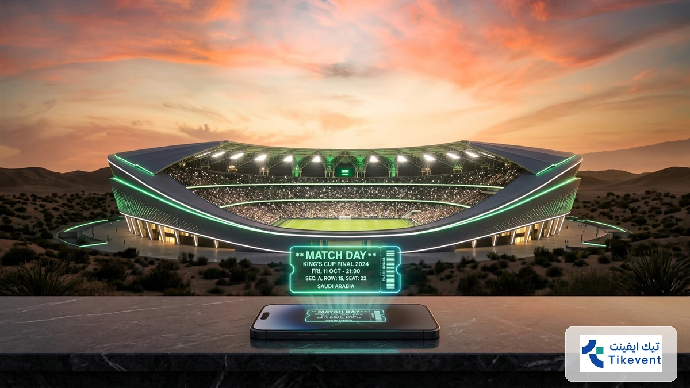
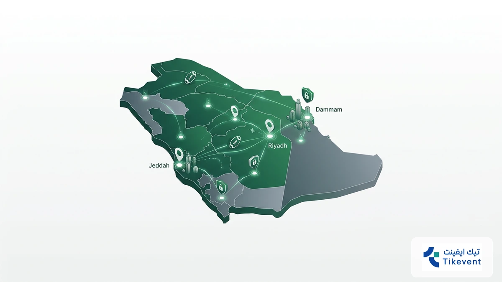
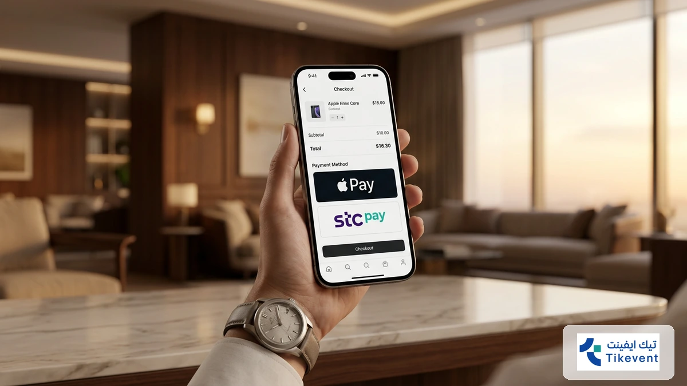
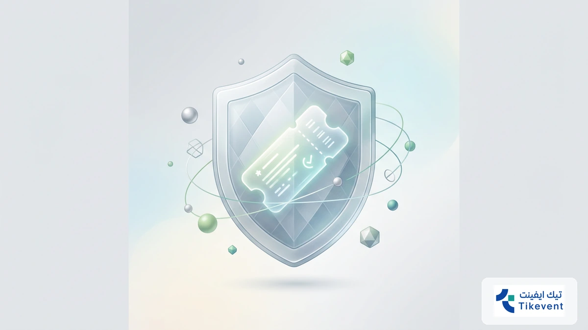
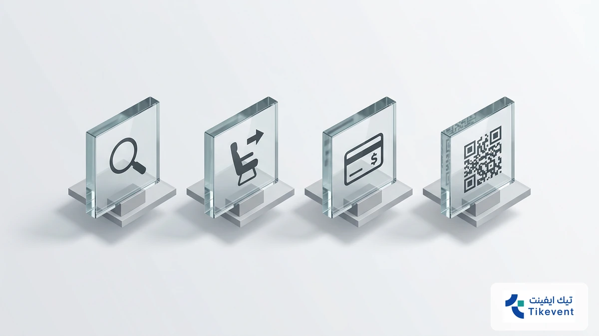
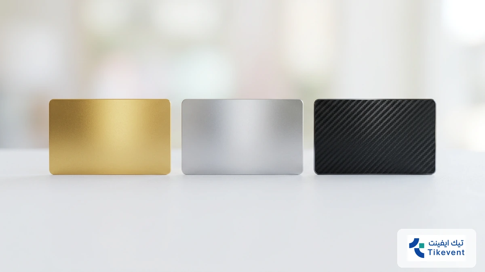

# أفضل منصة حجز تذاكر المباريات في السعودية لعام 2026: الأسعار والطريقة

<!-- section_id: sec_01 -->

!واجهة تطبيق حجز تذاكر المباريات في السعودية لعام 2026 أمام ملعب كرة قدم حديث
تنتظرك مدرجات الملاعب السعودية في موسم 2026 بشغف لا يهدأ، حيث يتنافس كبار نجوم دوري روشن وكأس الملك وسط أجواء جماهيرية عالمية. تأمين مقعدك الآن يتطلب سرعة فائقة لتجنب نفاذ الكميات المبكر.

تمنحك **حجز تذاكر المباريات** عبر منصتنا تجربة شرائية سلسة ومضمونة، حيث يمكنك الآن اكتشاف مواعيد المباريات الكبرى وحجز مقعدك فوراً بأسعار تنافسية تناسب ميزانيتك الرياضية لهذا العام، بعيداً عن استغلال السوق السوداء.

لا تدع الحماس يفوتك وكن أول الحاضرين في قلب الحدث؛ استفد من منصة حجز تذاكر المباريات لتأكيد حضورك بخطوات بسيطة، واستمتع بميزة تقسيط التذاكر التي نوفرها لك لضمان رفاهية المشاهدة دون أي ضغوط مالية.

## واقع سوق حجز تذاكر المباريات في السعودية العربية لعام 2026
<!-- section_id: sec_02 -->

**تواصل مع فريقنا اليوم وابدأ مشروعك في أقرب وقت.**

يتسم سوق الرياضة في المملكة حالياً بتحول رقمي هائل، حيث أصبحت عملية **حجز تذاكر المباريات** تعتمد كلياً على الأنظمة الذكية المرتبطة بالمحافظ الرقمية مثل "Stc Pay" و"Apple Pay". هذا التطور جعل الوصول إلى مقعدك في المدرجات أسرع من أي وقت مضى، خاصة مع التزام الملاعب السعودية بأعلى معايير التنظيم العالمية.

تتفوق منصة "تيك إيفنت" في هذا المشهد عبر تقديم حلول مالية مرنة، حيث تتيح لك شراء تذاكر كرة القدم بنظام التقسيط المريح الذي يصل إلى 12 دفعة. تهدف هذه الميزة إلى تخفيف العبء عن ميزانيتك الشخصية مع ضمان عدم تفويت أقوى المواجهات ضمن مواعيد المباريات السعودية الكبرى، مما يجعل تجربة المشجع أكثر رفاهية واستدامة.

*   تغطية شاملة لجميع فئات تذاكر المباريات من الفئة العامة إلى المقصورة الملكية.
*   إمكانية استرجاع قيمة التذاكر بسهولة وفق سياسة مرنة تراعي تغير خططك المفاجئة.
*   بيئة شرائية آمنة تماماً مدعومة بشراكات مع مستشارين عالميين لتطوير سوق التذاكر الثانوية.
*   دعم فني متواصل عبر قنوات متعددة لضمان حل أي مشكلة تقنية فور ظهورها.

يعكس نمو منصات حجز التذاكر الرسمية في المنطقة، مثل توجهات [الاتحاد السعودي لكرة القدم](https://www.saff.com.sa)، الرغبة في القضاء على السوق السوداء وتوفير أسعار عادلة للجميع. ومن خلال "تيك إيفنت"، يمكنك الآن تأمين حضورك في بطولة كأس خادم الحرمين الشريفين أو فعاليات مهرجان قطر لكرة القدم بخطوات بسيطة تغنيك عن عناء الانتظار في طوابير الملاعب المزدحمة.
## لماذا تختار منصة تيك إيفنت عند حجز تذاكر المباريات؟
<!-- section_id: sec_03 -->

**احصل على استشارة مجانية من خبرائنا المتخصصين — بدون أي التزام.**

تدرك منصة تيك إيفنت أن حماية استثمارك الرياضي تبدأ من الأمان الرقمي؛ لذا نوفر بيئة شرائية موثوقة تقضي على مخاطر السوق السوداء عند **حجز تذاكر المباريات** في المملكة، مع ضمان استلام تذاكر أصلية بنسبة 100%.

نحن المنصة الوحيدة التي تمنحك مرونة مالية استثنائية عبر تقسيط قيمة التذاكر حتى 12 دفعة، مما يسهل عليك حضور القمم الكروية دون ضغط على ميزانيتك. يمكنك الآن الاستفادة من حلول الدفع المحلية السريعة مثل Apple Pay وSTC Pay لضمان مقعدك في ثوانٍ معدودة.

*   **تقسيط مريح:** دفع قيمة التذكرة على دفعات شهرية تصل إلى 12 شهرًا لأول مرة في السعودية.
*   **أمان عالي:** شراكات مع مستشارين عالميين لتطوير سوق التذاكر الثانوية وضمان الموثوقية الكاملة.
*   **سياسة استرجاع مرنة:** إمكانية استرداد الأموال وفق شروط محددة إذا تغيرت خططك المفاجئة.
*   **تغطية شاملة:** توفير تذاكر لكافة الفئات، من الدرجة الموحدة إلى المقصورة الملكية في ملاعبنا العالمية.

تضمن لك منصتنا الوصول المباشر إلى فعاليات كبرى مثل كأس خادم الحرمين الشريفين، مع دعم فني متواصل يحل أي عقبة تقنية فورًا. التزامنا بمعايير [الاتحاد الدولي لكرة القدم (FIFA)](https://www.fifa.com) في تنظيم الوصول يضمن لك تجربة دخول سلسة للملعب.

لا تخاطر بأموالك في المواقع غير الموثوقة وتجنب ضياع فرصة مشاهدة **تذاكر نادي الاتحاد** أو مواجهات **حجز تذاكر كأس العالم 2026** القادمة. بادر بتأمين مقعدك الآن عبر منصة تيك إيفنت واستمتع بتجربة حضور استثنائية تخلو من عناء الطوابير والزحام.
## دليل الأمان والموثوقية: برهان تميزنا في السوق السعودي
<!-- section_id: sec_04 -->

**لا تدع منافسيك يسبقونك — ابدأ مشروعك الرقمي الآن.**

تعتمد ثقتك في **حجز تذاكر المباريات** على معايير أمان صارمة تتجاوز مجرد الشراء التقليدي. نوفر لك في السوق السعودي نظاماً مشفراً بالكامل يضمن حماية بياناتك البنكية ووصول التذكرة الأصيلة إلى محفظتك الرقمية فوراً.

تثبت تجربتنا في تنظيم دخول الجماهير لبطولات كبرى مثل كأس خادم الحرمين الشريفين كفاءة أنظمتنا في التعامل مع الضغط الجماهيري العالي. نضمن لك استلام تذكرتك بنسبة 100%، مما ينهي تماماً مخاوف السوق السوداء والتذاكر المكررة التي قد تواجهك في منصات غير موثوقة. | وجه المقارنة | منصتنا (Tikevent) | المنصات غير الرسمية |
| :--- | :--- | :--- |
| **موثوقية التذاكر** | أصلية ومضمونة 100% | مخاطرة عالية بالتكرار |
| **سياسة الاسترجاع** | مرنة وفق شروط واضحة | غالباً لا يوجد استرجاع |
| **طرق الدفع** | Apple Pay, STC Pay, تقسيط | تحويلات بنكية مشبوهة |
| **الدعم الفني** | متواجد على مدار الساعة | استجابة بطيئة أو معدومة |

**اكتشف كيف يمكننا تحويل رؤيتك إلى نتائج رقمية حقيقية.**
تتميز خدماتنا بتقديم حلول مالية مبتكرة تتيح لك شراء تذاكر المباريات الآن والتمتع بميزة التقسيط المريح التي تصل إلى 12 دفعة شهرية.

هذه المرونة تجعلك تشاهد نجومك المفضلين في الملعب دون القلق بشأن التكاليف المرتفعة للدرجات الفاخرة.
## خطوات حجز تذاكر المباريات أونلاين عبر تيك إيفنت
<!-- section_id: sec_05 -->

**خبراؤنا جاهزون للإجابة على كل تساؤلاتك — تواصل معنا الآن.**

تبدأ رحلتك في **حجز تذاكر المباريات** عبر منصة تيك إيفنت باختيار الفعالية من القائمة الرئيسية، حيث نوفر لك تغطية شاملة لمباريات كأس خادم الحرمين الشريفين ومهرجان قطر لكرة القدم في السعودية.

بمجرد تحديد المواجهة، يمكنك اختيار فئة المقعد المناسبة لميزانيتك، ثم الانتقال لإنهاء عملية حجز التذاكر أونلاين بخطوات سريعة تضمن لك استلام التذكرة رقمياً دون الحاجة للانتظار في طوابير الملاعب المزدحمة.

1. اختر المباراة أو الفعالية الرياضية المستهدفة من واجهة المنصة.
2. حدد فئة التذكرة وعدد المقاعد المطلوبة في المدرجات.
3. أدخل بياناتك واختر وسيلة الدفع (بطاقة مدى، Apple Pay، أو STC Pay).
4. فعل خيار التقسيط حتى 12 دفعة لتوزيع التكلفة بكل راحة.
5. استلم التذكرة الرقمية فوراً عبر بريدك الإلكتروني أو حسابك الشخصي.

عند وصولك إلى بوابات الملاعب السعودية، ستحتاج فقط لإبراز QR Code الموجود على تذكرتك الرقمية عبر الجوال، حيث تضمن تقنياتنا المشفرة مطابقة البيانات بنسبة 100% ومنع التلاعب أو التكرار.

تذكر أن نظامنا يدعم سياسة استرجاع مرنة تتيح لك استرداد القيمة وفق الشروط إذا تغيرت خططك، مما يمنحك أماناً كاملاً عند **شراء تذاكر كرة القدم** للمواجهات الكبرى القادمة.

### كيفية تفعيل خيار تقسيط التذاكر لعام 2026

<!-- section_id: sec_05_h3_1 -->

تسهل عليك منصة تيك إيفنت عملية **حجز تذاكر المباريات** عبر دمج حلول "اشترِ الآن وادفع لاحقاً" المعتمدة في السعودية، مما يتيح لك توزيع التكلفة على 12 دفعة شهرية مرنة. بمجرد اختيارك للمواجهة، ستظهر لك خيارات التقسيط في صفحة الدفع لتخفيف العبء المالي.

عند البدء في إجراءات شراء تذاكر كرة القدم، قم بتحديد فئة المقعد ثم فعل خيار التقسيط لتظهر لك قيمة الدفعة المستحقة. تضمن لك هذه الآلية الرقمية تأمين مكانك في القمم الكروية الكبرى دون الحاجة لدفع كامل المبلغ فوراً.

لضمان حضورك، يمكنك الحصول على تذاكر المباريات الآن والاستفادة من أنظمة الدفع المجزأ التي توفرها المنصة. اتبع الخطوات البسيطة لتأكيد حجزك واستلام تذكرتك الرقمية فوراً، مع مرونة كاملة في إدارة ميزانيتك الرياضية لعام 2026.
## أسعار وفئات تذاكر مباريات الدوري السعودي 2026
<!-- section_id: sec_06 -->

**خطوتك الأولى نحو النجاح تبدأ بمحادثة واحدة — دعنا نبدأ.**

تعتمد أسعار **حجز تذاكر المباريات** في السعودية لعام 2026 على فئة المقعد والمزايا اللوجستية التي يوفرها الاستاد. توفر منصة تيك إيفنت وصولاً مباشراً لفئات متنوعة تبدأ من التذاكر الموحدة خلف المرمى، وصولاً إلى المنصة الذهبية والفضية في ملاعب عالمية مثل "الجوهرة المشعة" و"مرسول بارك".

عند اختيارك للفئات الممتازة (VIP)، ستحصل على تجربة استثنائية تشمل مواقف سيارات مخصصة ومداخل خاصة تضمن لك تجنب الازدحام. توفر هذه الفئات رؤية بانورامية للملعب مع خدمات ضيافة متكاملة، مما يجعلها الخيار الأمثل لمن يبحث عن الرفاهية أثناء متابعة نجوم دوري روشن أو مباريات كأس خادم الحرمين الشريفين.

*   **الفئة العامة (الموحدة):** الخيار الاقتصادي الأفضل للمشجعين الراغبين في عيش الحماس الجماهيري بأسعار تنافسية.
*   **الفئة الفضية والذهبية:** تمنحك مقاعد في منتصف الواجهة مع زاوية رؤية مثالية وقرب من المنصة الرئيسية.
*   **كبار الشخصيات (VIP):** تشمل بوفيه ضيافة فاخر، مقاعد جلدية مريحة، وأولوية الدخول عبر البوابات الإلكترونية الذكية.
*   **المقصورة الملكية:** أعلى مستويات الخصوصية والخدمة الفندقية المباشرة داخل الملاعب السعودية الكبرى.

تتميز أنظمة الحجز لدينا بالمرونة المالية، حيث يمكنك الآن طلب تقسيط قيمة تذكرتك على 12 دفعة شهرية لتوزيع التكلفة دون ضغط على ميزانيتك. نضمن لك استلام تذكرة رقمية أصلية 100% مشفرة بنظام QR Code المتطور لضمان دخولك السلس والآمن للمدرجات.
## أسئلة شائعة حول حجز تذاكر المباريات في السعودية

<!-- section_id: sec_07 -->

<h3 itemprop="name">كيف أضمن أصالة التذكرة عند الشراء من السوق الثانوية؟</h3>

تعتمد الموثوقية في السوق السعودي حالياً على الربط التقني المباشر مع منصات مثل Webook، حيث يتم إصدار تذاكر رقمية مشفرة بنظام QR Code فريد. عند **حجز تذاكر المباريات** عبر منصة موثوقة، تضمن انتقال ملكية الرمز إليك فوراً، مما يمنع تكرار التذكرة أو تزويرها ويؤمن دخولك للملعب بنسبة 100%. 

<h3 itemprop="name">هل يمكنني استرجاع أموال التذاكر في حال تغيير موعد المباراة؟</h3>

نعم، تلتزم المنصات الرسمية في المملكة بسياسات مرنة تراعي حقوق المشجع؛ ففي حال تأجيل الفعالية أو تغيير موقعها، يحق لك استرداد القيمة أو استخدامها للموعد الجديد. يوفر لك هذا النظام أماناً مالياً كاملاً ويحفظ استثماراتك الرياضية من الضياع بسبب الظروف التنظيمية الطارئة. 

<h3 itemprop="name">ما هي أفضل طريقة لتأمين تذاكر المباريات الكبرى قبل نفادها؟</h3>

يُنصح دائماً بتفعيل تنبيهات البريد الإلكتروني ومتابعة منصات إعادة البيع المعتمدة للحصول على **تذاكر المباريات الآن** فور طرحها. استخدام وسائل الدفع السريع مثل Apple Pay يمنحك أفضلية في إنهاء العملية خلال ثوانٍ، وهو أمر حاسم في مواجهات القمة التي تنفد تذاكرها خلال دقائق معدودة. 

<h3 itemprop="name">هل تتوفر خيارات تقسيط عند شراء تذاكر كرة القدم للموسم الحالي؟</h3>

تدرك المنصات الرائدة حاجة المشجعين للمرونة، لذا تتيح لك الآن خدمة "اشترِ الآن وادفع لاحقاً" لتقسيط قيمة **شراء تذاكر كرة القدم** على دفعات شهرية. تساهم هذه الميزة في تخفيف العبء المالي عنك، خاصة عند الرغبة في حجز مقاعد الفئات الممتازة أو المقصورة الملكية في الملاعب العالمية. 

## الخلاصة: استعد لموسم كروي استثنائي مع تيك إيفنت

<!-- section_id: sec_08 -->

تعد منصة تيك إيفنت بوابتك الموثوقة لتأمين مقعدك في قلب الحدث، حيث نضمن لك تجربة **حجز تذاكر المباريات** في السعودية بمعايير عالمية تجمع بين السرعة الفائقة والأمان التام. بادر الآن بتنفيذ خطوات الحجز عبر واجهتنا الذكية لتستمتع بمشاهدة نجومك المفضلين في ملاعب المملكة المتطورة لعام 2026.

تخلص من تعقيدات السوق السوداء واستفد من حلولنا المالية المبتكرة التي تتيح لك تقسيط تذاكر مباريات الدوري السعودي وكأس الملك على 12 دفعة شهرية مريحة. نحن نضع بين يديك نظاماً مشفراً يضمن وصول التذكرة الرقمية إلى محفظتك فوراً، مما يمنحك راحة البال والتركيز فقط على مؤازرة فريقك المفضل في المدرجات.

لا تدع الفرصة تفوتك مع اقتراب القمم الكروية الكبرى، فالمقاعد المتميزة تنفد سريعاً نظراً للإقبال الجماهيري الهائل. اتخذ قرارك الآن للحصول على أفضل أسعار تذاكر المباريات في السعودية واستمتع بمزايا حصرية تشمل الدعم الفني المتواصل وسياسة الاسترجاع المرنة التي تحمي استثمارك الرياضي في كل الأوقات.